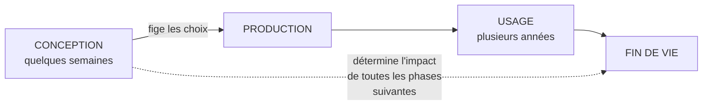
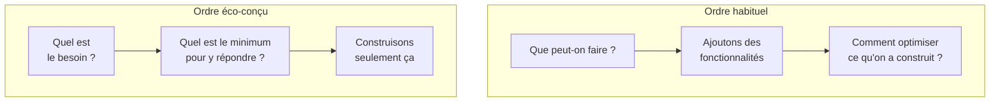
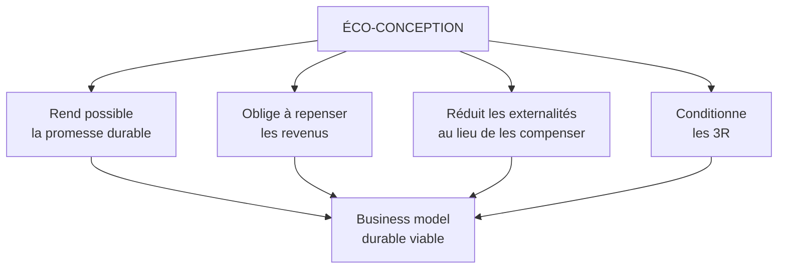

# Q11 — Qu'est-ce que l'éco-conception et en quoi sert-elle un modèle durable ?

> **La réponse en une phrase**
> L'éco-conception consiste à minimiser l'impact d'un produit **au moment où on le dessine**, parce que c'est à ce moment-là que l'impact est décidé — après, on ne peut plus que le subir.

---

## Partie 1 — L'idée fondatrice : le moment de la décision

C'est le concept le plus important de cette fiche. Prenez le temps.

### Décidé une fois, subi mille fois

Quand un ingénieur dessine un produit, il fixe en quelques semaines des choses qui vaudront pour toute la vie du produit :

| Ce qui est décidé en conception | Ce que ça détermine pour toute la vie du produit |
|---|---|
| Les matériaux | L'impact d'extraction, la recyclabilité |
| L'assemblage (vissé ou collé) | La réparabilité, donc la durée de vie |
| La consommation en fonctionnement | L'énergie sur 10 ans d'usage |
| La disponibilité des pièces | La possibilité même de réparer |
| L'architecture logicielle | Le poids des données transférées à chaque usage |

🔎 **Le raisonnement décisif** : une fois le produit conçu, ces choix sont figés. Vous ne pouvez pas rendre réparable un appareil dont le boîtier est collé. Vous ne pouvez pas alléger un service dont l'architecture impose de recharger toute la page à chaque clic.

**La conséquence stratégique.** Agir en conception est plus puissant qu'agir partout ailleurs, parce que c'est le seul moment où les choix sont encore ouverts. Après, on optimise à la marge.

---

## Partie 2 — La définition, et où elle s'ancre dans le cours

### Définition

L'éco-conception consiste à concevoir un produit ou un service en **minimisant son impact sur l'ensemble de son cycle de vie** : matières premières, production, distribution, usage, fin de vie.

### L'ancrage dans le cours

📘 Le cours définit la chaîne de valeur en durabilité comme couvrant « l'ensemble des activités, **depuis les matières premières jusqu'au recyclage ou à la fin de vie** d'un produit/service ».

🔎 L'éco-conception est exactement l'application de ce périmètre au moment de la conception. Le lien n'est pas décoratif : l'éco-conception **est** la chaîne de valeur durable vue depuis le bureau d'études.

### Où elle se situe dans les neuf cases

📘 Case **Développement technologique**, activité de soutien : « concerne aussi bien les systèmes d'information que la R&D, la gestion des connaissances ».

📘 Et rappel : « Les activités de soutien ont un impact **transversal** sur toutes les unités et sections. »

🔎 Transversal veut dire ici : une décision de conception se répercute sur la production, la logistique, les services et la fin de vie. C'est pour ça que le levier est si fort.

---

## Partie 3 — Les leviers concrets, phase par phase

| Phase du cycle de vie | Question que se pose le concepteur | Levier |
|---|---|---|
| Matières premières | De quoi est-ce fait, et faut-il vraiment ça ? | Moins de matière, matière recyclée, matière moins critique |
| Production | Combien d'énergie et de rebuts ? | Procédés sobres, réduction des chutes |
| Distribution | Combien de volume transporté ? | Compacité, emballage réduit et réemployable |
| **Usage** | Combien consomme-t-il, et combien de temps dure-t-il ? | Efficacité, **réparabilité**, mise à jour logicielle |
| **Fin de vie** | Que devient-il ? | Démontabilité, matériaux séparables, filière de reprise |

⚠️ Les deux lignes en gras sont les plus rentables du point de vue carbone, pour la raison expliquée en [[Q04_Reduire_lempreinte_carbone_via_la_chaine_de_valeur]] : dans beaucoup de produits, l'essentiel de l'impact est le carbone **incorporé à la fabrication**. Allonger la durée de vie évite donc une fabrication entière.

---

## Partie 4 — L'éco-conception appliquée au numérique : le RGESN

C'est ici que votre cours est le plus précis. Utilisez-le.

📘 « Le **Référentiel général d'écoconception des services numériques (RGESN) 2024** fournit un cadre concret. Il a été publié dans une version 2024 portée notamment par la **DINUM**, le **ministère de la Transition écologique**, l'**ADEME** et l'**Institut du Numérique Responsable. »

📘 Les six leviers qu'il impose : « Il demande de réduire les impacts des services numériques en agissant sur l'**architecture**, les **contenus**, les **flux**, l'**hébergement**, les **composants** et la **durée de vie des données**. »

### L'exemple concret du cours

📘 « Sur la vidéo, il recommande d'**ajuster la définition au contexte de visualisation**, car une résolution trop élevée augmente à la fois la consommation énergétique du terminal et le volume de données transférées. »

📘 Et la formule qui résume tout : « Cette logique résume bien la sobriété numérique : **ne pas supprimer l'usage utile, mais adapter la qualité technique au besoin réel**. »

🔎 Notez la précision : le RGESN ne dit pas « supprimez la vidéo ». Il dit « ne servez pas de la 4K sur un téléphone de 6 pouces ». C'est un ajustement de la qualité au besoin, pas une privation.

### Le renversement méthodologique

📘 « Concevoir un service numérique sobre consiste donc à **changer l'ordre des questions**. Il faut partir du **besoin**, puis déterminer le **niveau minimal de complexité nécessaire** pour y répondre. »

🔎 C'est le même principe que la sobriété du cours : 📘 « Sobriété : questionner les besoins **en première intention** ». « En première intention » veut dire : avant, pas après.

---

## Partie 5 — La limite morale : la sobriété juste

C'est la nuance qui distingue une réponse experte d'une réponse simpliste.

📘 Le document du cours pose la limite : « réduire les données, simplifier l'interface ou restreindre certaines fonctionnalités peut être pertinent ; en revanche, supprimer des **aides à la compréhension**, des **alternatives accessibles** ou des fonctions **réellement utiles** reviendrait à faire une **sobriété injuste**. »

📘 Et le critère exact : « **Le critère central n'est pas "moins", mais moins de superflu, sans réduire l'essentiel.** »

| Ce qu'on peut retirer | Ce qu'on ne doit pas retirer |
|---|---|
| Une animation décorative | Un texte alternatif pour lecteur d'écran |
| Une vidéo d'accueil en 4K | Une aide à la compréhension |
| Un historique de données de cinq ans | Une alternative accessible à une fonction |
| Une fonctionnalité gadget jamais utilisée | Une fonction réellement utile |

⚠️ **Le lien à faire** : sobriété et accessibilité peuvent entrer en conflit apparent. On pourrait alléger un site en supprimant les aides à la navigation. Le cours interdit explicitement ce raccourci. Voir [[Q20_Risques_de_la_numerisation_au_dela_de_lecologie]].

🔎 En termes du donut : réduire le plafond écologique ne doit pas se payer par un passage sous le fondement social.

---

## Partie 6 — En quoi ça sert un modèle durable

La question demande le lien avec le business model. Voici les quatre articulations.

### 1. Elle rend possible la promesse de durabilité

Vous ne pouvez pas promettre un produit qui dure 20 ans si vous ne l'avez pas conçu pour. La proposition de valeur du BM durable est **techniquement conditionnée** par l'éco-conception.

📘 Le document sur la métamorphose du BMC formule la proposition de valeur durable comme : « Création de produits ou services qui **minimisent l'impact environnemental**, utilisent des matériaux durables et offrent une plus-value sociale. »

### 2. Elle change la structure de revenus

🔎 Un produit conçu pour durer se vend moins souvent. Le BM doit donc compenser par des revenus de service : réparation, reconditionnement, location, pièces détachées. L'éco-conception **oblige** à repenser les revenus. C'est développé dans [[Q05_Transformer_un_business_model_en_BM_durable]].

### 3. Elle internalise les externalités en amont

Plutôt que de compenser un impact après coup, on l'évite avant qu'il n'existe. C'est moins cher et plus crédible.

📘 Le cours dit qu'une entreprise responsable cherche à « réduire ou compenser les externalités négatives ». 🔎 L'éco-conception est du côté « réduire », pas du côté « compenser ». C'est le côté fort.

### 4. Elle conditionne la circularité

📘 Le cours 5 : l'économie circulaire des appareils numériques passe par « l'extension de la vie utile des appareils numériques par le biais d'une **amélioration de la fabrication** et de la réutilisation ».

🔎 « Amélioration de la fabrication » : on ne peut pas réutiliser ce qui n'a pas été conçu pour l'être. L'éco-conception est la condition d'existence des 3R. Voir [[Q18_Economie_circulaire_des_appareils_numeriques]].

---

## Partie 7 — Exemple complet

**Le produit.** Une application mobile de gestion de comptes pour une banque régionale.

### Version non éco-conçue

| Choix de conception | Conséquence |
|---|---|
| Vidéo d'accueil en haute définition, lue automatiquement | Volume de données transféré à chaque ouverture |
| Rechargement complet des données à chaque écran | Multiplication des requêtes serveur |
| Conservation de 5 ans d'historique côté client et serveur | Stockage permanent, coût énergétique continu |
| Compatible uniquement avec les téléphones de moins de 3 ans | Force le renouvellement du matériel — le pire impact |

⚠️ La dernière ligne est la plus coûteuse écologiquement, et c'est celle à laquelle personne ne pense. Une application qui ne tourne plus sur un téléphone de 4 ans provoque la fabrication d'un téléphone neuf. Vous avez transféré votre impact chez le client.

### Version éco-conçue selon les six leviers du RGESN

| Levier 📘 | Décision |
|---|---|
| **Architecture** | Chargement partiel des écrans, pas de rechargement complet |
| **Contenus** | Vidéo remplacée par un texte et une image ; pas de lecture automatique |
| **Flux** | Synchronisation à la demande plutôt qu'en continu |
| **Hébergement** | Serveurs à faible intensité carbone, dimensionnés au réel |
| **Composants** | Réduction des bibliothèques externes chargées |
| **Durée de vie des données** | 12 mois d'historique en ligne, le reste sur demande |

### Le garde-fou de sobriété juste

| On retire | On garde absolument |
|---|---|
| L'animation de transition | La taille de police personnalisable |
| Le carrousel promotionnel | L'alternative au chatbot vers un humain |
| Le suivi analytique détaillé | La compatibilité avec les anciens appareils |

🔎 Cette dernière ligne est doublement gagnante : la compatibilité étendue est bonne écologiquement (elle évite le renouvellement matériel) **et** socialement (elle n'exclut pas ceux qui ne changent pas de téléphone tous les deux ans).

---

## Les pièges

> [!danger] Erreurs classiques
> 1. **Réduire l'éco-conception au produit physique.** Le RGESN s'applique aux services numériques, et votre cours insiste dessus.
> 2. **Oublier le renversement de l'ordre des questions.** 📘 « Partir du besoin, puis déterminer le niveau minimal de complexité. »
> 3. **Confondre sobriété et privation.** 📘 « Moins de superflu, sans réduire l'essentiel. »
> 4. **Oublier le lien avec les revenus.** Un produit qui dure se vend moins souvent.
> 5. **Oublier que c'est une activité de soutien.** 📘 Développement technologique, à impact transversal.
> 6. **Confondre réduire et compenser.** L'éco-conception réduit, elle ne compense pas.

## À retenir

| | |
|---|---|
| **L'idée fondatrice** | L'impact est décidé à la conception, puis subi |
| **Périmètre 📘** | Tout le cycle de vie : matières → fin de vie |
| **Cadre numérique 📘** | RGESN 2024 : architecture, contenus, flux, hébergement, composants, durée de vie des données |
| **Exemple du cours 📘** | Ajuster la résolution vidéo au contexte de visualisation |
| **Renversement 📘** | Partir du besoin, chercher le minimum nécessaire |
| **La limite 📘** | Sobriété juste : « moins de superflu, sans réduire l'essentiel » |
