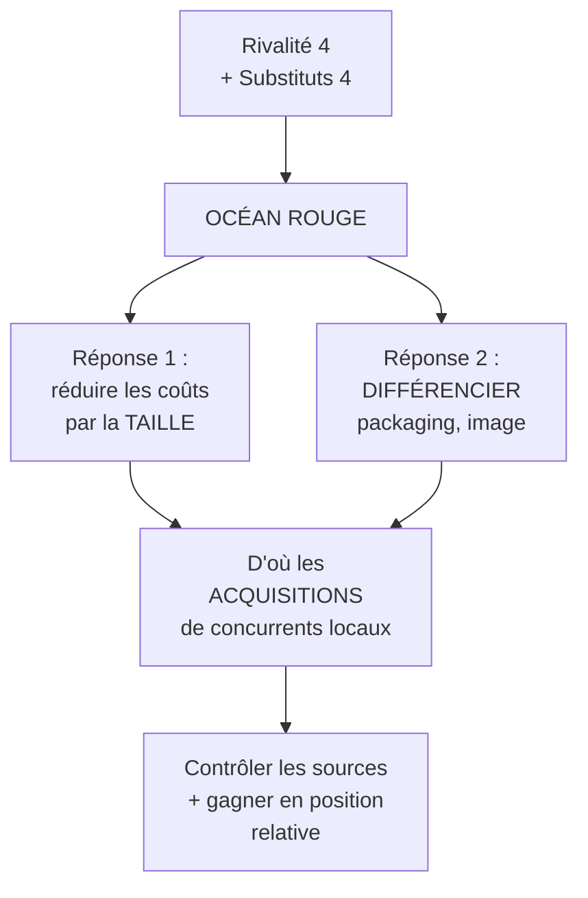

# Q11 — Analysez la rivalité dans un secteur saturé, exemple de l'eau embouteillée

> **La réponse en une phrase**
> On note chaque force sur une échelle, on trace la toile, et on conclut sur l'attractivité — le corrigé du cours donne les notes exactes, et la leçon est que **la rivalité n'est pas toujours la force la plus dangereuse**.

---

## Partie 1 — Pourquoi noter les forces plutôt que les décrire

📘 Le cours 2 : « L'**évaluation** des cinq forces de Porter permet d'apprécier l'intensité concurrentielle au sein d'une industrie. Selon l'intensité concurrentielle sur les différents segments, il est possible de distinguer deux types d'espaces de marché : les "océans bleus" et les "océans rouges". »

🔎 Le mot « évaluation » implique une note. Sans note, on ne peut pas comparer les forces entre elles, donc on ne sait pas **laquelle traiter en priorité**. Une description littéraire des cinq forces ne dit pas où est le problème.

📘 Le corrigé TP02B du cours utilise une échelle de 1 à 4 (faible / moyen / fort / élevé) et une représentation en **toile**.

---

## Partie 2 — Le corrigé du cours, force par force

📘 Toutes les notes et justifications ci-dessous sont celles du corrigé TP02B, sur l'industrie mondiale des eaux embouteillées.

| Force | Note 📘 | Justification du corrigé 📘 |
|---|---|---|
| **Rivalité** | **4 — fort** | « La concurrence comprend des entreprises mondiales (Nestlé, Danone, mais aussi Coca Cola, Pepsi) et des entreprises locales (accès direct sur les sources). » |
| **Substituts** | **4 — élevé** | « Il y a des substituts directs, comme l'eau du robinet et toutes les autres boissons. » |
| **Fournisseurs** | **3 — moyen** | « Les sources et leur qualité sont très importantes, mais les entreprises ont tout fait pour en minimiser les conséquences en diversifiant les matériaux (plastique et verre) et en faisant jouer la concurrence (transport). » |
| **Acheteurs** | **3 — moyen** | « Il est facile de changer de marque ou d'utiliser un substitut, mais les préoccupations sanitaires augmentent la demande. » |
| **Entrants potentiels** | **2 — faible** | « Les barrières d'entrée sont hautes, en raison des dépenses pour la communication (entreprises mondiales) et de l'accès aux sources locales. » |

```
Intensité des cinq forces — eaux embouteillées (📘 notes du corrigé)

Rivalité       ████████████████  4
Substituts     ████████████████  4
Fournisseurs   ████████████      3
Acheteurs      ████████████      3
Entrants       ████████          2
```

---

## Partie 3 — Comment lire ces notes : trois enseignements

### Enseignement 1 — La force la plus dangereuse n'est pas celle qu'on croit

⚠️ Beaucoup d'étudiants supposent que dans un secteur saturé, la rivalité domine seule. Le corrigé montre que **les substituts sont tout aussi forts (4)**.

🔎 Pourquoi c'est important : la rivalité et les substituts n'appellent pas la même réponse.
- Contre la rivalité, on se différencie de ses concurrents directs.
- Contre les substituts, il faut justifier **l'existence même de la catégorie**.

Et pour l'eau embouteillée, le substitut est **l'eau du robinet**, qui est quasi gratuite et de qualité comparable en Suisse. C'est une menace bien plus fondamentale qu'un concurrent embouteilleur.

### Enseignement 2 — Une note faible peut être une bonne nouvelle

📘 Les entrants potentiels sont à 2, car « les barrières d'entrée sont hautes ».

🔎 Attention au sens de lecture : une force **faible** est favorable au secteur. 📘 Le cours le dit : « plus une force est puissante, plus la pression qu'elle exerce sur les prix ou les coûts est élevée, et moins le secteur est attrayant. »

⚠️ Donc une note basse sur les entrants signifie que les acteurs installés sont protégés. C'est le seul point favorable de ce secteur.

### Enseignement 3 — Les notes moyennes s'expliquent par une contradiction

Regardez la justification des fournisseurs : les sources sont critiques (ce qui devrait donner un pouvoir fort), **mais** les entreprises ont diversifié pour le neutraliser. La note de 3 est le résultat de deux forces opposées.

🔎 C'est un point de méthode : une note moyenne n'est pas une absence d'analyse, c'est le solde de deux effets contraires. Il faut les nommer tous les deux.

---

## Partie 4 — La conclusion du corrigé

📘 « Le marché mondial de l'industrie de l'eau embouteillée est plus un **océan rouge**. Il y a une concurrence très forte qui nécessite une **réduction des coûts par la taille** et impose une **forte différenciation** des acteurs en matière de packaging, communication, d'image, etc. Dans ces conditions, les entreprises mondiales sont enclines à **acquérir les concurrents locaux** à la fois pour contrôler les sources et pour accroître leur position relative sur le marché. »



🔎 **Ce que ce raisonnement montre de remarquable** : la structure des forces **explique le comportement observé du secteur**. On ne se contente pas de dire « c'est un océan rouge », on en déduit pourquoi les grands groupes rachètent les petits. L'analyse prédit le comportement.

⚠️ C'est le niveau attendu : votre diagnostic doit **expliquer** ce qu'on observe, pas seulement le décrire.

---

## Partie 5 — La méthode transposable à n'importe quel secteur

| Étape | Ce qu'on fait | Erreur à éviter |
|---|---|---|
| 1. Définir le périmètre | Quel secteur, quelle zone géographique | Périmètre flou → notes ininterprétables |
| 2. Noter chaque force | Échelle 1 à 4, ou faible/moyen/fort | Noter sans justifier |
| 3. Justifier chaque note | Un argument pour, un argument contre si la note est moyenne | Justification en un mot |
| 4. Tracer la toile | Visualisation comparative | Sauter cette étape et perdre la hiérarchie |
| 5. Conclure sur l'attractivité | Océan rouge ou bleu, et pourquoi | S'arrêter aux notes |
| 6. En déduire les réponses stratégiques | Coûts, différenciation, ou sortie vers un océan bleu | Ne pas relier à l'action |

⚠️ L'étape 6 est celle qui distingue une analyse d'un exercice. 📘 Le corrigé la fait explicitement : réduction des coûts par la taille, différenciation, acquisitions.

---

## Partie 6 — Prolongement : et la sixième force ?

📘 Rappel : « Le pouvoir de l'État **peut constituer une 6ième force**. »

🔎 Dans le cas de l'eau embouteillée, l'État est très présent et le corrigé ne le note pas — c'est une occasion de compléter l'analyse :

| Rôle de l'État | Effet sur ce secteur |
|---|---|
| Régulateur sanitaire | Normes sur les sources, contrôles : ▲ barrières à l'entrée |
| Régulateur environnemental | Consigne, taxe sur le plastique : ▲ coûts |
| Gestionnaire de la ressource | Concessions d'exploitation des sources : contrôle direct de l'accès à l'input clé |
| **Producteur du substitut** | ⚠️ L'eau du robinet est fournie par la collectivité |

🔎 Le dernier point est spectaculaire : dans ce secteur, **l'État finance et distribue le principal substitut**. Une campagne publique en faveur de l'eau du robinet est une action stratégique majeure contre l'industrie. Voir [[Q08_La_sixieme_force_de_Porter]].

---

## Les pièges

> [!danger] Erreurs classiques
> 1. **Ne regarder que la rivalité.** 📘 Les substituts sont notés aussi haut (4).
> 2. **Inverser le sens des notes.** Une force faible est une **bonne** nouvelle pour le secteur.
> 3. **Noter sans justifier.** 📘 Le corrigé justifie chaque note.
> 4. **Traiter une note moyenne comme une absence d'analyse.** C'est un solde entre deux effets.
> 5. **S'arrêter à « océan rouge ».** 📘 Le corrigé en déduit les acquisitions.
> 6. **Oublier la sixième force.** Ici l'État produit le substitut principal.

## À retenir

| | |
|---|---|
| **Notes du corrigé 📘** | Rivalité 4, Substituts 4, Fournisseurs 3, Acheteurs 3, Entrants 2 |
| **Conclusion 📘** | « plus un océan rouge » |
| **Réponses stratégiques 📘** | Réduction des coûts par la taille, forte différenciation, acquisitions de concurrents locaux |
| **Sens de lecture 📘** | Plus une force est puissante, moins le secteur est attrayant |
| **Le point fin** | La structure des forces explique le comportement observé du secteur |
