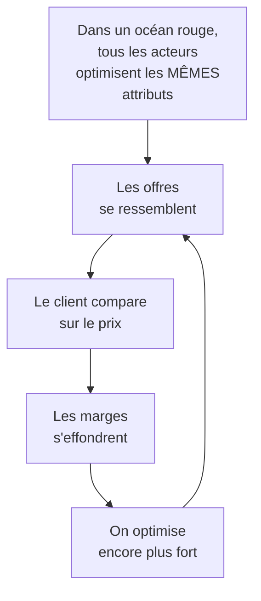
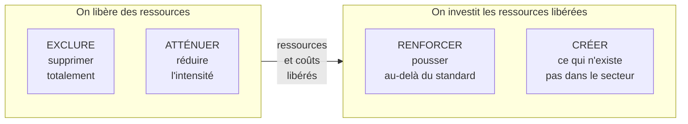

# Q12 — Qu'est-ce qu'une stratégie océan bleu ?

> [!warning] ⚠️ Écart détecté dans votre fiche de révision
> Votre fiche dit que la matrice ERAC signifie **Exclure / Réduire / Augmenter / Créer**.
> 📘 Vos slides disent : **Exclure / Renforcer / Atténuer / Créer**.
> Le sigle est identique, deux mots sur quatre sont différents. Apprenez la version de vos slides.

> **La réponse en une phrase**
> Au lieu de se battre mieux que les autres sur le même terrain, on **change de terrain** — en supprimant des attributs que le secteur considère comme obligatoires, ce qui libère les ressources pour en créer de nouveaux.

---

## Partie 1 — Les deux océans, avec les mots du cours

📘 Cours 2 : « L'**océan rouge** décrit un marché qui existe d'ores et déjà et où se joue une concurrence intense. La couleur rouge symbolise l'intensité de la concurrence, **le sang perdu par les entreprises**. »

📘 « L'**océan bleu** décrit de nouveaux espaces de marché, où la concurrence est minime. La couleur bleue connote la beauté et l'étendue de la mer, **sans un navire (celui du concurrent) en vue**. »

📘 Cours BM durable : « Stratégie Océan Bleu, 2ᵉ édition, **2013**, *Comment créer de nouveaux espaces stratégiques*, **W. Chan Kim et Renée Mauborgne**. La stratégie océan bleu vise à **créer un espace stratégique vierge de toute concurrence directe** et se positionner sur une **nouvelle demande** plutôt qu'opérer sur des marchés où les entreprises se livrent une lutte acharnée : l'océan rouge. »

### Le lien avec Porter

📘 « L'évaluation des cinq forces de Porter permet d'apprécier l'intensité concurrentielle au sein d'une industrie. Selon l'intensité concurrentielle sur les différents segments, il est possible de distinguer deux types d'espaces de marché : les "océans bleus" et les "océans rouges". »

🔎 Autrement dit : **l'océan bleu n'est pas un concept séparé, c'est une conclusion de Porter**. Vous notez les cinq forces ; si elles sont toutes fortes, vous êtes en océan rouge ; la question devient alors s'il existe un espace où elles seraient faibles.

---

## Partie 2 — Le raisonnement fondateur

Voici pourquoi cette stratégie existe.

🔎 **Le cercle vicieux** : plus on se bat bien dans un océan rouge, plus on ressemble à ses concurrents, parce qu'on optimise les mêmes critères qu'eux. L'excellence conduit à la banalisation.

**La sortie** consiste à faire l'inverse de ce que le secteur considère comme évident : accepter d'être **mauvais** sur des critères que tout le monde juge indispensables, pour libérer les moyens d'être exceptionnel ailleurs.

⚠️ C'est un renoncement, et c'est ce qui le rend difficile. Une entreprise qui veut être bonne partout ne fera jamais d'océan bleu.

---

## Partie 3 — La matrice ERAC, version du cours

📘 Les quatre définitions exactes de vos slides :

| Lettre | Mot 📘 | Définition du cours 📘 |
|---|---|---|
| **E** | **Exclure** | « Supprimer les fonctionnalités inutiles, non-créatrices de valeur pour le marché » |
| **R** | **Renforcer** | « Examiner si en augmentant des caractéristiques ou des performances, il est possible d'attirer plus de clients » |
| **A** | **Atténuer** | « Cette étape examine la proposition de valeur finale (produit ou service) et cherche à identifier les aspects de ces offres qui ne sont pas nécessaires aux buts ou objectifs de l'entreprise » |
| **C** | **Créer** | « Innovez en créant de nouvelles propositions de valeur. Il s'agit d'inventer des produits ou des services qui offrent aux clients quelque chose de radicalement différent, une **offre disruptive** » |

### La logique des quatre mouvements

🔎 **Le point central que peu d'étudiants voient** : les quatre mouvements ne sont pas indépendants. E et A **financent** R et C. C'est ce qui permet à un océan bleu d'être à la fois plus différencié **et** moins coûteux — alors que Porter oppose traditionnellement ces deux positions.

⚠️ Une réponse qui ne fait que « créer » sans « exclure » n'est pas un océan bleu : c'est une montée en gamme, plus chère, dans le même océan rouge.

---

## Partie 4 — Le lien avec la durabilité

C'est le pont que votre cours fait explicitement.

📘 Cours BM durable, sur la même slide que l'océan bleu : « La **Durabilité** (éco-conception, impact social) devient un **levier innovation-valeur**. »

🔎 Pourquoi ce lien est logique, et c'est un raisonnement fort :

| Mouvement ERAC | Version durabilité |
|---|---|
| **Exclure** | Supprimer les fonctionnalités gadgets, les emballages superflus, la surqualité — 📘 « moins de surqualité, moins de stockage inutile, moins de fonctionnalités gadgets » |
| **Atténuer** | 📘 « adapter la qualité technique au besoin réel » — le RGESN sur la résolution vidéo |
| **Renforcer** | Durée de vie, réparabilité, transparence, accessibilité |
| **Créer** | Reprise en fin de vie, location, reconditionnement, traçabilité prouvée |

⚠️ **Le raisonnement décisif** : la sobriété est structurellement une démarche ERAC. Elle exclut et atténue le superflu pour renforcer et créer l'essentiel. 📘 « Le critère central n'est pas "moins", mais moins de superflu, sans réduire l'essentiel. »

🔎 C'est exactement la définition d'un océan bleu appliquée à la durabilité : on n'est pas « moins bon », on est **différemment configuré**.

Voir [[Q38_Definir_la_sobriete_numerique]] et [[Q26_Exemples_de_revenus_durables]].

---

## Partie 5 — Exemple complet

**Le secteur.** Le mobilier de bureau, océan rouge : concurrence par le prix, renouvellement tous les 7 ans, catalogues identiques.

### Application de la matrice ERAC

| Mouvement | Décision | Effet |
|---|---|---|
| **Exclure** | La diversité de catalogue : de 340 références à 40 | Coûts de stock et de production divisés |
| **Exclure** | Les finitions purement décoratives, sans usage | Simplifie la production |
| **Atténuer** | Le renouvellement esthétique annuel | Fin de la course au design saisonnier |
| **Renforcer** | La durée de vie : garantie et pièces disponibles 15 ans | Argument de différenciation majeur |
| **Renforcer** | La modularité : un meuble se reconfigure au lieu d'être remplacé | Nouvelle proposition de valeur |
| **Créer** | Un service de reprise, reconditionnement et revente | Nouveau flux de revenus |
| **Créer** | La location longue durée avec maintenance incluse | Revenus récurrents |

### Pourquoi c'est un océan bleu et pas juste du haut de gamme

🔎 Vérifions les trois signes :

1. **Les coûts baissent aussi.** Exclure 300 références et les finitions décoratives compense l'investissement dans la durabilité. On n'est pas seulement plus cher.
2. **La comparaison directe devient impossible.** Un concurrent qui vend des meubles ne vend pas la même chose que quelqu'un qui loue des espaces de travail reconfigurables. Le client ne peut plus comparer ligne à ligne.
3. **Une nouvelle demande apparaît.** 📘 « se positionner sur une **nouvelle demande** » — ici les collectivités et entreprises soumises à des critères de marchés publics responsables, qui n'étaient pas un segment identifié.

⚠️ Et le revers à assumer : ce modèle vend **moins souvent**. Il ne tient que grâce aux revenus créés (location, reconditionnement). Sans le C de la matrice, il serait suicidaire. Voir [[Q27_Durabilite_sans_tuer_la_viabilite]].

---

## Les pièges

> [!danger] Erreurs classiques
> 1. **Dire « Réduire / Augmenter » au lieu de « Renforcer / Atténuer ».** 📘 Vérifiez vos slides.
> 2. **Ne faire que créer.** Sans exclure ni atténuer, c'est une montée en gamme, pas un océan bleu.
> 3. **Oublier que E et A financent R et C.** C'est ce qui permet d'être différencié et moins coûteux.
> 4. **Traiter l'océan bleu comme un concept isolé.** 📘 Il découle de l'évaluation des cinq forces.
> 5. **Oublier la source.** 📘 W. Chan Kim et Renée Mauborgne, 2ᵉ édition 2013.
> 6. **Oublier le lien durabilité.** 📘 « La durabilité devient un levier innovation-valeur. »

## À retenir

| | |
|---|---|
| **Océan rouge 📘** | Marché existant, concurrence intense, « le sang perdu par les entreprises » |
| **Océan bleu 📘** | « Espace stratégique vierge de toute concurrence directe », « nouvelle demande » |
| **Source 📘** | Kim et Mauborgne, 2ᵉ édition 2013 |
| **ERAC 📘** | **Exclure / Renforcer / Atténuer / Créer** |
| **La mécanique** | Exclure et Atténuer libèrent les ressources pour Renforcer et Créer |
| **Lien durabilité 📘** | « La durabilité devient un levier innovation-valeur » |
