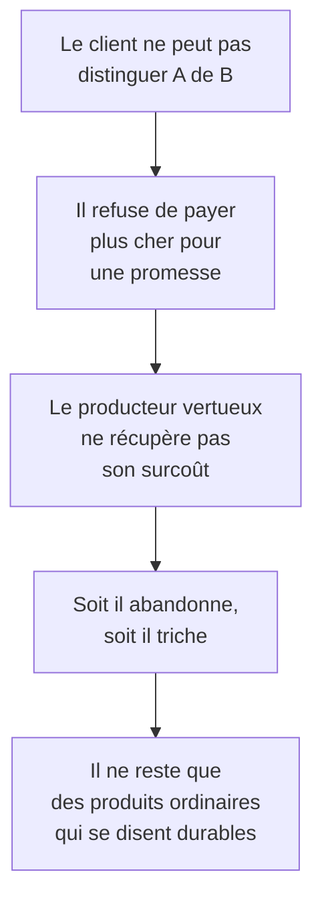
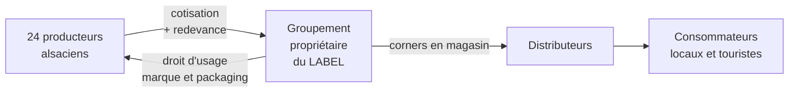

# Q12 — Transparence et labels : comment soutiennent-ils le positionnement stratégique ?

> **La réponse en une phrase**
> Parce que la durabilité est **invisible dans le produit** : le client ne peut pas la vérifier lui-même, donc sans preuve extérieure crédible, un produit vertueux et un produit qui prétend l'être se ressemblent — et le moins cher gagne.

---

## Partie 1 — Le problème que le label résout

C'est le raisonnement fondateur, et il vaut la peine d'être compris à fond.

### Une expérience de pensée

Imaginez deux paquets de café côte à côte sur une étagère.

| | Café A | Café B |
|---|---|---|
| Prix | 12 CHF | 9 CHF |
| Producteurs payés correctement | Oui | Non |
| Forêt préservée | Oui | Non |
| Ce que le client voit | Un paquet | Un paquet |
| Ce que le client goûte | Du café | Du café |

**Question : comment le client peut-il savoir ?**

Réponse : il ne peut pas. Ni en regardant, ni en goûtant, ni même en utilisant le produit pendant des années. Les qualités durables d'un produit sont **invisibles et invérifiables** par l'acheteur.

### Le mécanisme économique qui en découle

🔎 Voilà pourquoi la transparence n'est pas un supplément d'âme : **sans elle, le marché élimine mécaniquement les acteurs vertueux**. Ce n'est pas une question morale, c'est une question de survie économique.

📚 *Complément hors cours* : les économistes appellent ça l'**asymétrie d'information**. Le terme n'est pas dans vos slides ; présentez-le comme un apport.

---

## Partie 2 — Ce que fait un label, mécaniquement

Un label fait trois choses, et il est utile de les séparer.

| Fonction | Ce que ça veut dire |
|---|---|
| **1. Il atteste** | Un tiers indépendant a vérifié un critère précis |
| **2. Il signale** | L'information devient lisible en une seconde sur l'emballage |
| **3. Il segmente** | Il crée un marché distinct où le prix plus élevé devient acceptable |

⚠️ La fonction 1 est la seule qui compte vraiment. Un label auto-décerné ne fait que 2 et 3 — c'est-à-dire qu'il communique et segmente sans rien garantir. C'est la définition opérationnelle du greenwashing. Voir [[Q15_Le_greenwashing]].

### Les labels que votre cours cite

📘 Cours 5, achats IT responsables :

**Labels et certifications environnementaux et sociaux** : TCO certified, Ecolabel européen, Energy Star, EPEAT, Der blaue Engel.

**Normes ISO** : ISO 14'024 (2018), ISO 14'021 (2016), ISO 14'025.

🔎 Remarquez ce que ces labels ont tous en commun : **aucun n'appartient à une entreprise**. Ce sont des constructions collectives ou institutionnelles. Un label n'a de valeur que s'il ne peut pas être décerné par celui qu'il note. Voir [[Q06_Collaboration_ouverte_et_partenariats]].

### Le lien avec les critères d'achat

📘 Le cours 5 place les labels dans une démarche en quatre points pour « Acheter mieux en IT » :
1. Analyse des risques environnementaux et sociaux (matrice de pertinence de l'OFEV)
2. **Labels et certifications**
3. Normes ISO
4. Fixer des critères pour les achats (ex : critères TCO)

🔎 Notez la place du label : il est un **outil de décision d'achat**, pas seulement un argument de vente. Le même objet sert au vendeur pour se démarquer et à l'acheteur pour choisir. C'est ce double usage qui fait sa force.

---

## Partie 3 — Le lien avec le positionnement stratégique

La question demande le lien avec le positionnement. Voici l'articulation complète.

### Qu'est-ce que le positionnement

C'est la réponse à : pourquoi un client vous choisirait plutôt qu'un autre ?

Trois grandes réponses possibles :

| Positionnement | Argument | Ce que le label y apporte |
|---|---|---|
| Par les coûts | « Je suis moins cher » | Rien, voire un handicap |
| **Par la différenciation** | « Je suis différent et vous y tenez » | **Tout** — il rend la différence visible |
| Par la focalisation | « Je sers ce segment précis mieux que quiconque » | Il définit et délimite le segment |

🔎 Le label est donc un **outil de différenciation**. Il transforme une qualité invisible en argument commercial opposable.

📘 Le cours durabilité propose exactement ces orientations : « Choix stratégique : Choisissez une orientation : Différenciation (leader mondial en durabilité), Focalisation (ex : énergie verte), Innovation durable. »

### Le lien avec les forces de Porter

🔎 Un label agit sur plusieurs forces à la fois :

| Force | Effet du label |
|---|---|
| Pouvoir des clients | **Le réduit** — vous n'êtes plus interchangeable, donc moins substituable |
| Entrants potentiels | **Les freine** — obtenir une certification prend du temps et de l'argent |
| Concurrence intra-sectorielle | **L'atténue** — vous sortez de la comparaison par le prix |
| Fournisseurs | **Les contraint** — vous leur imposez des critères pour rester certifié |

⚠️ Le deuxième point mérite d'être nommé : un label est aussi une **barrière à l'entrée**. C'est un effet stratégique réel, et il n'est pas toujours vertueux — il protège les acteurs installés.

---

## Partie 4 — L'exemple du cours : le Marché de l'Oncle Hansi

📘 C'est votre cas de cours, et il illustre parfaitement cette question.

### Les faits

📘 En 2012, Steve Risch acquiert les droits de l'œuvre de Jean-Jacques Waltz, dit « l'oncle Hansi », et crée une **marque ombrelle** « Marché de l'Oncle Hansi », qui regroupe d'abord **24 entreprises alsaciennes de l'agroalimentaire » et « se propose de commercialiser leurs produits sous un même label ».

📘 Les trois critères de sélection des partenaires : « l'antériorité dans l'utilisation de l'imagerie Hansi, l'appartenance au groupement "saveurs d'Alsace" et la position de leader sur leur marché ».

📘 Cinq ans plus tard : chiffre d'affaires de l'ordre d'un million d'euros, une dizaine de salariés, **170 références alimentaires** et **55 références** dans les arts de la table et l'édition.

### Ce que dit le corrigé sur la proposition de valeur

📘 « Le business model de l'Oncle Hansi repose sur une proposition de valeur qui consiste à **offrir un label "alsacien"** pour des clients locaux ou des touristes. Cette proposition de valeur repose sur la recherche d'une **consommation de qualité (sanctionnée par les labels)**, dans le cadre d'une démarche **"locavore"** (consommation de proximité), pour une région marquée par une **forte identité** (consommation par les valeurs traditionnelles). »

📘 Et le point décisif, dans les points forts du modèle : « **l'entreprise possède le label qui fonde la proposition de valeur** ».

### Le raisonnement à en tirer

🔎 Lisez cette dernière phrase attentivement. Le label n'est pas un accessoire marketing ajouté à un produit. **Le label EST le produit.** L'entreprise ne fabrique rien : elle possède une garantie d'origine et de qualité, et elle la loue.

📘 Le corrigé décrit l'équation de profit : « la confrontation de deux flux de revenus (les **adhésions** et les **redevances**, ces dernières devant être **limitées pour éviter la concurrence des produits commercialisés sous la marque propre du producteur**) et d'une structure de coûts qui doit être la plus légère possible ».

⚠️ La parenthèse contient un arbitrage stratégique fin : si la redevance est trop élevée, le producteur préfère vendre sous sa propre marque et le label perd ses adhérents. Le prix du label est donc plafonné par l'alternative dont dispose l'adhérent.

📘 Autre point fort relevé par le corrigé : « les clients sont des partenaires (une petite base de clients adhère et "subventionne" le packaging), les coûts d'acquisition des clients sont donc supportés par les distributeurs ; il existe une proposition de valeur unique pour des clients différents ».

---

## Partie 5 — La transparence, au-delà du label

Le label est une preuve **ponctuelle et binaire** : on l'a ou on ne l'a pas. La transparence est une preuve **continue et graduée**.

| | Label | Transparence |
|---|---|---|
| Nature | Binaire | Graduée |
| Vérificateur | Un tiers certificateur | Tout le monde |
| Ce qu'elle montre | Le respect d'un seuil | La réalité, y compris ce qui ne va pas |
| Risque | Se limiter au minimum certifiable | Exposer ses faiblesses |

📘 Le document sur la métamorphose du BMC place la transparence dans le bloc Relations avec les clients : « Développement de relations durables par la **transparence**, le partage d'informations sur la durabilité, et l'engagement communautaire. »

📘 Et le Guide RNE de l'État de Genève relie explicitement la démarche à la confiance : elle « renforce le rapport de confiance entre l'entreprise, ses partenaires et ses clientes et clients ».

🔎 Le point contre-intuitif à faire : **la transparence est plus crédible quand elle montre aussi ce qui ne va pas**. Une entreprise qui publie ses points faibles et son plan de progrès est plus crédible qu'une entreprise dont tout est parfait. Une communication sans aucune faiblesse déclenche la méfiance.

---

## Partie 6 — Les limites et les risques

Une réponse à sens unique passerait à côté.

| Risque | Description |
|---|---|
| **Greenwashing** | Le label sert de vitrine sans changement réel dans la chaîne de valeur |
| **Inflation des labels** | Trop de labels, le consommateur ne s'y retrouve plus, le signal se dilue |
| **Coût d'accès** | Une certification coûte cher : elle exclut les petites structures qui sont parfois les plus vertueuses |
| **Effet plafond** | On vise le seuil du label et on s'arrête là, alors qu'on pourrait aller plus loin |
| **Barrière à l'entrée** | Protège les acteurs installés, ce qui n'est pas nécessairement souhaitable |
| **Label sans substance** | Auto-déclaré, sans vérification indépendante |

🔎 L'antidote général, et c'est le critère à retenir : **un label ne vaut que par l'indépendance de son vérificateur et la précision de ce qu'il certifie**. « Respectueux de l'environnement » ne certifie rien. « Fabrication socialement responsable, extension de la durée de vie, récupération des matériaux » — les critères TCO du cours — certifient quelque chose.

---

## Les pièges

> [!danger] Erreurs classiques
> 1. **Traiter le label comme du marketing.** 📘 Dans le cas Oncle Hansi, il « fonde la proposition de valeur ».
> 2. **Oublier le problème qu'il résout.** Sans invisibilité de la qualité, pas besoin de label.
> 3. **Confondre label et transparence.** L'un est binaire et vérifié par un tiers, l'autre est continue.
> 4. **Ne pas mentionner le greenwashing.** C'est le revers immédiat.
> 5. **Oublier l'effet sur les forces de Porter.** Un label est aussi une barrière à l'entrée.
> 6. **Oublier l'arbitrage sur la redevance.** 📘 Le corrigé insiste : trop élevée, elle fait fuir les adhérents.

## À retenir

| | |
|---|---|
| **Le problème résolu** | La qualité durable est invisible et invérifiable par l'acheteur |
| **Les trois fonctions** | Attester, signaler, segmenter — seule la première a de la valeur |
| **Labels du cours 📘** | TCO certified, Ecolabel européen, Energy Star, EPEAT, Der blaue Engel ; ISO 14'024, 14'021, 14'025 |
| **Positionnement** | Outil de différenciation, et barrière à l'entrée |
| **Cas 📘** | Oncle Hansi : « l'entreprise possède le label qui fonde la proposition de valeur » |
| **Le critère de validité** | Indépendance du vérificateur et précision du critère certifié |
