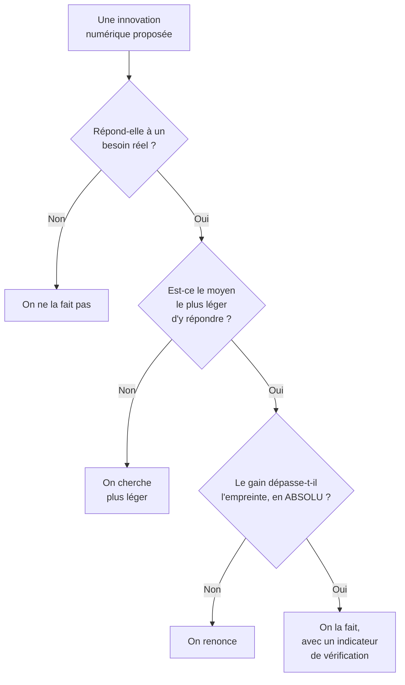

# Q13 — L'innovation digitale est-elle compatible avec la durabilité ? Discutez.

> **La réponse en une phrase**
> Compatible, oui — mais à une condition que le cours énonce explicitement : que l'innovation **questionne d'abord le besoin** au lieu de commencer par ce que la technique permet.

> [!note] Le mot « Discutez »
> Ce verbe est une consigne, pas une politesse. Il vous demande de construire **deux positions argumentées** et de trancher ensuite. Une réponse à sens unique ne répond pas à la consigne, même si elle est juste.

---

## Partie 1 — Poser correctement le désaccord

Avant de discuter, il faut savoir sur quoi porte le désaccord. Ce n'est pas « le numérique pollue-t-il ». Tout le monde est d'accord là-dessus.

Le vrai désaccord porte sur une seule question :

> **Les gains permis par l'innovation numérique dépassent-ils l'empreinte qu'elle crée, et le peuvent-ils durablement ?**

📘 Le document de cours pose le débat exactement ainsi : « Il existe donc **deux positions**. »

---

## Partie 2 — Position A : l'innovation digitale est compatible

📘 Formulation du cours : « La première affirme que le numérique peut rester un **levier majeur de durabilité, à condition d'être mieux piloté, mieux mesuré et mieux conçu**. Cette position est fondée : l'OCDE recommande bien d'utiliser les technologies numériques pour améliorer la performance environnementale tout en réduisant leur empreinte. »

### Les arguments, avec leur mécanisme

| Argument | Mécanisme concret | Fiche liée |
|---|---|---|
| **Dématérialisation** | Un flux d'information remplace un objet ou un déplacement | [[Q01_Transformation_digitale_et_durabilite]] |
| **Optimisation** | On supprime du gaspillage de coordination | [[Q08_Donnees_temps_reel_et_logistique_durable]] |
| **Mesure** | On rend visible donc pilotable | [[Q07_Numerique_pour_mesurer_et_piloter_impact]] |
| **Éco-conception outillée** | Le RGESN donne un cadre technique précis | [[Q11_Lecoconception]] |
| **Nouveaux modèles** | Vendre l'usage plutôt que le bien, mutualiser | [[Q05_Transformer_un_business_model_en_BM_durable]] |

### La condition posée par le cours

⚠️ Relisez la citation : « **à condition** d'être mieux piloté, mieux mesuré et mieux conçu ». Cette position n'est pas un « oui » inconditionnel. Trois conditions y sont incluses dès la formulation.

🔎 Autrement dit : même la position favorable dit que la compatibilité n'est pas automatique.

---

## Partie 3 — Position B : l'efficacité ne suffira pas

📘 Formulation du cours : « La seconde position soutient que **l'efficacité seule ne suffira pas si le modèle économique reste fondé sur l'expansion continue des usages**. Cette critique est également fondée, car les données de l'IEA, de l'Arcep et de l'ADEME montrent une **hausse structurelle** des besoins énergétiques et des impacts du secteur. »

⚠️ Notez que le cours dit « **également fondée** ». Il ne tranche pas en faveur de la position A. Vous ne devez pas trancher trop vite non plus.

### Les trois mécanismes de la critique

**Mécanisme 1 — L'effet rebond.**

```
Gain d'efficacité par unité   ▼ −20 %
Hausse des volumes            ▲ +35 %
------------------------------------
Bilan réel  0,80 × 1,35 =     ▲ +8 %
```

📘 L'OCDE souligne que les bénéfices indirects « peuvent être contrebalancés par ses impacts propres et par des effets rebond, ce qui rend le bilan net complexe à établir ».

**Mécanisme 2 — Le modèle économique.**

📘 « La difficulté centrale ne vient pas d'abord de la technique, mais du **modèle économique**. Une grande partie de l'économie numérique est structurée par l'augmentation du nombre d'utilisateurs, du temps passé, des interactions et des volumes de données. Or cette logique est **en tension directe avec la sobriété**. »

🔎 Décryptage : une entreprise numérique gagne de l'argent quand les usages augmentent. La sobriété demande qu'ils diminuent. Ce n'est pas un problème d'intention, c'est une **contradiction structurelle** entre deux logiques.

**Mécanisme 3 — La trajectoire réelle des chiffres.**

📘 Chiffres de vos supports :
- Croissance de la consommation électrique du numérique avec l'IA : **16 % par an**, soit un doublement environ tous les 4 ans.
- Une requête moyenne sur ChatGPT : environ **4,32 g de CO₂**, soit 4 à 5 fois plus qu'une recherche Google.
- 📘 Selon l'AIE citée par le cours, la demande d'électricité des centres de données devrait plus que doubler d'ici 2030 pour atteindre environ **945 térawattheures**, soit plus que la consommation totale d'électricité du Japon, et représenter un peu moins de **3 % de l'électricité mondiale**.

```
Trajectoire à +16 % par an (doublement tous les 4 ans)

Aujourd'hui   ████
Dans 4 ans    ████████
Dans 8 ans    ████████████████
Dans 12 ans   ████████████████████████████████
```

🔎 L'argument massue de la position B : **aucun gain d'efficacité ne compense durablement une croissance exponentielle**. Vous pouvez rendre chaque requête deux fois moins coûteuse ; si leur nombre double tous les quatre ans, vous avez gagné quatre ans.

---

## Partie 4 — La synthèse : sortir du match nul

Les deux positions sont fondées. Une bonne réponse ne les laisse pas dos à dos, elle en tire une règle.

📘 Le cours donne lui-même la synthèse : « Une stratégie crédible suppose donc des **arbitrages** : moins de surqualité, moins de stockage inutile, moins de fonctionnalités gadgets, moins de dépendance à des infrastructures lourdes **lorsque le gain social est faible**. »

⚠️ La fin de la phrase est capitale : « lorsque le gain social est faible ». Le cours ne dit pas « réduisez tout ». Il dit **arbitrez selon l'utilité**.

### La règle de décision qui en découle



### Les deux principes du cours

📘 « **Proposition n°2 : changer la logique de déploiement du numérique**
> 1. **Sobriété** : questionner les besoins en première intention
> 2. **Lucidité** : penser les conséquences directes et indirectes »

🔎 Analysons chaque mot.

**« En première intention »** — La sobriété n'est pas une correction appliquée après coup à un produit conçu sans elle. C'est la **première question posée**, avant de dessiner quoi que ce soit.

**« Conséquences directes et indirectes »** — Direct : ce que consomme votre service. Indirect : ce qu'il provoque ailleurs. Une application qui ne tourne que sur les téléphones récents provoque le renouvellement de millions de terminaux. Son impact direct est nul, son impact indirect est massif.

🔎 La lucidité est donc l'exigence de regarder plus loin que son propre périmètre. C'est le même geste que le périmètre élargi de la chaîne de valeur. Voir [[Q04_Reduire_lempreinte_carbone_via_la_chaine_de_valeur]].

---

## Partie 5 — Le renversement de la question « innovation »

C'est ici que vous pouvez aller plus loin que la réponse attendue.

### Le présupposé caché de la question

La question suppose que « innovation digitale » veut dire « faire plus avec le numérique ». Or ce n'est pas la seule forme d'innovation.

| Forme d'innovation | Exemple | Compatible avec la durabilité ? |
|---|---|---|
| Innovation d'**addition** | Nouvelle fonctionnalité, nouveau service, nouvel usage | Douteuse — ajoute de l'usage |
| Innovation de **substitution** | Un service numérique remplace un flux physique | Oui si la substitution est réelle |
| Innovation de **soustraction** | Faire la même chose avec moins de données, moins de calcul, moins de matériel | Oui, la plus alignée |
| Innovation de **modèle** | Vendre l'usage, mutualiser, allonger la durée de vie | La plus puissante |

🔎 **Le point à faire** : notre culture appelle « innovation » l'addition et rarement la soustraction. Pourtant concevoir un service qui fait la même chose avec dix fois moins de ressources est une innovation au moins aussi difficile.

📘 Le cours donne d'ailleurs un exemple de soustraction : ajuster la résolution d'une vidéo au contexte de visualisation, car « une résolution trop élevée augmente à la fois la consommation énergétique du terminal et le volume de données transférées ».

📘 Et la formule : « ne pas supprimer l'usage utile, mais **adapter la qualité technique au besoin réel** ».

---

## Partie 6 — Exemple complet : deux innovations comparées

**L'entreprise.** Une assurance suisse, 300 salariés.

### Projet A — Un assistant conversationnel à base d'IA générative

| Critère | Évaluation |
|---|---|
| Besoin réel ? | Partiel : les clients veulent une réponse rapide |
| Moyen le plus léger ? | Non : une FAQ bien structurée et un moteur de recherche couvrent 70 % des demandes |
| Coût direct | 📘 Environ 4,32 g de CO₂ par requête, 4 à 5 fois une recherche classique |
| Coût indirect | Dépendance à un fournisseur, hausse du volume de sollicitations |
| Risque social | Exclusion de ceux qui ne comprennent pas les réponses — cas SilverDigital |
| **Verdict** | À conditionner : réserver l'IA aux cas complexes, garder un accès humain |

### Projet B — Refonte du parcours de déclaration de sinistre

| Critère | Évaluation |
|---|---|
| Besoin réel ? | Oui : le parcours actuel génère des allers-retours papier et des déplacements |
| Moyen le plus léger ? | Oui : formulaire simple, photos compressées, pas de vidéo |
| Coût direct | Faible |
| Gain indirect | Suppression d'envois postaux et de déplacements en agence |
| Risque social | Maîtrisé si un canal papier et humain reste disponible |
| **Verdict** | Innovation de substitution : compatible |

🔎 Ce que la comparaison montre : **ce n'est pas la technologie qui décide de la compatibilité, c'est la question à laquelle elle répond**. Le projet B est moins impressionnant techniquement et bien plus aligné.

---

## Partie 7 — Les questions ouvertes du cours

📘 Vos supports posent des questions qui n'ont pas de réponse simple, et les citer montre de la maturité :

- « Est-ce qu'on peut vraiment diminuer notre consommation du numérique alors qu'on est **totalement dépendant** ? »
- « Notion d'**utilité** : on crée l'utilité qui fait qu'on ne peut pas s'en passer ? Comment faire ? »
- « **Addiction au numérique – dopamine – une dépendance programmée ?!** »
- « Effet sur l'attention à court terme, beaucoup de contenu court que l'on consomme sans en avoir conscience. »

🔎 La deuxième question est la plus profonde : elle suggère que l'innovation numérique ne se contente pas de répondre à des besoins, elle en **fabrique**. Si c'est vrai, alors « questionner le besoin en première intention » devient très difficile, parce que le besoin a été créé par l'innovation précédente.

---

## Les pièges

> [!danger] Erreurs classiques
> 1. **Répondre à sens unique.** La consigne dit « Discutez ».
> 2. **Trancher trop vite.** 📘 Le cours dit que les deux positions sont fondées.
> 3. **Oublier les chiffres.** 📘 4,32 g par requête, +16 % par an, 945 TWh en 2030.
> 4. **Confondre efficacité et sobriété.** L'efficacité fait mieux avec autant ; la sobriété demande si on doit le faire.
> 5. **Oublier « en première intention ».** C'est le mot qui donne son sens au principe.
> 6. **Ignorer les impacts indirects.** 📘 La lucidité exige de les prendre en compte.

## À retenir

| | |
|---|---|
| **La vraie question** | Les gains dépassent-ils l'empreinte, et durablement ? |
| **Position A 📘** | Levier majeur, « à condition d'être mieux piloté, mieux mesuré et mieux conçu » |
| **Position B 📘** | « L'efficacité seule ne suffira pas si le modèle reste fondé sur l'expansion des usages » |
| **La synthèse 📘** | Des arbitrages : moins de surqualité, de stockage inutile, de gadgets, « lorsque le gain social est faible » |
| **Les deux principes 📘** | Sobriété (questionner le besoin en première intention) et lucidité (conséquences directes et indirectes) |
| **L'ouverture** | L'innovation de soustraction est aussi une innovation |
