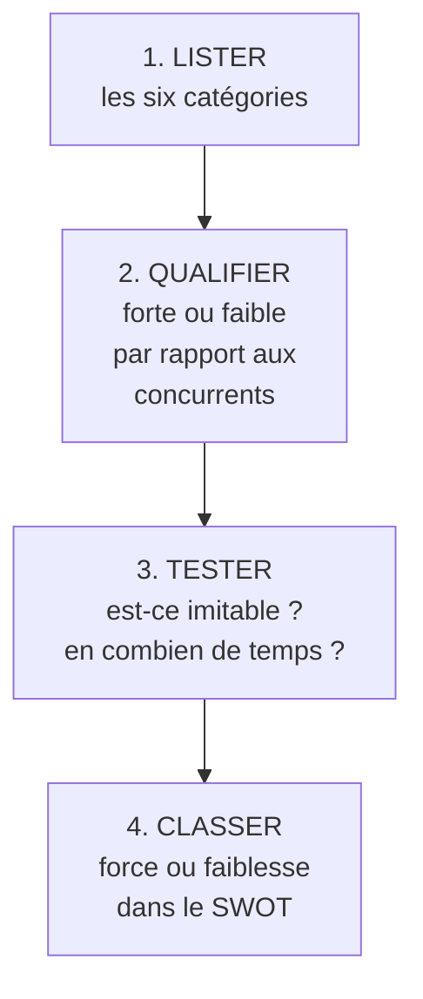

# Q13 — Distinguez les ressources matérielles et immatérielles

> **La réponse en une phrase**
> Trois de chaque côté : matérielles (financières, physiques, humaines) et immatérielles (organisation, technologie, image de marque) — et la distinction compte parce que la facilité à les identifier est inversement proportionnelle à leur valeur stratégique.

---

## Partie 1 — La définition du cours

📘 Cours 3 : « Les ressources de l'entreprise correspondent à des **actifs matériels ou immatériels** que possède l'entreprise et qu'elle va pouvoir **déployer et valoriser** pour générer des biens, produits ou services. »

⚠️ Deux verbes dans cette définition : posséder **et** valoriser. Une ressource qu'on possède sans savoir la valoriser n'est pas une ressource stratégique, c'est un actif dormant.

📘 Et la place de cet inventaire dans la démarche : « Comment réaliser un diagnostic interne ? Examiner l'environnement interne de l'entreprise. **Analyse des ressources matérielles et immatérielles.** Analyse de la chaîne de valeur. »

🔎 Donc l'inventaire des ressources vient **avant** la chaîne de valeur. La logique : on liste ce qu'on a, puis on regarde comment on s'en sert.

---

## Partie 2 — Les trois ressources matérielles

📘 « Dans les **actifs matériels** de l'entreprise, on trouve :
> - les ressources **financières** (résultat financier, flux de trésorerie, capacité de financement, etc.)
> - les ressources **physiques** (site de production, équipement, et aussi capacité de production, état, niveau d'innovation…)
> - les ressources **humaines** (effectif salarié, compétences et niveau de qualification des collaborateurs, ajustement de la masse salariale) »

📘 Et la caractéristique générale : « Les ressources **tangibles ou matérielles** sont constituées d'actifs **aisément identifiables**, tels que les infrastructures, les équipements, les usines, les brevets, les systèmes, le circuit de distribution, etc. Les moyens financiers sont aussi à considérer comme des actifs. Ces ressources concrètes sont **relativement faciles à identifier et à évaluer**. »

⚠️ Notez une subtilité : le cours range les **brevets** parmi les exemples de ressources tangibles dans ce passage, alors qu'il place la technologie et les brevets du côté immatériel dans la slide suivante. C'est une petite incohérence de vos supports — mentionnez-la si on vous interroge, plutôt que de trancher.

---

## Partie 3 — Les trois ressources immatérielles

📘 « Dans les **actifs immatériels** qui tiennent un rôle important dans le processus de production, on trouve :
> - l'**organisation et le management** de l'entreprise (procédures, contrôle qualité, etc.)
> - la **technologie utilisée** (brevets par exemple, et allocation menée pour la recherche et le développement)
> - l'**image de marque** (aspect marketing essentiel, la **réputation** et la **notoriété** de l'entreprise) »

---

## Partie 4 — Le tableau de comparaison

| | Matérielles | Immatérielles |
|---|---|---|
| **Les trois 📘** | Financières, physiques, humaines | Organisation/management, technologie, image de marque |
| **Identification** | 📘 « Relativement faciles à identifier et à évaluer » | Difficiles à isoler et à chiffrer |
| **Présence au bilan** | Oui, généralement | Rarement, ou très partiellement |
| **Acquisition** | S'achètent | Se construisent |
| **Délai d'acquisition** | Semaines ou mois | Années |
| **Imitabilité** | Élevée | Faible |
| **Valeur stratégique** | Souvent faible | Souvent élevée |

```
Facilité d'acquisition par un concurrent

Ressource financière   ████████████████████  emprunt, levée de fonds
Ressource physique     ████████████████      achat, location
Ressource humaine      ████████████          recrutement
Technologie            ████████              licence, R&D
Organisation           ████                  années de construction
Image de marque        █                     ne s'achète pas
```

🔎 Représentation qualitative de ma part. Le message : **plus une ressource est facile à identifier, plus elle est facile à acquérir pour un concurrent, donc moins elle fonde un avantage durable**.

⚠️ C'est le paradoxe central : ce qui est visible au bilan est ce qui compte le moins stratégiquement. Développé dans [[Q14_Pourquoi_limmateriel_fonde_lavantage_durable]].

---

## Partie 5 — Comment faire l'inventaire concrètement



| Étape | Question à poser | Erreur à éviter |
|---|---|---|
| Lister | Qu'est-ce que nous possédons dans chaque catégorie ? | Oublier les immatérielles, qui ne sont nulle part écrites |
| Qualifier | Sommes-nous mieux ou moins bien dotés que nos concurrents ? | Juger dans l'absolu au lieu de comparer |
| Tester | Combien de temps faudrait-il à un concurrent pour l'obtenir ? | Confondre « nous l'avons » et « c'est un avantage » |
| Classer | Force ou faiblesse ? | Tout mettre en force |

⚠️ L'étape 2 est celle qu'on saute. Avoir des ressources financières n'est une force que si vos concurrents en ont moins. Voir [[Q09_Opportunite_vs_force]].

---

## Partie 6 — Exemple complet

**L'entreprise.** Une PME genevoise d'ingénierie, 45 salariés.

### Inventaire des six catégories

| Catégorie | Ce qu'elle possède | Position vs concurrents | Imitabilité | Verdict |
|---|---|---|---|---|
| **Financières** | Trésorerie de 8 mois, pas d'endettement | Meilleure que la moyenne | Élevée (un concurrent peut lever des fonds) | Force modérée |
| **Physiques** | Bureaux loués, matériel standard | Équivalent | Très élevée | Neutre |
| **Humaines** | 12 ingénieurs, dont 3 spécialistes rares | Meilleure | Moyenne (recrutement possible mais marché tendu) | **Force** |
| **Organisation** | Méthodologie de projet documentée depuis 15 ans, taux d'erreur très bas | Nettement meilleure | **Faible** — ne s'achète pas | **Force majeure** |
| **Technologie** | Un logiciel de calcul développé en interne | Meilleure | Moyenne (peut être recodé) | Force |
| **Image de marque** | Référence auprès des collectivités romandes depuis 20 ans | Nettement meilleure | **Très faible** | **Force majeure** |

### Le raisonnement stratégique

🔎 Regardez la colonne Imitabilité. Les deux forces majeures sont les deux ressources **immatérielles** — l'organisation et l'image. Ce sont les seules qu'un concurrent bien financé ne peut pas obtenir rapidement.

**Conséquence pour la stratégie** : l'entreprise ne doit pas se battre sur le prix (financier, imitable) ni sur l'outillage (physique, imitable). Elle doit construire son positionnement sur ce que personne ne peut copier : la fiabilité méthodologique et la relation historique avec les collectivités.

⚠️ Et le risque symétrique : ces deux forces sont **fragiles**. Une réputation de 20 ans se détruit en un chantier raté. Une méthodologie disparaît si les trois personnes qui la portent partent en même temps. Une force immatérielle est durable face à l'imitation, pas face à la négligence.

---

## Les pièges

> [!danger] Erreurs classiques
> 1. **Oublier les immatérielles.** Elles ne figurent nulle part, donc on ne les liste pas.
> 2. **Classer les ressources humaines dans l'immatériel.** 📘 Le cours les met dans les **matérielles**.
> 3. **Ne pas comparer.** Une ressource n'est une force que par rapport aux concurrents.
> 4. **Confondre posséder et valoriser.** 📘 La définition contient les deux verbes.
> 5. **Oublier l'incohérence sur les brevets.** Vos supports les citent des deux côtés — signalez-le.

## À retenir

| | |
|---|---|
| **Définition 📘** | Actifs que l'entreprise possède et peut « déployer et valoriser » |
| **Matérielles 📘** | Financières, physiques, **humaines** |
| **Immatérielles 📘** | Organisation/management, technologie, image de marque |
| **Caractéristique 📘** | Les matérielles sont « relativement faciles à identifier et à évaluer » |
| **Le paradoxe** | Ce qui est le plus visible est le moins stratégique |
| **Place 📘** | L'inventaire précède l'analyse de la chaîne de valeur |
