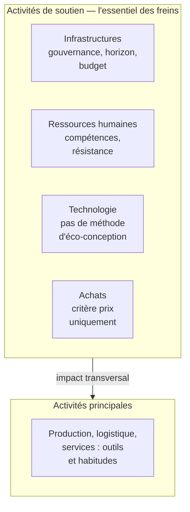
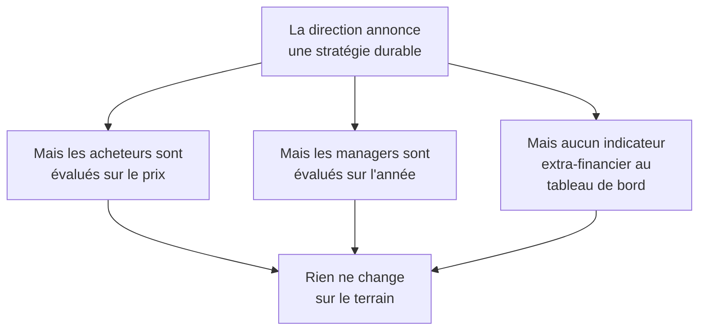

# Q14 — Quels sont les freins internes à une stratégie durable ?

> **La réponse en une phrase**
> Les freins internes ne sont pas de la mauvaise volonté : ce sont des **mécanismes de gestion normaux** — horizon annuel, budget contraint, absence de porteur, compétences manquantes — qui produisent l'inaction sans que personne ne l'ait décidée.

---

## Partie 1 — Pourquoi cette question est plus fine qu'elle n'en a l'air

### Le premier réflexe, et pourquoi il est faux

Le réflexe est de répondre « les gens résistent au changement » ou « ça coûte trop cher ». Ce n'est pas faux, mais ça n'explique rien.

🔎 Le bon angle : dans la plupart des cas, **personne n'a décidé de ne rien faire**. Chaque acteur pris séparément agit rationnellement, et le résultat collectif est l'immobilisme. C'est ça qu'il faut expliquer.

### Le mot « interne » situe la question

📘 Le cours 3 définit le diagnostic interne comme « la démarche qui va aboutir à l'identification des **forces et faiblesses** d'une organisation à un moment donné », et précise qu'il « consiste à évaluer l'ensemble de l'entreprise, de son ou ses processus de production principaux (activités principales) aux différentes activités de soutien ».

⚠️ Donc : les freins internes sont des **faiblesses** du SWOT, pas des menaces. Un durcissement réglementaire est externe. Un manque de compétences est interne.

| Frein | Interne ou externe ? |
|---|---|
| Nos salariés ne sont pas formés | Interne — faiblesse |
| Nos actionnaires exigent un dividende | Interne (gouvernance) |
| Nos concurrents ne sont pas contraints | Externe — menace |
| La technologie n'existe pas encore | Externe |
| Nous n'avons personne pour porter le sujet | Interne — faiblesse |

---

## Partie 2 — Les sept freins, classés par la chaîne de valeur

🔎 Classer les freins par case de la chaîne de valeur n'est pas un exercice de style : ça montre **où** il faut agir.



📘 Rappel du cours : « Les activités de soutien ont un impact **transversal** sur toutes les unités et sections. »

🔎 Conséquence : la majorité des freins se logent dans les activités de soutien, et c'est logique — ce sont elles qui décident pour toutes les autres.

### Frein 1 — L'horizon de décision (Infrastructures)

**Le mécanisme.** Une entreprise décide sur un exercice annuel. Un investissement durable coûte cette année et rapporte dans trois à cinq ans. Le calcul du décideur, sur son horizon, est défavorable — même s'il est favorable sur dix ans.

```
Coûts et bénéfices dans le temps

Année 0   ████████████████ COÛT
Année 1   ████████         coût résiduel
Année 2   ███              ▲ premiers gains
Année 3   ▲▲▲▲▲
Année 5   ▲▲▲▲▲▲▲▲▲▲       avantage installé

L'horizon de décision s'arrête ici : |
                                     ↑ année 1
```

🔎 Ce n'est pas de la myopie individuelle, c'est une **structure de gestion**. Le directeur est évalué sur l'année, donc il décide sur l'année.

**Comment le lever.** Chiffrer le risque évité, pas seulement le gain espéré. Une mise en conformité anticipée coûte moins qu'une mise en conformité subie.

### Frein 2 — Le coût d'investissement (Infrastructures)

**Le mécanisme.** L'argent est limité et les projets sont en concurrence. Un projet durable est en concurrence avec un projet commercial dont le retour est plus rapide.

**Comment le lever.** Commencer par les actions qui paient tout de suite — sobriété énergétique, allongement de la durée de vie du matériel, réduction des déchets — et financer les suivantes avec.

### Frein 3 — L'absence de gouvernance dédiée (Infrastructures)

**Le mécanisme.** Sans porteur désigné, un sujet transversal n'appartient à personne. Chaque service pense qu'un autre s'en occupe.

📘 Vos supports listent précisément les rôles qui existent pour combler ce vide : « Protection des données : Data Protection Officer. Questions numériques : Chief Digital Officer. Sécurité informatique : Chief Information Security Officer. Nouvelles technologies / IA : Chief AI Officer. **Environnement : Green Chief Officer**. Accessibilité : Accessibility Officer. »

🔎 L'existence même de ces fonctions est la preuve du problème : si le sujet se traitait naturellement, on n'aurait pas besoin de créer un poste pour lui.

📘 Et le Guide RNE présente la gouvernance comme un bénéfice de la démarche : elle « favorise une gouvernance technologique de l'entreprise et de l'information plus efficace par une meilleure maîtrise de ses données et de ses outils ».

### Frein 4 — L'absence de mesure (Infrastructures)

**Le mécanisme.** Ce qui n'est pas au tableau de bord n'entre dans aucun arbitrage. Le carbone reste une intention tant qu'il n'est pas un chiffre suivi.

🔎 C'est le frein le plus silencieux, parce qu'il ne se manifeste par aucune opposition. Personne ne dit non ; le sujet n'est simplement jamais discuté. Voir [[Q07_Numerique_pour_mesurer_et_piloter_impact]].

### Frein 5 — Le manque de compétences (Ressources humaines)

📘 Le cours définit cette case comme couvrant « recrutement, rémunération, motivation, formation, gestion de carrière ».

**Le mécanisme.** L'éco-conception, l'analyse de cycle de vie, l'accessibilité, la comptabilité carbone sont des métiers. Une entreprise qui n'a personne de formé ne peut pas agir, même avec le budget.

⚠️ Cas typique du cours : SilverDigital a la **capacité technique** de développer, mais pas la **compétence en accessibilité**. Ce ne sont pas les mêmes choses.

### Frein 6 — La résistance au changement (Ressources humaines)

**Le mécanisme.** Toute transformation menace des routines, des positions et des compétences acquises. La résistance n'est pas de la mauvaise foi : c'est une réaction rationnelle de protection.

🔎 La nuance à apporter : la résistance est souvent **un symptôme**, pas une cause. Elle apparaît quand le changement est imposé sans explication ni association. Voir [[Q10_Integrer_les_parties_prenantes]] et l'insistance du cours sur les actions de communication.

### Frein 7 — Les critères d'achat inchangés (Achats)

**Le mécanisme.** Tant que le service achats est évalué sur le prix d'acquisition, il achètera le moins cher, quelles que soient les intentions de la direction.

📘 Le cours 5 donne l'antidote : « Fixer des critères pour les achats (ex : critères TCO) » — fabrication socialement responsable, fabrication respectueuse de l'environnement, extension de la durée de vie, récupération des matériaux.

🔎 Le point à comprendre : **on obtient ce qu'on mesure**. Si l'acheteur est jugé sur le prix, la stratégie durable s'arrête à sa porte. Le frein n'est pas dans les têtes, il est dans les critères d'évaluation.

---

## Partie 3 — Le frein qui les résume tous : l'incohérence entre le discours et les critères

C'est le raisonnement le plus fort de cette fiche.



🔎 **La règle générale** : une organisation fait ce sur quoi elle est évaluée, pas ce qu'elle annonce. Tant que les critères d'évaluation internes ne changent pas, la stratégie durable reste un document.

⚠️ C'est aussi la définition interne du greenwashing : pas un mensonge délibéré, mais un écart entre un discours sincère et des mécanismes de gestion inchangés. Voir [[Q15_Le_greenwashing]].

---

## Partie 4 — Comment lever les freins : la correspondance

| Frein | Levier correspondant |
|---|---|
| Horizon de décision | Chiffrer le risque évité ; horizon d'évaluation allongé |
| Coût d'investissement | Commencer par les actions qui paient vite |
| Absence de gouvernance | Désigner un porteur (📘 Green Chief Officer, Accessibility Officer) |
| Absence de mesure | Deux indicateurs au tableau de bord de direction : intensité **et** absolu |
| Manque de compétences | Formation, recrutement, ou mutualisation entre PME ([[Q06_Collaboration_ouverte_et_partenariats]]) |
| Résistance au changement | 📘 Plan de management des parties prenantes, actions de communication |
| Critères d'achat | 📘 Critères TCO au cahier des charges, labels exigés |

---

## Partie 5 — Exemple complet : le cas SilverDigital lu comme un diagnostic de freins

📘 Les faits du cas : stratégie « Digital First », réduction des guichets physiques, application mobile prioritaire, chatbot intelligent. Résultats affichés : **+15 % de marge opérationnelle**, **−20 % de coûts de support**, **+10 % de nouveaux clients de moins de 40 ans**. Et aussi : **−12 % de clients de plus de 65 ans**, **30 %** des seniors préférant un contact humain, **9 minutes** de délai moyen pour joindre un agent, **4 étapes** pour accéder à un agent humain dans l'application, taille de police non personnalisable, authentification à double facteur obligatoire, **aucun manquement légal constaté**.

### Le diagnostic des freins internes

| Frein | Manifestation dans le cas |
|---|---|
| Absence de mesure | Le tableau de bord contient la marge et les coûts, pas la rétention par tranche d'âge |
| Absence de gouvernance | Aucun porteur de l'accessibilité |
| Compétences manquantes | Personne ne connaît les référentiels d'accessibilité |
| Critères d'achat | Le chatbot a été acquis sans critère d'accessibilité ni clause de responsabilité |
| Horizon de décision | Le gain est annuel et visible, la perte de clientèle est lente et diffuse |
| Conformité minimale | « Aucun manquement légal » sert de justification à l'inaction |

🔎 **Le point remarquable** : aucun de ces freins n'est de la malveillance. La direction a piloté avec les indicateurs dont elle disposait. Le problème est que ces indicateurs ne voyaient pas le dommage.

⚠️ Et notez le dernier frein : l'absence d'obligation légale devient elle-même un frein interne, parce qu'elle fournit un argument pour ne rien faire. La légalité est un plancher, pas une stratégie.

### Ce que cela dit du levier prioritaire

🔎 Si les freins sont majoritairement dans les activités de soutien — mesure, gouvernance, achats — alors le chantier prioritaire n'est pas technique. Il est **organisationnel** : mettre les bons indicateurs au bon niveau de décision, et désigner quelqu'un.

---

## Les pièges

> [!danger] Erreurs classiques
> 1. **Mettre de l'externe dans la liste.** Concurrence non contrainte et durcissement légal sont externes.
> 2. **Réduire la question à « les gens résistent ».** C'est un symptôme, pas une explication.
> 3. **Oublier la gouvernance.** 📘 Les rôles listés dans le cours existent précisément pour combler ce vide.
> 4. **Oublier les critères d'achat.** On obtient ce qu'on mesure.
> 5. **Oublier de proposer les leviers.** Nommer un frein sans dire comment le lever est un demi-travail.
> 6. **Ne pas relier au SWOT.** Ce sont des faiblesses, elles se croisent avec les menaces.

## À retenir

| | |
|---|---|
| **Nature** | Faiblesses du diagnostic interne, pas menaces |
| **Où ils se logent** | Majoritairement dans les activités de soutien |
| **Les sept** | Horizon, coût, gouvernance, mesure, compétences, résistance, critères d'achat |
| **La règle générale** | Une organisation fait ce sur quoi elle est évaluée, pas ce qu'elle annonce |
| **L'antidote 📘** | Porteur désigné, indicateurs au tableau de bord, critères TCO aux achats |
