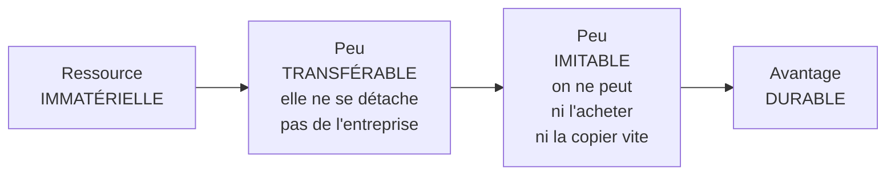

# Q14 — Pourquoi les ressources immatérielles fondent-elles un avantage durable ?

> **La réponse en une phrase**
> Parce qu'une ressource qui ne peut pas être **transférée** ne peut pas être **imitée**, et qu'un avantage n'est durable que dans la mesure exacte où les concurrents ne peuvent pas se le procurer.

---

## Partie 1 — La chaîne de raisonnement, maillon par maillon

C'est une déduction en trois temps. Chaque maillon doit être énoncé, sinon la réponse ressemble à une affirmation.



### Maillon 1 — Immatériel donc peu transférable

🔎 Une machine se démonte, se transporte et se revend. Une réputation ne se démonte pas : elle est attachée à une histoire, à un nom, à des relations. Si vous vendez votre entreprise, l'acheteur reçoit la machine intacte et hérite d'une réputation qui commence déjà à se modifier.

📘 Le cours 3 décrit ces actifs comme « tenant un rôle important dans le processus de production » : l'organisation et le management (« procédures, contrôle qualité »), la technologie (« brevets, allocation menée pour la recherche et le développement »), l'image de marque (« la réputation et la notoriété »).

### Maillon 2 — Peu transférable donc peu imitable

🔎 Un concurrent a deux moyens d'obtenir ce que vous avez : l'**acheter** ou le **reproduire**.
- L'acheter : impossible pour ce qui n'est pas transférable.
- Le reproduire : il faut refaire le chemin, c'est-à-dire y consacrer le même temps.

⚠️ Et le temps ne s'achète pas. C'est ce qui rend certains avantages structurellement inaccessibles.

### Maillon 3 — Peu imitable donc durable

📘 Rappel du mécanisme d'érosion, cours 2 : « Si [le secteur] crée beaucoup de valeur, les intervenants qui participent à chacune des cinq forces **chercheront à se l'approprier**. »

🔎 Un avantage est durable exactement dans la mesure où cette appropriation échoue. Voir [[Q03_Avantage_concurrentiel_durable]].

---

## Partie 2 — Les quatre raisons précises de l'inimitabilité

Aller au-delà de « c'est immatériel donc difficile à copier » est ce qui distingue une bonne réponse.

| Raison | Mécanisme | Exemple |
|---|---|---|
| **Le temps compressé impossible** | Certaines choses ne se construisent qu'en durée, et on ne peut pas accélérer | Une relation de confiance de 20 ans |
| **L'ambiguïté causale** | Le concurrent voit le résultat sans identifier la cause | Une culture d'entreprise, un taux d'erreur très bas |
| **La complémentarité systémique** | L'avantage vient de la combinaison, pas d'un élément isolé | Des procédures, des compétences et une culture qui se renforcent |
| **La dépendance de sentier** | L'avantage vient d'une histoire particulière et non reproductible | 📘 Oncle Hansi : les droits d'une œuvre patrimoniale unique |

🔎 **La deuxième est la plus puissante et la moins connue.** Un concurrent qui voit vos résultats sans comprendre ce qui les produit ne peut pas les copier, même avec des moyens illimités. Il copiera ce qu'il croit être la cause, et échouera.

⚠️ Corollaire inconfortable : une entreprise qui documente et publie parfaitement ses processus réduit sa propre ambiguïté causale. La transparence a un coût stratégique — c'est un arbitrage réel, pas un détail.

---

## Partie 3 — Le tableau du temps d'acquisition

```
Temps qu'il faudrait à un concurrent bien financé

Lever des fonds                ▌ semaines
Acheter du matériel            █ mois
Recruter des compétences       ███ mois à une année
Développer une technologie     ██████ années
Construire une organisation    ████████████ des années
Construire une réputation      ████████████████████ une décennie ou plus
```

🔎 Illustration qualitative. Ce que ce tableau montre : **l'argent achète les premières lignes et échoue sur les dernières**. C'est précisément là qu'un avantage devient défendable.

---

## Partie 4 — La contrepartie : l'immatériel est fragile

Une réponse complète doit dire le revers, sinon elle est naïve.

| Fragilité | Mécanisme |
|---|---|
| **Asymétrie de destruction** | Une réputation met dix ans à se construire et un incident à se détruire |
| **Dépendance aux personnes** | Un savoir-faire non formalisé part avec ceux qui le portent |
| **Invisibilité comptable** | Ce qui n'est pas au bilan n'est pas défendu lors des arbitrages budgétaires |
| **Érosion silencieuse** | On ne voit pas une organisation se dégrader avant que ça ne casse |

⚠️ La troisième ligne est un vrai problème de gestion : une machine a une ligne d'amortissement et un budget de maintenance. Une réputation n'a rien de tout ça. Elle est donc **la première victime des coupes budgétaires**, alors qu'elle est la ressource la plus stratégique.

🔎 Formulation à retenir : **l'immatériel est durable face à l'imitation, pas face à la négligence**.

---

## Partie 5 — L'application à la durabilité

C'est le pont à faire, et il est central pour votre examen.

Une démarche de durabilité crédible produit exactement le type de ressources décrit ci-dessus :

| Ressource produite | Pourquoi elle est inimitable |
|---|---|
| Réputation environnementale | Temps + asymétrie de destruction |
| Compétences internes en éco-conception | Ambiguïté causale : ce sont des savoir-faire diffus |
| Relations fournisseurs durables | Temps + dépendance de sentier |
| Conformité anticipée | 📘 La loi arrive — « Vers une accessibilité numérique obligatoire pour le secteur privé » — et l'avance ne se rattrape pas |
| Confiance | 📘 Le Guide RNE : la démarche « renforce le rapport de confiance entre l'entreprise, ses partenaires et ses clientes et clients » |

⚠️ **Mais la condition est stricte** : ces ressources ne sont créées que si la démarche est **réelle**. Un affichage se copie en une semaine, et il se détruit encore plus vite quand l'écart est révélé.

🔎 C'est l'argument stratégique le plus solide contre le greenwashing : le greenwashing produit exactement l'inverse d'une ressource immatérielle. Il crée une **dette réputationnelle** au lieu d'un capital.

---

## Partie 6 — Exemple complet

**Deux entreprises du même secteur**, fabrication de vêtements techniques, taille comparable.

| | Entreprise A | Entreprise B |
|---|---|---|
| Investissement | 2 M CHF dans une machine de découpe automatisée | 2 M CHF sur 5 ans en formation, audits de filière, relations fournisseurs |
| Ressource créée | Physique | Organisation + image de marque |
| Visible au bilan | ✅ Oui | ❌ Presque pas |
| Gain immédiat | ✅ Productivité +15 % dès le 1er mois | ❌ Rien de mesurable la première année |
| Imitable en | 6 mois (un concurrent achète la même machine) | 5 ans minimum, et encore |
| Position à 5 ans | Avantage disparu, tout le secteur est équipé | Avantage installé et croissant |

🔎 **La leçon** : l'investissement A est plus facile à faire approuver, plus rapide à rentabiliser, et sans valeur stratégique à moyen terme. L'investissement B est plus difficile à défendre en conseil et c'est le seul qui construit quelque chose.

⚠️ Et c'est exactement pourquoi le frein est interne : le mécanisme de décision favorise A. Voir [[Q27_Durabilite_sans_tuer_la_viabilite]].

---

## Les pièges

> [!danger] Erreurs classiques
> 1. **Affirmer sans démontrer.** Déroulez la chaîne : immatériel → non transférable → non imitable → durable.
> 2. **Oublier l'ambiguïté causale.** C'est la barrière la plus solide.
> 3. **Oublier la fragilité.** Durable face à l'imitation, pas face à la négligence.
> 4. **Mettre les ressources humaines du côté immatériel.** 📘 Le cours les classe en matérielles.
> 5. **Oublier le cas du greenwashing.** Il produit une dette, pas un capital.

## À retenir

| | |
|---|---|
| **La chaîne** | Immatériel → peu transférable → peu imitable → avantage durable |
| **Les 4 barrières** | Temps incompressible, ambiguïté causale, complémentarité, dépendance de sentier |
| **La contrepartie** | Fragile, invisible au bilan, détruite plus vite que construite |
| **Les 3 immatérielles 📘** | Organisation/management, technologie, image de marque |
| **Lien durabilité 📘** | La démarche « renforce le rapport de confiance » |
| **Formule** | Durable face à l'imitation, pas face à la négligence |
