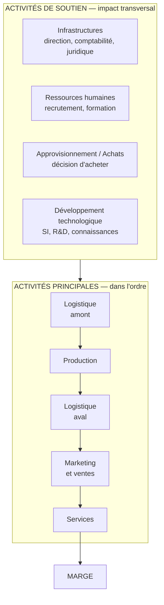

# Q15 — Décrivez la chaîne de valeur de Porter

> **La réponse en une phrase**
> Neuf cases — cinq activités principales qui se suivent dans le temps et quatre de soutien qui les traversent toutes — dont le but n'est pas de décrire l'entreprise mais de **repérer où elle se distingue et où elle est faible**.

---

## Partie 1 — L'idée de départ

📘 Cours 3 : « Le concept de chaîne de valeur repose sur l'idée que divers **inputs** sont transformés afin de créer les produits finaux escomptés (**outputs**). »

En français courant : il entre des choses, il sort un produit, et entre les deux il y a une suite d'étapes. La chaîne de valeur est la liste de ces étapes.

📘 Et surtout, la finalité, qui est la phrase à retenir : « Au sein du processus de fabrication, l'accent est mis sur les activités où l'entreprise/l'organisation parvient à **se distinguer de ses concurrents**, puis sur l'**identification de ses faiblesses à améliorer**. »

⚠️ Ce n'est donc pas un organigramme. C'est un outil de **comparaison** : dans quelle case sommes-nous meilleurs, dans laquelle sommes-nous moins bons ?

📘 « Les activités créatrices de valeur sont de 2 types : **activités principales** et **activités de soutien**. »

---

## Partie 2 — Les cinq activités principales

📘 Les définitions exactes du cours.

| # | Activité | Définition 📘 | Exemple boulangerie |
|---|---|---|---|
| 1 | **Logistique d'approvisionnement** | « Activités logistiques (amont) de réception, de stockage et de manutention interne » | Le camion livre la farine, on la stocke |
| 2 | **Fabrication / production** | « Transformation des matières et sous-ensembles en produits finis » | On pétrit, on cuit |
| 3 | **Logistique de commercialisation** | « Activités de livraison des biens et services au client » | Le pain arrive au comptoir |
| 4 | **Marketing et ventes** | « Moyens et méthodes utilisées pour faire connaître l'offre, la faire apprécier et déclencher l'achat » | Enseigne, vitrine, publicité locale |
| 5 | **Services** | « Activités associées à l'offre principale (formation, maintenance…) » | Commandes sur mesure, reprise |

🔎 Ce qui les unit : elles **touchent physiquement le produit ou le client**, et elles se suivent dans le temps. On ne peut pas vendre avant d'avoir produit.

---

## Partie 3 — Les quatre activités de soutien

📘 « Les activités de soutien ont un impact **transversal** sur toutes les unités et sections. »

⚠️ Attention à un détail de vos supports : la slide qui les liste est titrée « Activités **secondaires** ». Deux mots pour la même chose. Connaissez les deux.

| Activité | Définition 📘 |
|---|---|
| **Infrastructures de l'entreprise** | « Direction générale et autres fonctions communément appelées support, telles que la comptabilité, le juridique » |
| **Gestion des ressources humaines** | « Recrutement, rémunération, motivation, formation, gestion de carrière » |
| **Approvisionnement** | « Achats de matière, de marchandises, de fournitures diverses, mais également de moyens de production » |
| **Développement technologique** | « Systèmes d'information, R&D, gestion des connaissances » |

### Le piège du mot « approvisionnement »

⚠️ Ce mot apparaît **deux fois** dans la chaîne, et ce n'est pas la même chose :

| Où | Ce que c'est |
|---|---|
| Activité **principale** n°1 | Le mouvement physique : le camion arrive, on décharge, on range |
| Activité **de soutien** | La **décision d'achat** : quel fournisseur, quel contrat, quel cahier des charges |

🔎 Et le cours 5 appelle cette seconde case « **les achats** ». Même endroit, deux mots selon les supports.

---

## Partie 4 — Le schéma complet

🔎 **Ce que « transversal » veut dire concrètement** : une décision prise dans une case de soutien se répercute sur les cinq cases principales. Si les ressources humaines vont mal, la production, la vente et le service vont mal simultanément.

⚠️ Conséquence stratégique, et c'est le point le plus important de cette fiche : **les leviers les plus puissants sont dans les activités de soutien, alors que les impacts visibles sont dans les activités principales**. La case qui décide n'est jamais la case qui produit l'effet.

---

## Partie 5 — Comment l'utiliser : la méthode en cinq temps

| Temps | Ce qu'on fait | Question à poser |
|---|---|---|
| 1 | Décrire ce que fait votre entreprise dans chaque case | Concrètement, qui fait quoi ici ? |
| 2 | Comparer chaque case aux concurrents | Sommes-nous meilleurs, équivalents ou moins bons ? |
| 3 | Repérer les cases de distinction | 📘 « où l'entreprise parvient à se distinguer » |
| 4 | Repérer les cases faibles | 📘 « identification de ses faiblesses à améliorer » |
| 5 | Alimenter le SWOT | Forces ← cases 3 ; faiblesses ← cases 4 |

⚠️ L'erreur la plus courante est de s'arrêter au temps 1. Décrire les neuf cases n'est pas un diagnostic : **sans comparaison, il n'y a ni force ni faiblesse**.

---

## Partie 6 — La version durable

📘 Le cours 3 ajoute une définition élargie : « **La chaîne de valeur en durabilité** : l'ensemble des activités, **depuis les matières premières jusqu'au recyclage ou à la fin de vie** d'un produit/service, en intégrant systématiquement les dimensions :
> - **Environnementales** : réduction de l'empreinte carbone, circularité des matériaux, énergies renouvelables.
> - **Sociales** : conditions de travail, équité, impact sur les communautés locales.
> - **Économiques** : création de valeur à long terme, efficacité des ressources, innovation responsable. »

| | Chaîne classique | Chaîne durable |
|---|---|---|
| Périmètre | De l'entrée à la sortie de l'entreprise | 📘 « Des matières premières à la fin de vie » |
| Critère | La marge | Trois dimensions : environnementale, sociale, économique |
| Question | Où crée-t-on de la valeur ? | 📘 « Où se crée la valeur durable ? Où sont les **impacts négatifs** ? » |

🔎 Le mot décisif est « depuis… jusqu'à ». Il **empêche le transfert d'impact** : une entreprise qui délocalise sa production ne réduit pas ses émissions, elle change qui les compte. Le périmètre élargi ferme cette porte.

Voir [[Q16_Ou_agir_pour_reduire_lempreinte_carbone]].

---

## Partie 7 — Le prolongement : le système de valeur

📘 Le cours BM durable évoque « l'**architecture de valeur** », qui « décrit la production et la délivrance de la proposition de valeur à travers les ressources et compétences de l'entreprise. Il s'agit principalement de la **chaîne de valeur** et du **système de valeur**. »

🔎 Le système de valeur, c'est l'enchaînement des chaînes de valeur : celle de votre fournisseur, la vôtre, celle de votre distributeur. Votre chaîne est un maillon dans une chaîne plus grande.

⚠️ C'est cette notion qui rend nécessaires les partenariats : vous ne contrôlez qu'un maillon, alors que la durabilité se joue sur toute la longueur. Voir [[Q17_La_coopetition]].

---

## Partie 8 — Exemple express

**L'entreprise.** Un cabinet d'architecture genevois, 30 personnes.

| Case | Ce qu'elle y fait | Vs concurrents |
|---|---|---|
| Logistique amont | Réception des dossiers, plans, relevés | = |
| Production | Conception, plans d'exécution | **+** méthodologie éprouvée |
| Logistique aval | Livraison des dossiers, suivi de chantier | = |
| Marketing et ventes | Concours, réseau, bouche-à-oreille | **−** aucune démarche commerciale structurée |
| Services | Suivi post-livraison | **+** rare dans le secteur |
| Infrastructures | Direction, administration | = |
| RH | Recrutement, formation | **−** pas de plan de formation |
| **Achats** | Logiciels, matériel informatique, prestataires | **−** aucun critère environnemental |
| Développement technologique | Outils de modélisation, veille | **+** internalisé |

🔎 Lecture : trois forces (production, services, technologie), trois faiblesses (commercial, RH, achats). Et deux des trois faiblesses sont dans les activités de **soutien**, ce qui signifie qu'elles pèsent sur tout le reste. C'est là que le plan d'action doit commencer.

---

## Les pièges

> [!danger] Erreurs classiques
> 1. **Décrire sans comparer.** 📘 Le but est de repérer distinction et faiblesses.
> 2. **Confondre les deux « approvisionnement ».** Mouvement physique vs décision d'achat.
> 3. **Ignorer le mot « secondaires ».** Vos slides emploient les deux termes.
> 4. **Traiter les activités de soutien comme accessoires.** 📘 Elles ont un impact « transversal ».
> 5. **Oublier le périmètre durable.** 📘 Des matières premières à la fin de vie.
> 6. **Oublier la marge.** La chaîne aboutit à la création de marge, c'est sa finalité économique.

## À retenir

| | |
|---|---|
| **Principe 📘** | Des inputs transformés en outputs |
| **Finalité 📘** | Repérer où l'on se distingue et où l'on est faible |
| **5 principales 📘** | Logistique amont, production, logistique aval, marketing et ventes, services |
| **4 de soutien 📘** | Infrastructures, RH, approvisionnement, développement technologique |
| **Caractéristique 📘** | Les activités de soutien ont un impact « transversal » |
| **Version durable 📘** | Des matières premières à la fin de vie, en trois dimensions |
