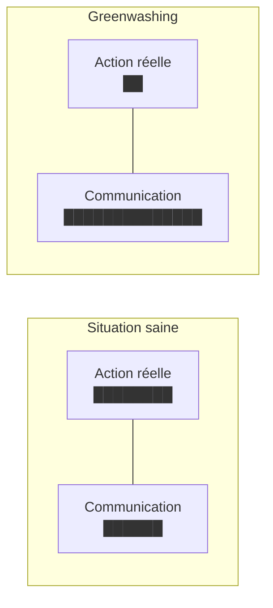
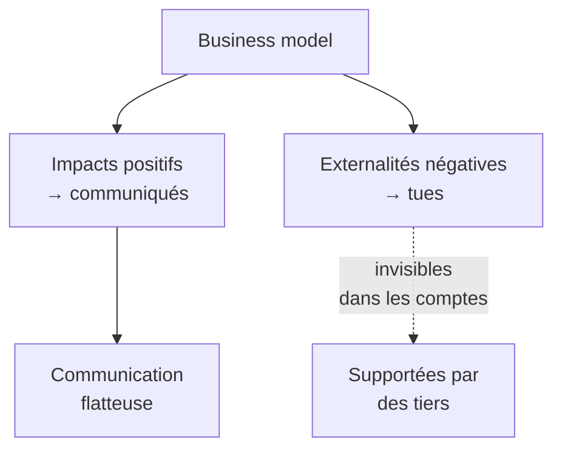

# Q15 — Qu'est-ce que le greenwashing et comment l'éviter ?

> **La réponse en une phrase**
> Le greenwashing est l'écart entre ce qu'une entreprise **dit** de son engagement et ce qu'elle **fait** réellement dans sa chaîne de valeur — et on l'évite non pas en communiquant mieux, mais en rendant la communication **vérifiable**.

---

## Partie 1 — Définition précise, et ce qu'elle exclut

### La définition

Le greenwashing est une communication qui **survend l'engagement écologique réel** : allégations vagues, sans preuve, ou disproportionnées par rapport à ce qui est effectivement fait.

### Ce que ce n'est pas — trois précisions utiles

| Ce n'est pas | Pourquoi |
|---|---|
| Un mensonge délibéré nécessairement | Beaucoup de greenwashing est involontaire : une direction sincère, des mécanismes internes inchangés |
| Le fait de communiquer sur ses efforts | Communiquer est légitime ; c'est la **disproportion** qui pose problème |
| Un problème seulement moral | C'est un risque juridique, réputationnel et stratégique concret |

🔎 La définition opérationnelle qui vous servira : **le greenwashing, c'est un écart de proportion**. Pas « ils mentent », mais « leur communication est plus grande que leur action ».

---

## Partie 2 — Les six formes concrètes

Savoir les nommer permet de les détecter.

| Forme | Description | Exemple type |
|---|---|---|
| **L'allégation vague** | Un mot qui ne certifie rien | « Éco-responsable », « respectueux de la nature », « vert » |
| **Le détail qui cache le tout** | On communique sur un point minuscule et vertueux, on tait le reste | Un emballage recyclable pour un produit fabriqué à l'autre bout du monde |
| **Le recyclage-alibi** | On met en avant le dernier R pour éviter de parler des deux premiers | « 100 % recyclable » sans rien dire des volumes produits |
| **La compensation sans réduction** | On achète des crédits carbone au lieu de réduire | 📘 Le cours distingue bien « réduire **ou** compenser » |
| **Le label auto-décerné** | Un logo maison qui imite un label indépendant | Un pictogramme feuille verte créé par le service marketing |
| **La promesse lointaine** | Un engagement à 2050 sans jalon intermédiaire | « Neutralité carbone en 2050 » sans plan à 3 ans |

### Le cas du recyclage-alibi : pourquoi c'est le plus fréquent

📘 Le cours 5 donne l'ordre des 3R et insiste : « Tout cela dépend des efforts de **réduction et de réutilisation, puis enfin seulement de recyclage**. »

🔎 Le mécanisme du greenwashing consiste à **inverser cet ordre dans la communication**. Le recyclage est le seul des trois R qui ne remet pas en cause le volume vendu. Communiquer dessus permet d'avoir l'air vertueux sans changer le modèle économique.

⚠️ Test simple à appliquer : si une entreprise ne communique que sur le recyclage et jamais sur la réduction, il y a de fortes chances que ses volumes augmentent. Voir [[Q18_Economie_circulaire_des_appareils_numeriques]].

---

## Partie 3 — Le lien avec les externalités négatives

C'est ici que votre cours donne le concept le plus utile.

📘 « Dans le cadre du Business Model Canvas (BMC), les impacts positifs et les **externalités négatives** sont des notions liées à la création de valeur au-delà du seul aspect économique. Une entreprise responsable cherche à : maximiser les impacts positifs (valeur partagée), **réduire ou compenser les externalités négatives**. »

### Le test qui découle de cette phrase

🔎 Le greenwashing peut se définir très précisément avec ce vocabulaire :

> **Un business model est en greenwashing quand il communique sur ses impacts positifs tout en laissant ses externalités négatives cachées.**

⚠️ Et notez la nuance du cours : « réduire **ou** compenser ». Compenser est autorisé, mais c'est le second choix. Une entreprise qui ne fait que compenser, sans jamais réduire, est à la limite du greenwashing.

---

## Partie 4 — Les cinq moyens de l'éviter

### 1. Prouver par des chiffres

Une allégation sans chiffre n'est pas vérifiable, donc elle ne vaut rien.

| Formulation faible | Formulation solide |
|---|---|
| « Nous réduisons notre empreinte » | « Nous sommes passés de 480 à 390 tonnes CO₂ entre 2024 et 2026 » |
| « Nos produits durent longtemps » | « Pièces détachées garanties disponibles 15 ans » |
| « Nous achetons responsable » | « 80 % de nos achats IT respectent les critères TCO » |

⚠️ Et le chiffre doit être **absolu**, pas seulement en intensité. Une intensité qui baisse pendant que le total monte est techniquement vraie et trompeuse. C'est l'effet rebond. Voir [[Q08_Donnees_temps_reel_et_logistique_durable]].

### 2. Faire vérifier par un tiers

📘 Le cours 5 liste les labels indépendants : TCO certified, Ecolabel européen, Energy Star, EPEAT, Der blaue Engel, et les normes ISO 14'024, 14'021, 14'025.

🔎 Le critère : **un label ne vaut que si celui qui le décerne n'est pas celui qui le porte**. Voir [[Q12_Transparence_labels_et_positionnement]].

### 3. Assurer la cohérence avec toute la chaîne de valeur

📘 La chaîne de valeur en durabilité couvre « l'ensemble des activités, depuis les matières premières jusqu'au recyclage ou à la fin de vie ».

🔎 Le test de cohérence : si vous communiquez sur un maillon, l'auditeur regardera les huit autres. Communiquer sur l'emballage quand les achats amont ne respectent aucun critère est une invitation à l'enquête.

### 4. Publier aussi ce qui ne va pas

📘 Le document sur la métamorphose du BMC parle de « relations durables par la **transparence**, le partage d'informations sur la durabilité ».

🔎 Le point contre-intuitif : une entreprise qui publie ses points faibles et son plan de progrès est **plus** crédible qu'une entreprise dont tout est parfait. Un bilan sans aucune ombre déclenche la méfiance.

### 5. Changer les critères internes, pas seulement le discours

🔎 C'est la mesure de fond. Tant que les acheteurs sont évalués sur le prix et les managers sur l'exercice annuel, la communication durable est structurellement en avance sur l'action. Le greenwashing devient alors mécanique, sans que personne ne l'ait voulu. Voir [[Q14_Les_freins_internes_a_une_strategie_durable]].

---

## Partie 5 — Une grille de détection en cinq questions

Utilisable pour tester une communication, la vôtre ou celle d'un concurrent.

| Question | Si la réponse est non |
|---|---|
| 1. L'allégation est-elle **chiffrée** ? | Allégation vague |
| 2. Le chiffre est-il **absolu** et pas seulement en intensité ? | Risque de masquer un effet rebond |
| 3. Un **tiers indépendant** a-t-il vérifié ? | Auto-déclaration |
| 4. L'effort porte-t-il sur les maillons qui **pèsent le plus** ? | Détail qui cache le tout |
| 5. Y a-t-il de la **réduction**, ou seulement de la compensation et du recyclage ? | Recyclage-alibi |

🔎 Cinq « oui » : la communication est probablement solide. Un seul « non » sur les questions 3 ou 5 suffit à rendre l'ensemble suspect.

---

## Partie 6 — Exemple complet : deux communications comparées

**Le produit.** Une gamme de mobilier de bureau.

### Communication A

> « Chez nous, l'écologie est au cœur de nos valeurs. Nos meubles sont conçus dans le respect de la planète, avec des matériaux recyclables, pour un avenir plus vert. »

**Passage à la grille :**

| Question | Réponse | Verdict |
|---|---|---|
| Chiffrée ? | Non | ❌ |
| Absolue ? | Sans objet | ❌ |
| Vérifiée par un tiers ? | Non | ❌ |
| Porte sur les maillons lourds ? | Non, uniquement la recyclabilité | ❌ |
| Réduction ou seulement recyclage ? | Uniquement recyclage | ❌ |

**Verdict : greenwashing caractérisé.** Aucune information vérifiable. « Recyclable » ne dit même pas « recyclé » : c'est une propriété théorique du matériau, pas un fait sur le produit.

### Communication B

> « 72 % de notre bois provient de forêts certifiées, contre 41 % en 2024. Nos pièces détachées sont garanties disponibles 15 ans. Nous n'avons pas encore réduit nos émissions de transport, qui ont augmenté de 4 % avec la croissance de nos ventes : c'est notre chantier prioritaire pour 2027. »

**Passage à la grille :**

| Question | Réponse | Verdict |
|---|---|---|
| Chiffrée ? | Oui, avec une année de référence | ✅ |
| Absolue ? | Oui, et l'entreprise signale elle-même une hausse | ✅ |
| Vérifiée ? | Certification forestière indépendante | ✅ |
| Maillons lourds ? | Matière première et durée de vie | ✅ |
| Réduction ? | En cours, et l'échec est reconnu | ✅ |

**Verdict : communication solide.** 🔎 Et notez ce qui la rend crédible : elle contient une **mauvaise nouvelle**. L'aveu d'une hausse de 4 % renforce la crédibilité des trois affirmations positives, parce qu'il prouve que l'entreprise ne sélectionne pas ses chiffres.

⚠️ C'est l'enseignement principal de cette fiche : **la crédibilité vient de la vérifiabilité et de la complétude, pas de la beauté du message**.

---

## Partie 7 — Pourquoi c'est un enjeu stratégique, pas seulement éthique

| Risque | Conséquence concrète |
|---|---|
| Juridique | Les allégations environnementales sont de plus en plus encadrées ; une allégation non prouvée peut être sanctionnée |
| Réputationnel | La révélation d'un écart détruit plus de valeur que la communication n'en avait créé |
| Concurrentiel | Le greenwashing dévalue les labels et pénalise les acteurs réellement engagés — c'est le mécanisme décrit en [[Q12_Transparence_labels_et_positionnement]] |
| Interne | Les salariés voient l'écart entre le discours et la réalité, ce qui démobilise |

🔎 Le raisonnement stratégique de fond : le greenwashing est un pari sur le fait que personne ne vérifiera. Or la traçabilité, le reporting et la pression des parties prenantes rendent la vérification de plus en plus facile. C'est un pari dont les chances baissent chaque année.

---

## Les pièges

> [!danger] Erreurs classiques
> 1. **Définir le greenwashing comme un mensonge.** Souvent c'est un écart de proportion, sans intention de tromper.
> 2. **Proposer de « mieux communiquer ».** L'antidote est la preuve, pas la communication.
> 3. **Oublier les externalités négatives.** 📘 C'est le concept du cours qui structure la réponse.
> 4. **Oublier l'ordre des 3R.** Le recyclage-alibi est la forme la plus fréquente.
> 5. **Oublier l'indicateur absolu.** Une intensité qui baisse peut cacher un total qui monte.
> 6. **Ne pas voir l'enjeu stratégique.** Ce n'est pas qu'un sujet moral.

## À retenir

| | |
|---|---|
| **Définition** | Écart entre la communication et l'action réelle |
| **Formes** | Allégation vague, détail qui cache le tout, recyclage-alibi, compensation sans réduction, label auto-décerné, promesse lointaine |
| **Concept-clé 📘** | Externalités négatives laissées cachées |
| **Grille de détection** | Chiffré, absolu, vérifié par un tiers, sur les maillons lourds, avec de la réduction |
| **L'antidote de fond** | Changer les critères internes, pas le discours |
| **Le signe de crédibilité** | Une communication qui contient aussi ce qui ne va pas |
