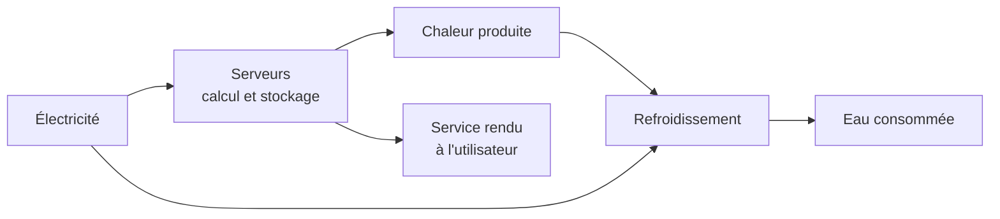

# Q16 — Quel est l'impact environnemental des data centers et comment le réduire ?

> **La réponse en une phrase**
> Un centre de données consomme de l'électricité et de l'eau en continu, et sa croissance est **exponentielle** — donc les gains d'efficacité, aussi réels soient-ils, ne suffisent pas : il faut agir sur la demande, pas seulement sur l'offre.

---

## Partie 1 — Qu'est-ce qu'un centre de données, concrètement

### La définition matérielle

Un centre de données est un bâtiment rempli de serveurs qui fonctionnent 24 heures sur 24. Chaque serveur consomme de l'électricité pour calculer, et transforme cette électricité en chaleur. Il faut donc **refroidir** en permanence, ce qui consomme encore de l'électricité et souvent de l'eau.



🔎 Le point à comprendre : un centre de données consomme **deux fois** pour le même travail — une fois pour calculer, une fois pour évacuer la chaleur produite par le calcul. C'est une contrainte physique, pas un défaut de conception.

### Pourquoi c'est invisible

📘 Le document de cours sur le donut l'explique : « l'impact environnemental du numérique est souvent difficile à percevoir, car il repose sur des **infrastructures éloignées et invisibles**, comme les centres de données, les réseaux et les serveurs ».

🔎 C'est la caractéristique stratégique la plus importante de ce sujet : l'utilisateur qui envoie une requête ne voit rien, n'entend rien, ne paie rien de visible. L'impact existe, mais aucun signal ne l'accompagne.

---

## Partie 2 — Les trois postes d'impact du numérique

Il est essentiel de situer les centres de données dans un ensemble, sinon on se trompe de priorité.

| Poste | Ce que c'est | Nature dominante de l'impact |
|---|---|---|
| **Terminaux** | Ordinateurs, téléphones, tablettes, objets connectés | **Fabrication** (carbone incorporé) |
| **Centres de données** | Serveurs de calcul et de stockage | **Usage** (électricité, eau) |
| **Réseaux** | Antennes, câbles, équipements de transmission | Fabrication et usage |

⚠️ La distinction fabrication / usage est décisive pour savoir quoi faire.

🔎 Pour les terminaux, le levier est d'**allonger la durée de vie** — voir [[Q18_Economie_circulaire_des_appareils_numeriques]]. Pour les centres de données, le levier est de **réduire la demande de calcul et de stockage**, parce que l'impact est proportionnel à l'usage.

---

## Partie 3 — Les chiffres du cours

📘 Ces chiffres viennent de vos supports. Ce sont les plus solides que vous puissiez citer.

### La trajectoire

📘 Cours numérique et durabilité : « Croissance de la consommation électrique (avec IA) : **16 % / an** (doublement tous les 4 ans) ».

```
Ce que signifie +16 % par an

Aujourd'hui   ████
Dans 4 ans    ████████
Dans 8 ans    ████████████████
Dans 12 ans   ████████████████████████████████
```

### Les projections de l'AIE

📘 Cité par le cours depuis Le Monde : le développement de l'IA générative « devrait plus que **doubler la demande d'électricité des centres de données** dans le monde d'ici à 2030. Selon un rapport publié en avril par l'Agence internationale de l'énergie (AIE), elle devrait atteindre environ **945 térawattheures**, soit plus que la consommation totale d'électricité du **Japon**. »

📘 « À cette échéance, les centres de données consommeront un peu moins de **3 % de l'électricité mondiale** […] "Aux États-Unis, les centres de données représentent près de la **moitié de la croissance attendue de la demande d'électricité** d'ici à 2030". »

### L'unité individuelle

📘 « Une requête moyenne sur ChatGPT génère environ **4,32 grammes de CO₂**, soit **4 à 5 fois plus** qu'une recherche Google. Cela s'explique par la puissance de calcul nécessaire pour générer une réponse basée sur des modèles de langage complexes. »

🔎 Ce chiffre est utile pour une raison précise : il donne une **échelle individuelle** à un phénomène qui ne se raconte qu'en térawattheures. C'est ce qui rend le sujet actionnable.

---

## Partie 4 — Le raisonnement central : pourquoi l'efficacité ne suffit pas

C'est le cœur de cette fiche.

### Le raisonnement en trois temps

**Temps 1.** Les centres de données deviennent réellement plus efficaces. L'électricité par unité de calcul baisse d'année en année. Ce n'est pas contesté.

**Temps 2.** Mais le volume de calcul croît de **16 % par an**, soit un doublement tous les quatre ans.

**Temps 3.** Une amélioration d'efficacité de, disons, 30 % est absorbée en moins de deux ans par la croissance des volumes.

```
Efficacité par calcul     ▼ améliorée
Volume de calculs         ▲▲▲ doublement tous les 4 ans
--------------------------------------------------------
Consommation totale       ▲▲ en hausse malgré l'efficacité
```

🔎 **La conclusion à énoncer** : quand la demande croît de façon exponentielle et l'efficacité de façon linéaire, l'efficacité perd. Toujours. Ce n'est pas un jugement, c'est une propriété mathématique.

📘 C'est exactement la position B du débat que le cours pose : « l'efficacité seule ne suffira pas si le modèle économique reste fondé sur l'expansion continue des usages ».

---

## Partie 5 — Les leviers, du plus faible au plus fort

Je les classe volontairement dans cet ordre, parce que la hiérarchie est le point à comprendre.

### Niveau 1 — Efficacité technique (utile, insuffisant)

| Levier | Ce que ça fait |
|---|---|
| Amélioration du PUE | Réduire l'énergie consacrée au refroidissement par rapport à celle du calcul |
| Refroidissement passif, air libre, climats froids | Moins d'énergie de climatisation |
| Récupération de la chaleur fatale | Chauffer des bâtiments voisins avec la chaleur des serveurs |
| Matériel plus performant par watt | Plus de calcul pour la même électricité |

📚 *Complément hors cours* : le sigle PUE (Power Usage Effectiveness) n'apparaît pas dans vos slides. Mentionnez-le comme un apport extérieur.

### Niveau 2 — Décarbonation de l'électricité (utile, déplacé)

| Levier | Limite |
|---|---|
| Alimentation en énergies renouvelables | ⚠️ Réduit le CO₂ mais pas la consommation. L'électricité verte utilisée par un centre de données n'est plus disponible ailleurs |
| Localisation dans des pays à électricité décarbonée | Déplace le problème géographiquement |

🔎 Le point critique à faire : dans un système où l'électricité décarbonée est limitée, en consommer davantage pour le numérique signifie qu'un autre usage restera carboné. Le bénéfice est donc moins direct qu'il n'y paraît.

### Niveau 3 — Mutualisation (réel, ambivalent)

Un serveur en propre dans une entreprise tourne souvent à 10 % de sa capacité. Un serveur mutualisé tourne beaucoup plus haut. La mutualisation améliore donc réellement le rendement.

⚠️ Mais elle rend aussi la ressource « illimitée » du point de vue de l'utilisateur, ce qui encourage le stockage inutile. C'est l'effet rebond appliqué au cloud. Voir [[Q21_Le_cloud_soutient_il_la_durabilite]].

### Niveau 4 — Sobriété (le seul levier qui agit sur la cause)

📘 Le cours donne le principe : « **Sobriété** : questionner les besoins en première intention. **Lucidité** : penser les conséquences directes et indirectes. »

📘 Et le RGESN 2024 donne les leviers concrets, qui agissent tous sur la demande adressée aux centres de données : agir sur « l'architecture, les contenus, les flux, l'hébergement, les composants et la **durée de vie des données** ».

| Levier RGESN 📘 | Effet sur les centres de données |
|---|---|
| Architecture | Moins de requêtes serveur par action utilisateur |
| Contenus | Moins de volume à stocker et à transférer |
| Flux | Moins de synchronisations inutiles |
| Hébergement | Dimensionnement au réel plutôt qu'au maximum théorique |
| Composants | Moins de bibliothèques chargées |
| **Durée de vie des données** | Moins de stockage permanent |

⚠️ La dernière ligne est la plus négligée. Conserver dix ans de logs, de sauvegardes et d'historiques a un coût énergétique **permanent**, pour une valeur qui décroît très vite.

📘 Exemple concret du cours : sur la vidéo, ajuster la définition au contexte de visualisation, « car une résolution trop élevée augmente à la fois la consommation énergétique du terminal et le volume de données transférées ».

### Niveau 5 — Le rôle de la régulation

📘 Vos supports posent la question ouverte : « Quel avenir pour les centres de données ? » et notent : « Subventions/avantages fiscaux aux entreprises pour créer des "Green data centers". **Mais cela ne change pas le modèle économique.** Avoir une réflexion sur la **localisation** des data centers ? Le rôle de l'État de mettre des **normes strictes**. »

🔎 Cette note du cours est précieuse : elle dit qu'un centre de données « vert » subventionné reste un centre de données dont la croissance est portée par un modèle économique inchangé. Le cours suggère donc que la réponse est aussi **politique**, pas seulement technique.

---

## Partie 6 — Ce qu'une entreprise ordinaire peut faire

Vous n'exploitez pas un centre de données. Mais vous en consommez. Voici la traduction opérationnelle.

| Action | Case de la chaîne de valeur | Effet |
|---|---|---|
| Définir une politique de durée de vie des données | Développement technologique | Réduit le stockage permanent |
| Alléger les services numériques livrés | Développement technologique | Réduit les requêtes et les transferts |
| Choisir un hébergeur sur des critères énergétiques et de localisation | **Achats** | Agit sur l'amont |
| Questionner le recours à l'IA générative selon la tâche | Infrastructures / gouvernance | 📘 4,32 g par requête, 4 à 5 fois une recherche |
| Mesurer la consommation numérique | Infrastructures | Rend le sujet pilotable |

🔎 Notez encore une fois que le levier le plus fort passe par les **achats** — ici le choix de l'hébergeur. C'est le schéma récurrent de tout le cours. Voir [[Q04_Reduire_lempreinte_carbone_via_la_chaine_de_valeur]].

---

## Partie 7 — Exemple complet

**L'entreprise.** Une plateforme suisse de réservation en ligne, 45 salariés, hébergée dans le cloud.

### Diagnostic

| Constat | Poids |
|---|---|
| Photos servies en pleine résolution quel que soit l'écran | Élevé |
| Sauvegardes complètes quotidiennes conservées 7 ans | Élevé, et croissant |
| Synchronisation en temps réel de données consultées une fois par mois | Moyen |
| Environnements de test allumés en permanence, y compris la nuit | Moyen |
| Fonction de recommandation par IA sur chaque page | Élevé, 📘 4 à 5 fois le coût d'une requête classique |

### Actions, classées par levier

| Levier | Action | Gain attendu |
|---|---|---|
| Contenus | Résolution adaptée à l'écran | Fort, immédiat |
| Durée de vie des données | Sauvegardes complètes hebdomadaires, incrémentales quotidiennes, rétention 18 mois | Fort, croissant dans le temps |
| Flux | Synchronisation à la demande | Moyen |
| Hébergement | Extinction automatique des environnements de test la nuit | Moyen, immédiat |
| **Sobriété** | Recommandation par IA uniquement sur la page de résultats, pas partout | Fort |

### La vérification

| Indicateur | Type |
|---|---|
| Volume de données stockées (To) | Absolu |
| Volume transféré par visite (Mo) | Intensité |
| Nombre d'appels à l'IA par visite | Intensité |
| **Consommation totale facturée par l'hébergeur** | **Absolu** |

⚠️ Le dernier indicateur est le seul qui détecte l'effet rebond : si le trafic double, tous les indicateurs d'intensité peuvent s'améliorer pendant que la facture énergétique augmente.

---

## Les pièges

> [!danger] Erreurs classiques
> 1. **Ne parler que d'électricité.** L'eau de refroidissement est un impact réel et souvent oublié.
> 2. **Isoler les centres de données.** Ce sont l'un des trois postes ; pour les terminaux, l'impact est dans la fabrication.
> 3. **Croire que l'efficacité suffit.** 📘 +16 % par an bat n'importe quel gain d'efficacité linéaire.
> 4. **Présenter le renouvelable comme la solution.** Il déplace le problème dans un système où l'électricité décarbonée est limitée.
> 5. **Oublier la durée de vie des données.** 📘 C'est un des six leviers du RGESN.
> 6. **Oublier la dimension politique.** 📘 Le cours note que les subventions « ne changent pas le modèle économique ».

## À retenir

| | |
|---|---|
| **Impacts** | Électricité de calcul, électricité de refroidissement, eau |
| **Les 3 postes** | Terminaux (fabrication), centres de données (usage), réseaux |
| **Chiffres 📘** | +16 % par an, doublement tous les 4 ans ; 945 TWh en 2030 ; <3 % de l'électricité mondiale ; 4,32 g par requête ChatGPT |
| **Le raisonnement clé** | Efficacité linéaire contre demande exponentielle : l'efficacité perd |
| **Le seul levier de fond** | La sobriété, via les six leviers du RGESN |
| **Note du cours 📘** | Les « green data centers » subventionnés « ne changent pas le modèle économique » |
