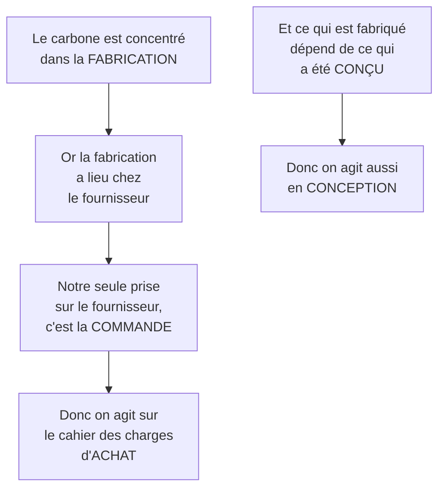

# Q16 — Où agir dans la chaîne de valeur pour réduire l'empreinte carbone ?

> **La réponse en une phrase**
> Là où le carbone est concentré — ce qui, pour la plupart des entreprises, n'est ni la production ni les déplacements, mais les **achats** et la **conception** : les deux cases qui décident de ce que les autres feront.

---

## Partie 1 — La règle avant les leviers : mesurer puis hiérarchiser

Beaucoup de réponses listent des actions dans les neuf cases. C'est une erreur de méthode, pour trois raisons :

| Contrainte | Conséquence |
|---|---|
| L'argent est limité | On ne finance pas neuf chantiers |
| Le temps est limité | Neuf projets de front, c'est neuf projets ratés |
| **Les cases n'ont pas le même poids carbone** | Agir partout, c'est diluer l'effort |

🔎 La troisième raison commande tout. **Avant d'agir, il faut savoir où est le carbone.**

📘 Le cours durabilité pose d'ailleurs l'exercice ainsi : « Où se crée la valeur durable ? **Où sont les impacts négatifs ?** […] Proposez **2 améliorations** pour renforcer la durabilité. »

Deux améliorations. Pas neuf.

---

## Partie 2 — Où est le carbone, typiquement

```
Répartition de l'empreinte d'un appareil ou d'un équipement
(ordres de grandeur illustratifs, PAS des chiffres du cours)

Fabrication          ███████████████████████████████████  ~75 %
Usage (électricité)  ████████                             ~18 %
Transport            ██                                    ~5 %
Fin de vie           █                                     ~2 %
```

🔎 Ces proportions sont mon illustration, et elles **varient fortement selon le métier**. Ce qui compte n'est pas le chiffre mais la structure : pour beaucoup d'entreprises de services et de bureaux, l'essentiel du carbone est **déjà émis avant l'achat** — c'est le carbone incorporé.

⚠️ Contre-exemples à connaître :
- Un transporteur routier : le carburant domine, donc la logistique.
- Un centre de données : l'électricité d'usage domine.
- Une entreprise agroalimentaire : les matières premières agricoles dominent.

**La méthode ne change pas — mesurer puis hiérarchiser — mais le résultat change.** C'est pour ça que le cours fait toujours commencer par un diagnostic.

---

## Partie 3 — Le raisonnement qui désigne les deux leviers



### Levier n°1 — Les achats

📘 Le cours 5 donne le contenu : « Fixer des critères pour les achats (ex : critères **TCO**) », soit sept critères — fabrication socialement responsable, fabrication respectueuse de l'environnement, santé et sécurité des utilisateurs, performance du produit, **extension de la durée de vie**, réduction des substances dangereuses, **récupération des matériaux**.

📘 Et les sept principes de l'achat responsable : « 1) Minimiser les impacts environnementaux/sociaux. 2) Les **coûts du cycle de vie** (prix d'achat, coût de fonctionnement, coût de l'élimination). 3) Labels, certifications. 4) Fournisseurs engagés. 5) Durée de vie, économie circulaire. 6) Emballages. 7) Transports. »

### Levier n°2 — Le développement technologique

📘 Cette case couvre « les systèmes d'information, la R&D, la gestion des connaissances ».

🔎 L'impact d'un produit est **décidé à la conception, puis subi** pendant toute sa vie. On ne peut pas rendre réparable un appareil dont le boîtier est collé. Agir en conception est donc structurellement plus puissant qu'agir en production.

📘 Pour le numérique, le cadre existe : le **RGESN 2024** demande d'agir sur « l'architecture, les contenus, les flux, l'hébergement, les composants et la **durée de vie des données** ».

⚠️ Notez que ces deux leviers sont tous les deux des **activités de soutien**. 📘 « Les activités de soutien ont un impact transversal sur toutes les unités et sections. » Le gain se voit dans les activités principales, la décision se prend dans les activités de soutien.

---

## Partie 4 — Les leviers case par case

| Case | Ce qui émet | Levier |
|---|---|---|
| Logistique amont | Transport, matières, énergie de stockage | Sourcing de proximité, matériaux à faible empreinte, taux de remplissage |
| Production | Énergie de process, rebuts, chaleur perdue | 📘 Énergies renouvelables, efficacité, réduction des rebuts, récupération de chaleur |
| Logistique aval | Transport, emballages, dernier kilomètre | Report modal, mutualisation, emballages réemployables |
| Marketing et ventes | Supports physiques, déplacements | Dématérialisation, campagnes numériques sobres |
| Services | Déplacements, remplacements prématurés | 📘 Extension de la durée de vie : maintenance, réparabilité, pièces détachées |
| **Achats** | 🔴 Levier n°1 | Critères TCO contraignants, labels exigés, coût du cycle de vie |
| **Développement technologique** | 🔴 Levier n°2 | Éco-conception ; RGESN pour le numérique |
| RH | Mobilité domicile-travail | Formation, télétravail, critères carbone dans les objectifs |
| Infrastructures | Le pilotage | Bilan carbone, gouvernance, indicateurs au tableau de bord |

---

## Partie 5 — Les 3R, et pourquoi l'ordre commande l'action

📘 « Le modèle des 3R : réduire, réutiliser, recycler. […] Tout cela dépend des efforts de **réduction et de réutilisation, puis enfin seulement de recyclage**. »

```
Carbone évité selon le niveau

1. Réduire     ████████████████████████████  ne pas acheter = tout évité
2. Réutiliser  ████████████████████          une fabrication en moins
3. Recycler    ████████                      le carbone est déjà parti
```

⚠️ Si votre seule proposition est « mieux recycler », vous avez implicitement accepté que tout soit fabriqué puis jeté. Voir [[Q53_Les_3R_et_pourquoi_lordre_compte]].

📘 Le cours des achats donne d'ailleurs le cycle complet : « 1. **Acheter moins** (avant l'appel d'offres) // ODD. 2. **Acheter mieux** (appel d'offres). 3. **Utiliser plus longtemps, utiliser mieux** (après l'appel d'offres). »

🔎 Notez l'ordre : acheter moins vient **avant** l'appel d'offres. La première question n'est pas « lequel choisir » mais « en a-t-on besoin ».

---

## Partie 6 — Les deux pièges qui annulent une bonne analyse

### Le transfert d'impact

Vous fermez l'atelier, vous sous-traitez. Vos émissions internes chutent de 40 %. Vous n'avez rien réduit : vous avez changé qui les compte.

📘 C'est exactement ce que le périmètre du cours empêche : « depuis les matières premières jusqu'au recyclage ou à la fin de vie ».

### L'effet rebond

```
Efficacité par unité   ▼ −20 %
Volumes vendus         ▲ +35 %
--------------------------------
0,80 × 1,35 = 1,08     ▲ +8 % d'émissions totales
```

⚠️ Vous pouvez communiquer honnêtement sur « −20 % par produit » tout en ayant aggravé la situation.

**D'où la règle des deux indicateurs :**

| Type | Exemple | Ce qu'il dit |
|---|---|---|
| Intensité | kg CO₂ par produit | Le progrès technique |
| **Absolu** | tonnes CO₂ totales de l'année | Le problème réel |

Voir [[Q37_Leffet_rebond]].

---

## Partie 7 — Exemple complet

**L'entreprise.** Agence web genevoise, 12 personnes.

| Étape | Contenu |
|---|---|
| **1. Découper** | Les neuf cases remplies |
| **2. Mesurer** | Deux points chauds : achats (40 machines renouvelées tous les 2 ans) et technologie (sites livrés lourds) |
| **3. Classer** | Achats, puis technologie, puis le reste |
| **4. Agir** | Voir le tableau ci-dessous |
| **5. Vérifier** | Deux types d'indicateurs |

| Case | Réduire | Réutiliser | Recycler |
|---|---|---|---|
| Achats | A-t-on besoin de 40 machines ? Postes partagés ? | Renouvellement de 2 à 5 ans, critères TCO, réparabilité | Filière de réemploi puis DEEE |
| Technologie | Supprimer les fonctionnalités non utilisées | Réutiliser des composants existants | Sans objet |

| Indicateur | Type | Cible |
|---|---|---|
| Durée de vie moyenne du parc IT | Absolu | De 2 à 5 ans |
| **Nombre de machines achetées par an** | **Absolu** | De 20 à moins de 8 |
| Part des achats couverts par critères TCO | Intensité | 100 % |
| Poids moyen des pages livrées | Intensité | Divisé par deux |

🔎 Le deuxième indicateur est le seul juge : tous les autres peuvent s'améliorer pendant que le nombre absolu de machines augmente, si l'agence grandit.

---

## Les pièges

> [!danger] Erreurs classiques
> 1. **Lister des actions dans les neuf cases.** 📘 Le cours en demande deux.
> 2. **Ne parler que de la production.** Achats et conception sont les leviers majeurs.
> 3. **Inverser les 3R.**
> 4. **Se limiter au périmètre interne.** 📘 « Des matières premières à la fin de vie. »
> 5. **N'avoir que des indicateurs d'intensité.**
> 6. **Généraliser la répartition.** Pour un transporteur, c'est la logistique qui domine.

## À retenir

| | |
|---|---|
| **La méthode** | Découper → mesurer → classer → agir sur 2 ou 3 cases → vérifier |
| **Levier n°1** | Achats : critères TCO, labels, coût du cycle de vie |
| **Levier n°2** | Développement technologique : éco-conception, RGESN |
| **Le schéma récurrent** | La case qui décide n'est pas la case qui émet |
| **Ordre 📘** | Acheter moins → acheter mieux → utiliser plus longtemps |
| **Vérification** | Un indicateur d'intensité **et** un indicateur absolu |
