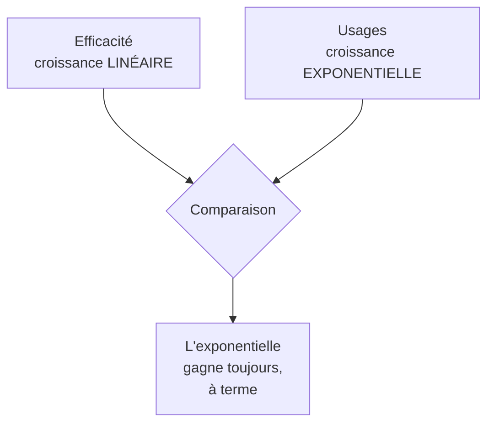
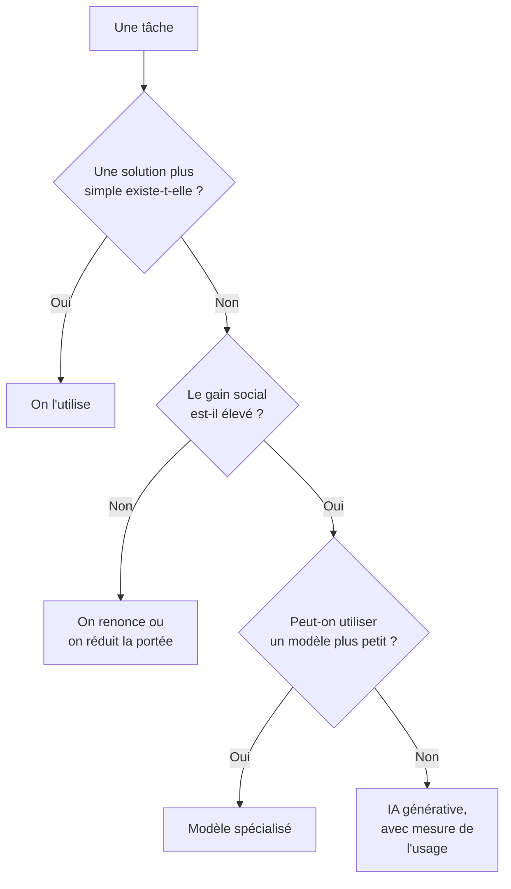

# Q17 — L'IA et sa consommation énergétique : enjeu et réponses

> **La réponse en une phrase**
> L'IA générative coûte environ **quatre à cinq fois** plus qu'une recherche classique par requête, et son déploiement fait croître la demande électrique de façon exponentielle — la seule réponse à la hauteur est donc de **questionner le recours à l'IA lui-même**, pas seulement de l'optimiser.

---

## Partie 1 — Pourquoi l'IA coûte cher en énergie

Comprendre le mécanisme évite de réciter des chiffres sans les comprendre.

### La différence avec une recherche classique

| | Recherche classique | IA générative |
|---|---|---|
| Ce que fait la machine | Retrouve un document déjà indexé | **Génère** un texte mot par mot |
| Travail par requête | Consulter un index | Faire tourner un modèle de plusieurs milliards de paramètres |
| Analogie | Chercher un livre dans une bibliothèque | Écrire le livre à chaque demande |

📘 Le cours l'explique exactement ainsi : le surcoût « s'explique par la **puissance de calcul nécessaire pour générer une réponse** basée sur des modèles de langage complexes ».

🔎 L'analogie de la bibliothèque est la plus parlante : retrouver un ouvrage existant est infiniment moins coûteux que de le rédiger. C'est la différence entre récupérer et produire.

### Il y a deux coûts, pas un

| Phase | Ce qui se passe | Fréquence |
|---|---|---|
| **Entraînement** | On construit le modèle, calcul massif sur des semaines | Une fois, mais énorme |
| **Inference (usage)** | Chaque requête fait tourner le modèle | Des milliards de fois |

🔎 Point souvent mal compris : l'entraînement est spectaculaire mais ponctuel. C'est l'**usage répété** qui, à l'échelle de milliards de requêtes quotidiennes, domine le bilan. C'est pour ça que la sobriété d'usage compte autant que l'efficacité des modèles.

---

## Partie 2 — Les chiffres de votre cours

📘 Ce sont les chiffres à citer. Ils viennent tous de vos supports.

### L'échelle individuelle

📘 « Une requête moyenne sur ChatGPT génère environ **4,32 grammes de CO₂**, soit **4 à 5 fois plus** qu'une recherche Google. »

### L'échelle mondiale

📘 Repris du Monde dans vos slides : le développement de l'IA générative « devrait plus que **doubler la demande d'électricité des centres de données** dans le monde d'ici à 2030. Selon un rapport publié en avril par l'Agence internationale de l'énergie (AIE), elle devrait atteindre environ **945 térawattheures**, soit plus de la consommation totale d'électricité du **Japon**. »

📘 « À cette échéance, les centres de données consommeront un peu moins de **3 % de l'électricité mondiale** […] "Aux États-Unis, les centres de données représentent près de la **moitié de la croissance attendue de la demande d'électricité** d'ici à 2030". »

📘 Le cours qualifie le phénomène de « **gouffre énergétique** que représente l'IA générative ».

### La trajectoire

📘 Cours numérique et durabilité : « Croissance de la consommation électrique (avec IA) : **16 % / an** (doublement tous les 4 ans) ».

```
Ce que veut dire un doublement tous les 4 ans

2026   ████
2030   ████████
2034   ████████████████
2038   ████████████████████████████████
```

🔎 Le chiffre à retenir n'est pas 945 TWh, c'est **le doublement tous les 4 ans**. Parce qu'il dit quelque chose que les autres chiffres ne disent pas : la trajectoire, pas l'état.

---

## Partie 3 — Le raisonnement central : pourquoi l'efficacité ne règle pas le problème

C'est le cœur de la réponse, et c'est ce qui distingue une bonne copie d'une récitation.

### La démonstration

Supposons qu'on rende les modèles deux fois plus efficaces. Excellent résultat technique.

| | |
|---|---|
| Gain d'efficacité | Facteur 2, obtenu par un effort de recherche considérable |
| Croissance des usages | Facteur 2 tous les 4 ans, automatiquement |
| **Résultat** | Le gain est absorbé en 4 ans. On a acheté du temps, pas une solution |



🔎 Formulation à retenir : **on ne compense pas une croissance exponentielle par des gains linéaires**. Ce n'est pas un avis, c'est une propriété mathématique.

### Le lien avec le cours

📘 C'est exactement la position B du débat que votre cours pose : « l'efficacité seule ne suffira pas si le modèle économique reste fondé sur l'**expansion continue des usages** ».

📘 Et le cours pose la question ouverte correspondante : « Est-ce qu'on peut vraiment diminuer notre consommation du numérique alors qu'on est **totalement dépendant** ? »

---

## Partie 4 — Les réponses, du plus faible au plus fort

### Réponse 1 — Des modèles plus efficaces (utile, insuffisant)

Utiliser un petit modèle spécialisé plutôt qu'un grand modèle généraliste quand la tâche est simple.

🔎 L'analogie : on ne prend pas un camion de 40 tonnes pour livrer une lettre. Beaucoup d'usages actuels de l'IA générative sont exactement ça.

### Réponse 2 — Une électricité décarbonée (utile, déplacé)

⚠️ Réduit le CO₂ mais pas la consommation. Et dans un système où l'électricité décarbonée est limitée, celle qui va à l'IA n'ira pas ailleurs.

📘 Le cours cite d'ailleurs un titre parlant dans ses références : « US official: Winning AI more important than saving climate ». 🔎 Cette référence signale un arbitrage politique explicite en faveur de l'IA contre le climat — un fait à connaître, pas une opinion à porter.

### Réponse 3 — Mesurer (nécessaire)

Sans mesure, aucune décision. 📘 Le cours cite l'extension Oris, qui « a pour objectif d'estimer en temps réel l'empreinte carbone liée à l'usage de plateformes comme Google, ChatGPT, YouTube ou Netflix, en affichant notamment les volumes de données transférées, les **requêtes liées à l'IA** et une estimation du CO₂ associé ».

📘 Et le cours en donne la valeur : elle « transforme une réalité technique cachée en information compréhensible », ce qui « lui donne une vraie valeur pédagogique ».

⚠️ Mais le titre du passage est « Oris : un exemple **utile, mais limité** ». Ne le présentez pas comme une solution.

Voir [[Q07_Numerique_pour_mesurer_et_piloter_impact]].

### Réponse 4 — La sobriété d'usage (le seul levier de fond)

📘 Le principe du cours : « **Sobriété** : questionner les besoins en première intention. »

Appliqué à l'IA, ça donne une question simple, à poser **avant** de déployer :

> **Cette tâche a-t-elle besoin d'IA générative, ou une solution plus simple suffit-elle ?**

| Tâche | Solution la plus légère | IA générative justifiée ? |
|---|---|---|
| Trouver une information dans une base | Un moteur de recherche | ❌ Non |
| Répondre à une question fréquente | Une FAQ bien structurée | ❌ Non |
| Trier des messages par catégorie | Des règles ou un petit modèle de classification | ❌ Non |
| Rédiger une synthèse à partir de sources hétérogènes | — | ✅ Oui |
| Adapter un texte à un niveau de lecture | — | ✅ Souvent oui |

🔎 Le constat qu'on tire de ce tableau : une grande part des usages actuels de l'IA générative sont des tâches que d'autres technologies traitaient déjà correctement pour un coût bien moindre. Le surcoût n'achète alors aucune valeur supplémentaire.

### Réponse 5 — La lucidité sur les effets indirects

📘 Deuxième principe du cours : « **Lucidité** : penser les conséquences directes et indirectes. »

Les effets indirects de l'IA vont au-delà de l'énergie :

| Effet indirect | Description |
|---|---|
| Renouvellement matériel | Des fonctions d'IA embarquées poussent au remplacement des terminaux |
| Croissance des usages induite | 📘 « Notion d'utilité : on crée l'utilité qui fait qu'on ne peut pas s'en passer ? » |
| Usage involontaire | 📘 Le cours distingue l'usage « volontairement (p. ex. prompt à un LLM) » et « involontairement (p. ex. recherche en ligne avec réponse IA automatique) » |
| Dépendance géopolitique | 📘 Le cours fait travailler le scénario d'une coupure de service depuis les États-Unis |

⚠️ La ligne « usage involontaire » est celle qu'on oublie : l'utilisateur consomme de l'IA sans l'avoir demandée, quand un moteur de recherche insère automatiquement une réponse générée. La sobriété individuelle devient alors difficile — c'est un choix qui se joue au niveau du fournisseur, pas de l'utilisateur.

---

## Partie 5 — La formulation stratégique

🔎 Le point le plus fort à faire sur cette question :

> **La question n'est pas « comment rendre l'IA plus efficace », mais « pour quelles tâches son surcoût est-il justifié ».**

C'est un déplacement de la question technique vers la question de la **désirabilité**. Et c'est exactement ce que le cours demande : questionner le besoin en première intention.

📘 Le cours donne le cadre de l'arbitrage : « Une stratégie crédible suppose donc des arbitrages : moins de surqualité, moins de stockage inutile, moins de fonctionnalités gadgets, moins de dépendance à des infrastructures lourdes **lorsque le gain social est faible**. »

🔎 « Lorsque le gain social est faible » est le critère opératoire. Une IA qui rend un service public accessible à des personnes en difficulté de lecture a un gain social élevé. Une IA qui génère des variantes de textes marketing a un gain social faible. Le même coût énergétique n'achète pas la même chose.



---

## Partie 6 — Exemple complet

**L'organisation.** Une administration cantonale qui envisage de déployer l'IA générative.

### Les cinq usages envisagés, passés à la grille

| Usage envisagé | Solution plus simple ? | Gain social | Décision |
|---|---|---|---|
| Assistant qui reformule les courriers administratifs en langage clair | Non, c'est précisément ce que l'IA fait bien | **Élevé** : accessibilité pour les personnes en difficulté de lecture | ✅ Déployer |
| Chatbot généraliste sur le site | Oui : FAQ structurée + moteur de recherche | Faible, et risque d'exclusion | ❌ Renoncer |
| Résumé automatique de dossiers volumineux pour les agents | Non | Moyen, gain de temps réel | ✅ Déployer, usage encadré |
| Génération de visuels pour les campagnes de communication | Oui : banque d'images | Faible | ❌ Renoncer |
| Classement automatique du courrier entrant | Oui : modèle de classification léger | Moyen | ✅ Mais sans IA générative |

🔎 Résultat : sur cinq usages, deux justifient l'IA générative, un justifie une IA légère, deux ne la justifient pas. C'est ça, appliquer la sobriété en première intention — et remarquez que l'usage retenu en premier est celui qui a le plus fort **gain social**, exactement le critère du cours.

### Les garde-fous

| Garde-fou | Justification |
|---|---|
| Compter les appels au modèle, mois par mois | Indicateur absolu, détecte l'effet rebond |
| Conserver un canal humain accessible | 📘 Dimension sociale ; cas SilverDigital |
| Vérifier la conformité AI Act | Cadre légal cité par le cours |
| Ne pas déployer d'IA générée automatiquement dans les recherches internes | Éviter l'usage involontaire |

---

## Les pièges

> [!danger] Erreurs classiques
> 1. **Citer les chiffres sans le mécanisme.** Expliquez pourquoi générer coûte plus que retrouver.
> 2. **Oublier la distinction entraînement / usage.** C'est l'usage répété qui domine.
> 3. **Croire que l'efficacité suffit.** Linéaire contre exponentiel.
> 4. **Proposer seulement le renouvelable.** Il déplace le problème.
> 5. **Oublier l'usage involontaire.** 📘 Le cours le distingue explicitement.
> 6. **Oublier le critère du gain social.** 📘 C'est le critère d'arbitrage donné par le cours.

## À retenir

| | |
|---|---|
| **Le mécanisme** | Générer coûte plus que retrouver ; et c'est l'usage répété qui pèse |
| **Chiffres 📘** | 4,32 g CO₂ par requête, 4 à 5 fois une recherche Google |
| **Trajectoire 📘** | +16 % par an, doublement tous les 4 ans ; 945 TWh en 2030 ; <3 % de l'électricité mondiale |
| **Le raisonnement** | Efficacité linéaire contre demande exponentielle |
| **La réponse de fond 📘** | Sobriété : questionner le besoin en première intention |
| **Le critère d'arbitrage 📘** | Le gain social justifie-t-il l'infrastructure lourde ? |
