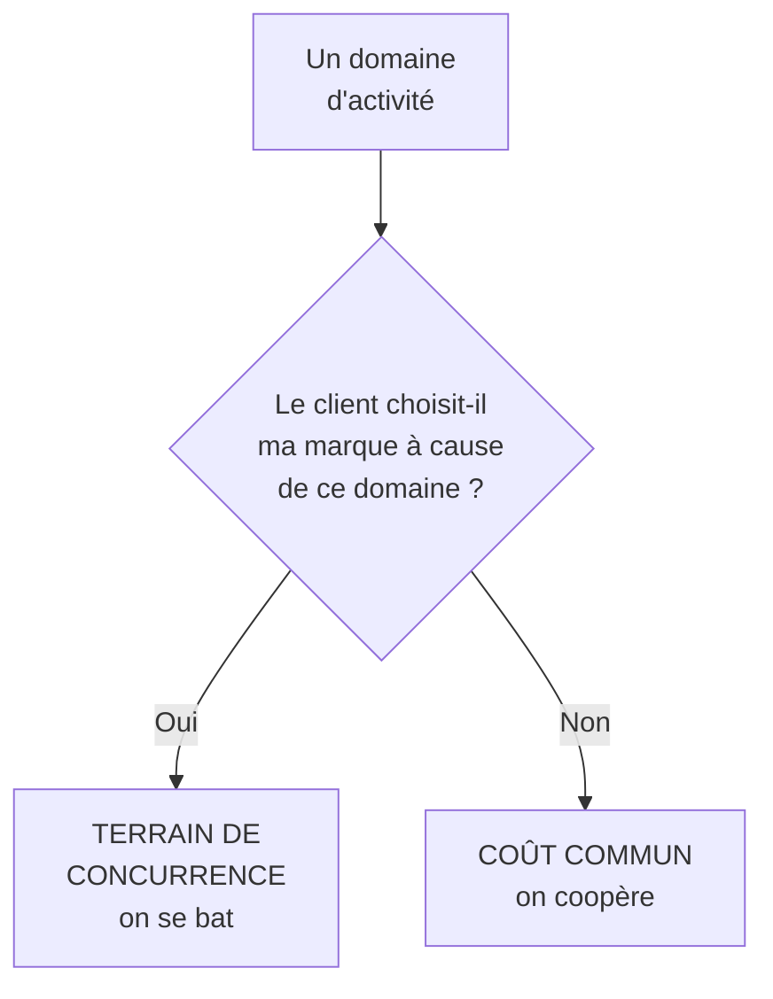

# Q17 — Qu'est-ce que la coopétition ?

> [!note] Provenance
> 📚 Le mot « coopétition » **ne figure pas** dans vos slides. Le concept sous-jacent, lui, est bien dans le cours via le **système de valeur** et les partenariats. Annoncez-le comme un apport extérieur appuyé sur une notion du cours.

> **La réponse en une phrase**
> Coopérer avec ses concurrents sur un terrain précis tout en restant en concurrence sur le marché — ce qui est rationnel parce que certains problèmes sont des **coûts communs**, pas des terrains de différenciation.

---

## Partie 1 — Le mot et le concept

**Coopétition** = coopération + compétition. Deux entreprises rivales collaborent sur un objet délimité, sans cesser d'être rivales ailleurs.

⚠️ Ce n'est pas une alliance, ni une fusion, ni une entente. C'est une coopération **partielle et bornée**.

### L'ancrage dans le cours : le système de valeur

📘 Le cours BM durable : l'architecture de valeur « décrit la production et la délivrance de la proposition de valeur à travers les ressources et compétences de l'entreprise. Il s'agit principalement de la **chaîne de valeur** et du **système de valeur**. »

🔎 Le système de valeur est l'enchaînement des chaînes de valeur d'une filière : celle de votre fournisseur, la vôtre, celle de votre distributeur. Vous n'êtes qu'un maillon.

📘 Et le cours 3 le montre concrètement à propos de la distribution : « tous les biens et services doivent être distribués au consommateur final. Si la connaissance du marché est inexistante au sein de l'entreprise, il peut être difficile de pénétrer le marché ; les entreprises sont ainsi **forcées de coopérer** avec des distributeurs précis. »

⚠️ Le cours emploie « forcées de coopérer ». La coopération n'est pas présentée comme un choix moral mais comme une **nécessité structurelle** quand on ne détient pas tous les maillons.

---

## Partie 2 — Le raisonnement : sur quoi coopère-t-on, sur quoi se bat-on

C'est le cœur de la réponse.

| Terrain | On se concurrence ? | Pourquoi |
|---|---|---|
| Prix, produit, service client | ✅ Oui | C'est là que se joue la préférence |
| Filière de collecte et de recyclage | ❌ Non | Aucun client ne choisit une marque pour sa benne |
| Norme de traçabilité | ❌ Non | Une norme n'a de valeur que si tout le monde l'applique |
| Formation aux métiers du secteur | ❌ Non | La pénurie de compétences frappe tout le monde |
| Infrastructure logistique de retour | ❌ Non | Coût fixe qu'aucun ne peut porter seul |
| Recherche pré-concurrentielle | ❌ Non | Le résultat profitera à toute la filière de toute façon |

🔎 **La règle simple** : on coopère sur ce qui ne fait pas vendre, on se concurrence sur ce qui fait vendre.

---

## Partie 3 — Pourquoi c'est particulièrement pertinent en durabilité

Trois raisons structurelles, chacune ancrée dans le cours.

### Raison 1 — Le périmètre dépasse l'entreprise

📘 « L'ensemble des activités, **depuis les matières premières jusqu'au recyclage ou à la fin de vie** ».

🔎 Or l'extraction se passe chez le fournisseur du fournisseur, la fin de vie chez le client. Vous ne contrôlez ni l'un ni l'autre. Pour agir sur ce que vous ne contrôlez pas, il n'y a que deux moyens : la contrainte contractuelle et le partenariat.

### Raison 2 — Une boucle circulaire a besoin d'au moins deux acteurs

📘 Le cours 5 définit l'économie circulaire comme passant par « une amélioration de la fabrication et de la **réutilisation** ».

🔎 Réutiliser suppose quelqu'un qui reprend, reconditionne et redistribue. Une entreprise seule produit un déchet qu'elle ne sait pas utiliser. Le déchet de l'un doit devenir la ressource de l'autre.

### Raison 3 — Les labels sont des constructions collectives

📘 Le cours 5 liste : TCO certified, Ecolabel européen, Energy Star, EPEAT, Der blaue Engel, et les normes ISO 14'024, 14'021, 14'025.

⚠️ Aucun de ces labels n'appartient à une entreprise. Un label auto-décerné ne vaut rien — c'est la définition du greenwashing. La crédibilité exige donc un tiers, donc une construction commune.

📘 Et l'ancrage institutionnel : « Les ODD s'articulent autour des "5P" : Populations, Planète, Prospérité, Paix et **Partenariats**. » Le partenariat est l'un des cinq piliers, pas un moyen parmi d'autres.

---

## Partie 4 — Les limites, à ne surtout pas omettre

| Limite | Description |
|---|---|
| **Risque juridique** | ⚠️ Coopérer entre concurrents a des limites strictes en droit de la concurrence. Toute coordination sur les **prix**, les **volumes** ou le **partage de marché** est illicite |
| Coût de coordination | Réunir cinq acteurs prend du temps ; parfois plus que le gain |
| Passager clandestin | Certains bénéficient du travail collectif sans y contribuer |
| Fuite d'information | Tracer une filière suppose de révéler ses fournisseurs, parfois ses marges |
| Dilution de la responsabilité | Quand tout le monde est responsable, personne ne l'est |

🔎 La première ligne mérite d'être dite explicitement : la coopétition doit rester **cantonnée** au terrain de la durabilité et ne jamais toucher aux variables commerciales. C'est une nuance qui montre de la maturité.

---

## Partie 5 — Exemple complet

**La situation.** Cinq PME genevoises de services numériques, de 10 à 40 salariés, concurrentes sur les mêmes appels d'offres.

### Ce qu'aucune ne peut faire seule

| Obstacle | Pourquoi seule c'est impossible |
|---|---|
| Négocier des critères TCO avec un fournisseur IT | 12 machines par an ne donnent aucun poids |
| Monter une filière de reconditionnement | Volume trop faible pour être rentable |
| Financer un expert en éco-conception et accessibilité | Coût hors de portée d'une PME de 12 personnes |

### Ce que la coopétition rend possible

| Action collective | Mécanisme | Terrain |
|---|---|---|
| Centrale d'achat commune, cahier des charges TCO | 200 machines par an : le fournisseur écoute | Coût commun ✅ |
| Contrat unique avec un reconditionneur régional | Le volume rend la filière viable | Coût commun ✅ |
| Formation mutualisée à l'accessibilité | Coût divisé par cinq | Coût commun ✅ |
| Charte commune vérifiée par un tiers | Crédibilité impossible à obtenir seul | Coût commun ✅ |
| **Répartition des appels d'offres entre elles** | ❌ **Interdit** | Entente illicite |

⚠️ La dernière ligne montre exactement où passe la frontière. Les quatre premières actions sont légitimes ; la cinquième est un délit.

### Le résultat stratégique

🔎 Les cinq PME obtiennent ensemble ce qui était individuellement hors de portée : un argument de différenciation face aux grandes agences, et l'accès aux marchés publics à critères responsables.

**La coopétition transforme une faiblesse partagée — la petite taille — en force collective.** Et elles restent concurrentes le jour où l'appel d'offres sort.

---

## Les pièges

> [!danger] Erreurs classiques
> 1. **Présenter le mot comme du cours.** 📚 Il n'y est pas ; le système de valeur, si.
> 2. **Oublier la limite juridique.** Prix, volumes et marchés sont hors du champ autorisé.
> 3. **Confondre coopétition et alliance.** La coopétition est partielle et bornée.
> 4. **Ne pas expliquer le critère de partage.** On coopère sur ce qui ne fait pas vendre.
> 5. **Oublier les limites pratiques.** Coordination, passager clandestin, fuite d'information.

## À retenir

| | |
|---|---|
| **Définition** | Coopérer avec un concurrent sur un terrain borné, tout en restant rival |
| **Ancrage cours 📘** | Le **système de valeur** ; « forcées de coopérer » |
| **Le critère** | On coopère sur ce qui ne fait pas vendre |
| **Pourquoi en durabilité** | Périmètre élargi, boucles circulaires, labels collectifs |
| **Ancrage ODD 📘** | Partenariats, l'un des 5P |
| **La limite absolue** | Jamais sur les prix, les volumes ou le partage de marché |
