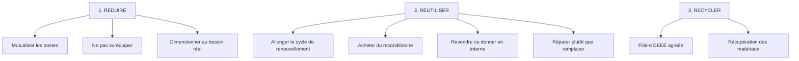
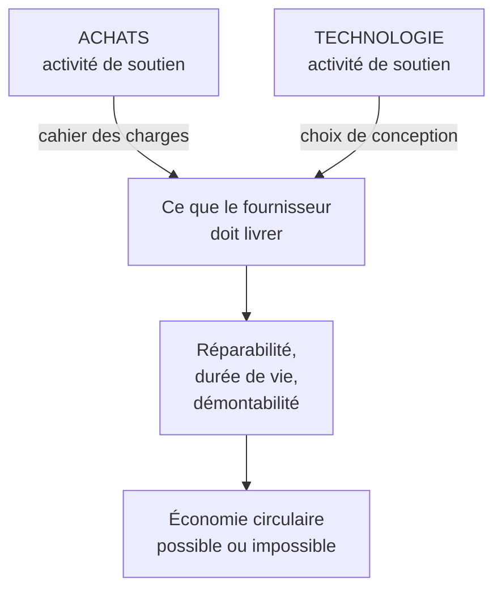

# Q18 — Quels leviers d'économie circulaire pour les appareils numériques ?

> **La réponse en une phrase**
> Le levier principal n'est pas le recyclage, c'est **l'allongement de la durée de vie** — parce que dans un appareil numérique, l'essentiel de l'impact est déjà émis avant la première utilisation.

---

## Partie 1 — Le fait physique qui commande tout le reste

### Le carbone incorporé

Quand vous achetez un ordinateur, vous n'avez rien brûlé. Mais pour qu'il existe, il a fallu extraire des métaux, les raffiner, fabriquer des composants dans des usines, transporter le tout. Tout cela a émis du CO₂ **avant** que vous ne l'allumiez.

C'est le **carbone incorporé** : il est déjà « dans » l'objet au moment de l'achat.

```
Répartition de l'empreinte d'un appareil numérique
(ordres de grandeur illustratifs, PAS des chiffres du cours)

Fabrication          ███████████████████████████████████  ~75 %
Usage (électricité)  ████████                             ~18 %
Transport            ██                                    ~5 %
Fin de vie           █                                     ~2 %
```

🔎 Ces proportions sont mon illustration. Ce qui compte est la **structure** : la fabrication écrase tout.

### La conséquence, qui est contre-intuitive

Si la fabrication domine :

| Réflexe habituel | Ce que dit le raisonnement |
|---|---|
| « Éteignons les ordinateurs la nuit » | Agit sur ~18 % du problème |
| « Achetons des appareils moins gourmands » | Agit sur ~18 % du problème |
| **« Gardons les appareils deux ans de plus »** | **Agit sur ~75 % du problème** |

🔎 Formulation à retenir : **allonger la durée de vie d'un appareil d'un an réduit davantage son empreinte que n'importe quelle optimisation de sa consommation électrique**.

C'est le raisonnement le plus important de cette fiche, et il justifie tout ce qui suit.

---

## Partie 2 — L'économie circulaire, définie par votre cours

📘 Cours 5 : « L'économie circulaire des appareils numériques peut s'entendre comme **l'extension de la vie utile des appareils numériques** par le biais d'une **amélioration de la fabrication** et de la **réutilisation**, une **minimisation du besoin de nouveaux appareils** et des déchets électroniques. »

Décortiquons cette phrase, car chaque groupe de mots est un levier.

| Fragment de la définition 📘 | Ce que ça veut dire | Levier correspondant |
|---|---|---|
| « extension de la vie utile » | L'objectif central | Durée de vie |
| « amélioration de la fabrication » | Concevoir pour durer et pour réparer | Éco-conception |
| « réutilisation » | Un second usage, chez un autre | Réemploi, reconditionnement |
| « minimisation du besoin de nouveaux appareils » | Ne pas acheter | Réduction |
| « et des déchets électroniques » | La conséquence | Moins de DEEE |

⚠️ Notez ce que cette définition **ne dit pas** : elle ne parle pas de recyclage. Le recyclage n'apparaît que dans la phrase suivante, et pour être placé en dernier.

---

## Partie 3 — Les 3R, et pourquoi l'ordre est un classement

📘 « Le modèle des 3R : réduire, réutiliser, recycler. […] Tout cela dépend des efforts de **réduction et de réutilisation, puis enfin seulement de recyclage**. »

« Puis enfin seulement » n'est pas une transition rédactionnelle. C'est une **hiérarchie d'efficacité**.

```
Carbone évité selon le niveau d'action

1. Réduire     ████████████████████████████  ne pas acheter = tout évité
2. Réutiliser  ████████████████████          une fabrication en moins
3. Recycler    ████████                      le carbone est déjà parti
```

### Le raisonnement, R par R

**Réduire — évite 100 %.**
Si l'appareil n'est pas acheté, il n'est pas fabriqué. C'est le seul niveau qui évite la totalité de l'impact. Concrètement : mutualiser un poste entre deux personnes, ne pas doter chaque salarié d'un ordinateur **et** d'une tablette **et** d'un téléphone professionnel.

**Réutiliser — évite presque tout.**
L'appareil existe déjà. En le gardant ou en le passant à quelqu'un d'autre, on évite la fabrication d'un appareil neuf. Il reste l'impact de l'appareil conservé, plus éventuellement une réparation.

**Recycler — évite peu.**
L'appareil a été fabriqué, le CO₂ est parti, il ne reviendra pas. Le recyclage récupère de la matière et évite une part d'extraction future — c'est réel mais partiel. Et recycler consomme de l'énergie et ne récupère jamais 100 % des matériaux.

⚠️ **Pourquoi cet ordre est constamment inversé dans la pratique** : le recyclage est le seul des trois R qui ne remet pas en cause le volume d'achats. C'est donc le plus confortable à mettre en avant. Voir [[Q15_Le_greenwashing]].

---

## Partie 4 — Les leviers concrets, classés



### Le levier qui les conditionne tous : les critères d'achat

📘 Le cours 5 structure la démarche « Acheter mieux en IT » en quatre points :

1. **Analyse des risques environnementaux et sociaux** — 📘 « Voir la matrice de pertinence de l'OFEV sur les moyens de télécommunication et informatique »
2. **Labels et certifications** — 📘 TCO certified, Ecolabel européen, Energy Star, EPEAT, Der blaue Engel
3. **Normes ISO** — 📘 ISO 14'024 (2018), ISO 14'021 (2016), ISO 14'025
4. **Fixer des critères pour les achats (ex : critères TCO)**

📘 Les sept critères TCO listés par le cours :
- Fabrication socialement responsable
- Fabrication respectueuse de l'environnement
- Santé et sécurité des utilisateurs
- Performance du produit
- **Extension de la durée de vie**
- Réduction des substances dangereuses
- **Récupération des matériaux**

🔎 Regardez la liste : deux des sept critères portent directement sur la circularité (durée de vie et récupération des matériaux), et deux sur la fabrication. Le cahier des charges d'achat est donc **l'instrument principal** de l'économie circulaire, parce que c'est le seul moment où vous avez un pouvoir sur le fabricant.

⚠️ Et c'est logique : vous ne pouvez pas rendre réparable un appareil qui a été conçu pour ne pas l'être. Il fallait le demander **avant** l'achat.

---

## Partie 5 — Pourquoi les activités de soutien décident de tout



📘 Rappel : « Les activités de soutien ont un impact **transversal** sur toutes les unités et sections. »

🔎 Le schéma récurrent de tout le cours : **la case qui décide n'est jamais la case qui émet**. C'est déjà le cas pour l'empreinte carbone ([[Q04_Reduire_lempreinte_carbone_via_la_chaine_de_valeur]]), pour la logistique ([[Q08_Donnees_temps_reel_et_logistique_durable]]) et ici pour la circularité.

---

## Partie 6 — Le lien avec les ODD

📘 Le cours pose le cadre : « Les **17 objectifs de développement durable (ODD)** et leurs **169 cibles** forment la clé de voûte de l'Agenda 2030 », adopté « le 25 septembre 2015 » par « les 193 États membres de l'ONU », et articulé autour des « **5P : Populations, Planète, Prospérité, Paix et Partenariats** ».

🔎 L'ODD 12 porte sur la consommation et la production responsables : c'est l'objectif dans lequel s'inscrit directement l'économie circulaire.

⚠️ Et le 5P « **Partenariats** » n'est pas un hasard ici : une boucle circulaire a par définition au moins deux extrémités. Un reconditionneur, une filière de collecte, un acheteur de seconde main. Aucune entreprise ne ferme une boucle seule. Voir [[Q06_Collaboration_ouverte_et_partenariats]].

---

## Partie 7 — Exemple complet

**L'entreprise.** Une PME genevoise de 40 salariés, parc de 45 ordinateurs portables et 40 téléphones professionnels, renouvellement tous les 2 ans.

### Diagnostic

| Constat | Conséquence |
|---|---|
| Renouvellement systématique tous les 2 ans, indépendamment de l'état | 22 machines fabriquées par an |
| Chaque salarié a un ordinateur, un téléphone et une tablette | Suréquipement |
| Achat au moins-disant, aucun critère environnemental | Aucun levier sur le fabricant |
| Anciens appareils stockés dans un placard | Ni réemploi, ni recyclage |
| Aucune réparation, remplacement systématique | Durée de vie subie |

### Plan, dans l'ordre des 3R

**R1 — Réduire**

| Action | Effet |
|---|---|
| Supprimer les tablettes, non utilisées par 30 des 40 salariés | 30 appareils non fabriqués |
| Postes fixes partagés pour les fonctions de production ponctuelles | 5 machines évitées |
| Dimensionner les machines au besoin réel plutôt qu'au maximum | Moins de composants, moins d'impact |

**R2 — Réutiliser**

| Action | Effet |
|---|---|
| Cycle de renouvellement porté de 2 à 5 ans | Divise par 2,5 le rythme de fabrication induite |
| Achat de matériel reconditionné pour les postes bureautiques | Aucune fabrication neuve |
| Réparation systématique avant remplacement (batteries, écrans, claviers) | Prolonge encore |
| Second usage interne : les anciennes machines deviennent postes d'accueil ou de test | Diffère le remplacement |
| Contrat avec un reconditionneur régional pour les sorties de parc | Ferme la boucle |

**R3 — Recycler**

| Action | Effet |
|---|---|
| Filière DEEE agréée pour ce qui n'est plus réutilisable | Récupération des matériaux |

**Le levier transversal — Achats**

| Action | Critère TCO mobilisé 📘 |
|---|---|
| Cahier des charges exigeant la réparabilité et la disponibilité des pièces | Extension de la durée de vie |
| Exigence de labels reconnus | TCO certified, EPEAT, Der blaue Engel |
| Clause de reprise en fin de contrat | Récupération des matériaux |
| Critère social sur les conditions de fabrication | Fabrication socialement responsable |

### Indicateurs

| Indicateur | Type | Cible |
|---|---|---|
| Durée de vie moyenne du parc | Absolu | De 2 à 5 ans |
| Nombre d'appareils achetés neufs par an | **Absolu** | De 22 à moins de 9 |
| Part d'achats reconditionnés | Intensité | 40 % |
| Part d'achats couverts par un label reconnu | Intensité | 100 % |
| Taux de réparation avant remplacement | Intensité | 70 % |

⚠️ Le deuxième indicateur est le seul qui mesure vraiment le résultat. Tous les autres peuvent progresser pendant que le nombre d'appareils achetés augmente, si l'entreprise grandit.

---

## Partie 8 — Les limites à mentionner

| Limite | Description |
|---|---|
| L'obsolescence logicielle | Un appareil parfaitement fonctionnel devient inutilisable parce qu'il ne reçoit plus de mises à jour. La durée de vie n'est plus décidée par le matériel |
| La réparabilité verrouillée | Pièces collées, composants soudés, pièces détachées indisponibles |
| Le recyclage partiel | On ne récupère jamais tous les matériaux, et certains métaux sont pratiquement irrécupérables |
| L'effet rebond du reconditionné | Un marché du reconditionné dynamique peut encourager à changer plus souvent, puisque « ça se revend » |
| La sécurité informatique | Un vieux matériel non mis à jour peut poser un risque réel — 🔎 c'est un arbitrage à assumer, pas à nier |

🔎 La première limite est la plus importante et la moins connue : **l'obsolescence est devenue majoritairement logicielle**. Une politique d'achat, aussi bonne soit-elle, ne peut rien contre un éditeur qui cesse de supporter un modèle. C'est un argument pour la régulation, pas seulement pour l'action d'entreprise.

---

## Les pièges

> [!danger] Erreurs classiques
> 1. **Commencer par le recyclage.** 📘 Le cours dit « puis enfin seulement de recyclage ».
> 2. **Oublier le carbone incorporé.** C'est le fait qui justifie tout l'ordre des 3R.
> 3. **Oublier les achats.** C'est le levier qui conditionne les trois R.
> 4. **Ne citer que des indicateurs d'intensité.** Le nombre absolu d'appareils achetés est le seul juge.
> 5. **Oublier l'obsolescence logicielle.** Elle rend une partie du problème hors de portée de l'entreprise.
> 6. **Oublier le partenariat.** Une boucle a deux extrémités.

## À retenir

| | |
|---|---|
| **Le fait de base** | L'essentiel de l'impact d'un appareil est incorporé à sa fabrication |
| **Définition 📘** | « Extension de la vie utile […] minimisation du besoin de nouveaux appareils » |
| **L'ordre 📘** | Réduire > Réutiliser > « puis enfin seulement » Recycler |
| **Le levier transversal 📘** | Les critères d'achat, dont deux portent sur la circularité |
| **Labels 📘** | TCO certified, Ecolabel européen, Energy Star, EPEAT, Der blaue Engel |
| **Indicateur juge** | Nombre absolu d'appareils achetés neufs par an |
