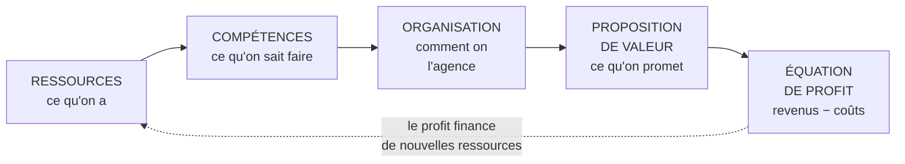

# Q18 — Expliquez le modèle RCOV

> **La réponse en une phrase**
> Quatre briques enchaînées — **R**essources, **C**ompétences, **O**rganisation, proposition de **V**aleur — dont la logique est que ce qu'on peut promettre au client découle de ce qu'on a et de ce qu'on sait faire, et non l'inverse.

---

## Partie 1 — Le sigle, avec les mots exacts du cours

📘 Cours BM durable : « Le modèle **RCOV** (**R**esources, **C**ompetences, **O**rganization and **V**alue proposition) ».

| Lettre | Terme anglais 📘 | En français | Question qu'elle pose |
|---|---|---|---|
| **R** | Resources | Ressources | Qu'est-ce que nous **possédons** ? |
| **C** | Competences | Compétences | Qu'est-ce que nous **savons faire** ? |
| **O** | Organization | Organisation | Comment nous **agençons** tout ça ? |
| **V** | Value proposition | Proposition de valeur | Qu'est-ce que nous **promettons** au client ? |

⚠️ Ne confondez pas R et C. Posséder une machine de découpe laser (ressource) et savoir l'exploiter au meilleur rendement (compétence) sont deux choses différentes. Une entreprise peut avoir les ressources sans les compétences — c'est même une situation très fréquente et très coûteuse.

---

## Partie 2 — Le sens de la flèche, et pourquoi il compte

🔎 **Le point central du modèle** : la proposition de valeur n'est pas un point de départ, c'est un **aboutissement**. On ne promet pas ce qu'on voudrait ; on promet ce que nos ressources, nos compétences et notre organisation permettent réellement de tenir.

⚠️ C'est ce qui distingue RCOV d'une démarche purement marketing. Le marketing part du client et remonte vers l'offre ; RCOV part de la capacité et descend vers l'offre. Les deux lectures sont utiles, mais RCOV rappelle qu'**une promesse non tenable détruit plus de valeur qu'elle n'en crée**.

### La boucle de retour

La flèche en pointillé est essentielle : le profit dégagé finance de nouvelles ressources, qui permettent de nouvelles compétences, donc une proposition de valeur enrichie.

🔎 Un business model est donc **dynamique**, contrairement au BMC qui est 📘 « essentiellement statique ». Voir [[Q21_Les_limites_du_BMC]].

---

## Partie 3 — Chaque brique en détail

### R — Ressources

📘 Cours 3 : « Les ressources de l'entreprise correspondent à des actifs matériels ou immatériels que possède l'entreprise et qu'elle va pouvoir déployer et valoriser. »

📘 Trois matérielles : financières, physiques, humaines. Trois immatérielles : organisation et management, technologie, image de marque.

Voir [[Q13_Ressources_materielles_et_immaterielles]].

### C — Compétences

Ce que vous **savez faire** avec ces ressources. Une compétence est un savoir-faire, pas un actif.

🔎 Le test qui les sépare : une ressource s'achète, une compétence s'apprend. C'est pour ça que les compétences fondent plus solidement un avantage. Voir [[Q14_Pourquoi_limmateriel_fonde_lavantage_durable]].

### O — Organisation

Comment vous articulez le tout : les processus, la répartition des rôles, les relations avec l'extérieur.

📘 Le cours BM durable parle d'**architecture de valeur** : elle « décrit la production et la délivrance de la proposition de valeur à travers les ressources et compétences de l'entreprise. Il s'agit principalement de la **chaîne de valeur** et du **système de valeur**. »

⚠️ Point important : l'organisation ne s'arrête pas aux murs de l'entreprise. Le **système de valeur** — l'enchaînement avec fournisseurs et distributeurs — en fait partie. Voir [[Q17_La_coopetition]].

### V — Proposition de valeur

Ce que le client obtient et pourquoi il vous choisit.

📘 Exemple du cours, corrigé Oncle Hansi : « une proposition de valeur qui consiste à **offrir un label "alsacien"** […] fondée sur la recherche d'une consommation de qualité (sanctionnée par les labels), dans le cadre d'une démarche "locavore", pour une région marquée par une forte identité. »

---

## Partie 4 — Ce que RCOV produit : l'équation de profit

📘 Cours BM durable : « **Pour une équation de profit originale.** La confrontation de la **proposition de valeur** avec l'**architecture de valeur** se traduit par une confrontation **revenus-coûts** qui dégage un profit. »

🔎 Décryptons cette phrase, qui est la clé du modèle :

| Élément | Ce qu'il produit |
|---|---|
| Proposition de valeur | Les **revenus** — ce que le client accepte de payer |
| Architecture de valeur (R + C + O) | Les **coûts** — ce que ça vous coûte de tenir la promesse |
| Confrontation des deux | Le **profit** |

⚠️ Le mot « **originale** » dans le titre du cours n'est pas décoratif. Un business model se distingue de ses concurrents non seulement par ce qu'il promet, mais par **la façon dont il gagne de l'argent**. Deux entreprises peuvent vendre la même chose avec des équations de profit complètement différentes.

📘 Exemple dans le corrigé Oncle Hansi : l'équation repose sur « **deux flux de revenus** (les adhésions et les redevances) » et « une structure de coûts qui doit être la plus légère possible », puisque « les droits de la marque sont la propriété de l'entreprise ; la **logistique reste à la charge des entreprises** » adhérentes.

🔎 C'est exactement ça, une équation de profit originale : l'entreprise encaisse sans supporter la logistique. Voir [[Q22_Lequation_de_profit]].

---

## Partie 5 — RCOV comparé au BMC

| | RCOV | BMC |
|---|---|---|
| Nombre d'éléments | 4 + l'équation de profit | 9 blocs |
| Logique | **Enchaînée** : R → C → O → V | Juxtaposée autour de la proposition de valeur |
| Dynamique | ✅ Boucle de retour par le profit | 📘 « essentiellement **statique** » |
| Point fort | Montre la causalité | Montre l'exhaustivité |
| Point faible | Moins détaillé sur les canaux et segments | 📘 Néglige la concurrence, centré interne |

🔎 **Comment les utiliser ensemble** : RCOV pour expliquer *pourquoi* le modèle tient, BMC pour vérifier qu'on n'a rien oublié. Ce sont des outils complémentaires, pas concurrents.

---

## Partie 6 — Exemple complet

**L'entreprise.** Un atelier genevois de réparation et reconditionnement d'appareils électroniques, 14 salariés.

| Brique | Contenu |
|---|---|
| **R — Ressources** | Un atelier équipé ; un stock de pièces détachées de 4 000 références ; 14 salariés ; une base de 2 000 clients ; une réputation locale de 9 ans |
| **C — Compétences** | Diagnostic rapide de panne ; soudure de composants fins ; sourcing de pièces rares ; capacité à évaluer la valeur résiduelle d'un appareil |
| **O — Organisation** | Réception en boutique et par envoi ; partenariat avec 3 communes pour les points de collecte ; contrat avec une filière DEEE pour l'irréparable ; canal de revente en ligne |
| **V — Proposition de valeur** | « Votre appareil réparé en 5 jours, garanti 12 mois, à moins de la moitié du prix du neuf » — et pour l'acheteur d'occasion : « du reconditionné garanti, avec un rapport de test » |

### L'équation de profit

| Revenus | Coûts |
|---|---|
| Prestations de réparation | Main-d'œuvre qualifiée (poste principal) |
| Vente d'appareils reconditionnés | Achat de pièces |
| Contrats de maintenance avec les communes | Loyer de l'atelier |
| Revente de matière aux filières | Logistique de collecte |

### Le test de cohérence RCOV

🔎 Vérifions que la promesse est **tenable** par les briques du dessus :

| Promesse | Brique qui la soutient | Tenable ? |
|---|---|---|
| « Réparé en 5 jours » | Stock de 4 000 références + compétence de diagnostic rapide | ✅ |
| « Garanti 12 mois » | Compétence en soudure + capacité d'évaluation | ✅ |
| « Moins de la moitié du prix du neuf » | ⚠️ Dépend du coût de la main-d'œuvre qualifiée en Suisse | **Fragile** |

⚠️ La troisième ligne révèle le vrai enjeu du modèle : la promesse de prix est en tension avec le coût de la compétence. La solution ne se trouve pas dans le V, elle se trouve dans le **O** — mutualiser la collecte, obtenir un soutien public, ou créer un flux de revenus complémentaire.

🔎 C'est l'utilité de RCOV : il montre **où** un modèle est fragile, et que la réponse est rarement dans la case où le problème apparaît.

---

## Les pièges

> [!danger] Erreurs classiques
> 1. **Confondre ressources et compétences.** Avoir n'est pas savoir faire.
> 2. **Inverser la flèche.** La proposition de valeur découle des trois autres briques.
> 3. **Oublier l'équation de profit.** 📘 C'est là que se fait « la confrontation revenus-coûts ».
> 4. **Oublier la boucle de retour.** RCOV est dynamique, contrairement au BMC.
> 5. **Oublier le système de valeur dans le O.** L'organisation dépasse les murs de l'entreprise.
> 6. **Ne pas tester la tenabilité de la promesse.** C'est l'usage principal du modèle.

## À retenir

| | |
|---|---|
| **Sigle 📘** | Resources, Competences, Organization, Value proposition |
| **La logique** | Ce qu'on promet découle de ce qu'on a et sait faire, pas l'inverse |
| **Le O 📘** | Architecture de valeur = chaîne de valeur + système de valeur |
| **La sortie 📘** | « La confrontation de la proposition de valeur avec l'architecture de valeur […] dégage un profit » |
| **Vs BMC** | RCOV est enchaîné et dynamique, le BMC est juxtaposé et statique |
| **Usage** | Tester si la promesse est tenable par les briques du dessus |
