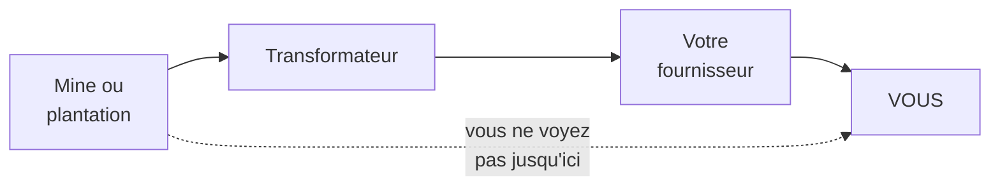
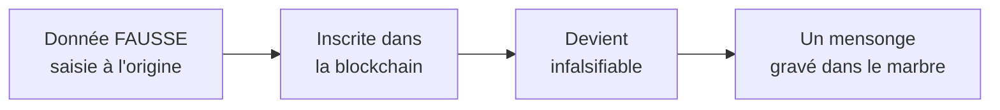
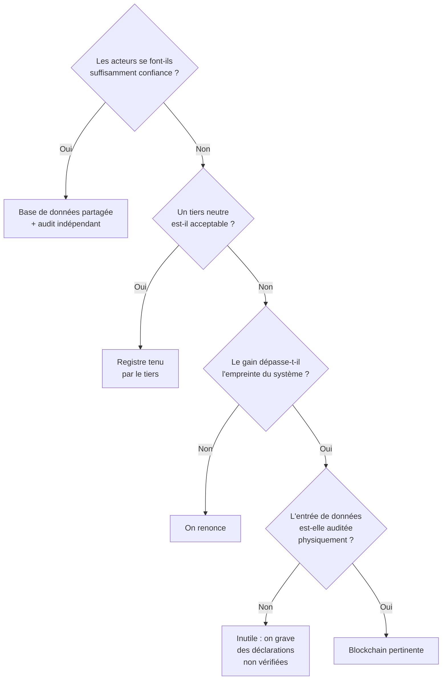

# Q19 — La blockchain peut-elle améliorer la traçabilité durable ? Discutez.

> [!warning] Avertissement de provenance — à lire avant tout
> **La blockchain n'est pas dans vos supports de cours.** Aucune slide ne la traite. Cette fiche est donc entièrement construite sur des raisonnements 🔎 et des compléments 📚, articulés à des notions du cours qui, elles, sont sourcées.
>
> À l'oral, dites-le : « La blockchain n'est pas traitée dans le cours ; je la présente comme un exemple technologique et je l'analyse avec les outils vus en cours. » C'est une position beaucoup plus solide que de faire semblant.

> **La réponse en une phrase**
> La blockchain garantit qu'une information n'a pas été **modifiée après coup**, mais elle ne garantit pas qu'elle était **vraie au départ** — donc elle résout un problème réel de la traçabilité, mais pas le principal.

---

## Partie 1 — Le problème que la traçabilité doit résoudre

Commençons par le besoin, pas par la technologie. C'est d'ailleurs le principe même du cours : 📘 « Sobriété : questionner les besoins en première intention. »

### Pourquoi la traçabilité est nécessaire

📘 La chaîne de valeur en durabilité couvre « l'ensemble des activités, **depuis les matières premières jusqu'au recyclage ou à la fin de vie** d'un produit/service ».

🔎 Or vous ne voyez que votre fournisseur direct. Le fournisseur de votre fournisseur vous est invisible, et c'est souvent là que se trouvent les impacts les plus lourds — extraction, conditions de travail, déforestation.

**La traçabilité est donc la condition technique du périmètre élargi.** Sans elle, la définition du cours reste théorique.

### Les trois problèmes de la traçabilité classique

| Problème | Description |
|---|---|
| **Visibilité** | Chaque acteur ne connaît que ses voisins immédiats |
| **Fiabilité** | Les informations peuvent être modifiées, perdues, ou reconstruites après coup |
| **Vérité initiale** | Ce qui est déclaré à l'entrée de la chaîne peut être faux |

⚠️ Retenez cette distinction entre les problèmes 2 et 3, tout le raisonnement de cette fiche en dépend.

---

## Partie 2 — Ce qu'est une blockchain, en termes simples

📚 *Complément théorique hors cours.*

Une blockchain est un **registre partagé** :
- chaque nouvelle information est ajoutée à la suite des précédentes ;
- chaque entrée est liée mathématiquement à la précédente ;
- le registre est copié chez de nombreux participants ;
- modifier une entrée passée obligerait à modifier tout ce qui suit, chez tout le monde, simultanément.

🔎 Le résultat : le registre est **infalsifiable a posteriori**. Une fois écrite, une information ne peut plus être discrètement changée.

C'est là toute la promesse — et toute la limite.

---

## Partie 3 — Position A : oui, elle améliore la traçabilité

| Apport | Mécanisme | Utilité pour la durabilité |
|---|---|---|
| **Registre infalsifiable** | On ne peut pas réécrire l'histoire | Une déclaration d'origine ne peut pas être retouchée après un scandale |
| **Partage sans autorité centrale** | Plusieurs acteurs concurrents peuvent écrire dans le même registre sans se faire confiance | Résout un vrai problème : personne n'accepte que son concurrent tienne le registre |
| **Horodatage vérifiable** | On sait quand chaque information a été inscrite | Preuve d'antériorité, détection des reconstructions tardives |
| **Preuve d'origine** | Support technique d'un label | 📘 Lien avec les labels du cours, voir [[Q12_Transparence_labels_et_positionnement]] |

🔎 L'apport le plus solide est le deuxième, et il est souvent mal compris. Le vrai obstacle à la traçabilité collective n'est pas technique : c'est que les acteurs d'une filière **ne veulent pas confier leurs données à un concurrent ou à un acteur dominant**. Une blockchain permet un registre commun sans propriétaire. C'est un problème de **gouvernance** résolu par la technique.

Voir [[Q06_Collaboration_ouverte_et_partenariats]].

---

## Partie 4 — Position B : les limites, et elles sont sérieuses

### Limite 1 — Le problème de l'entrée de données

🔎 **C'est la limite décisive.** Une blockchain garantit qu'une donnée n'a pas été modifiée. Elle ne garantit absolument pas qu'elle était exacte au moment de l'inscription.

Si un producteur déclare « bois issu d'une forêt certifiée » alors que c'est faux, la blockchain rendra ce mensonge **permanent et incontestable**.

🔎 Formulation à retenir : **la blockchain sécurise le registre, pas la réalité**. Le lien entre le monde physique et l'enregistrement numérique reste le maillon faible, et aucune technologie ne le résout.

⚠️ Ce qui résout ce maillon, c'est l'audit physique par un tiers — c'est-à-dire exactement ce que fait un label. 📘 Le cours cite ces labels : TCO certified, Ecolabel européen, Energy Star, EPEAT, Der blaue Engel, et les normes ISO 14'024, 14'021, 14'025.

**Conclusion importante** : la blockchain ne remplace pas la certification, elle peut au mieux la compléter.

### Limite 2 — La consommation énergétique

📚 Certaines blockchains, notamment celles qui reposent sur un mécanisme de validation par calcul intensif, consomment énormément d'énergie. D'autres mécanismes de validation sont bien plus sobres.

🔎 Le raisonnement du cours s'applique directement : 📘 les bénéfices environnementaux indirects du numérique « peuvent être contrebalancés par ses impacts propres ». Si le système de traçabilité consomme plus que ce qu'il permet d'économiser, il est contre-productif.

⚠️ Le test à appliquer : **le gain de traçabilité dépasse-t-il l'empreinte du système** ? Si vous ne pouvez pas répondre, vous ne devriez pas déployer.

### Limite 3 — La complexité et le coût

| Difficulté | Conséquence |
|---|---|
| Chaque acteur de la chaîne doit être équipé | Les petits producteurs sont exclus |
| Compétences rares | Coût élevé de mise en œuvre |
| Gouvernance du réseau à définir | Qui peut écrire ? Qui valide ? Le problème politique revient |

🔎 Le troisième point est ironique : on adopte la blockchain pour éviter d'avoir une autorité centrale, et on doit ensuite créer une gouvernance pour décider qui a le droit d'écrire. Le problème est déplacé, pas supprimé.

### Limite 4 — Une solution plus simple existe souvent

🔎 Dans beaucoup de cas, une base de données partagée entre acteurs qui se font raisonnablement confiance, plus un audit indépendant, atteint le même résultat pour une fraction du coût.

📘 C'est l'application directe du principe du cours : « partir du besoin, puis déterminer le **niveau minimal de complexité nécessaire** pour y répondre ».

⚠️ La blockchain est utile précisément quand les acteurs **ne peuvent pas se faire confiance** et qu'aucun tiers neutre n'est acceptable. Hors de ce cas, elle est probablement surdimensionnée.

---

## Partie 5 — La grille de décision

🔎 Regardez le nombre de conditions à franchir. Ce n'est pas un rejet de la technologie, c'est un rappel qu'elle répond à un cas précis et pas à un besoin général.

---

## Partie 6 — Exemple complet

**La filière.** Du cacao, du producteur ivoirien à la tablette de chocolat suisse.

### Le besoin réel

| Question à laquelle il faut répondre | Difficulté |
|---|---|
| Le cacao vient-il d'une zone déforestée ? | Personne dans la chaîne ne le sait avec certitude |
| Le producteur a-t-il été payé le prix annoncé ? | Multiples intermédiaires |
| Y a-t-il eu du travail des enfants ? | Ni visible ni déclaré |

### Ce que la blockchain apporte

| Apport | Valeur |
|---|---|
| Les coopératives, négociants, transformateurs et distributeurs écrivent dans un registre commun sans qu'aucun ne le contrôle | ✅ Réelle : ils sont en position de négociation les uns face aux autres |
| Un lot ne peut pas être requalifié après coup | ✅ Réelle |
| Le prix payé à chaque étape est horodaté | ✅ Réelle, si les données sont exactes |

### Ce qu'elle n'apporte pas

| Ce qui manque | Pourquoi |
|---|---|
| La garantie que le lot déclaré « hors déforestation » l'est vraiment | Cela suppose une vérification sur le terrain ou par imagerie satellite |
| La garantie qu'il n'y a pas eu de travail des enfants | Cela suppose un audit social |
| La garantie que le producteur a reçu l'argent inscrit | Cela suppose une vérification indépendante |

🔎 **La conclusion de l'exemple** : la blockchain sécurise la chaîne d'information une fois que les données y sont entrées. Elle ne remplace ni l'audit de terrain, ni la certification, ni l'imagerie satellite. Elle est un **complément**, jamais un substitut.

### La formulation stratégique

> Un système de traçabilité crédible repose sur trois briques : une **vérification physique** à l'entrée, un **registre fiable** au milieu, une **communication vérifiable** à la sortie. La blockchain n'occupe que la brique du milieu.

---

## Les pièges

> [!danger] Erreurs classiques
> 1. **Présenter la blockchain comme du cours.** Elle n'y figure pas. Dites-le.
> 2. **Confondre immuabilité et véracité.** C'est l'erreur la plus fréquente et la plus grave.
> 3. **Généraliser la consommation énergétique.** Elle dépend du mécanisme de validation.
> 4. **Oublier de chercher plus simple.** 📘 « Le niveau minimal de complexité nécessaire. »
> 5. **Oublier le maillon physique.** Aucune technologie ne relie automatiquement un objet réel à un enregistrement.
> 6. **Ne pas discuter.** La consigne dit « Discutez » : deux positions puis un arbitrage.

## À retenir

| | |
|---|---|
| **Statut** | ⚠️ Hors cours — à présenter comme un exemple technologique |
| **Ce qu'elle garantit** | Qu'une donnée n'a pas été modifiée après son inscription |
| **Ce qu'elle ne garantit pas** | Que la donnée était vraie au départ |
| **Son vrai apport** | Un registre commun sans propriétaire, entre acteurs qui ne se font pas confiance |
| **Les limites** | Entrée de données, énergie, complexité, gouvernance qui revient |
| **La formule** | Elle sécurise le registre, pas la réalité |
