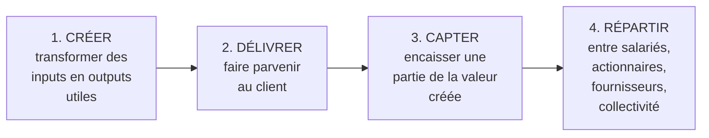
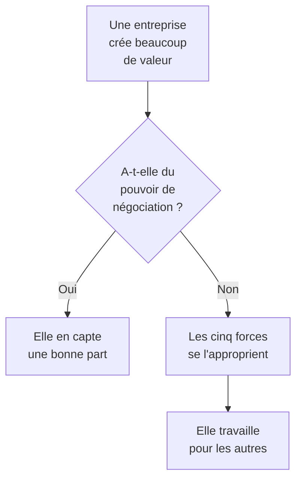

# Q19 — Quelles sont les quatre dimensions de la valeur ?

> [!warning] ⚠️ Écart de provenance à connaître
> Votre fiche de révision annonce quatre dimensions : **création / délivrance / captation / répartition** de la valeur.
> 📘 Vos slides, elles, structurent le raisonnement en **trois** éléments : **proposition de valeur**, **architecture de valeur**, **équation de profit**.
> Le découpage en quatre dimensions est cohérent et utile, mais je ne l'ai pas retrouvé formulé ainsi dans vos supports. Présentez-le comme un cadre d'analyse (📚) et rattachez-le explicitement au triptyque du cours (📘).

> **La réponse en une phrase**
> La valeur se **crée**, se **délivre**, se **capte** et se **répartit** — et l'essentiel est que ces quatre opérations sont distinctes : une entreprise peut créer énormément de valeur et n'en capter aucune.

---

## Partie 1 — Le triptyque du cours, d'abord

📘 Vos slides structurent le business model ainsi :

| Élément 📘 | Définition du cours |
|---|---|
| **Proposition de valeur** | Ce que l'entreprise promet et à qui |
| **Architecture de valeur** | « Décrit la production et la **délivrance** de la proposition de valeur à travers les ressources et compétences de l'entreprise. Il s'agit principalement de la **chaîne de valeur** et du **système de valeur**. » |
| **Équation de profit** | « La confrontation de la proposition de valeur avec l'architecture de valeur se traduit par une confrontation **revenus-coûts** qui dégage un profit. » |

🔎 Notez que le mot « délivrance » figure bien dans le cours, dans la définition de l'architecture de valeur. Le découpage en quatre dimensions est donc un **développement** du triptyque, pas une contradiction.

---

## Partie 2 — Les quatre dimensions, une par une

### 1. Créer la valeur

📘 Le mécanisme est celui de la chaîne de valeur : « divers **inputs** sont transformés afin de créer les produits finaux escomptés (**outputs**) ».

**La question** : qu'est-ce qui, à la sortie, vaut plus qu'à l'entrée, et pour qui ?

⚠️ « Valoir plus » se juge **du point de vue du client**, pas du vôtre. 📘 Le cours 2 le dit : « Le prix reflète **la valeur que les clients accordent** aux produits offerts par les entreprises d'un secteur, c'est-à-dire ce qu'ils sont prêts à payer lorsqu'ils examinent leurs diverses options. »

### 2. Délivrer la valeur

Faire parvenir concrètement la valeur au client : canaux, logistique, relation, service.

📘 Le cours 3 montre que ce n'est pas trivial : « tous les biens et services doivent être distribués au consommateur final. Si la connaissance du marché est inexistante au sein de l'entreprise, il peut être difficile de pénétrer le marché ; les entreprises sont ainsi **forcées de coopérer** avec des distributeurs précis. »

🔎 On peut créer une valeur réelle et échouer à la délivrer, faute d'accès au marché. C'est le sort de beaucoup de bons produits.

### 3. Capter la valeur

**C'est la dimension la plus importante et la plus négligée.** Créer de la valeur ne signifie pas la garder.

📘 Le cours 2 est explicite : « Si [un secteur] crée beaucoup de valeur, les intervenants qui participent à chacune des **cinq forces chercheront à se l'approprier**. »

| Qui capte | Comment |
|---|---|
| Les fournisseurs | En augmentant leurs prix |
| Les clients | En négociant des baisses |
| Les concurrents | En copiant et en cassant les prix |
| Les entrants | En diluant les marges |
| Les substituts | En plafonnant ce que vous pouvez demander |

⚠️ **Le raisonnement décisif** : la capacité à capter dépend de votre **pouvoir de négociation**, pas de la qualité de ce que vous créez. Un agriculteur crée une valeur considérable et en capte une fraction minuscule.

📘 L'équation du cours résume : « **Profit = Prix – Coûts** », et « plus une force est puissante, plus la pression qu'elle exerce sur les prix ou les coûts est élevée ».

### 4. Répartir la valeur

Une fois captée, la valeur se distribue : salaires, dividendes, réinvestissement, impôts, prix payés aux fournisseurs.

🔎 C'est la dimension **politique** du business model, et c'est celle que la durabilité met au centre.

---

## Partie 3 — Pourquoi la distinction est stratégiquement décisive

🔎 **La formule à retenir** : *créer de la valeur est une condition nécessaire, ce n'est pas une condition suffisante*. Le travail stratégique porte autant sur la capture que sur la création.

### L'exemple du cours

📘 Corrigé Oncle Hansi, sur les points forts du modèle : « les **clients sont des partenaires** (une petite base de clients adhère et "subventionne" le packaging), les coûts d'acquisition des clients sont donc **supportés par les distributeurs** ; il existe une proposition de valeur unique pour des clients différents ; **l'entreprise possède le label qui fonde la proposition de valeur**. »

🔎 Analysons ce que fait ce modèle sur les quatre dimensions :

| Dimension | Ce que fait Oncle Hansi |
|---|---|
| **Créer** | Il crée une garantie d'origine et d'identité alsacienne |
| **Délivrer** | 📘 Corners en magasin, boutiques, projet de site — mais « la logistique reste à la charge des entreprises » adhérentes |
| **Capter** | 📘 Deux flux : adhésions et redevances. Et il capte **parce qu'il possède le label**, donc il détient la ressource non substituable |
| **Répartir** | 📘 Les redevances doivent être « limitées pour éviter la concurrence des produits commercialisés sous la marque propre du producteur » |

⚠️ La dernière ligne est un chef-d'œuvre de finesse : **la répartition contraint la captation**. Si le groupement capte trop, les adhérents partent vendre sous leur propre marque. Le partage n'est donc pas une générosité, c'est une **condition de survie du modèle**.

---

## Partie 4 — Ce que la durabilité ajoute à la quatrième dimension

📘 Le cours BM durable : « les **impacts positifs** et les **externalités négatives** sont des notions liées à la création de valeur **au-delà du seul aspect économique**. Une entreprise responsable cherche à : maximiser les impacts positifs (**valeur partagée**), réduire ou compenser les externalités négatives. »

🔎 Le terme « valeur partagée » est exactement une question de **répartition**. Et les « externalités négatives » sont une répartition… négative : une part du coût est répartie sur des tiers qui n'ont rien demandé.

| | Répartition positive | Répartition négative |
|---|---|---|
| Nom | Valeur partagée | Externalité négative |
| Bénéficiaire / victime | Salariés, fournisseurs, territoire | Riverains, écosystème, générations futures |
| Visible dans les comptes | Oui | ❌ Non |

⚠️ C'est pourquoi la quatrième dimension n'est pas une considération morale ajoutée en fin d'analyse : c'est là que se logent les externalités. Voir [[Q25_Ou_se_cachent_les_externalites_negatives]].

---

## Les pièges

> [!danger] Erreurs classiques
> 1. **Présenter les quatre dimensions comme du cours.** 📘 Vos slides parlent de proposition / architecture / équation de profit.
> 2. **Confondre créer et capter.** C'est la distinction la plus rentable de tout le cours.
> 3. **Oublier que capter dépend du pouvoir de négociation**, pas de la qualité.
> 4. **Traiter la répartition comme un supplément moral.** C'est là que se logent les externalités.
> 5. **Oublier le contre-exemple Oncle Hansi.** La répartition contraint la captation.

## À retenir

| | |
|---|---|
| **Triptyque du cours 📘** | Proposition de valeur / architecture de valeur / équation de profit |
| **Les 4 dimensions 📚** | Créer, délivrer, capter, répartir |
| **La distinction clé** | Créer ≠ capter — les cinq forces « chercheront à se l'approprier » |
| **Ce qui décide de la capture** | Le pouvoir de négociation, pas la qualité |
| **Ce que la durabilité ajoute 📘** | Valeur partagée et externalités négatives, dans la répartition |
