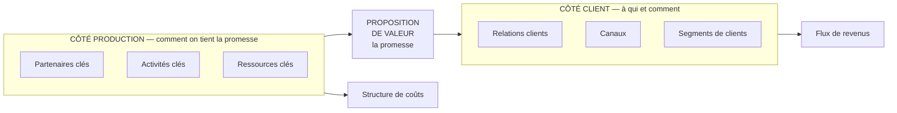

# Q20 — Citez les neuf blocs du Business Model Canvas

> **La réponse en une phrase**
> Neuf cases organisées autour de la proposition de valeur : quatre à droite tournées vers le client, quatre à gauche tournées vers la production, et la promesse au centre qui relie les deux moitiés.

---

## Partie 1 — Ce que le canvas cherche à faire

📘 Cours BM durable : « Le modèle Canvas a pour objet de proposer une **représentation visuelle** du business model de l'entreprise **à partir de la proposition de valeur**. »

⚠️ Deux informations dans cette phrase :
- C'est un outil de **représentation**, pas d'analyse. Il montre, il ne juge pas.
- Le point de départ est la **proposition de valeur**. C'est pour ça qu'elle est au centre.

📘 « La représentation CANVAS permet d'analyser en **trois phases** le business model d'une entreprise. »

---

## Partie 2 — Les neuf blocs, organisés par logique

| # | Bloc | Question qu'il pose | Côté |
|---|---|---|---|
| 1 | **Segments de clients** | À qui s'adresse-t-on ? | Client |
| 2 | **Proposition de valeur** | Que leur promet-on ? | Centre |
| 3 | **Canaux** | Par quels moyens les atteint-on ? | Client |
| 4 | **Relations avec les clients** | Quel type de relation entretient-on ? | Client |
| 5 | **Flux de revenus** | Comment l'argent rentre-t-il ? | Client |
| 6 | **Ressources clés** | Que faut-il posséder ? | Production |
| 7 | **Activités clés** | Que faut-il faire ? | Production |
| 8 | **Partenaires clés** | Qui fait ce qu'on ne fait pas ? | Production |
| 9 | **Structure de coûts** | Que coûte tout cela ? | Production |

🔎 **La logique de lecture** : la moitié droite décrit la valeur telle que le client la perçoit, la moitié gauche décrit ce qu'il faut mobiliser pour la produire. Le bas — coûts et revenus — est la conséquence chiffrée des deux moitiés.

---

## Partie 3 — Les blocs qu'on remplit mal

### Bloc 2 — Proposition de valeur

⚠️ L'erreur la plus fréquente : décrire le **produit** au lieu de la **valeur**.

| Description du produit ❌ | Proposition de valeur ✅ |
|---|---|
| « Des ordinateurs reconditionnés » | « Du matériel professionnel fiable à moitié prix, garanti, sans risque » |
| « Un label alsacien » | 📘 « Une consommation de qualité (sanctionnée par les labels), dans le cadre d'une démarche locavore, pour une région marquée par une forte identité » |

🔎 Le test : la proposition de valeur doit répondre à « **pourquoi le client vous choisit** », pas à « qu'est-ce que vous vendez ».

### Bloc 8 — Partenaires clés

⚠️ On y met souvent tous les fournisseurs. Un partenaire **clé** est celui sans qui le modèle s'effondre.

🔎 Le test : si ce partenaire disparaît demain, mon business model tient-il ? Si oui, ce n'est pas un partenaire clé, c'est un fournisseur.

### Blocs 5 et 9 — Revenus et coûts

⚠️ Ces deux blocs sont souvent expédiés en un mot. Or ils portent la viabilité entière du modèle.

📘 Le cours en fait un point à part entière : « **Pour une équation de profit originale.** La confrontation de la proposition de valeur avec l'architecture de valeur se traduit par une confrontation revenus-coûts qui dégage un profit. »

Voir [[Q22_Lequation_de_profit]].

---

## Partie 4 — La méthode : dans quel ordre remplir

Il n'y a pas d'ordre officiel, mais il y a un ordre **efficace**.

| Ordre | Bloc | Pourquoi ici |
|---|---|---|
| 1 | Segments de clients | On ne peut rien promettre sans savoir à qui |
| 2 | Proposition de valeur | 📘 Le canvas se construit « à partir de la proposition de valeur » |
| 3 | Canaux et relations | Comment on atteint ces segments |
| 4 | Flux de revenus | Ce que ces segments acceptent de payer |
| 5 | Ressources et activités clés | Ce qu'il faut pour tenir la promesse |
| 6 | Partenaires clés | Ce qu'on ne fait pas soi-même |
| 7 | Structure de coûts | Conséquence de 5 et 6 |
| 8 | **Vérification de cohérence** | Les revenus couvrent-ils les coûts ? La promesse est-elle tenable ? |

⚠️ L'étape 8 est celle qui manque toujours. Un canvas rempli n'est pas une analyse. Voir [[Q23_Analyser_un_mini_cas_avec_le_BMC]].

---

## Partie 5 — Ce que la durabilité change dans les blocs

📘 Le document « La métamorphose du Business Model Canvas » réécrit chaque bloc en version durable. Voici les blocs documentés dans vos supports :

| Bloc | 📘 Version durable |
|---|---|
| **Raison d'être** | « Intégration d'une **mission** centrée sur l'impact environnemental et social positif » |
| **Segments de clients** | « Identification et ciblage de segments qui **valorisent la durabilité** et l'éthique » |
| **Propositions de valeur** | « Produits ou services qui **minimisent l'impact environnemental**, utilisent des matériaux durables et offrent une plus-value sociale » |
| **Canaux** | « Canaux qui **réduisent l'empreinte écologique**, comme l'e-commerce vert ou la distribution locale » |
| **Relations avec les clients** | « Relations durables par la **transparence**, le partage d'informations sur la durabilité, et l'engagement communautaire » |

⚠️ Notez que la version durable ajoute un bloc absent du canvas classique : la **raison d'être**. Voir [[Q24_Ce_que_le_BMC_durable_ajoute]] et [[Q28_La_metamorphose_du_BMC]].

---

## Partie 6 — Exemple complet

**L'entreprise.** Un atelier genevois de réparation de vélos avec service d'abonnement, 8 salariés.

| Bloc | Contenu |
|---|---|
| **Segments** | Pendulaires urbains sans place de stationnement ; entreprises équipant leurs salariés ; livreurs professionnels |
| **Proposition de valeur** | « Vous roulez, on s'occupe du reste » — un vélo toujours en état, sans souci d'entretien ni de vol |
| **Canaux** | Atelier en ville ; vélo-atelier mobile qui se déplace en entreprise ; application pour les rendez-vous |
| **Relations** | Abonnement, relation continue et non transactionnelle ; historique d'entretien de chaque vélo |
| **Flux de revenus** | Abonnements mensuels ; réparations ponctuelles hors abonnement ; contrats entreprises ; revente de vélos reconditionnés |
| **Ressources clés** | Atelier équipé ; stock de pièces ; 5 mécaniciens qualifiés ; flotte de vélos de remplacement |
| **Activités clés** | Entretien préventif ; réparation ; gestion de la flotte de remplacement |
| **Partenaires clés** | Deux fournisseurs de pièces ; une filière de récupération de cadres ; les communes pour les emplacements |
| **Structure de coûts** | Main-d'œuvre (poste dominant) ; pièces ; loyer ; flotte de remplacement |

### La vérification de cohérence

| Question | Réponse |
|---|---|
| Les revenus couvrent-ils les coûts ? | L'abonnement doit couvrir la main-d'œuvre récurrente : c'est le point critique |
| La promesse est-elle tenable ? | « Toujours en état » exige la flotte de remplacement — d'où sa présence en ressource clé |
| Y a-t-il un bloc fragile ? | ⚠️ Les partenaires : deux fournisseurs seulement, c'est une dépendance |

🔎 Remarquez comment le canvas fait apparaître une fragilité qui n'était visible dans aucun bloc pris isolément : c'est la **cohérence entre blocs** qui produit le diagnostic.

---

## Les pièges

> [!danger] Erreurs classiques
> 1. **Décrire le produit dans la proposition de valeur.** Il faut la raison du choix client.
> 2. **Mettre tous les fournisseurs en partenaires clés.**
> 3. **Expédier les blocs coûts et revenus.** 📘 C'est là qu'est l'équation de profit.
> 4. **S'arrêter au canvas rempli.** La cohérence entre blocs est l'analyse.
> 5. **Oublier les limites du modèle.** Voir [[Q21_Les_limites_du_BMC]].

## À retenir

| | |
|---|---|
| **Objet 📘** | « Une représentation visuelle du business model à partir de la proposition de valeur » |
| **Les 9 blocs** | Segments, proposition de valeur, canaux, relations, revenus, ressources clés, activités clés, partenaires clés, coûts |
| **Structure** | Droite = client ; gauche = production ; centre = promesse ; bas = argent |
| **Phases 📘** | « Analyser en trois phases le business model » |
| **Le test** | La proposition de valeur répond à « pourquoi vous », pas à « quoi » |
