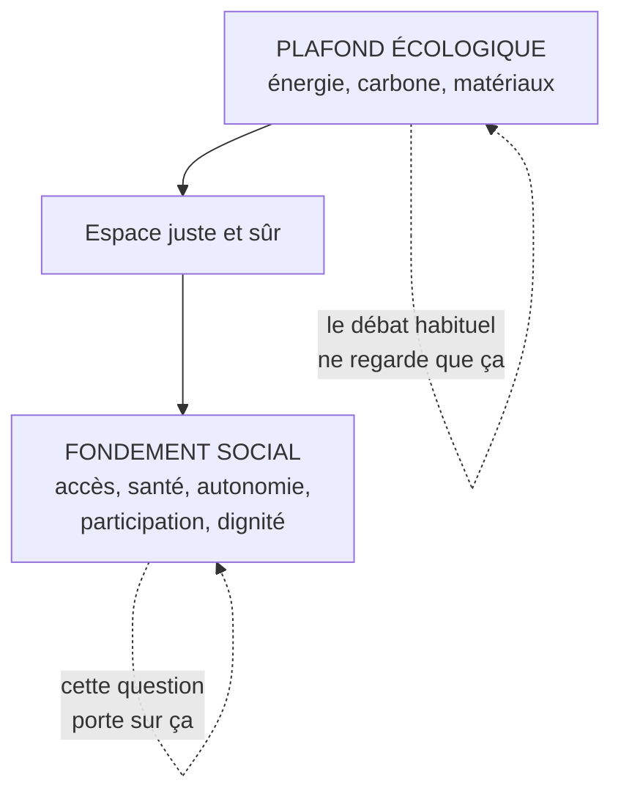

# Q20 — Quels risques la numérisation fait-elle peser, au-delà de l'écologie ?

> **La réponse en une phrase**
> La numérisation peut dégrader la durabilité **par le bas** — en faisant passer des personnes sous le fondement social du donut — alors que le débat se concentre presque toujours sur le plafond écologique.

---

## Partie 1 — Le cadre qui structure toute la réponse : le donut

Cette question n'est pas une liste de problèmes divers. Elle a une architecture, et c'est le modèle du donut qui la donne.

📘 Le cours définit les deux limites :

| Limite | Définition du cours 📘 |
|---|---|
| **Limite haute — plafond écologique** | « Limites planétaires, au-delà desquelles les conditions de vie ne sont plus assurées et des basculements irréversibles peuvent se produire » |
| **Limite basse — fondement social** | « Besoins humains fondamentaux pour toute l'humanité, permettant à chacun·e d'avoir une vie digne » |

🔎 **Le raisonnement fondateur** : dépasser le plafond n'est qu'une des deux façons de sortir du donut. Passer sous le plancher en est une autre, aussi grave. Une numérisation « verte » qui exclut des gens échoue quand même.

### La question des besoins, telle que le cours la pose

📘 Le cours 📘 pose explicitement : « Transition écologique / sociale : notion de besoin ? Comment définir le besoin ? » et cite trois cadres :

| Auteur 📘 | Apport |
|---|---|
| **Max-Neef** (1989, 1992) | Matrice des besoins 9×4 (subsistance, affection, loisirs…) et distinction entre les besoins et les « satisfiers », moyens de les satisfaire, « qui varient dans le temps, en fonction de la culture » |
| **Doyal & Gough** (1991→2015) | Niveau 1 : survie physique + autonomie individuelle. Trois besoins fondamentaux : « appartenir/participer, intégrité et santé physique, autonomie et capacité de raisonnement » |
| **Nussbaum** (2000, 2006) | Les **capabilités** : « la liberté réelle de choisir et d'agir » — l'exemple du cours : « se déplacer lorsque notre corps a la capacité de marcher, que des trottoirs existent, qu'il n'y a pas d'interdiction de sortir dans la rue » |

🔎 **Nussbaum est la clé de cette question.** Une capabilité n'existe que si les trois conditions sont réunies : la capacité personnelle, l'infrastructure, et l'absence d'obstacle. Transposé au numérique : avoir un smartphone ne suffit pas si l'interface est illisible, si le réseau manque, ou si l'authentification est trop complexe. La capacité formelle d'accéder n'est pas l'accès réel.

---

## Partie 2 — Les sept risques, organisés

### Risque 1 — L'exclusion numérique

**Le mécanisme.** Un service passe au numérique. Il devient plus efficace pour la majorité et **inaccessible** pour une minorité — qui n'a pas d'alternative, puisque l'ancien canal a été supprimé.

📘 Le cas SilverDigital le documente précisément : « +15 % de marge opérationnelle », « −20 % de coûts de support », « +10 % de nouveaux clients < 40 ans » — et « **−12 % de clients > 65 ans** », « 30 % des seniors déclarent préférer un contact humain », « délai moyen pour joindre un agent : 9 minutes », « accès à un agent humain : 4 étapes dans l'application », « taille de police non personnalisable », « authentification à double facteur obligatoire », « **aucun manquement légal constaté** ».

#### La notion à connaître : l'exclusion indirecte

📘 L'article du cours cite un professeur en gouvernance numérique à Genève : « Le risque n'est pas juridique, mais stratégique. Une entreprise peut **respecter la loi tout en créant une exclusion indirecte**. »

🔎 Définition en clair : il y a exclusion indirecte quand un dispositif **neutre en apparence**, sans aucune intention d'exclure, produit un **effet disproportionné** sur un groupe identifiable.

⚠️ Le point à comprendre : l'absence d'intention ne supprime pas l'effet. Personne chez SilverDigital n'a décidé d'exclure les personnes âgées. Le résultat est là quand même.

📘 Et le cours cite la défense de l'entreprise, qui est instructive : « Nous maintenons un support humain pour les cas complexes. Notre chatbot améliore l'accessibilité en étant disponible 24 heures sur 24. » 🔎 Cette défense est de bonne foi et passe à côté : un service disponible 24h/24 mais incompréhensible n'est pas accessible.

#### Le cadre réglementaire

📘 **International** : « Standard international **WCAG** (Web Content Accessibility Guidelines), règles pour l'accessibilité des contenus web. But : fournir un standard unique et commun, applicable aux besoins des personnes, des organismes et des gouvernements. »

📘 **Suisse** :
- « Norme suisse **eCH-0059** — But : régir l'accessibilité des sites Internet et des applications mobiles des **autorités publiques** »
- « **Vers une accessibilité numérique obligatoire pour le secteur privé** — Révision de la **loi sur l'égalité pour les handicapés (LHand)**. But : garantir que toutes les personnes, quelle que soit leur condition, puissent accéder efficacement et sans obstacles à diverses plateformes numériques telles que les sites web et les applications mobiles »

⚠️ Le mot « Vers » est important : c'est une trajectoire, pas encore un état. Ce qui est aujourd'hui un choix stratégique deviendra une obligation.

### Risque 2 — La cybersécurité

📘 Le Guide RNE de l'État de Genève place ce risque en premier bénéfice de la démarche : elle « aide à **prévenir les cyber-risques** en anticipant les menaces potentielles ».

🔎 Le raisonnement : chaque service numérisé est une porte d'entrée supplémentaire. La numérisation augmente mécaniquement la surface d'attaque.

### Risque 3 — La protection des données

📘 Vos supports listent parmi les enjeux de la RNE : « Publication des informations sur les sites web. **Collecte des données**. Utilisations de nouvelles technologies (IA). Environnement. Impact sociétal. »

📘 Et le rôle correspondant existe : « Protection des données : **Data Protection Officer** ».

📘 Le cours pointe aussi l'enjeu économique sous-jacent : « Exploitation des données dans l'entreprise "**or numérique**" : habitudes du consommateur / IA. Gagner en performance, faire du profit. C'est l'État qui doit agir sur l'entreprise. »

### Risque 4 — L'économie de l'attention et l'addiction

📘 Le cours pose la question frontalement : « **Addiction au numérique – dopamine – une dépendance programmée ?!** »

📘 Et : « Effet sur l'attention à court terme, beaucoup de contenu court que l'on consomme sans en avoir conscience (cinéma, plateformes changent de format). »

📘 Le cours cite aussi Zuboff : « Les entreprises vendent à notre insu des prédictions de nos comportements. »

🔎 Le lien avec le donut : l'attention et l'autonomie de raisonnement relèvent du fondement social. 📘 Doyal & Gough listent « autonomie et capacité de raisonnement » parmi les trois besoins fondamentaux. Une technologie conçue pour capter l'attention agit donc directement contre un besoin fondamental identifié par le cours.

### Risque 5 — La dépendance

📘 Le cours pose : « Est-ce qu'on peut vraiment diminuer notre consommation du numérique alors qu'on est **totalement dépendant** ? »

📘 Et : « Notion d'**utilité** : on crée l'utilité qui fait qu'on ne peut pas s'en passer ? Comment faire ? »

🔎 La deuxième question est la plus dérangeante : elle suggère que la dépendance n'est pas un effet secondaire mais un **objectif de conception**.

### Risque 6 — La souveraineté et la fragilité géopolitique

📘 Le cours fait travailler ce risque en exercice pratique : imaginer le système informatique d'une PME pouvant faire face à deux aléas :
- « **Coupure de service de la part des USA**, sur décision présidentielle. Implique que tous les services numériques dépendants d'entreprises dont le siège est aux USA arrêtent de fonctionner du jour au lendemain (p. ex. stockage et calcul des centres de données, transactions financières, hébergement web). »
- « **Rupture des chaînes d'approvisionnement** en matériaux et pièces informatiques en provenance de l'Asie. Implique une impossibilité de se fournir en matériaux bruts et raffinés (p. ex. terres rares, métaux) ainsi qu'en pièces informatiques (p. ex. processeurs, carte graphique). »

🔎 Ce risque est le plus opérationnel de tous : il ne relève pas de l'éthique mais de la **continuité d'activité**. Et il croise directement l'économie circulaire : un parc dont la durée de vie est allongée est aussi un parc moins exposé à une rupture d'approvisionnement. Voir [[Q18_Economie_circulaire_des_appareils_numeriques]].

### Risque 7 — La responsabilité des systèmes automatisés

📘 Le cas SilverDigital pose la question : « Qui est responsable des réponses données par le chatbot ? »

🔎 La réponse : **l'entreprise**. Externaliser techniquement un service ne transfère ni la responsabilité juridique, ni la responsabilité réputationnelle vis-à-vis du client. Le client n'a pas de contrat avec le fournisseur du chatbot.

⚠️ Conséquence pratique, et elle est stratégique : cette responsabilité doit être **anticipée au moment de l'achat**, par une clause au cahier des charges. Encore une fois, le levier est dans les achats.

---

## Partie 3 — Le cadre de réponse : les quatre axes de la RNE

📘 Deux formulations coexistent dans vos supports. Connaissez les deux.

| Slides HEG 📘 | Guide État de Genève 2024 📘 |
|---|---|
| Réglementation et technologie | Responsabilité **technologique** |
| Société | Responsabilité **sociétale** |
| Environnement | Responsabilité **environnementale** |
| Économie | Responsabilité **économique** |

📘 Définition du Guide : la RNE « c'est donner des lignes directrices pour naviguer dans le paysage numérique actuel, souvent complexe et en constante évolution. Elle offre une multitude d'opportunités aux entreprises qui mettent en œuvre une démarche responsable vis-à-vis des enjeux que posent les usages du numérique, notamment en contribuant à un développement durable et éthique du numérique. »

📘 Les quatre bénéfices annoncés : « Aide à prévenir les cyber-risques. Favorise une gouvernance technologique de l'entreprise et de l'information plus efficace. Contribue à répondre à des enjeux sociétaux majeurs, tels que l'employabilité et la durabilité. **Renforce le rapport de confiance** entre l'entreprise, ses partenaires et ses clientes et clients. »

### Correspondance risques / axes

| Risque | Axe RNE principal |
|---|---|
| Exclusion numérique | Sociétale |
| Cybersécurité | Technologique |
| Protection des données | Technologique et sociétale |
| Attention, addiction | Sociétale |
| Dépendance, souveraineté | Économique et technologique |
| Responsabilité des systèmes | Technologique et réglementaire |

---

## Partie 4 — Les rôles de gouvernance

📘 Vos supports listent les fonctions qui répondent à ces risques : « Protection des données : Data Protection Officer. Questions numériques : Chief Digital Officer. Sécurité informatique : Chief Information Security Officer. Nouvelles technologies / IA : Chief AI Officer. Environnement : Green Chief Officer. **Accessibilité : Accessibility Officer**. »

🔎 Chaque rôle correspond à une partie prenante qui, sans lui, n'aurait aucune voix dans les arbitrages. Voir [[Q10_Integrer_les_parties_prenantes]].

---

## Partie 5 — Le principe qui articule tout : la sobriété juste

C'est le point le plus fin de cette fiche, et il évite un contresens fréquent.

📘 « Réduire les données, simplifier l'interface ou restreindre certaines fonctionnalités peut être pertinent ; en revanche, supprimer des **aides à la compréhension**, des **alternatives accessibles** ou des fonctions **réellement utiles** reviendrait à faire une **sobriété injuste**. »

📘 « Le critère central n'est pas "moins", mais **moins de superflu, sans réduire l'essentiel**. »

⚠️ **Le piège que ce principe évite** : on pourrait alléger un site en supprimant les aides à la navigation, les textes alternatifs, les alternatives accessibles. On réduirait le plafond écologique en passant sous le fondement social. Le cours interdit explicitement ce raccourci.

🔎 Formulation à retenir : **écologie et inclusion ne s'arbitrent pas l'une contre l'autre**. Le donut demande de respecter les deux limites simultanément, pas de choisir.

---

## Partie 6 — Exemple complet : le diagnostic SilverDigital

### Les cinq obstacles, classés comme le demande le cas

📘 Le cas demande d'identifier « au moins 5 obstacles » et de les classer en « technique, ergonomique, organisationnel, stratégique ».

| Obstacle 📘 | Catégorie | Pourquoi |
|---|---|---|
| Taille de police non personnalisable | **Technique** | Non-conformité WCAG élémentaire |
| Authentification à double facteur obligatoire, sans alternative | **Technique** | Barrière d'accès sans contournement |
| 4 étapes pour atteindre un agent humain | **Ergonomique** | Le parcours décourage |
| 9 minutes de délai moyen | **Organisationnel** | Sous-dimensionnement du support |
| Réponses du chatbot incompréhensibles pour une partie des clients | **Ergonomique et organisationnel** | Conception non testée auprès du public concerné |
| Réduction des guichets physiques sans alternative | **Stratégique** | Décision de modèle, pas d'interface |

🔎 La dernière ligne est la plus importante : c'est un obstacle **stratégique**, pas technique. On peut corriger une taille de police en une journée ; on ne corrige pas la suppression d'un canal sans revenir sur une décision de direction.

### Le dilemme central

📘 Le cas demande de le formuler.

🔎 Ma formulation : **faut-il préserver une rentabilité obtenue par l'exclusion d'un segment historique, ou réinvestir une partie de la marge pour reconquérir ce segment et sécuriser la conformité future ?**

⚠️ Reformulation plus fine, et c'est celle qui débloque : ce n'est pas *rentabilité contre inclusion*, c'est **rentabilité de court terme contre rentabilité de long terme**. Le segment senior est à fort patrimoine, la loi arrive, la population vieillit. 📘 Le cas le note : « La population genevoise vieillit. Les plus de 65 ans représentent une part croissante des usagers de services financiers. »

### Réponse à la question de l'obligation légale

📘 Le cas demande : « L'absence d'obligation légale suffit-elle à exonérer l'entreprise ? »

🔎 Non, pour trois raisons :
1. La légalité est un plancher, pas une stratégie. Elle définit ce qui est sanctionnable, pas ce qui est souhaitable.
2. 📘 Le risque identifié par le cours « n'est pas juridique, mais stratégique » — perte de clientèle, réputation, confiance.
3. 📘 La loi arrive : « Vers une accessibilité numérique obligatoire pour le secteur privé ». Attendre signifie subir la mise en conformité dans l'urgence.

### Le KPI et la gouvernance

📘 Le cas demande un KPI d'accessibilité stratégique et un modèle de gouvernance.

| Élément | Proposition | Justification |
|---|---|---|
| KPI principal | **Taux de rétention des clients de plus de 65 ans**, suivi trimestriellement | 🔎 C'est le seul indicateur qui traduit l'accessibilité en valeur économique, donc le seul audible en conseil d'administration |
| KPI secondaires | Délai moyen d'accès à un humain ; taux de résolution du chatbot par tranche d'âge | Mesurent la cause, pas seulement l'effet |
| Gouvernance | Rattachement de l'accessibilité au comité de direction, pas à l'informatique | Un sujet stratégique ne se traite pas au niveau technique |
| | 📘 Désignation d'un **Accessibility Officer** | Un sujet sans porteur n'appartient à personne |
| | Panel d'utilisateurs seniors consulté **en amont** | Donner une voix avant la décision, pas après |
| | Indicateurs extra-financiers au tableau de bord trimestriel | Sans cela, le sujet n'entre dans aucun arbitrage |

---

## Les pièges

> [!danger] Erreurs classiques
> 1. **Faire une liste sans architecture.** Le donut structure la réponse : c'est le fondement social qui est en jeu.
> 2. **Croire que l'absence d'intention excuse.** L'exclusion indirecte n'a pas besoin d'intention.
> 3. **Confondre légalité et responsabilité.** 📘 « Aucun manquement légal constaté » n'exonère de rien.
> 4. **Croire qu'externaliser transfère la responsabilité.** Le chatbot reste celui de l'entreprise.
> 5. **Opposer écologie et inclusion.** 📘 La sobriété juste interdit ce raccourci.
> 6. **Oublier la souveraineté.** 📘 Le cours en fait un exercice pratique.

## À retenir

| | |
|---|---|
| **L'architecture** | Le fondement social du donut, pas le plafond écologique |
| **Notion clé** | Exclusion indirecte : « respecter la loi tout en créant une exclusion indirecte » |
| **Les 7 risques** | Exclusion, cybersécurité, données, attention, dépendance, souveraineté, responsabilité |
| **Cadre de réponse 📘** | Les 4 axes de la RNE, deux libellés selon la source |
| **Normes 📘** | WCAG (international), eCH-0059 (Suisse, public), révision de la LHand (vers le privé) |
| **Le principe 📘** | Sobriété juste : « moins de superflu, sans réduire l'essentiel » |
