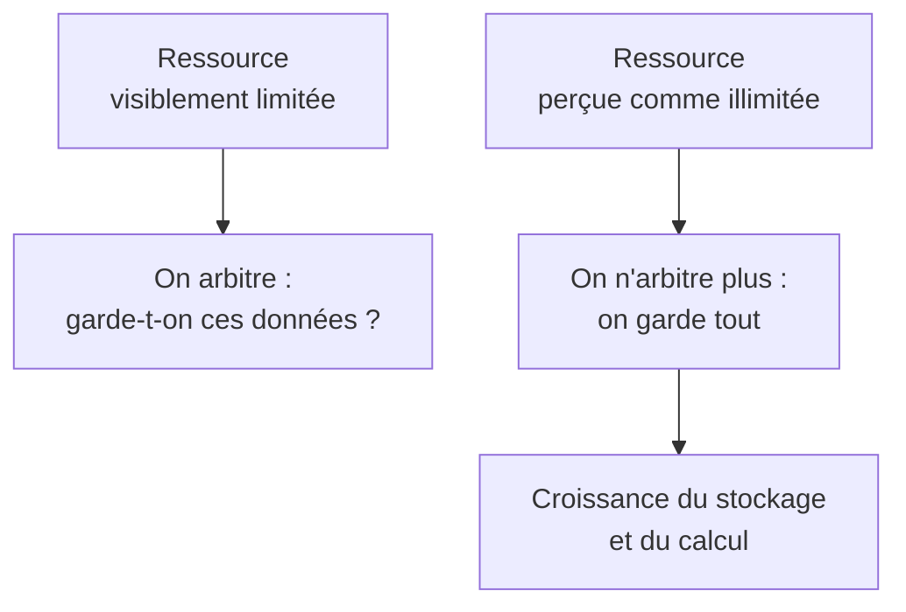
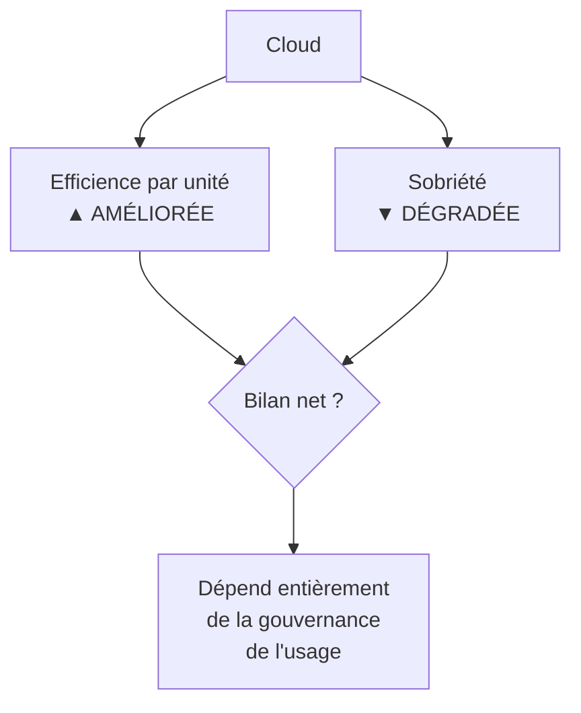

# Q21 — Le cloud soutient-il ou freine-t-il la durabilité ?

> **La réponse en une phrase**
> Le cloud est **plus efficient par unité** mais il **fait exploser le volume d'unités** — et comme il présente la ressource comme illimitée, il supprime précisément le signal qui pousserait à la sobriété.

---

## Partie 1 — Qu'est-ce que le cloud, en termes concrets

### Avant et après

| | Serveurs en propre | Cloud |
|---|---|---|
| Où sont les machines | Dans un local de l'entreprise | Dans un centre de données mutualisé |
| Qui les achète | L'entreprise | Le prestataire |
| Dimensionnement | Sur le pic prévu, avec marge | À la demande |
| Taux d'utilisation typique | Faible, souvent 10 à 20 % | Élevé, la machine sert plusieurs clients |
| Coût perçu par l'utilisateur interne | Invisible, déjà payé | Facturé à l'usage, mais souvent noyé dans un forfait |

🔎 La dernière ligne est celle qui décide de tout, et on y revient en partie 4.

### Le raisonnement d'efficience

Un serveur acheté pour absorber le pic du vendredi soir passe le reste de la semaine à tourner presque à vide, en consommant quand même. Mutualisé entre cent clients dont les pics ne coïncident pas, il travaille en permanence.

```
Taux d'utilisation d'un serveur

En propre     ██                    ~15 % — le reste est de la capacité gâchée
Mutualisé     ████████████          bien plus élevé
```

🔎 Illustration qualitative de ma part. Le principe est solide : **mutualiser une ressource dont les usages ne sont pas simultanés améliore réellement son rendement**.

---

## Partie 2 — Position A : le cloud soutient la durabilité

| Argument | Mécanisme |
|---|---|
| **Mutualisation** | Un serveur bien rempli remplace plusieurs serveurs à vide |
| **Économies d'échelle sur l'infrastructure** | Refroidissement, alimentation et matériel optimisés à grande échelle, ce qu'une PME ne peut pas faire |
| **Élasticité** | On dimensionne au réel plutôt qu'au pic théorique |
| **Renouvellement matériel plus efficace** | Le prestataire remplace le matériel selon un cycle optimisé, avec des filières de reprise |
| **Localisation choisie** | Possibilité d'implanter là où l'électricité est décarbonée |
| **Moins de matériel chez le client** | Moins de serveurs locaux à fabriquer et à refroidir |

📘 Cette position correspond au camp que le cours identifie : le numérique « peut rester un levier majeur de durabilité, **à condition d'être mieux piloté, mieux mesuré et mieux conçu** ».

⚠️ Remarquez encore la condition incluse dans la formulation. Même le camp favorable pose des conditions.

---

## Partie 3 — Position B : le cloud freine la durabilité

### Argument 1 — L'abondance perçue

C'est l'argument central, et il faut bien le comprendre.

**Le mécanisme.** Quand la ressource est en propre, elle est visiblement limitée : il n'y a que trois serveurs dans le local. Quand elle est dans le cloud, elle paraît infinie : on ajoute un téraoctet en un clic.



🔎 **La formulation à retenir** : le cloud améliore l'efficience par unité et supprime le frein qui limitait le nombre d'unités. Une contrainte physique visible est remplacée par une facture diluée que personne ne regarde.

⚠️ C'est le cas d'école de l'**effet rebond** : l'efficacité rend l'usage moins coûteux, donc l'usage augmente.

📘 Le cours pose exactement ce mécanisme : les bénéfices « peuvent être contrebalancés par ses impacts propres et par des **effets rebond**, ce qui rend le bilan net complexe à établir ».

### Argument 2 — La concentration

Le cloud ne fait pas disparaître les serveurs, il les concentre dans des centres de données.

📘 Chiffres du cours sur cette concentration : la demande d'électricité des centres de données « devrait plus que doubler […] d'ici à 2030 » pour atteindre « environ **945 térawattheures**, soit plus de la consommation totale d'électricité du **Japon** », et représenter « un peu moins de **3 % de l'électricité mondiale** ».

📘 Et la trajectoire : « Croissance de la consommation électrique (avec IA) : **16 % / an** (doublement tous les 4 ans). »

🔎 L'argument : la mutualisation améliore le rendement d'un facteur limité, une fois. La croissance des usages, elle, est exponentielle. Voir [[Q16_Impact_environnemental_des_data_centers]].

### Argument 3 — La dépendance et la souveraineté

📘 Le cours fait travailler ce risque en exercice pratique : imaginer le système informatique d'une PME face à une « **coupure de service de la part des USA**, sur décision présidentielle », impliquant que « tous les services numériques dépendants d'entreprises dont le siège est aux USA arrêtent de fonctionner du jour au lendemain (p. ex. stockage et calcul des centres de données, transactions financières, hébergement web) ».

📘 Et le cours cite en référence un article du Temps intitulé « Une immense supercherie : Comment Microsoft, Google et Amazon font croire qu'ils renforcent la souveraineté numérique européenne et suisse ».

⚠️ Cet argument ne relève pas de l'écologie mais de la **durabilité économique** : 📘 « création de valeur à long terme, efficacité des ressources, innovation responsable ». Une entreprise dont l'activité peut s'arrêter sur décision d'un gouvernement étranger n'a pas un modèle durable, quelle que soit son empreinte carbone.

### Argument 4 — L'opacité

🔎 Le client du cloud ne sait généralement pas où sont ses données, ni comment le centre est alimenté, ni quel est le rendement réel. Il ne peut donc pas piloter ce qu'il ne mesure pas. Voir [[Q07_Numerique_pour_mesurer_et_piloter_impact]].

---

## Partie 4 — La synthèse : sortir du match nul

Les deux positions sont solides. Voici la formulation qui les articule.

> **Le cloud améliore l'efficience et dégrade la sobriété.**



🔎 Ce sont deux notions différentes qu'il faut distinguer soigneusement :

| Notion | Question qu'elle pose |
|---|---|
| **Efficience** | Fait-on mieux avec la même chose ? |
| **Sobriété** | A-t-on besoin de le faire ? |

📘 Le cours pose la sobriété comme première : « Sobriété : questionner les besoins **en première intention**. »

⚠️ Le cloud répond très bien à la première question et supprime les conditions matérielles qui forçaient à poser la seconde.

### La conclusion

🔎 Le cloud n'est ni bon ni mauvais pour la durabilité. Il déplace la responsabilité : **elle passe du fournisseur au client**. Autrefois, la limite physique de vos serveurs vous imposait la sobriété. Maintenant, c'est vous qui devez vous l'imposer, contre un système conçu pour ne jamais dire non.

---

## Partie 5 — Les conditions pour que le bilan soit positif

| Condition | Ce que ça veut dire | Ancrage |
|---|---|---|
| **Définir une durée de vie des données** | Ne pas conserver indéfiniment | 📘 Un des six leviers du RGESN 2024 |
| **Dimensionner au réel** | Éteindre les environnements inutilisés, arrêter les tests la nuit | 📘 Levier « hébergement » du RGESN |
| **Mesurer et facturer en interne** | Rendre le coût visible pour l'équipe qui le génère | 🔎 Restaure le signal supprimé |
| **Choisir sur critères** | Localisation, mix électrique, transparence du prestataire | 📘 Le levier achats, encore une fois |
| **Prévoir la réversibilité** | Pouvoir changer de prestataire ou revenir en interne | 📘 Scénario de rupture travaillé en cours |
| **Suivre un indicateur absolu** | Volume total stocké, facture énergétique totale | 🔎 Seul moyen de détecter l'effet rebond |

🔎 La troisième ligne est la plus efficace et la moins pratiquée. Quand une équipe voit le coût de son stockage sur son propre budget, son comportement change immédiatement. Quand c'est une ligne globale à la direction informatique, rien ne change.

---

## Partie 6 — Exemple complet

**L'entreprise.** Un cabinet d'architecture genevois, 30 personnes. Passage de serveurs locaux au cloud il y a trois ans.

### Ce que la migration a apporté

| Gain | Réalité |
|---|---|
| Suppression de 4 serveurs locaux et de leur climatisation | ✅ Gain réel et mesurable |
| Fin du surdimensionnement pour les pics de rendu 3D | ✅ Gain réel |
| Fin du renouvellement matériel tous les 4 ans | ✅ Gain réel |

### Ce que la migration a provoqué

| Dérive | Mécanisme |
|---|---|
| Volume stocké multiplié par 6 en trois ans | Plus aucune raison de faire le ménage |
| Conservation de toutes les versions intermédiaires de tous les projets | Le tri coûtait du temps, le stockage ne coûtait plus rien de visible |
| Rendus 3D lancés en surqualité systématique | La puissance est disponible, donc on l'utilise |
| Sauvegardes complètes quotidiennes conservées indéfiniment | Personne n'a jamais défini de règle |

```
Consommation attribuable au numérique du cabinet

Avant migration    ████████████
Après, théorie     ██████         gain d'efficience attendu
Après, réalité     ███████████████  effet rebond du volume
```

🔎 Illustration de ma part. Le message : le gain d'efficience était réel, et il a été plus qu'absorbé par la croissance du volume.

### Le plan de correction

| Action | Levier RGESN 📘 |
|---|---|
| Politique de rétention : 18 mois en ligne, archivage froid ensuite, suppression après 7 ans | Durée de vie des données |
| Une seule version majeure conservée par projet, pas toutes les intermédiaires | Contenus |
| Rendus en qualité adaptée à l'usage : présentation client ou vérification interne | 📘 « Adapter la qualité technique au besoin réel » |
| Sauvegardes incrémentales, complètes hebdomadaires | Flux |
| Refacturation interne du stockage par équipe projet | 🔎 Restaure le signal de rareté |

### Les indicateurs

| Indicateur | Type |
|---|---|
| Volume total stocké (To) | **Absolu** |
| Volume par projet livré (Go) | Intensité |
| Facture énergétique ou carbone du prestataire | **Absolu** |
| Nombre de projets livrés dans l'année | Contrôle |

⚠️ Le dernier permet de savoir si une baisse vient d'une vraie sobriété ou d'une baisse d'activité.

---

## Les pièges

> [!danger] Erreurs classiques
> 1. **Répondre « oui, le cloud est plus efficace ».** Vrai par unité, faux en absolu.
> 2. **Confondre efficience et sobriété.** Ce sont deux questions différentes.
> 3. **Oublier l'effet rebond.** C'est le mécanisme central de cette question.
> 4. **Oublier la souveraineté.** 📘 Le cours en fait un exercice, et c'est un enjeu de durabilité économique.
> 5. **Oublier la durée de vie des données.** 📘 Un des six leviers du RGESN.
> 6. **Ne pas voir le déplacement de responsabilité.** La contrainte matérielle a disparu, il faut la remplacer par une règle.

## À retenir

| | |
|---|---|
| **La formule** | Le cloud améliore l'efficience et dégrade la sobriété |
| **Le mécanisme** | L'abondance perçue supprime l'arbitrage |
| **Chiffres 📘** | Centres de données : +16 % par an, 945 TWh en 2030, moins de 3 % de l'électricité mondiale |
| **Risque non écologique 📘** | Souveraineté : scénario de coupure de service travaillé en cours |
| **Les conditions** | Durée de vie des données, dimensionnement réel, refacturation interne, critères d'achat, réversibilité |
| **L'indicateur juge** | Volume total stocké, en absolu |
