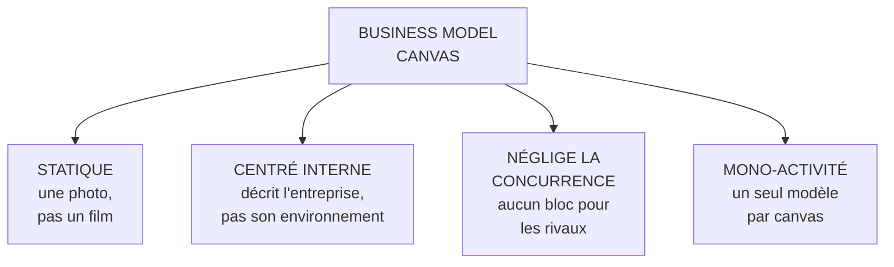
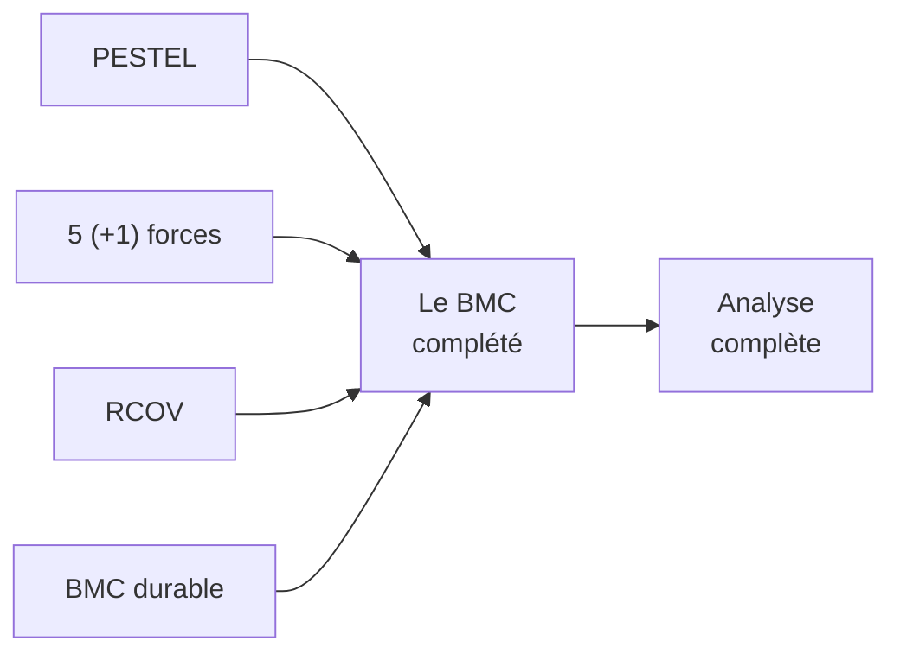

# Q21 — Quelles sont les limites du Business Model Canvas ?

> **La réponse en une phrase**
> Quatre limites, toutes dans vos slides : il est **statique**, **centré sur l'interne**, il **néglige la concurrence**, et il est pensé pour des entreprises **mono-activité de type start-up**.

---

## Partie 1 — La citation exacte, à connaître

📘 Cours BM durable, slide « Le modèle Canvas » :

> « Si ce modèle présente l'avantage de la **simplicité** et d'une mise en œuvre **facile et directe**, il s'applique surtout à des entreprises **monoactivité comme les start-up**. De plus, il se focalise essentiellement sur le **fonctionnement interne** de l'entreprise, en **négligeant la concurrence**, et il reste essentiellement **statique**. »

🔎 C'est une des rares slides du cours qui critique explicitement un outil. Le fait qu'elle existe signifie qu'on attend de vous cette lecture critique. Une réponse qui présente le BMC sans ses limites passe à côté de ce que le cours a voulu enseigner.

⚠️ Notez aussi que le cours reconnaît d'abord ses avantages : simplicité, mise en œuvre facile et directe. Une critique équilibrée commence par là.

---

## Partie 2 — Les quatre limites, expliquées

### Limite 1 — Statique

**Ce que ça veut dire.** Le canvas décrit un **état à un instant t**. Il ne montre ni comment on y est arrivé, ni comment ça évolue, ni les effets de retour.

🔎 Conséquence concrète : il ne fait pas apparaître qu'un profit réinvesti crée de nouvelles ressources, qui permettent de nouvelles compétences. Cette boucle existe dans RCOV et pas dans le BMC. Voir [[Q18_Le_modele_RCOV]].

⚠️ Conséquence pour la durabilité : les effets à long terme — érosion d'une ressource, montée d'une contrainte réglementaire, effet rebond — sont **invisibles** dans un canvas. Or ce sont précisément les effets qui comptent en durabilité.

### Limite 2 — Centré sur le fonctionnement interne

**Ce que ça veut dire.** Huit blocs sur neuf décrivent l'entreprise et ses relations directes. Le neuvième, les segments de clients, décrit à qui elle s'adresse — pas ce qui se passe dans son environnement.

🔎 Il n'y a **aucun bloc PESTEL** dans le canvas. Ni réglementation, ni évolution technologique, ni contrainte écologique.

⚠️ Conséquence : un canvas parfaitement cohérent peut décrire un modèle voué à disparaître, parce que la contrainte qui va le tuer n'est nulle part dessinée.

### Limite 3 — Néglige la concurrence

**Ce que ça veut dire.** Aucun bloc ne demande « que font les autres ? ».

📘 Or le cours 2 fait de la concurrence le cœur de l'analyse externe : les cinq forces, la rivalité, les substituts, les entrants. Et : « plus une force est puissante, plus la pression qu'elle exerce sur les prix ou les coûts est élevée, et moins le secteur est attrayant ».

🔎 Le problème logique : le BMC vous permet de décrire une proposition de valeur excellente **sans jamais vérifier qu'elle est différenciante**. Or 📘 « l'accent est mis sur les activités où l'entreprise parvient à se distinguer de ses concurrents ». Sans comparaison, pas de distinction.

### Limite 4 — Pensé pour la mono-activité, type start-up

**Ce que ça veut dire.** Un canvas décrit **un** modèle. Une entreprise diversifiée en a plusieurs, avec des segments, des canaux et des équations de profit différents.

🔎 Si vous forcez plusieurs activités dans un seul canvas, les blocs deviennent des listes floues qui ne décrivent aucun modèle en particulier.

⚠️ La solution pratique : **un canvas par domaine d'activité stratégique**, puis une analyse des synergies entre eux.

---

## Partie 3 — Comment compenser chaque limite

C'est ce qui transforme une critique en méthode. Chaque limite se comble avec un autre outil du cours.

| Limite | Outil de compensation 📘 |
|---|---|
| **Statique** | Le modèle **RCOV** et sa boucle profit → ressources ; et le suivi d'indicateurs dans le temps |
| **Centré interne** | Le **PESTEL** pour le macro |
| **Néglige la concurrence** | Les **5 (+1) forces de Porter** pour le micro |
| **Mono-activité** | Un canvas par activité, puis analyse des synergies |
| *Bonus : ignore les externalités* | Le **BMC durable** : mission, impacts positifs, externalités négatives |

🔎 **La formulation qui vaut des points** : « Le BMC est un excellent outil de représentation, à condition de ne jamais l'utiliser seul. Ses limites sont exactement les zones couvertes par les autres outils du cours. »

---

## Partie 4 — La cinquième limite, celle que le cours corrige lui-même

📘 Le BMC classique ne comporte aucun bloc pour ce que l'entreprise fait subir à des tiers. Le cours ajoute donc : « les **impacts positifs** et les **externalités négatives** sont des notions liées à la création de valeur **au-delà du seul aspect économique**. Une entreprise responsable cherche à : maximiser les impacts positifs (valeur partagée), réduire ou compenser les externalités négatives. »

🔎 Le raisonnement : dans un canvas classique, un coût supporté par un tiers n'apparaît **nulle part**. Ni dans la structure de coûts (vous ne le payez pas), ni ailleurs. Le modèle est donc structurellement aveugle aux externalités.

⚠️ C'est plus qu'une lacune de représentation : c'est un outil qui **rend invisible** ce que la durabilité cherche à rendre visible. Voir [[Q25_Ou_se_cachent_les_externalites_negatives]].

---

## Partie 5 — Exemple : ce qu'un canvas ne montre pas

**L'entreprise.** Une plateforme de livraison de repas.

### Le canvas, tel qu'il se remplit

| Bloc | Contenu |
|---|---|
| Segments | Urbains pressés, restaurants |
| Proposition de valeur | Repas livrés en 30 minutes |
| Canaux | Application mobile |
| Revenus | Commission sur commandes, frais de livraison, abonnements |
| Ressources clés | Plateforme technique, base de restaurants |
| Activités clés | Mise en relation, gestion des flux |
| Partenaires clés | Restaurants, livreurs |
| Structure de coûts | Développement, marketing, support |

🔎 Ce canvas est **cohérent**. Les revenus couvrent les coûts. La promesse est tenable.

### Ce que le canvas ne montre pas

| Angle mort | Limite en cause |
|---|---|
| Le statut et les conditions des livreurs, absents de la structure de coûts | Externalités négatives |
| Les émissions des trajets de livraison | Externalités négatives |
| Les emballages à usage unique | Externalités négatives |
| L'arrivée d'une réglementation sur le statut des travailleurs de plateforme | Centré interne, pas de PESTEL |
| Trois concurrents identiques qui cassent les commissions | Néglige la concurrence |
| La dégradation progressive de la marge des restaurants partenaires | Statique |

⚠️ Le dernier point est le plus intéressant : les restaurants sont dans **partenaires clés**, mais le canvas ne dit rien de la soutenabilité de la relation dans le temps. Si la commission dégrade leur marge, les partenaires clés disparaissent — et le modèle avec.

🔎 C'est exactement la limite « statique » : le canvas montre une relation, pas sa trajectoire.

---

## Les pièges

> [!danger] Erreurs classiques
> 1. **Présenter le BMC sans ses limites.** Le cours consacre une slide à les énoncer.
> 2. **Oublier les avantages.** 📘 Simplicité, mise en œuvre facile et directe.
> 3. **Citer les limites sans dire comment les compenser.** Chaque limite a son outil.
> 4. **Oublier l'aveuglement aux externalités.** C'est ce que corrige le BMC durable.
> 5. **Forcer une entreprise diversifiée dans un seul canvas.**

## À retenir

| | |
|---|---|
| **Les 4 limites 📘** | Statique, centré interne, néglige la concurrence, mono-activité type start-up |
| **Les avantages 📘** | Simplicité, mise en œuvre facile et directe |
| **La 5ᵉ limite** | Aveugle aux externalités négatives — corrigée par le BMC durable |
| **Compensations** | RCOV (dynamique), PESTEL (macro), Porter (concurrence), un canvas par activité |
| **La formule** | Excellent outil, à condition de ne jamais l'utiliser seul |
