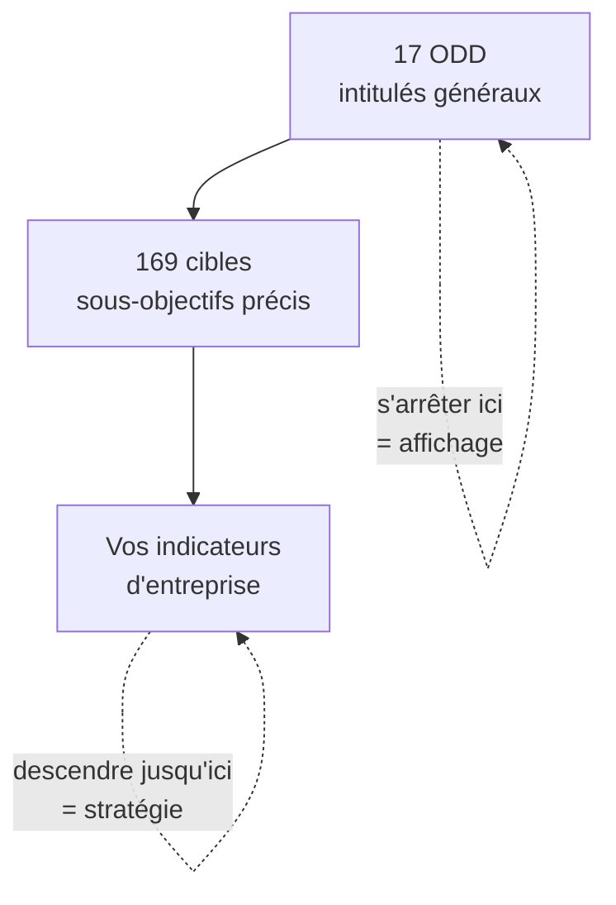
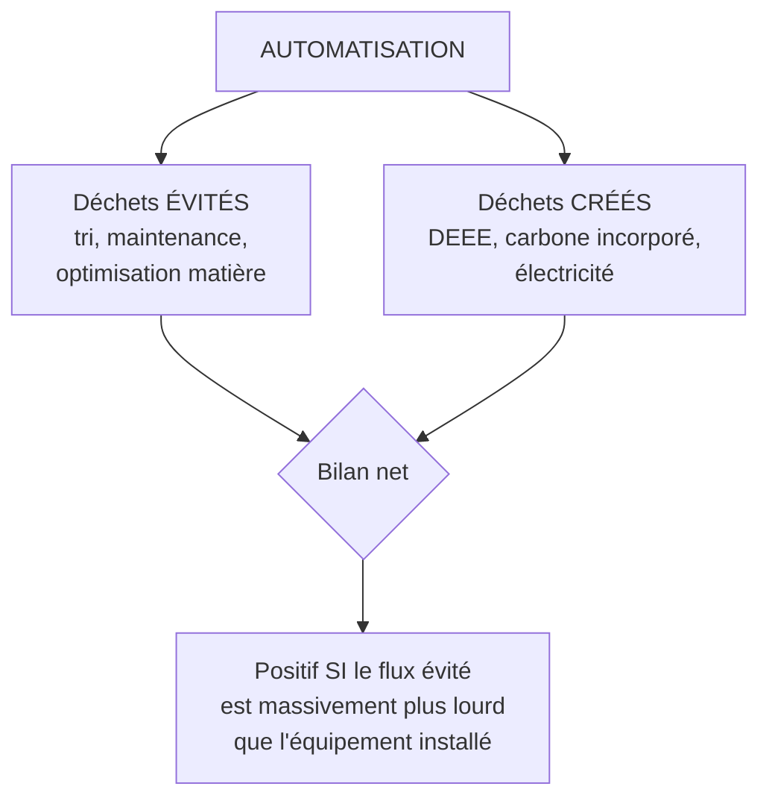

# Q22 — Comment intégrer les ODD dans une stratégie digitale ? Automatisation et déchets

> **La réponse en une phrase**
> On n'« intègre » pas les 17 ODD : on en **choisit deux ou trois** que l'activité touche réellement, on descend au niveau des cibles, et on accepte de nommer les ODD sur lesquels on régresse — l'automatisation étant le cas typique d'un projet qui sert un ODD tout en en dégradant un autre.

---

## Partie 1 — Ce que sont les ODD, exactement

📘 Le cours pose le cadre avec précision :

> « Le **25 septembre 2015**, les **193 États membres** de l'ONU ont adopté l'Agenda 2030 de développement durable. Les **17 objectifs de développement durable (ODD)** et leurs **169 cibles** (sous-objectifs) forment la clé de voûte de l'Agenda 2030. Les ODD doivent être atteints par tous les États membres de l'ONU d'ici à 2030. Les ODD s'articulent autour des "**5P**" : **Populations, Planète, Prospérité, Paix et Partenariats**. »

📘 Et en Suisse : « Dans sa **Stratégie pour le développement durable 2030 (SDD 2030)**, le Conseil fédéral montre selon quelles priorités il entend mettre en œuvre l'Agenda 2030 pour le développement durable d'ici 2030. »

### Le détail que presque personne n'exploite : les 169 cibles

🔎 Il y a 17 objectifs **et 169 cibles**. Les objectifs sont des intitulés généraux ; les cibles sont des sous-objectifs précis. C'est au niveau des cibles qu'un projet devient mesurable.

⚠️ C'est la différence entre « nous contribuons à l'ODD 12 » — qui ne veut rien dire — et « nous visons une cible précise de réduction des déchets par une action identifiée, mesurée par tel indicateur ».



---

## Partie 2 — L'erreur à ne surtout pas commettre

### Le tableau des 17 logos

La pratique la plus répandue consiste à afficher les 17 pictogrammes colorés sur le rapport annuel et à cocher ceux auxquels on « contribue ». Résultat : une entreprise contribue à quinze ODD et n'en pilote aucun.

🔎 Pourquoi c'est vide : contribuer à un ODD n'engage à rien. Toute entreprise qui emploie quelqu'un contribue à l'ODD 8 sur le travail décent. Ce n'est pas une stratégie, c'est une constatation.

⚠️ C'est un cas de **greenwashing** au sens de [[Q15_Le_greenwashing]] : la communication est plus large que l'action.

### La méthode qui fonctionne : sélectionner puis approfondir

```
Deux approches

Approche affichage    ██ ██ ██ ██ ██ ██ ██ ██ ██ ██ ██ ██ ██ ██ ██
                      17 ODD effleurés, aucun piloté

Approche stratégique  ████████████  ████████████  ████████████
                      3 ODD, descendus jusqu'à la cible et l'indicateur
```

| Étape | Ce qu'on fait |
|---|---|
| 1. **Cartographier** | Sur quels ODD mon activité a-t-elle un impact **réel**, positif ou négatif ? |
| 2. **Sélectionner** | Retenir 2 ou 3 ODD, ceux où l'impact est le plus fort |
| 3. **Descendre à la cible** | Choisir la ou les cibles précises visées parmi les 169 |
| 4. **Traduire en objectif SMART** | Un objectif chiffré, daté, atteignable |
| 5. **Nommer les tensions** | Sur quels ODD ce projet dégrade-t-il la situation ? |
| 6. **Mesurer** | Un indicateur d'intensité et un indicateur absolu |

📘 L'étape 4 vient directement de votre cours : « Formulez **1 objectif SMART** […] Proposez **2 actions concrètes, 1 indicateur de suivi**. Les objectifs doivent guider la stratégie et être **mesurables**. »

---

## Partie 3 — Les ODD qu'une stratégie digitale touche réellement

🔎 Ma sélection, argumentée. La liste des 17 est celle de l'ONU ; le choix de ceux qui concernent le numérique est mon raisonnement.

| ODD | Intitulé | Lien avec une stratégie digitale | Sens |
|---|---|---|---|
| **9** | Industrie, innovation et infrastructure | Le numérique est une infrastructure ; l'innovation responsable en relève | ✅ Positif |
| **12** | Consommation et production responsables | Économie circulaire du matériel, DEEE, durée de vie | ⚠️ Les deux sens |
| **13** | Mesures relatives à la lutte contre les changements climatiques | Consommation électrique, empreinte des centres de données | ⚠️ Les deux sens |
| **7** | Énergie propre et d'un coût abordable | Le numérique est un consommateur électrique majeur | ⚠️ Les deux sens |
| **8** | Travail décent et croissance économique | Automatisation et emploi ; conditions dans la chaîne amont | ⚠️ Les deux sens |
| **10** | Inégalités réduites | Exclusion numérique, accessibilité | ⚠️ Les deux sens |
| **17** | Partenariats pour la réalisation des objectifs | 📘 L'un des 5P ; les boucles circulaires exigent plusieurs acteurs | ✅ Positif |

⚠️ Regardez la colonne de droite : la majorité des ODD concernés vont **dans les deux sens**. C'est l'observation la plus importante de cette fiche, et elle prépare la seconde partie de la question.

---

## Partie 4 — La seconde moitié de la question : automatisation et déchets

C'est ici que la question devient intéressante, parce qu'elle contient une contradiction.

### Ce que l'automatisation apporte, côté déchets

| Mécanisme | Effet |
|---|---|
| **Tri intelligent** | Meilleure séparation des flux, plus de matière effectivement récupérée |
| **Maintenance prédictive** | On répare avant la panne, la machine dure plus longtemps |
| **Optimisation matière** | Découpe optimisée, moins de chutes en production |
| **Prévision de la demande** | Moins de surproduction, moins d'invendus |
| **Contrôle qualité automatisé** | Moins de rebuts |

🔎 Le mécanisme commun aux cinq : **l'automatisation supprime du gaspillage lié à l'imprécision humaine ou au manque d'information**. C'est le même raisonnement que pour la logistique en [[Q08_Donnees_temps_reel_et_logistique_durable]].

📘 Et la maintenance prédictive touche directement le levier central de l'économie circulaire : « l'**extension de la vie utile** des appareils […] une **minimisation du besoin de nouveaux appareils** et des déchets électroniques ».

### Ce que l'automatisation crée, côté déchets

| Mécanisme | Effet |
|---|---|
| **Déchets d'équipements électriques et électroniques (DEEE)** | Capteurs, automates, robots, caméras : autant d'appareils à fabriquer puis à jeter |
| **Carbone incorporé** | L'essentiel de l'impact d'un équipement électronique est dans sa fabrication |
| **Consommation électrique** | Les systèmes tournent en continu |
| **Obsolescence logicielle** | Un automate parfaitement fonctionnel devient inutilisable faute de support |
| **Effet rebond** | Une production plus efficace peut simplement produire davantage |

### La mise en balance



🔎 **La règle de décision**, et elle est la même que pour la logistique : le bilan est favorable quand le numérique optimise quelque chose de **beaucoup plus lourd que lui**.

| Cas | Bilan probable | Pourquoi |
|---|---|---|
| Tri automatisé dans un centre de traitement de déchets | ✅ Favorable | Le flux traité est massif, l'équipement est unique |
| Maintenance prédictive sur des machines industrielles | ✅ Favorable | Évite le remplacement d'équipements lourds |
| Capteurs sur chaque produit vendu | ⚠️ Douteux | On ajoute un composant électronique à chaque unité |
| Automatisation d'une tâche administrative légère | ⚠️ Douteux | Le gain est faible, le coût numérique est réel |

⚠️ Notez la troisième ligne : intégrer un capteur dans chaque produit multiplie les DEEE par le nombre d'unités vendues. C'est le cas le plus risqué, et c'est aussi le plus à la mode.

---

## Partie 5 — L'arbitrage à expliciter

C'est ce que la question demande littéralement : un arbitrage **explicite**.

### Pourquoi il faut le nommer et pas le masquer

🔎 Trois raisons :

1. **Crédibilité.** Un projet qui ne présente que des bénéfices n'est pas crédible. Voir [[Q15_Le_greenwashing]].
2. **Pilotage.** On ne surveille pas un risque qu'on n'a pas nommé.
3. **Cohérence avec les ODD eux-mêmes.** L'Agenda 2030 comporte 17 objectifs précisément parce qu'ils sont en tension : la croissance économique (ODD 8) et la consommation responsable (ODD 12) ne pointent pas dans la même direction.

### Le tableau d'arbitrage type

| ODD | Effet du projet | Sens |
|---|---|---|
| ODD 12 — Consommation et production responsables | Moins de rebuts, plus de matière triée | ⬆️ Amélioration |
| ODD 9 — Innovation et infrastructure | Modernisation de l'outil de production | ⬆️ Amélioration |
| ODD 12 — volet DEEE | Nouveaux équipements électroniques installés | ⬇️ **Dégradation** |
| ODD 7 et 13 — énergie et climat | Consommation électrique supplémentaire | ⬇️ **Dégradation** |
| ODD 8 — Travail décent | Postes transformés ou supprimés | ⚖️ **À traiter** |

⚠️ La dernière ligne est celle qu'on escamote systématiquement. L'automatisation a un effet sur l'emploi, et l'ODD 8 existe. 📘 La dimension sociale de la chaîne de valeur durable inclut explicitement les « conditions de travail ». Ne pas en parler, c'est faire une analyse à deux dimensions sur trois.

🔎 Traiter ne veut pas dire renoncer : cela veut dire prévoir la formation, la requalification, l'association du personnel. 📘 C'est exactement le « plan de management des parties prenantes » du cours 1. Voir [[Q10_Integrer_les_parties_prenantes]].

---

## Partie 6 — Exemple complet

**L'entreprise.** Une PME genevoise de traitement et valorisation de déchets de chantier, 55 salariés. Projet : automatiser le tri par reconnaissance visuelle.

### Étape 1 et 2 — Cartographier et sélectionner

| ODD | Impact réel de l'activité | Retenu ? |
|---|---|---|
| ODD 12 — Consommation et production responsables | Cœur de métier | ✅ Principal |
| ODD 13 — Climat | Émissions de l'activité et évitées | ✅ Secondaire |
| ODD 8 — Travail décent | 12 postes de tri manuel concernés | ✅ Tension à traiter |
| ODD 17 — Partenariats | Débouchés pour la matière triée | ✅ Condition de réussite |
| Les 13 autres | Impact marginal ou nul | ❌ Non retenus |

🔎 Quatre ODD sur dix-sept. C'est ça, sélectionner.

### Étape 3 et 4 — Descendre à la cible, puis à l'objectif SMART

| Élément | Contenu |
|---|---|
| ODD principal | 12 — Consommation et production responsables |
| Cible visée | Réduction de la production de déchets par la valorisation |
| **Objectif SMART** | Porter le taux de valorisation matière de 62 % à 78 % en 24 mois |
| Action 1 | Installation d'une ligne de tri optique sur le flux principal |
| Action 2 | Contrat de reprise avec deux filières régionales pour les fractions nouvellement séparables |
| Indicateur de suivi | Taux de valorisation matière (intensité) **et** tonnes envoyées en enfouissement (absolu) |

📘 Cette structure — orientation, objectif SMART, deux actions, un indicateur — est exactement celle que votre cours demande.

### Étape 5 — Nommer les tensions

| Tension | Traitement prévu |
|---|---|
| DEEE créés : caméras, automates, serveur local | Contrat de reprise avec le fournisseur ; critères 📘 TCO à l'achat (extension de la durée de vie, récupération des matériaux) |
| Consommation électrique de la ligne | Contrat d'électricité renouvelable ; suivi de la consommation totale du site |
| Obsolescence logicielle du système de reconnaissance | Clause contractuelle de support minimum de 10 ans |
| **12 postes de tri manuel** | 8 requalifiés en conduite de ligne et contrôle qualité, avec formation financée ; 4 redéployés sur la nouvelle activité de reprise. Personnel associé à la conception dès le départ |

🔎 Notez le traitement de la dernière ligne : le projet crée aussi une activité nouvelle (la relation avec les filières de reprise), ce qui absorbe une partie de l'effet sur l'emploi. Un bon projet cherche cette compensation plutôt que de la subir.

### Étape 6 — Le tableau de bord

| Indicateur | Type | ODD suivi |
|---|---|---|
| Taux de valorisation matière | Intensité | 12 |
| **Tonnes envoyées en enfouissement** | **Absolu** | 12 |
| Consommation électrique totale du site | **Absolu** | 7 et 13 |
| Nombre d'équipements électroniques en service et leur âge moyen | **Absolu** | 12, volet DEEE |
| Nombre de salariés formés et maintenus dans l'emploi | Absolu | 8 |
| Tonnage total traité | Contrôle | — |

⚠️ La dernière ligne est le garde-fou contre l'effet rebond : si le tonnage traité double, tous les taux peuvent s'améliorer pendant que les impacts absolus augmentent.

---

## Partie 7 — La formulation stratégique à retenir

> **Intégrer les ODD, ce n'est pas cocher des cases : c'est choisir sur quels objectifs on s'engage, descendre jusqu'à un indicateur mesurable, et déclarer sur lesquels on régresse.**

🔎 Le second point est celui qui distingue une entreprise sérieuse d'une entreprise en affichage. Aucun projet réel n'améliore les 17 ODD simultanément. Une organisation qui l'affirme n'a pas fait l'analyse.

---

## Les pièges

> [!danger] Erreurs classiques
> 1. **Vouloir couvrir les 17 ODD.** Trois pilotés valent mieux que dix-sept cochés.
> 2. **Rester au niveau des objectifs.** 📘 Il y a **169 cibles** : c'est là que ça devient mesurable.
> 3. **Ne présenter que les bénéfices de l'automatisation.** La question demande explicitement d'expliciter l'arbitrage.
> 4. **Oublier les DEEE.** Automatiser, c'est ajouter des équipements électroniques.
> 5. **Oublier l'ODD 8 et l'emploi.** 📘 La dimension sociale fait partie de la définition du cours.
> 6. **Oublier l'indicateur absolu.** C'est le seul qui détecte l'effet rebond.
> 7. **Oublier l'ODD 17.** 📘 Partenariats est l'un des 5P, et une boucle circulaire a besoin de plusieurs acteurs.

## À retenir

| | |
|---|---|
| **Le cadre 📘** | 25 septembre 2015, 193 États, **17 ODD**, **169 cibles**, 5P : Populations, Planète, Prospérité, Paix, Partenariats |
| **En Suisse 📘** | Stratégie pour le développement durable 2030 (SDD 2030) |
| **La méthode** | Cartographier → sélectionner 2-3 → descendre à la cible → objectif SMART → nommer les tensions → mesurer |
| **ODD du numérique** | 9, 12, 13, 7, 8, 10, 17 — la plupart vont dans les deux sens |
| **Automatisation, gain** | Tri intelligent, maintenance prédictive, optimisation matière |
| **Automatisation, coût** | DEEE, carbone incorporé, électricité, obsolescence logicielle, effet rebond |
| **La règle de décision** | Favorable quand le numérique optimise un flux beaucoup plus lourd que lui |
