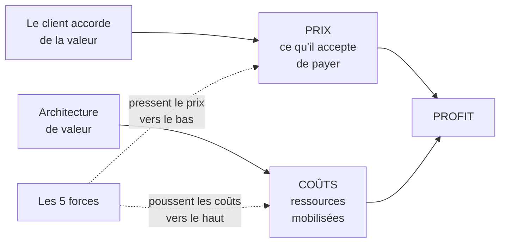
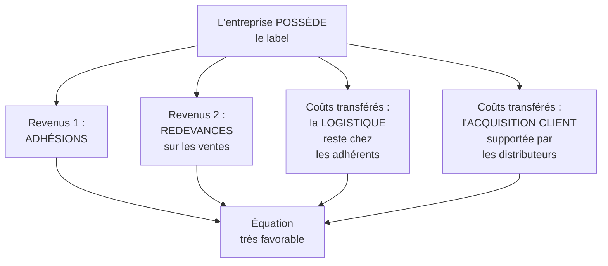

# Q22 — Qu'est-ce que l'équation de profit ?

> **La réponse en une phrase**
> La confrontation entre ce que la promesse rapporte et ce que l'architecture coûte — et son intérêt stratégique n'est pas le solde, c'est la **structure** : deux entreprises vendant la même chose peuvent gagner leur argent de façons radicalement différentes.

---

## Partie 1 — La définition du cours, décortiquée

📘 Cours BM durable, slide « **Pour une équation de profit originale** » :
> « La confrontation de la **proposition de valeur** avec l'**architecture de valeur** se traduit par une confrontation **revenus-coûts** qui dégage un **profit**. »

Décomposons.

| Élément | Ce qu'il produit | Pourquoi |
|---|---|---|
| **Proposition de valeur** | Les **revenus** | C'est ce que le client accepte de payer |
| **Architecture de valeur** | Les **coûts** | C'est ce que ça coûte de tenir la promesse |
| Leur confrontation | Le **profit** | La différence |

📘 Et l'architecture de valeur est elle-même définie : elle « décrit la production et la délivrance de la proposition de valeur à travers les ressources et compétences de l'entreprise. Il s'agit principalement de la **chaîne de valeur** et du **système de valeur**. »

⚠️ Le mot **« originale »** dans le titre de la slide est le point le plus important. Le cours ne dit pas « une équation de profit », il dit « une équation de profit **originale** ». Cela signifie que la façon de gagner de l'argent est elle-même un terrain de différenciation.

---

## Partie 2 — Le lien avec Porter

📘 Cours 2 : « L'équation fondamentale : **Profit = Prix – Coûts** ».

📘 Et l'explication : « Le **coût** est ici celui de toutes les ressources utilisées, y compris les investissements, pour entrer en concurrence ; et ces ressources sont celles qu'un secteur donné transforme pour créer de la valeur. Le **prix** reflète la valeur que les clients accordent aux produits offerts par les entreprises d'un secteur, c'est-à-dire ce qu'ils sont prêts à payer lorsqu'ils examinent leurs diverses options. »

📘 Enfin, les deux conséquences : « Si un secteur ne crée pas beaucoup de valeur pour les clients, les prix couvriront à peine les coûts. Si, au contraire, il crée beaucoup de valeur, les intervenants qui participent à chacune des cinq forces **chercheront à se l'approprier**. »



🔎 **Ce que ce schéma dit** : le profit n'est pas un résultat acquis, c'est un **espace disputé** entre deux pressions opposées. Le travail stratégique consiste à élargir cet espace ou à le protéger.

---

## Partie 3 — Les deux façons de rendre une équation originale

### Originalité par la structure des revenus

Qui paie, pour quoi, et quand ?

| Modèle | Structure des revenus |
|---|---|
| Vente classique | Le client paie le produit, une fois |
| Abonnement | Le client paie l'usage, régulièrement |
| Freemium | Une minorité paie pour la majorité |
| Commission | Le vendeur paie, pas l'acheteur |
| Location, leasing | On paie l'usage, pas la propriété |
| Adhésion + redevance | 📘 Le modèle Oncle Hansi |

🔎 Un même produit, cinq façons de le facturer, cinq modèles économiques différents. Voir [[Q26_Exemples_de_revenus_durables]].

### Originalité par la structure des coûts

Qui supporte quoi ?

📘 Le corrigé Oncle Hansi en donne un exemple remarquable : « une structure de coûts qui doit être **la plus légère possible**. Les droits de la marque sont la **propriété de l'entreprise** ; **la logistique reste à la charge des entreprises** » adhérentes.

⚠️ L'entreprise détient l'actif qui crée la valeur (le label) et **transfère** l'activité coûteuse (la logistique) à ses adhérents. C'est ça, une équation de profit originale.

---

## Partie 4 — Le cas Oncle Hansi, l'exemple du cours

📘 Le corrigé, dans son intégralité sur ce point :

> « L'équation de profit est la résultante de la confrontation de **deux flux de revenus** (les **adhésions** et les **redevances**, ces dernières devant être **limitées pour éviter la concurrence des produits commercialisés sous la marque propre du producteur**) et d'une **structure de coûts qui doit être la plus légère possible**. Les droits de la marque sont la propriété de l'entreprise ; la logistique reste à la charge des entreprises. »

📘 Et les points forts relevés : « les **clients sont des partenaires** (une petite base de clients adhère et "subventionne" le packaging), les coûts d'acquisition des clients sont donc **supportés par les distributeurs** ; il existe une **proposition de valeur unique pour des clients différents** ; **l'entreprise possède le label qui fonde la proposition de valeur**. »

### L'analyse



📘 Résultat après cinq ans : « un chiffre d'affaires de l'ordre d'un million d'euros », « une dizaine de salariés », « **170 références alimentaires et 55 références** dans les arts de la table et l'édition ».

🔎 Une dizaine de salariés pour 225 références et 24 entreprises partenaires : c'est le signe d'une structure de coûts extrêmement légère, exactement comme le dit le corrigé.

---

## Partie 5 — La contrainte cachée : la redevance est plafonnée

C'est le détail le plus fin du corrigé, et celui qui fait la différence à l'oral.

📘 « les redevances […] devant être **limitées pour éviter la concurrence des produits commercialisés sous la marque propre du producteur** ».

🔎 Traduction : chaque adhérent a une **alternative**. Il peut cesser d'utiliser le label et vendre sous sa propre marque. Le prix que le groupement peut demander est donc plafonné par la valeur que le label apporte réellement à l'adhérent.

```
Redevance                Comportement de l'adhérent

Trop basse    ▁▁▁▁       le groupement ne gagne pas assez
Optimale      ▄▄▄▄       l'adhérent y gagne, il reste
Trop élevée   ████       il part vendre sous sa propre marque
```

⚠️ **Le raisonnement à retenir** : dans un modèle qui repose sur des partenaires, la **captation de valeur est bornée par la répartition**. Capter trop détruit le modèle. Ce n'est pas de la générosité, c'est une contrainte de viabilité. Voir [[Q19_Les_quatre_dimensions_de_la_valeur]].

---

## Partie 6 — L'équation de profit en version durable

📘 Le cours BM durable : « les impacts positifs et les **externalités négatives** sont des notions liées à la création de valeur **au-delà du seul aspect économique** ».

🔎 Appliqué à l'équation : une partie des coûts réels n'apparaît **pas** dans la structure de coûts, parce qu'elle est supportée par des tiers. L'équation de profit affichée est donc partiellement fausse.

| Équation affichée | Équation réelle |
|---|---|
| Revenus − coûts comptabilisés = profit | Revenus − coûts comptabilisés − **coûts supportés par des tiers** = valeur réellement créée |

⚠️ **Internaliser une externalité, c'est faire passer un coût de la seconde ligne à la première.** Le profit affiché baisse — non pas parce qu'on a créé un coût, mais parce qu'on a cessé de le cacher.

🔎 C'est exactement pour ça que la transition vers un modèle durable coûte à court terme, et pourquoi la tension court terme / long terme existe. Voir [[Q27_Durabilite_sans_tuer_la_viabilite]].

---

## Les pièges

> [!danger] Erreurs classiques
> 1. **Réduire l'équation à « revenus moins coûts ».** L'intérêt est dans la **structure**, pas le solde.
> 2. **Oublier le mot « originale ».** 📘 C'est le titre de la slide.
> 3. **Oublier la contrainte sur la redevance.** 📘 Le corrigé insiste dessus.
> 4. **Oublier d'où viennent revenus et coûts.** Proposition de valeur → revenus ; architecture → coûts.
> 5. **Oublier les externalités.** L'équation affichée peut être partiellement fausse.

## À retenir

| | |
|---|---|
| **Définition 📘** | « La confrontation de la proposition de valeur avec l'architecture de valeur […] dégage un profit » |
| **Porter 📘** | Profit = Prix – Coûts, sous la pression des cinq forces |
| **Le mot clé 📘** | « **originale** » — la façon de gagner de l'argent est différenciante |
| **Cas 📘** | Oncle Hansi : adhésions + redevances, coûts transférés aux adhérents et distributeurs |
| **La contrainte 📘** | Les redevances « limitées pour éviter la concurrence des produits sous marque propre » |
| **Version durable** | Une partie des coûts réels est hors de l'équation : les externalités |
