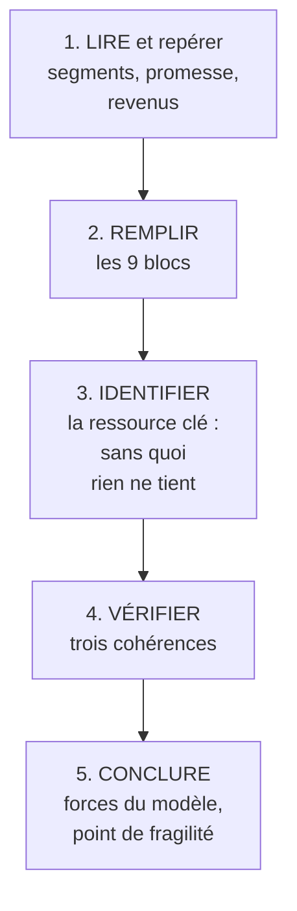

# Q23 — Comment analyser un mini-cas avec le BMC ?

> **La réponse en une phrase**
> Remplir les neuf blocs est le **début** du travail : l'analyse consiste ensuite à identifier la ressource clé, vérifier trois cohérences, et repérer le point de fragilité.

---

## Partie 1 — La méthode en cinq temps

📘 Le cours annonce d'ailleurs que « la représentation CANVAS permet d'analyser en **trois phases** le business model d'une entreprise ».

⚠️ L'étape 4 est celle qui distingue une analyse d'un remplissage. Un canvas rempli est une description ; les cohérences sont le diagnostic.

---

## Partie 2 — Les trois cohérences à vérifier

### Cohérence 1 — Promesse × Segment

**La question** : ce que nous promettons correspond-il à ce que ce segment précis valorise ?

⚠️ Une promesse excellente pour un segment peut être sans intérêt pour un autre. « Livré en 30 minutes » séduit un urbain pressé, laisse indifférent un client qui commande à l'avance.

📘 Le corrigé Oncle Hansi montre un cas remarquable : « il existe une **proposition de valeur unique pour des clients différents** ». Une seule promesse — le label alsacien — qui fonctionne à la fois pour les distributeurs, la clientèle locale et les touristes.

🔎 C'est rare et c'est un point fort majeur : cela évite de devoir maintenir plusieurs offres.

### Cohérence 2 — Promesse × Ressources et activités

**La question** : avons-nous ce qu'il faut pour tenir la promesse ?

🔎 C'est le test de **tenabilité**, celui que RCOV formalise : la proposition de valeur découle des ressources, des compétences et de l'organisation. Voir [[Q18_Le_modele_RCOV]].

⚠️ Si une promesse n'est adossée à aucune ressource clé identifiable, c'est du marketing, pas un business model.

### Cohérence 3 — Revenus × Coûts

**La question** : les flux de revenus couvrent-ils la structure de coûts, durablement ?

📘 C'est l'équation de profit : « la confrontation de la proposition de valeur avec l'architecture de valeur se traduit par une confrontation revenus-coûts qui dégage un profit ».

⚠️ Vérifiez surtout la **nature** des flux : un coût fixe et récurrent couvert par un revenu ponctuel et aléatoire est une bombe à retardement.

---

## Partie 3 — Trouver la ressource clé

C'est l'étape la plus utile et la plus rapide à faire.

**Le test** : *si je retire cet élément, le modèle s'effondre-t-il ?*

| Élément | Si on le retire | Ressource clé ? |
|---|---|---|
| Un fournisseur parmi dix | On en trouve un autre | ❌ |
| 📘 Les droits de l'œuvre de Hansi | Toute la proposition de valeur disparaît | ✅ |
| Le local commercial | On déménage | ❌ |
| Les 3 spécialistes qui portent le savoir-faire | Plus de compétence, plus de promesse | ✅ |

📘 Le corrigé Oncle Hansi le formule exactement : « **l'entreprise possède le label qui fonde la proposition de valeur** ».

🔎 Une fois la ressource clé identifiée, deux questions suivent immédiatement :
1. **Est-elle protégée ?** (contrat, propriété, difficulté d'imitation)
2. **Est-elle concentrée ?** Une ressource clé détenue par trois personnes ou un partenaire unique est un risque majeur.

---

## Partie 4 — La grille de lecture d'un mini-cas

Voici ce qu'il faut chercher dans le texte, dans l'ordre.

| Ce qu'on cherche | Indices dans le texte |
|---|---|
| **Segments** | À qui vend-on ? Y en a-t-il plusieurs types ? |
| **Proposition de valeur** | Pourquoi le client choisit-il celui-là ? |
| **Flux de revenus** | Qui paie, pour quoi, combien de fois ? |
| **Ressource clé** | Qu'est-ce qui est possédé et rare ? |
| **Coûts transférés** | Qui supporte quoi ? Un partenaire porte-t-il un coût ? |
| **Chiffres** | Effectif, CA, nombre de références : ils révèlent la structure |

🔎 La dernière ligne est souvent négligée. 📘 Oncle Hansi : « un chiffre d'affaires de l'ordre d'un million d'euros », « une dizaine de salariés », « 170 références alimentaires et 55 références dans les arts de la table ». Dix salariés pour 225 références et 24 entreprises partenaires : **le ratio dit à lui seul que la structure de coûts est très légère**. Les chiffres d'un cas ne sont jamais décoratifs.

---

## Partie 5 — Le cas Oncle Hansi, analysé de bout en bout

📘 Les faits : en 2012, Steve Risch acquiert les droits de l'œuvre de Jean-Jacques Waltz et crée une marque ombrelle regroupant **24 entreprises alsaciennes de l'agroalimentaire**, sélectionnées sur « l'antériorité dans l'utilisation de l'imagerie Hansi, l'appartenance au groupement "saveurs d'Alsace" et la position de leader sur leur marché ». Il démarche les enseignes pour installer des « corners Oncle Hansi » et crée quelques boutiques.

### Le canvas rempli

| Bloc | Contenu |
|---|---|
| **Segments** | 📘 « deux clientèles : les **distributeurs** et les **consommateurs** de produits alsaciens », ces derniers étant « une clientèle locale attachée aux produits régionaux et une clientèle touristique » |
| **Proposition de valeur** | 📘 « offrir un **label "alsacien"** […] consommation de qualité (sanctionnée par les labels), démarche **locavore**, région marquée par une **forte identité** » |
| **Canaux** | Corners en magasin, boutiques propres, projet de site de commercialisation |
| **Relations** | Adhésion à un groupement, relation contractuelle durable |
| **Revenus** | 📘 Cotisations d'adhésion + redevances sur les ventes sous label |
| **Ressources clés** | 📘 **Les droits de l'œuvre** — « l'entreprise possède le label qui fonde la proposition de valeur » |
| **Activités clés** | Gestion de la marque, sélection des adhérents, négociation avec la distribution, packaging |
| **Partenaires clés** | 24 entreprises alsaciennes ; enseignes de distribution |
| **Coûts** | 📘 « la plus légère possible » — la logistique « reste à la charge des entreprises » |

### Les trois cohérences

| Cohérence | Verdict |
|---|---|
| Promesse × segment | ✅ 📘 « proposition de valeur unique pour des clients différents » — remarquable |
| Promesse × ressources | ✅ La ressource clé (les droits) **est** la promesse |
| Revenus × coûts | ✅ Coûts très légers, deux flux de revenus récurrents |

### Le point de fragilité

⚠️ 📘 « les redevances […] devant être **limitées pour éviter la concurrence des produits commercialisés sous la marque propre du producteur** ».

🔎 Voilà la fragilité : le modèle repose entièrement sur des partenaires qui ont **une alternative**. Ils peuvent quitter le groupement et vendre sous leur propre marque. Le pouvoir de captation est donc plafonné.

Deuxième fragilité, non dite dans le corrigé mais déductible : les partenaires ont été choisis comme **leaders de leur marché**. C'est une force à l'entrée — les meilleurs sont pris — et une faiblesse ensuite, car des leaders ont d'autant plus d'alternatives.

---

## Les pièges

> [!danger] Erreurs classiques
> 1. **S'arrêter au canvas rempli.** Remplir n'est pas analyser.
> 2. **Ne pas identifier la ressource clé.** C'est l'étape la plus rentable.
> 3. **Oublier de vérifier les cohérences.** Trois tests, trois angles différents.
> 4. **Ignorer les chiffres du cas.** Ils révèlent la structure de coûts.
> 5. **Ne pas chercher le point de fragilité.** Une analyse sans risque identifié est incomplète.
> 6. **Oublier les coûts transférés.** Qui supporte quoi est souvent le cœur du modèle.

## À retenir

| | |
|---|---|
| **La méthode** | Lire → remplir → ressource clé → trois cohérences → fragilité |
| **Les 3 cohérences** | Promesse×segment, promesse×ressources, revenus×coûts |
| **Le test de la ressource clé** | Si je la retire, le modèle s'effondre-t-il ? |
| **Cas 📘** | Oncle Hansi : « possède le label qui fonde la proposition de valeur » |
| **La fragilité type** | Un modèle dont les partenaires ont une alternative |
