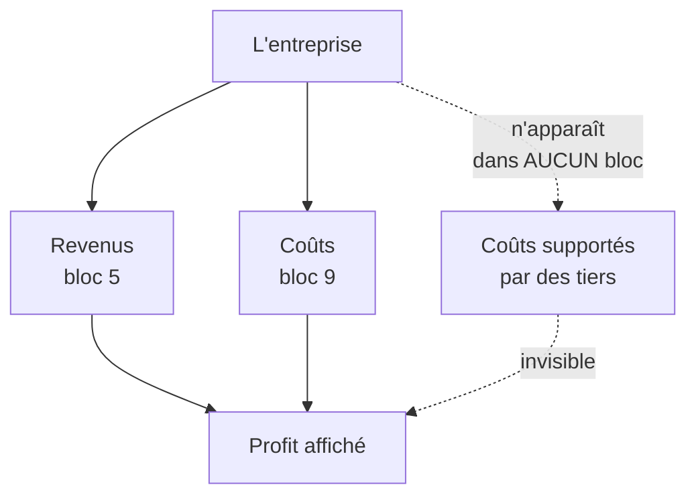
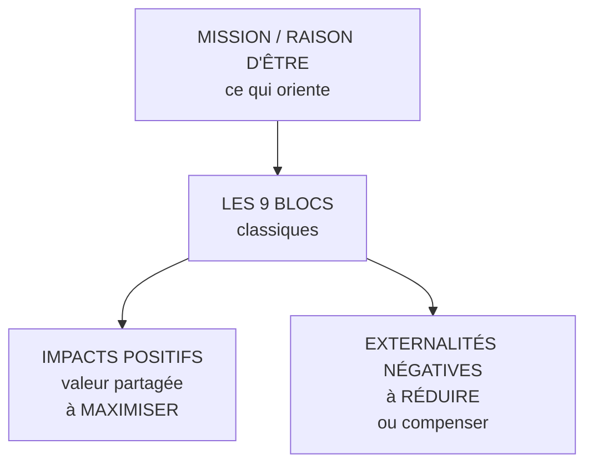

# Q24 — Qu'ajoute le BMC durable au BMC classique ?

> **La réponse en une phrase**
> Trois choses : une **mission** au-dessus (qui oriente), des **impacts positifs** et des **externalités négatives** en dessous (qui mesurent) — autrement dit une ligne de direction et une ligne de conséquence que le canvas classique n'a pas.

---

## Partie 1 — Le problème que ça corrige

📘 Le cours reconnaît lui-même les limites du BMC classique : « il se focalise essentiellement sur le **fonctionnement interne** de l'entreprise, en négligeant la concurrence, et il reste essentiellement **statique** ».

🔎 Mais il y a une quatrième lacune, plus profonde, que le BMC durable vient combler : **dans un canvas classique, un coût supporté par un tiers n'apparaît nulle part**.

Ni dans la structure de coûts — vous ne le payez pas. Ni ailleurs — aucun bloc ne s'y intéresse.

⚠️ **Le canvas classique n'est pas seulement incomplet : il rend invisible ce que la durabilité cherche à rendre visible.** C'est une lacune structurelle, pas un oubli.

---

## Partie 2 — Ce que le cours ajoute, littéralement

📘 Slide « BMC durable » : « Dans le cadre du Business Model Canvas (BMC), les **impacts positifs** et les **externalités négatives** sont des notions liées à la création de valeur **au-delà du seul aspect économique**. Une entreprise responsable cherche à :
> - **Maximiser les impacts positifs** (valeur partagée),
> - **Réduire ou compenser les externalités négatives** (via l'innovation, la réglementation interne, ou la compensation carbone par exemple). »

📘 Et le document « La métamorphose du Business Model Canvas » ajoute un bloc absent du canvas classique : la **Raison d'être**, dont la version durable est « intégration d'une **mission** centrée sur l'impact environnemental et social positif ».

### Les trois ajouts

| Ajout | Position | Fonction |
|---|---|---|
| **Mission / raison d'être** | Au-dessus | Oriente tous les blocs |
| **Impacts positifs** | En dessous | Mesure ce que l'on apporte au-delà du profit |
| **Externalités négatives** | En dessous | Rend visible ce que l'on fait subir |

---

## Partie 3 — Pourquoi la mission est en haut et non dans un bloc

C'est un point de logique qui vaut d'être expliqué.

📘 La version traditionnelle de la raison d'être est décrite comme « orientée principalement vers la **profitabilité** sans intégration explicite de considérations environnementales ou sociales ».

🔎 Dans un canvas classique, la raison d'être est implicite : gagner de l'argent. Elle n'a pas besoin d'un bloc parce qu'elle va de soi.

Dès qu'on ajoute d'autres finalités, il faut les **expliciter**, sinon la finalité implicite reprend le dessus à chaque arbitrage. C'est pour ça que la mission remonte au-dessus du canvas : elle est le **critère d'arbitrage** quand deux blocs entrent en conflit.

⚠️ Exemple concret : le bloc Canaux dit « massifier pour réduire les coûts », le bloc Propositions de valeur dit « minimiser l'impact ». Sans mission explicite, c'est le coût qui gagne. Avec elle, l'arbitrage est cadré à l'avance.

---

## Partie 4 — Impacts positifs et externalités négatives, en détail

### Les impacts positifs — « valeur partagée »

📘 Le terme exact du cours est « valeur partagée ».

🔎 Il ne s'agit pas de philanthropie : il s'agit de valeur créée **pour d'autres que vos actionnaires**, et qui revient en partie vers vous.

| Impact positif | Bénéficiaire | Retour pour l'entreprise |
|---|---|---|
| Formation de la filière amont | Fournisseurs | Qualité et fiabilité de l'approvisionnement |
| Emplois locaux qualifiés | Territoire | Bassin de compétences, ancrage |
| Service accessible à tous | Publics fragiles | Marché élargi, conformité anticipée |
| Filière de recyclage montée avec d'autres | Le secteur | Sécurisation de l'accès à la matière |

### Les externalités négatives

**Définition en clair** : un coût réel, supporté par un tiers, absent de vos comptes.

📘 Le cours donne trois moyens de traitement : « via l'**innovation**, la **réglementation interne**, ou la **compensation carbone** par exemple ».

⚠️ Et l'ordre du verbe compte : « **réduire ou compenser** ». Réduire d'abord. Compenser n'est pas équivalent — c'est le second choix, quand la réduction n'est pas possible.

| Moyen 📘 | Ce que c'est | Qualité |
|---|---|---|
| **Innovation** | Concevoir autrement pour que l'externalité n'existe pas | La meilleure |
| **Réglementation interne** | Se donner des règles plus strictes que la loi | Bonne |
| **Compensation** | Payer ailleurs pour ce qu'on émet ici | La moins bonne |

🔎 Une entreprise qui ne fait que compenser sans jamais réduire est à la limite du greenwashing. Voir [[Q25_Ou_se_cachent_les_externalites_negatives]].

---

## Partie 5 — L'effet sur l'équation de profit

C'est la conséquence économique, et il faut la nommer.

| | Équation affichée | Équation réelle |
|---|---|---|
| Formule | Revenus − coûts comptabilisés | Revenus − coûts comptabilisés − coûts supportés par des tiers |
| Ce qu'elle mesure | Le profit | La valeur nette réellement créée |

⚠️ **Internaliser une externalité fait baisser le profit affiché.** Non pas parce qu'on a créé un coût, mais parce qu'on a cessé de le faire porter par quelqu'un d'autre.

🔎 C'est exactement la source de la tension court terme / long terme : le coût devient visible immédiatement, le bénéfice — réputation, conformité anticipée, risque évité — arrive plus tard. Voir [[Q27_Durabilite_sans_tuer_la_viabilite]].

---

## Partie 6 — Exemple complet

**L'entreprise.** Une société genevoise de nettoyage de bureaux, 70 salariés.

### Canvas classique — ce qui apparaît

| Bloc | Contenu |
|---|---|
| Segments | Immeubles de bureaux, régies |
| Proposition de valeur | Prestation fiable au meilleur prix du marché |
| Revenus | Contrats mensuels au m² |
| Structure de coûts | Salaires, produits, transport |

🔎 Ce canvas est cohérent et rentable.

### Ce que le BMC durable fait apparaître

| Élément ajouté | Contenu |
|---|---|
| **Mission** | « Un nettoyage professionnel qui ne se paie ni sur la santé de nos équipes ni sur l'eau » |
| **Impacts positifs** | Emplois stables non délocalisables ; formation qualifiante ; horaires de jour |
| **Externalité 1** | Horaires de nuit fractionnés : coût supporté par les salariés (santé, vie familiale) |
| **Externalité 2** | Produits chimiques rejetés : coût supporté par le réseau d'eau |
| **Externalité 3** | Déplacements en voiture sur des sites dispersés : coût supporté par l'atmosphère |

### Le traitement, dans l'ordre du cours

| Externalité | Moyen 📘 | Décision |
|---|---|---|
| Horaires de nuit | **Réglementation interne** | Nettoyage de jour négocié avec les clients ; horaires continus |
| Produits chimiques | **Innovation** | Passage à des produits certifiés et au nettoyage vapeur |
| Déplacements | **Innovation** puis compensation | Regroupement géographique des contrats ; véhicules électriques ; le résiduel est compensé |

### L'effet sur l'équation

⚠️ Le nettoyage de jour est **plus cher** — il faut renégocier avec chaque client. Les produits certifiés coûtent plus. La marge affichée baisse la première année.

🔎 Mais trois choses apparaissent que le canvas classique ne montrait pas :
1. Le turnover baisse fortement, donc les coûts de recrutement et de formation aussi.
2. L'entreprise devient éligible aux marchés publics à critères sociaux et environnementaux.
3. Elle est en avance sur une réglementation qui se durcit.

**Ces trois retours sont différés.** C'est pour ça qu'ils sont invisibles dans un modèle statique, et c'est pour ça que la mission doit être explicite : sans elle, la décision de la première année ne se prend pas.

---

## Les pièges

> [!danger] Erreurs classiques
> 1. **Oublier la mission.** 📘 C'est le premier bloc du document de métamorphose.
> 2. **Traiter compensation et réduction comme équivalentes.** 📘 « Réduire **ou** compenser » — dans cet ordre.
> 3. **Oublier les impacts positifs.** Le modèle ajoute deux lignes, pas une.
> 4. **Ne pas dire où se cachent les externalités.** Nulle part dans le canvas classique — c'est le problème.
> 5. **Oublier l'effet sur l'équation de profit.** Internaliser fait baisser le profit affiché.

## À retenir

| | |
|---|---|
| **Les trois ajouts 📘** | Mission / raison d'être ; impacts positifs (valeur partagée) ; externalités négatives |
| **Le verbe 📘** | « Maximiser » les impacts positifs, « réduire **ou** compenser » les externalités |
| **Les trois moyens 📘** | Innovation, réglementation interne, compensation carbone |
| **Pourquoi la mission est au-dessus** | Elle est le critère d'arbitrage entre blocs en conflit |
| **La conséquence** | Internaliser fait baisser le profit affiché, pas la valeur réelle |
