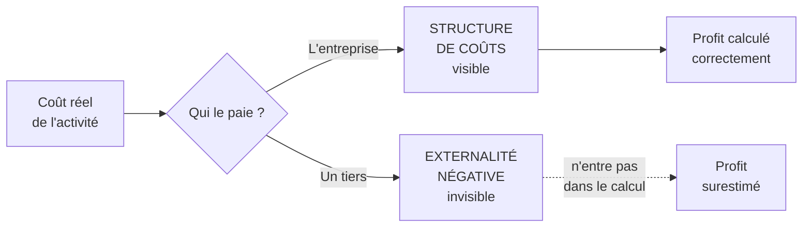

# Q25 — Où se cachent les externalités négatives dans un business model ?

> **La réponse en une phrase**
> Dans la **structure de coûts** — mais par leur **absence** : ce sont précisément les coûts qui devraient y figurer et qui n'y sont pas, parce que quelqu'un d'autre les paie.

---

## Partie 1 — Le paradoxe du lieu

La question dit « où se cachent ». Le mot est bien choisi, et il faut le prendre au sérieux.

🔎 Une externalité négative ne se cache pas dans un bloc au sens où elle y serait écrite en petit. **Elle se cache dans un bloc au sens où elle devrait y être et n'y est pas.** C'est une absence, pas une présence discrète.

⚠️ **La conséquence** : le profit affiché est partiellement une **illusion comptable**. Une part vient de coûts que d'autres paient à votre place.

---

## Partie 2 — La définition, avec les mots du cours

📘 Cours BM durable : « les **impacts positifs** et les **externalités négatives** sont des notions liées à la création de valeur **au-delà du seul aspect économique**. Une entreprise responsable cherche à : maximiser les impacts positifs (valeur partagée), **réduire ou compenser les externalités négatives** (via l'innovation, la réglementation interne, ou la compensation carbone par exemple). »

**Définition en clair** : une externalité négative est un **coût réel, supporté par un tiers, absent de vos comptes**.

Les trois conditions sont cumulatives :

| Condition | Si elle manque |
|---|---|
| C'est un **coût réel** | Sinon c'est un fantasme, pas une externalité |
| Il est supporté par un **tiers** | Si vous le payez, c'est un coût ordinaire |
| Il est **absent de vos comptes** | S'il y figure, il est internalisé |

---

## Partie 3 — La méthode de détection : les cinq questions

Plutôt que de chercher dans un bloc, on interroge chaque bloc avec la même question : **qui d'autre paie ?**

| Bloc du BMC | Question à poser | Externalité typique |
|---|---|---|
| **Ressources clés** | D'où viennent nos matières et à quel coût pour d'autres ? | Extraction, déforestation, épuisement d'une ressource |
| **Activités clés** | Que produisons-nous d'autre que notre produit ? | Émissions, rejets, déchets, nuisances |
| **Partenaires clés** | Que leur faisons-nous supporter ? | Conditions de travail chez le sous-traitant, marges comprimées |
| **Canaux** | Que coûte l'acheminement, et à qui ? | Transport, emballages, dernier kilomètre |
| **Segments et relations** | Qui excluons-nous, et que leur en coûte-t-il ? | Exclusion numérique, temps perdu, perte d'accès |
| **Flux de revenus** | Notre modèle repose-t-il sur un usage qu'on ne devrait pas encourager ? | Économie de l'attention, obsolescence, surconsommation |
| **Structure de coûts** | Quels coûts réels n'y figurent pas ? | ⬅️ **La synthèse de tout ce qui précède** |

🔎 Le dernier bloc n'est pas une catégorie de plus : c'est **là que toutes les réponses précédentes auraient dû atterrir**. D'où la formule : les externalités se cachent dans la structure de coûts, par leur absence.

---

## Partie 4 — Les quatre familles d'externalités

| Famille | Qui paie | Exemple |
|---|---|---|
| **Environnementale** | L'écosystème, la collectivité | Émissions, eau, déchets, biodiversité |
| **Sociale, en amont** | Les travailleurs de la chaîne | 📘 « conditions de travail, équité » dans la définition de la chaîne de valeur durable |
| **Sociale, en aval** | Les clients exclus ou lésés | Exclusion numérique, temps d'accès, économie de l'attention |
| **Temporelle** | Les générations futures | Ressources non renouvelables, dette écologique |

⚠️ Les deux familles sociales sont les plus souvent oubliées, alors que 📘 la définition du cours les nomme explicitement : la chaîne de valeur durable intègre « **Sociales** : conditions de travail, équité, impact sur les communautés locales ».

🔎 Et l'exclusion en aval est parfaitement documentée dans votre cours par le cas SilverDigital : **+15 % de marge opérationnelle**, **−20 % de coûts de support** — et **−12 % de clients de plus de 65 ans**. La marge gagnée et le coût supporté par les clients âgés sont **la même opération vue des deux côtés**. Voir [[Q50_Lexclusion_indirecte]].

---

## Partie 5 — Le test décisif

🔎 Voici le test qui identifie une externalité à coup sûr :

> **Si nous devions payer ce coût nous-mêmes, notre modèle serait-il encore rentable ?**

| Réponse | Ce que ça révèle |
|---|---|
| Oui, largement | L'externalité est marginale, l'internaliser est facile |
| Oui, mais la marge se réduit | Il faut un plan de transition |
| **Non** | ⚠️ **Le modèle est rentable *parce que* l'externalité est cachée** |

⚠️ Le troisième cas est le plus important à savoir nommer. Il signifie que la rentabilité n'est pas due à une performance, mais à un **transfert de coût**. Ces modèles sont ceux que la réglementation finit par emporter.

🔎 Et c'est précisément là que la sixième force de Porter intervient : seul l'État peut imposer l'internalisation à tous en même temps, ce qui évite que le premier à le faire soit pénalisé. Voir [[Q08_La_sixieme_force_de_Porter]].

---

## Partie 6 — Exemple complet

**L'entreprise.** Une marque suisse de vêtements techniques, 45 salariés, production sous-traitée en Asie.

### Le canvas classique

| Bloc | Contenu |
|---|---|
| Proposition de valeur | Vêtements techniques performants à prix accessible |
| Ressources clés | Marque, design, réseau de distribution |
| Partenaires clés | Trois usines partenaires |
| Structure de coûts | Achat des produits finis, marketing, logistique, salaires en Suisse |

### Les cinq questions appliquées

| Bloc interrogé | Externalité identifiée | Qui paie |
|---|---|---|
| Ressources clés | Fibres synthétiques issues du pétrole ; microplastiques relâchés au lavage | L'écosystème |
| Activités clés | Teinture et traitements chimiques | Les cours d'eau locaux |
| Partenaires clés | Conditions de travail non auditées ; heures supplémentaires | Les travailleurs |
| Canaux | Fret aérien pour les réassorts urgents | L'atmosphère |
| Flux de revenus | Deux collections par an incitant au renouvellement | La collectivité (déchets textiles) |

### Le test décisif appliqué

| Externalité | Si on l'internalisait | Verdict |
|---|---|---|
| Fret aérien | Passage au maritime : +3 semaines de délai, coût moindre | ✅ Facile, et même économique |
| Traitements chimiques | Procédés certifiés : +8 % sur le coût produit | ⚠️ Marge réduite, plan de transition nécessaire |
| Conditions de travail | Audits + hausse des salaires : +15 % sur le coût produit | ⚠️ Réduit fortement la marge |
| Renouvellement à deux collections | Passage à une collection durable | ❌ **Réduit le volume de ventes** |

🔎 La dernière ligne révèle la structure profonde : le modèle est rentable **parce que** le rythme de renouvellement est élevé. Internaliser cette externalité-là ne réduit pas une marge, cela remet en cause le business model lui-même.

⚠️ **Conclusion stratégique** : c'est là que le BM durable exige de **créer de nouveaux revenus** pour remplacer ceux que la durabilité supprime — réparation, location, seconde main. Sinon la transformation est suicidaire. Voir [[Q26_Exemples_de_revenus_durables]] et [[Q27_Durabilite_sans_tuer_la_viabilite]].

---

## Les pièges

> [!danger] Erreurs classiques
> 1. **Chercher les externalités comme une ligne écrite quelque part.** Elles sont une absence.
> 2. **Ne penser qu'à l'environnement.** 📘 Les dimensions sociales sont dans la définition du cours.
> 3. **Oublier l'exclusion en aval.** Le cas SilverDigital en est l'illustration.
> 4. **Confondre réduire et compenser.** 📘 L'ordre du cours est « réduire ou compenser ».
> 5. **Ne pas faire le test décisif.** Il distingue une marge à ajuster d'un modèle à refonder.

## À retenir

| | |
|---|---|
| **Où** | Dans la structure de coûts, **par leur absence** |
| **Définition** | Coût réel + supporté par un tiers + absent des comptes |
| **La méthode** | Interroger chaque bloc : qui d'autre paie ? |
| **Les 4 familles** | Environnementale, sociale amont, sociale aval, temporelle |
| **Le test décisif** | Si nous payions ce coût, le modèle serait-il encore rentable ? |
| **Traitement 📘** | Réduire (innovation, règles internes) **ou** compenser |
