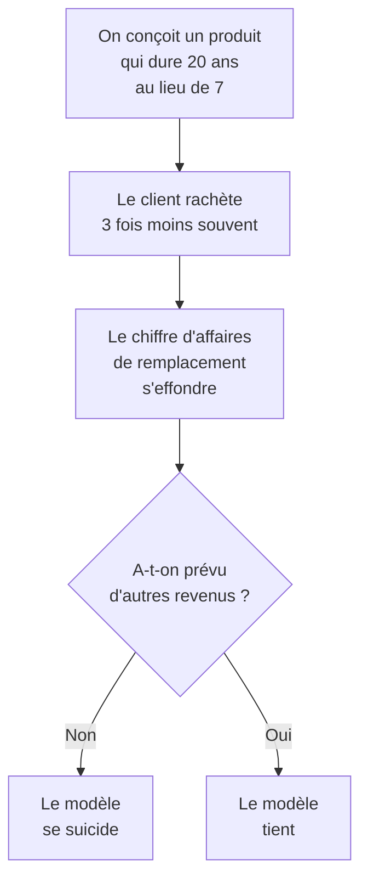

# Q26 — Donnez des exemples de revenus durables

> **La réponse en une phrase**
> Des revenus qui ne dépendent pas de la **fréquence de remplacement** — leasing, réemploi, services, économie circulaire — et il faut comprendre pourquoi ils sont *nécessaires* avant de les citer.

---

## Partie 1 — Le problème auquel ils répondent

C'est le raisonnement le plus important de cette fiche, et il faut l'exposer avant toute liste.

### Le piège de la durabilité pour le modèle économique

🔎 **Le paradoxe** : dans un modèle de vente classique, la durabilité du produit est **contraire à l'intérêt du vendeur**. Si vous vendez des ampoules, votre intérêt commercial est qu'elles grillent.

⚠️ Ce n'est pas une question de moralité des dirigeants. C'est une **structure d'incitation**. Tant que le revenu vient du remplacement, aucune entreprise ne peut rationnellement allonger la durée de vie de ses produits.

**Conclusion** : un business model durable ne peut pas se contenter de verdir le produit. Il doit changer **d'où vient l'argent**.

---

## Partie 2 — Le principe : vendre l'usage, pas l'objet

🔎 Le retournement fondamental : si vous vendez de la **lumière** au lieu d'**ampoules**, votre intérêt devient exactement inverse. Vous gagnez plus quand vos ampoules durent longtemps, puisque vous payez le remplacement.

| Vous vendez | Votre intérêt est que le produit | Effet sur la durabilité |
|---|---|---|
| L'objet | Se remplace vite | ❌ Contraire |
| L'usage | Dure longtemps | ✅ Aligné |

⚠️ C'est ce qu'on appelle l'**alignement des intérêts**. C'est le critère le plus solide pour juger un modèle durable : ne demandez pas si l'entreprise est bien intentionnée, demandez si son intérêt économique va dans le bon sens.

📚 *Complément hors cours* : ce type de modèle porte le nom d'« économie de la fonctionnalité ». Le terme n'est pas dans vos slides ; présentez-le comme un apport.

---

## Partie 3 — Les six familles de revenus durables

| Famille | Mécanisme | Ce que ça remplace |
|---|---|---|
| **Location, leasing** | Le client paie l'usage périodique, l'entreprise garde la propriété | La vente unitaire |
| **Abonnement de service** | Maintenance, mise à jour, support inclus | Le remplacement pour panne |
| **Réparation** | Prestation facturée sur un produit existant | La vente d'un neuf |
| **Reconditionnement et seconde main** | Reprise, remise en état, revente | Rien — c'est un revenu nouveau |
| **Pièces détachées et consommables** | Revenu récurrent lié à un parc installé | Une part du remplacement |
| **Valorisation de la matière** | Revente de la matière récupérée en fin de vie | Rien — c'est un revenu nouveau |

📘 Ces familles s'ancrent directement dans le cours 5, qui définit l'économie circulaire des appareils numériques comme « l'extension de la vie utile […] par le biais d'une amélioration de la fabrication et de la **réutilisation**, une **minimisation du besoin de nouveaux appareils** et des déchets électroniques ».

🔎 Notez que « minimisation du besoin de nouveaux appareils » est exactement ce qui détruit le revenu classique. Le cours pose donc le problème sans le nommer : il faut bien que l'argent vienne d'ailleurs.

---

## Partie 4 — Ce que le cours en dit dans le BMC durable

📘 Document « La métamorphose du Business Model Canvas », colonne Nouvelles Pratiques DD :
> « Innovation dans le **recyclage**, l'**économie circulaire**, et la **valorisation des déchets**. »

📘 Et pour les canaux : « Optimisation des chaînes logistiques pour réduire l'empreinte carbone et **maximiser l'utilisation des ressources locales**. »

📘 Et pour les relations clients : « Mise en place de programmes de **fidélité** et de sensibilisation pour renforcer l'engagement envers les initiatives durables. »

🔎 La ligne « fidélité » est intéressante ici : un programme de fidélité transforme une relation transactionnelle en relation continue. C'est déjà un pas vers un revenu récurrent.

---

## Partie 5 — Les conditions de viabilité

⚠️ Ces revenus ne fonctionnent pas automatiquement. Il faut quatre conditions.

| Condition | Pourquoi |
|---|---|
| **Le produit doit avoir été éco-conçu** | On ne peut pas louer ni reconditionner un objet non réparable. Voir [[Q16_Ou_agir_pour_reduire_lempreinte_carbone]] |
| **La logistique de retour doit exister** | Un produit repris est un produit qu'il faut récupérer, trier, transporter |
| **Le besoin en trésorerie change** | En leasing, vous financez le produit et vous êtes payé sur des années |
| **Les compétences changent** | Réparer et reconditionner n'est pas fabriquer |

🔎 La troisième condition est la plus sous-estimée. Passer de la vente à la location **inverse le flux de trésorerie** : vous payez tout de suite, vous encaissez lentement. Beaucoup de transitions échouent là, pas sur l'idée.

⚠️ Et la deuxième condition explique pourquoi les partenariats sont nécessaires : une entreprise seule n'a pas le volume pour rentabiliser une filière de retour. Voir [[Q17_La_coopetition]].

---

## Partie 6 — Exemple complet

**L'entreprise.** Un fabricant suisse de mobilier de bureau, 80 personnes. Modèle actuel : vente, renouvellement client tous les 7 ans.

### Le point de départ du problème

L'entreprise veut concevoir un mobilier qui dure 25 ans. Bonne nouvelle écologique, catastrophe commerciale : le cycle de rachat passe de 7 à 25 ans, soit **un chiffre d'affaires de remplacement divisé par plus de trois**.

### La reconstruction des revenus

| Nouveau flux | Mécanisme | Effet sur la trésorerie |
|---|---|---|
| **Location longue durée** | Le client paie un montant mensuel par poste de travail | Investissement initial élevé, revenus étalés |
| **Contrat de reconfiguration** | Un bureau se transforme au lieu d'être remplacé quand l'entreprise change d'organisation | Revenu ponctuel récurrent |
| **Reprise et reconditionnement** | Rachat du mobilier en fin de contrat, remise en état, revente à un autre segment | Revenu nouveau, marge élevée |
| **Pièces détachées garanties 15 ans** | Vente directe ou via un réseau | Revenu à long terme sur le parc installé |
| **Valorisation matière** | Bois et métal revendus quand plus rien n'est réutilisable | Marginal mais réel |

### Le tableau avant / après

| | Modèle vente | Modèle durable |
|---|---|---|
| Nature des revenus | Ponctuels, tous les 7 ans | Récurrents, mensuels + ponctuels |
| Prévisibilité | Faible | Élevée |
| Trésorerie initiale | Favorable | ⚠️ Défavorable |
| Intérêt de l'entreprise | Que le meuble s'use | **Que le meuble dure** |
| Relation client | Transactionnelle | Continue |
| Nouveau segment accessible | — | Marchés publics à critères responsables |

🔎 Regardez la ligne « intérêt de l'entreprise ». C'est le test décisif : dans la colonne de droite, l'entreprise **perd de l'argent** si le meuble casse, puisque c'est elle qui le répare. Elle a donc une raison économique de bien le concevoir.

⚠️ Et regardez la ligne trésorerie : c'est la vraie difficulté de la transition, et c'est ce qu'il faut savoir nommer à l'oral. Ce n'est pas un problème de conviction, c'est un problème de financement du décalage.

---

## Partie 7 — Le lien avec l'équation de profit

📘 Rappel : « **Pour une équation de profit originale.** La confrontation de la proposition de valeur avec l'architecture de valeur se traduit par une confrontation revenus-coûts qui dégage un profit. »

🔎 Les revenus durables sont précisément une manière de rendre l'équation **originale** : deux entreprises vendant le même mobilier peuvent avoir des équations de profit incomparables, l'une fondée sur le volume de ventes, l'autre sur la durée de la relation.

Voir [[Q22_Lequation_de_profit]].

---

## Les pièges

> [!danger] Erreurs classiques
> 1. **Donner une liste sans expliquer le problème.** Le point de départ est que la durabilité détruit le revenu de remplacement.
> 2. **Oublier l'alignement des intérêts.** C'est le critère de qualité d'un modèle durable.
> 3. **Oublier la contrainte de trésorerie.** Le leasing inverse le flux de trésorerie.
> 4. **Oublier la condition d'éco-conception.** On ne loue pas un produit non réparable.
> 5. **Présenter l'économie de la fonctionnalité comme du cours.** 📚 Le terme n'y figure pas.

## À retenir

| | |
|---|---|
| **Le problème** | Un produit durable se vend moins souvent : il faut d'autres revenus |
| **Le principe** | Vendre l'usage, pas l'objet — cela aligne les intérêts |
| **Les six familles** | Location/leasing, abonnement de service, réparation, reconditionnement, pièces détachées, valorisation matière |
| **Ancrage 📘** | « Innovation dans le recyclage, l'économie circulaire, et la valorisation des déchets » |
| **Les 4 conditions** | Éco-conception, logistique de retour, trésorerie, compétences |
| **Le test** | L'entreprise gagne-t-elle quand le produit dure ? |
