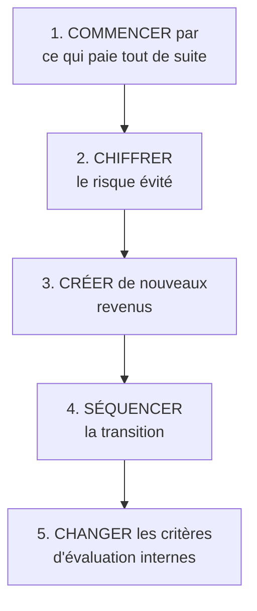

# Q27 — Comment intégrer la durabilité sans tuer la viabilité économique ?

> **La réponse en une phrase**
> En reformulant le dilemme : ce n'est pas *rentabilité contre durabilité*, c'est **rentabilité de court terme contre rentabilité de long terme** — et on résout un décalage temporel par un séquençage, pas par un renoncement.

---

## Partie 1 — Poser correctement le problème

### Ce que le problème n'est pas

⚠️ Le problème n'est **pas** que la durabilité coûte. Beaucoup d'actions durables rapportent immédiatement : moins d'énergie consommée, moins de déchets, matériel qui dure plus longtemps.

### Ce que le problème est réellement

🔎 Le problème est que **le coût et le bénéfice ne tombent pas au même moment**, alors que les mécanismes de décision d'une entreprise sont calés sur l'exercice annuel.

```
Coûts et bénéfices dans le temps

Année 0   ████████████████ COÛT investissement, formation, certification
Année 1   ████████         coût résiduel
Année 2   ███              ▲ premiers bénéfices
Année 3   ▲▲▲▲▲            réputation, conformité, risque évité
Année 5   ▲▲▲▲▲▲▲▲▲▲       avantage concurrentiel installé

                          ↑
        L'horizon de décision s'arrête ici
```

⚠️ Le décideur n'est pas myope par bêtise : il est **évalué sur l'année**. Sur son horizon, le calcul est défavorable, même s'il est favorable sur dix ans. Voir [[Q02_Objectif_vs_strategie]].

---

## Partie 2 — Où le cours place ce problème : l'acceptabilité

📘 Le cours 1, grille SAF : « **Acceptabilité.** Cette partie du test porte sur l'attractivité de la stratégie proposée auprès des parties prenantes, en prenant en compte leurs intérêts et pouvoirs d'influence, et en soulevant les questions suivantes : Le **retour attendu** est-il acceptable ? Le niveau de **risque** est-il acceptable ? Les parties prenantes vont-elles **s'opposer** à la stratégie ? »

🔎 Une stratégie durable est presque toujours **souhaitable** et souvent **faisable**. Elle échoue sur l'**acceptabilité**. Nommer cela avec le vocabulaire du cours vaut des points : vous ne décrivez pas une difficulté vague, vous identifiez précisément le critère du SAF qui bloque. Voir [[Q05_La_grille_SAF]].

---

## Partie 3 — Les cinq leviers, du plus simple au plus profond



### Levier 1 — Commencer par ce qui paie immédiatement

| Action | Retour |
|---|---|
| Allonger la durée de vie du parc IT de 2 à 5 ans | Immédiat et important |
| Réduire la consommation énergétique | Immédiat |
| Réduire les rebuts et les invendus | Immédiat |
| 📘 « Acheter moins (avant l'appel d'offres) » | Immédiat |

🔎 **Ces actions autofinancent les suivantes.** C'est le levier le plus efficace et le moins utilisé, parce qu'il n'est pas spectaculaire.

### Levier 2 — Chiffrer le risque évité, pas seulement le gain espéré

Un décideur compare un coût certain à un bénéfice incertain. Renversez la comparaison : comparez un coût maîtrisé aujourd'hui à un coût subi demain.

📘 Les trajectoires réglementaires sont connues : AI Act entré en vigueur le **1er août 2024** ; European Accessibility Act en **juin 2025** ; « **Vers une accessibilité numérique obligatoire pour le secteur privé** ».

⚠️ Formulation à utiliser : « la mise en conformité arrivera. La seule question est de savoir si elle sera **anticipée ou subie**. » Une mise en conformité subie coûte plus cher, se fait dans l'urgence, et sans bénéfice d'image.

### Levier 3 — Créer de nouveaux revenus

Voir [[Q26_Exemples_de_revenus_durables]]. C'est indispensable dès que la durabilité réduit la fréquence de remplacement.

### Levier 4 — Séquencer

⚠️ On ne transforme pas neuf blocs du canvas en un an. 📘 Le cours durabilité demande d'ailleurs « **2 actions concrètes** », pas dix.

| Phase | Contenu | Financement |
|---|---|---|
| Phase 1 (0-12 mois) | Actions à retour immédiat + mesure | Autofinancée |
| Phase 2 (12-30 mois) | Éco-conception, critères d'achat, formation | Financée par la phase 1 |
| Phase 3 (30 mois et +) | Nouveaux revenus, transformation du modèle | Financée par les phases 1 et 2 |

### Levier 5 — Changer les critères d'évaluation internes

🔎 C'est le levier le plus profond, et le seul qui rende la transformation durable.

⚠️ **Une organisation fait ce sur quoi elle est évaluée, pas ce qu'elle annonce.** Tant que l'acheteur est jugé sur le prix d'acquisition et le manager sur l'exercice annuel, la stratégie durable s'arrête à leur porte.

📘 Le cours 5 donne l'antidote côté achats : « Fixer des critères pour les achats (ex : critères TCO) », et le principe des « **coûts du cycle de vie** (prix d'achat, coût de fonctionnement, coût de l'élimination) ».

🔎 Passer du prix d'achat au coût du cycle de vie change mécaniquement la décision, sans avoir besoin de convaincre qui que ce soit. Voir [[Q54_Le_cout_du_cycle_de_vie]].

---

## Partie 4 — La reformulation qui débloque

C'est le point à retenir absolument.

| Formulation qui bloque | Formulation qui débloque |
|---|---|
| « Rentabilité **contre** durabilité » | « Rentabilité de **court terme** contre rentabilité de **long terme** » |
| « Un coût supplémentaire » | « Un coût que nous payions déjà, mais que d'autres supportaient » |
| « Un investissement écologique » | « Une réduction de notre exposition au risque réglementaire et matériel » |
| « Faire notre part » | « Accéder à des marchés dont les critères se durcissent » |

🔎 Pourquoi la deuxième ligne est juste : 📘 internaliser une externalité, ce n'est pas créer un coût, c'est **cesser de le faire porter par quelqu'un d'autre**. Le coût existait déjà. Voir [[Q25_Ou_se_cachent_les_externalites_negatives]].

⚠️ Ce n'est pas un artifice rhétorique : c'est économiquement exact, et c'est ce qui rend la reformulation défendable.

---

## Partie 5 — Ce qu'il faut assumer honnêtement

Une réponse complète ne prétend pas que tout se concilie.

| Ce qu'il faut assumer | Pourquoi |
|---|---|
| **Le désavantage temporaire** | Vos concurrents qui n'internalisent pas restent moins chers, tant que la loi ne les y oblige pas |
| **La contrainte de trésorerie** | Passer de la vente à la location inverse le flux de trésorerie |
| **La perte de certains segments** | Le client purement au prix ne vous suivra pas |
| **Le temps de montée en compétence** | Éco-conception et accessibilité sont des métiers |

🔎 Et c'est ici que la sixième force de Porter reprend son rôle : seul l'État peut égaliser les conditions en imposant la même règle à tous. 📘 Le cours le dit à propos du numérique : « **C'est l'État qui doit agir sur l'entreprise.** » Voir [[Q08_La_sixieme_force_de_Porter]].

---

## Partie 6 — Exemple complet

**L'entreprise.** Une imprimerie genevoise, 35 salariés, marge nette de 4 %.

### Phase 1 — Autofinancement (0-12 mois)

| Action | Coût | Retour |
|---|---|---|
| Réduction des gâches de production | Faible | Immédiat, matière économisée |
| Passage du parc IT de 3 à 6 ans | Nul | Immédiat |
| Éclairage et chauffage pilotés | 12 000 CHF | 18 mois |
| Mise en place de deux indicateurs (intensité + absolu) | Faible | Rend le reste pilotable |

**Résultat** : marge préservée, environ 25 000 CHF dégagés sur l'année.

### Phase 2 — Financée par la phase 1 (12-30 mois)

| Action | Coût | Retour |
|---|---|---|
| Certification environnementale | 25 000 CHF | Accès aux marchés publics à critères |
| Papiers certifiés et encres végétales | +6 % sur le coût matière | Différenciation |
| Formation de deux personnes | 8 000 CHF | Compétence interne |

⚠️ La hausse de 6 % sur la matière est le vrai point de friction. Elle est absorbée parce que la phase 1 a dégagé de la marge — et **seulement pour cette raison**.

### Phase 3 — Transformation (30 mois et +)

| Action | Effet |
|---|---|
| Offre « impression responsable » avec bilan carbone par commande | Nouveau segment |
| Candidature systématique aux marchés publics à critères | Nouveau flux de revenus |
| Service de conseil en éco-conception documentaire | Revenu de service, marge élevée |

### Le changement de critères internes

| Critère avant | Critère après |
|---|---|
| L'acheteur est jugé sur le prix d'achat | 📘 Sur le **coût du cycle de vie** |
| Le tableau de bord contient la marge | Marge **plus** tonnes CO₂ totales **plus** taux de gâche |
| Aucun porteur du sujet | Un référent désigné, rattaché à la direction |

🔎 Ce dernier tableau est ce qui distingue une transition réussie d'une opération ponctuelle. Sans lui, tout revient à l'état antérieur dès que la pression retombe.

---

## Les pièges

> [!danger] Erreurs classiques
> 1. **Prétendre que tout se concilie.** Le désavantage temporaire est réel, il faut le nommer.
> 2. **Oublier de reformuler le dilemme.** C'est la clé de la réponse.
> 3. **Oublier le séquençage.** 📘 Le cours demande deux actions, pas dix.
> 4. **Oublier les critères d'évaluation internes.** Sans eux, rien ne tient.
> 5. **Ne pas relier au SAF.** 📘 C'est un problème d'acceptabilité.
> 6. **Oublier la trésorerie.** Le décalage de flux tue plus de transitions que le manque de conviction.

## À retenir

| | |
|---|---|
| **Le vrai problème** | Le coût est immédiat, le bénéfice est différé |
| **Où ça bloque 📘** | L'**acceptabilité** du SAF |
| **Les 5 leviers** | Commencer par ce qui paie, chiffrer le risque évité, créer des revenus, séquencer, changer les critères |
| **La reformulation** | Court terme contre long terme, pas rentabilité contre durabilité |
| **L'argument exact** | Internaliser, c'est cesser de faire payer les autres — pas créer un coût |
| **Ce qu'il faut assumer** | Désavantage temporaire, trésorerie, perte du segment prix |
