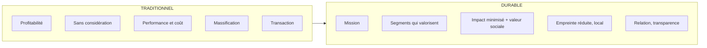

# Q28 — Qu'est-ce que la « métamorphose » du BMC ?

> **La réponse en une phrase**
> Chaque bloc du canvas est **réécrit** en version durable, un par un — et le mot « métamorphose » est choisi exprès : ce n'est pas un ajout à la marge, c'est le même organisme qui change de forme.

---

## Partie 1 — Pourquoi ce mot

🔎 Comparez trois mots possibles :

| Mot | Ce qu'il impliquerait |
|---|---|
| Ajout | On colle une couche durable sur un modèle inchangé |
| Amélioration | On optimise l'existant dans le même sens |
| **Métamorphose** | Le même organisme change de forme, chaque partie se transforme |

⚠️ Le choix du mot dit exactement ce qu'il faut faire : **on ne verdit pas un bloc, on les repasse tous**. Un modèle où seul le bloc « canaux » est devenu durable n'a pas subi de métamorphose : il a reçu un accessoire. Et c'est la définition du greenwashing. Voir [[Q15_Le_greenwashing]] du dossier précédent, ou l'article correspondant.

---

## Partie 2 — La structure du document du cours

📘 Le document « **La métamorphose du Business Model Canvas** » est construit en **trois colonnes** :

| Colonne 📘 | Ce qu'elle contient |
|---|---|
| **Business Model Traditionnel** | L'état de départ |
| **Business Model intégrant le Développement Durable** | L'état d'arrivée |
| **Nouvelles Pratiques DD** | Les gestes concrets pour y aller |

🔎 La troisième colonne est celle qu'on oublie de citer, alors que c'est la plus opérationnelle : elle répond à « comment », pas seulement à « quoi ».

---

## Partie 3 — Les cinq blocs documentés, avec les citations exactes

### Bloc 1 — Raison d'être

| Colonne | 📘 Contenu |
|---|---|
| Traditionnel | « Orientée principalement vers la **profitabilité** sans intégration explicite de considérations environnementales ou sociales » |
| Durable | « Intégration d'une **mission** centrée sur l'impact environnemental et social positif » |
| Pratiques DD | « Définition et **communication** d'une mission d'entreprise qui reflète un engagement envers le développement durable et la responsabilité sociale » |

⚠️ Ce bloc n'existe pas dans le canvas classique à neuf blocs. Le document commence donc par **ajouter une case au-dessus** de toutes les autres.

🔎 Pourquoi en haut : c'est le **critère d'arbitrage** quand deux blocs entrent en conflit. Sans mission explicite, la finalité implicite — la profitabilité — reprend le dessus à chaque décision.

### Bloc 2 — Segments de clients

| Colonne | 📘 Contenu |
|---|---|
| Traditionnel | « Groupes de clients ciblés selon les besoins et les comportements **sans considération spécifique pour la durabilité** » |
| Durable | « Identification et ciblage de segments qui **valorisent la durabilité** et l'éthique environnementale et sociale » |
| Pratiques DD | « Adoption de technologies propres, réduction des déchets, et amélioration du bilan carbone » |

⚠️ Notez une bizarrerie du document : la colonne « Nouvelles Pratiques DD » de ce bloc ne parle pas de segments mais de technologies propres et de bilan carbone. Il y a un décalage dans le tableau source. Signalez-le si on vous interroge, plutôt que de forcer une cohérence qui n'y est pas.

### Bloc 3 — Propositions de valeur

| Colonne | 📘 Contenu |
|---|---|
| Traditionnel | « Offre centrée sur la **performance et le coût** du produit/service » |
| Durable | « Création de produits ou services qui **minimisent l'impact environnemental**, utilisent des matériaux durables et offrent une **plus-value sociale** » |
| Pratiques DD | « **Innovation dans le recyclage, l'économie circulaire, et la valorisation des déchets** » |

🔎 La mention « plus-value sociale » est importante : la proposition de valeur durable ne se réduit pas à l'environnement.

### Bloc 4 — Canaux

| Colonne | 📘 Contenu |
|---|---|
| Traditionnel | « Optimisation des canaux pour la **massification** et la réduction des coûts, avec peu de considérations écologiques » |
| Durable | « Utilisation de canaux qui **réduisent l'empreinte écologique**, comme l'e-commerce vert ou la **distribution locale** » |
| Pratiques DD | « Optimisation des chaînes logistiques pour réduire l'empreinte carbone et **maximiser l'utilisation des ressources locales** » |

### Bloc 5 — Relations avec les clients

| Colonne | 📘 Contenu |
|---|---|
| Traditionnel | « Relations basées principalement sur la **transaction** et la satisfaction client » |
| Durable | « Développement de **relations durables** par la **transparence**, le partage d'informations sur la durabilité, et l'**engagement communautaire** » |
| Pratiques DD | « Mise en place de programmes de **fidélité** et de sensibilisation » |

🔎 Le glissement de « transaction » à « relation durable » n'est pas cosmétique : il prépare le passage aux revenus récurrents. Voir [[Q26_Exemples_de_revenus_durables]].

---

## Partie 4 — Le fil conducteur des cinq blocs

Si on lit les cinq lignes ensemble, un même mouvement apparaît.

🔎 **Le mouvement commun** : on passe d'une logique de **volume et de coût** à une logique de **relation et d'impact**. Chaque bloc dit la même chose dans son langage.

⚠️ Et remarquez la tension économique que ce mouvement crée : massification et distribution locale s'opposent, transaction et relation durable s'opposent. La métamorphose **détruit des sources d'efficacité** avant d'en créer d'autres. C'est précisément la tension court terme / long terme. Voir [[Q27_Durabilite_sans_tuer_la_viabilite]].

---

## Partie 5 — Les blocs non documentés dans le tableau

📘 Le document couvre cinq variables. Les quatre autres blocs du canvas — ressources clés, activités clés, partenaires clés, structure de coûts et flux de revenus — ne figurent pas dans les extraits de vos supports.

🔎 Ce qu'il faut faire : ne pas prétendre les citer, et proposer la transposition en la signalant comme votre raisonnement.

| Bloc | 🔎 Version durable, par transposition |
|---|---|
| Ressources clés | Matériaux renouvelables ou recyclés, énergie décarbonée, compétences en éco-conception |
| Activités clés | Réparation, reconditionnement, mesure d'impact, en plus de la production |
| Partenaires clés | Filières de reprise, fournisseurs engagés, autres acteurs de la boucle circulaire |
| Structure de coûts | 📘 Intègre les **externalités négatives** jusqu'ici absentes |
| Flux de revenus | Location, service, réemploi plutôt que vente unitaire seule |

⚠️ Cette honnêteté vaut mieux qu'une invention : dire « ces blocs ne sont pas documentés dans le tableau du cours, voici comment je les transposerais » est une réponse plus solide qu'une citation fausse.

---

## Partie 6 — Exemple complet

**L'entreprise.** Une chaîne genevoise de trois cafés, 22 salariés.

| Bloc | Traditionnel | Après métamorphose |
|---|---|---|
| **Raison d'être** | Vendre du café avec une bonne marge | « Servir un café dont on peut expliquer chaque étape, du producteur à la tasse » |
| **Segments** | Passants, employés de bureau | Employés de bureau et habitants attachés à l'origine ; entreprises pour leurs machines |
| **Proposition de valeur** | Café rapide et correct, prix compétitif | Café tracé, torréfié localement, servi sans jetable ; producteurs rémunérés au-dessus du cours |
| **Canaux** | Trois points de vente | Points de vente + livraison à vélo pour les entreprises + vente de grains |
| **Relations** | Transactionnelle | Programme de tasse consignée ; affichage de l'origine et du prix payé au producteur |
| 🔎 **Ressources clés** | Emplacements, machines | + relations directes avec deux coopératives |
| 🔎 **Revenus** | Vente à la tasse | + abonnement entreprises + vente de grains + consigne |
| 🔎 **Coûts** | Café, salaires, loyers | + surcoût matière première, − coût des jetables |

### Le test de la métamorphose

🔎 Vérifiez que **tous** les blocs ont bougé. Si un seul avait changé — par exemple uniquement les gobelets — on serait dans l'accessoire, pas dans la métamorphose.

⚠️ Et vérifiez la cohérence économique : le surcoût du café payé plus cher est compensé par la suppression des jetables et les deux nouveaux flux de revenus. Sans cette compensation, la métamorphose serait invivable. C'est exactement ce que le BMC durable oblige à vérifier.

---

## Les pièges

> [!danger] Erreurs classiques
> 1. **Verdir un seul bloc.** Le mot « métamorphose » exclut cette lecture.
> 2. **Oublier la troisième colonne.** 📘 « Nouvelles Pratiques DD » répond au comment.
> 3. **Oublier le bloc « raison d'être ».** Il n'existe pas dans le canvas classique.
> 4. **Inventer les blocs non documentés.** Signalez-les comme une transposition.
> 5. **Ignorer les tensions créées.** Massification contre local, transaction contre relation.
> 6. **Oublier de vérifier la viabilité.** Une métamorphose sans revenus nouveaux ne tient pas.

## À retenir

| | |
|---|---|
| **Le principe** | Chaque bloc est réécrit, pas complété |
| **Structure 📘** | Trois colonnes : traditionnel / durable / nouvelles pratiques DD |
| **Blocs documentés 📘** | Raison d'être, segments, propositions de valeur, canaux, relations clients |
| **L'ajout majeur 📘** | La **raison d'être / mission**, absente du canvas classique |
| **Le fil conducteur** | Du volume et du coût vers la relation et l'impact |
| **Le test** | Tous les blocs ont-ils bougé, et le modèle reste-t-il viable ? |
