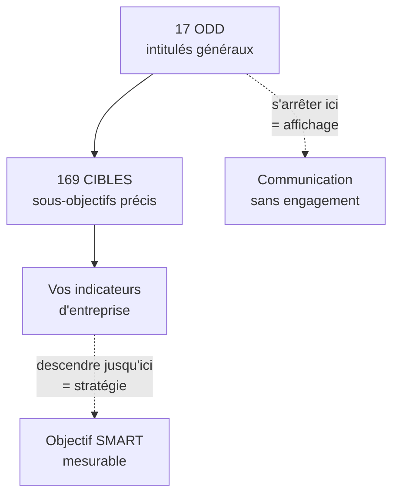

# Q29 — Qu'est-ce que l'Agenda 2030 ?

> **La réponse en une phrase**
> Un cadre adopté par **193 États** le **25 septembre 2015**, structuré en **17 objectifs** et **169 cibles** à atteindre d'ici 2030 — et le chiffre qui compte vraiment est 169, parce que c'est au niveau des cibles qu'une entreprise devient mesurable.

---

## Partie 1 — Les faits, cités exactement

📘 Cours durabilité :
> « Le **25 septembre 2015**, les **193 États membres** de l'ONU ont adopté l'**Agenda 2030** de développement durable. Les **17 objectifs de développement durable (ODD)** et leurs **169 cibles** (sous-objectifs) forment la **clé de voûte** de l'Agenda 2030. Les ODD doivent être atteints par **tous les États membres** de l'ONU d'ici à 2030. Les ODD s'articulent autour des "**5P**" : **Populations, Planète, Prospérité, Paix et Partenariats**. »

📘 Et pour la Suisse : « Dans sa **Stratégie pour le développement durable 2030 (SDD 2030)**, le Conseil fédéral montre selon quelles priorités il entend mettre en œuvre l'Agenda 2030 pour le développement durable d'ici 2030. »

### Le mémo des chiffres

| Chiffre | Ce qu'il désigne |
|---|---|
| **25 septembre 2015** | Date d'adoption |
| **193** | États membres signataires |
| **17** | Objectifs |
| **169** | Cibles, ou sous-objectifs |
| **2030** | Échéance |
| **5** | Les 5P |

---

## Partie 2 — Ce qui rend ce cadre particulier

Trois caractéristiques méritent d'être expliquées, pas seulement citées.

### 1. L'universalité

📘 « Les ODD doivent être atteints par **tous les États membres** de l'ONU. »

🔎 C'est une rupture. Les cadres précédents distinguaient pays développés et pays en développement, les seconds étant les destinataires de l'aide. L'Agenda 2030 s'applique à tous, y compris la Suisse. **Personne n'est seulement donateur.**

### 2. L'indivisibilité

📘 Le terme « **clé de voûte** » est employé pour les 17 ODD et leurs 169 cibles.

🔎 Une clé de voûte est la pierre centrale sans laquelle l'arche s'effondre. L'image dit que les objectifs forment un **système**, pas un menu où l'on choisit.

⚠️ Conséquence pratique : les ODD sont **en tension entre eux**. L'ODD 8, croissance économique, et l'ODD 12, consommation responsable, ne pointent pas dans la même direction. C'est voulu : le cadre force à arbitrer, il ne prétend pas que tout se concilie.

### 3. La descente vers les cibles

🔎 **C'est le point le plus utile pour une entreprise.** Un ODD est un intitulé général : « consommation et production responsables ». Une cible est un sous-objectif précis.



⚠️ Dire « nous contribuons à l'ODD 12 » n'engage à rien. Toute entreprise qui produit quelque chose contribue à l'ODD 12 dans un sens ou dans l'autre. Descendre à la cible, puis à l'indicateur, transforme une déclaration en engagement vérifiable.

📘 Et c'est exactement ce que le cours exige : « Formulez **1 objectif SMART** […] Les objectifs doivent guider la stratégie et être **mesurables**. »

---

## Partie 3 — Les 5P, brièvement

📘 « Populations, Planète, Prospérité, Paix et Partenariats. »

| P | Ce qu'il regroupe |
|---|---|
| **Populations** | Pauvreté, faim, santé, éducation, égalité |
| **Planète** | Climat, eau, biodiversité, consommation |
| **Prospérité** | Énergie, travail, industrie, inégalités, villes |
| **Paix** | Institutions, justice, sécurité |
| **Partenariats** | Coopération, moyens de mise en œuvre |

Développé dans [[Q30_Les_5P]].

---

## Partie 4 — Comment une entreprise s'en sert vraiment

### L'erreur du tableau de logos

⚠️ La pratique la plus répandue consiste à afficher les 17 pictogrammes et à cocher ceux auxquels on « contribue ». Résultat : on contribue à quinze ODD et on n'en pilote aucun.

```
Deux approches

Affichage      ██ ██ ██ ██ ██ ██ ██ ██ ██ ██ ██ ██ ██ ██ ██
               17 ODD effleurés, aucun piloté

Stratégique    ████████████  ████████████  ████████████
               3 ODD, descendus jusqu'à la cible et l'indicateur
```

### La méthode en six temps

| Temps | Ce qu'on fait |
|---|---|
| 1 | **Cartographier** : sur quels ODD notre activité a-t-elle un impact **réel**, positif ou négatif ? |
| 2 | **Sélectionner** 2 ou 3 ODD, ceux où l'impact est le plus fort |
| 3 | **Descendre à la cible** précise parmi les 169 |
| 4 | 📘 **Formuler un objectif SMART** |
| 5 | **Nommer les tensions** : sur quels ODD ce projet dégrade-t-il la situation ? |
| 6 | **Mesurer** : un indicateur d'intensité **et** un indicateur absolu |

🔎 Le temps 5 est le plus révélateur de sérieux. Aucun projet réel n'améliore les 17 ODD simultanément. Une entreprise qui l'affirme n'a pas fait l'analyse.

---

## Partie 5 — Le lien avec les autres cadres du cours

📘 Vos supports présentent trois cadres conceptuels qui se répondent :

| Cadre | Ce qu'il apporte | Sa limite |
|---|---|---|
| **Agenda 2030 / 17 ODD** | Un langage universel, des objectifs partagés, des cibles chiffrées | Les objectifs sont mis à plat, sans hiérarchie |
| **Le « wedding cake »** | 📘 Il **hiérarchise** : biosphère, société, économie | Voir [[Q32_Le_wedding_cake_des_ODD]] |
| **Le donut de Raworth** | Il pose deux limites : plafond écologique, fondement social | Voir [[Q34_Le_donut_de_Kate_Raworth]] |

🔎 Le rapport entre les trois : les ODD donnent la **liste**, le wedding cake donne l'**ordre de priorité**, le donut donne les **bornes**. Les citer ensemble montre que vous avez compris qu'ils ne se concurrencent pas.

---

## Partie 6 — Exemple complet

**L'entreprise.** Une PME genevoise de traitement de déchets de chantier, 55 salariés.

| Temps | Contenu |
|---|---|
| **Cartographier** | Impact fort sur les ODD 12 (consommation et production responsables), 13 (climat), 8 (travail décent), 17 (partenariats). Impact marginal sur les 13 autres |
| **Sélectionner** | ODD 12 en principal, 13 et 8 en secondaires, 17 comme condition |
| **Cible** | Réduction de la production de déchets par la valorisation |
| **Objectif SMART** | Porter le taux de valorisation matière de 62 % à 78 % en 24 mois |
| **Tensions** | ⚠️ ODD 12 volet déchets électroniques : la ligne de tri automatisée crée des DEEE. ODD 7 et 13 : consommation électrique supplémentaire. ODD 8 : 12 postes de tri manuel concernés |
| **Mesurer** | Taux de valorisation (intensité) **et** tonnes envoyées en enfouissement (absolu) **et** tonnage total traité (contrôle) |

🔎 Quatre ODD sur dix-sept. Et trois tensions nommées, dont une sur l'emploi. C'est ça, une intégration sérieuse — et le troisième indicateur est le garde-fou contre l'effet rebond.

---

## Les pièges

> [!danger] Erreurs classiques
> 1. **Oublier les 169 cibles.** C'est le chiffre qui rend le cadre opérationnel.
> 2. **Vouloir couvrir les 17 ODD.** Trois pilotés valent mieux que dix-sept cochés.
> 3. **Oublier l'universalité.** 📘 Tous les États, y compris la Suisse.
> 4. **Oublier la SDD 2030.** 📘 C'est la déclinaison suisse.
> 5. **Ne pas nommer les tensions.** Aucun projet n'améliore les 17 objectifs.
> 6. **Confondre les trois cadres.** ODD = liste ; wedding cake = hiérarchie ; donut = bornes.

## À retenir

| | |
|---|---|
| **Date et signataires 📘** | 25 septembre 2015, 193 États membres de l'ONU |
| **Structure 📘** | 17 ODD, 169 cibles, échéance 2030, « clé de voûte » |
| **Les 5P 📘** | Populations, Planète, Prospérité, Paix, Partenariats |
| **Suisse 📘** | Stratégie pour le développement durable 2030 (SDD 2030) |
| **La règle d'usage** | Sélectionner 2-3 ODD, descendre à la cible, nommer les tensions |
