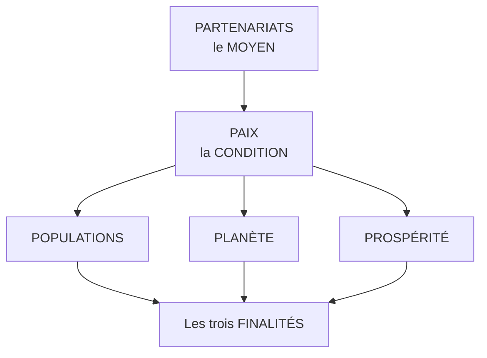

# Q30 — Citez les 5P

> **La réponse en une phrase**
> **Populations, Planète, Prospérité, Paix, Partenariats** — cinq mots qui ne sont pas une liste mais une **architecture** : trois finalités, une condition politique, un moyen de mise en œuvre.

---

## Partie 1 — La citation exacte

📘 Cours durabilité : « Les ODD s'articulent autour des "**5P**" : **Populations, Planète, Prospérité, Paix et Partenariats**. »

⚠️ Notez le verbe : les ODD « **s'articulent autour** » des 5P. Ce ne sont pas cinq catégories dans lesquelles on range les objectifs, c'est la **charpente** qui les organise.

---

## Partie 2 — Ce que chaque P recouvre

| P | Domaine | ODD typiquement concernés |
|---|---|---|
| **Populations** | Dignité humaine : pauvreté, faim, santé, éducation, égalité | 1 à 5 |
| **Planète** | Ressources et systèmes naturels : eau, climat, biodiversité, consommation | 6, 12, 13, 14, 15 |
| **Prospérité** | Vies épanouies : énergie, travail, industrie, inégalités, villes | 7 à 11 |
| **Paix** | Sociétés justes et pacifiques : institutions, justice, sécurité | 16 |
| **Partenariats** | Moyens de mise en œuvre et coopération | 17 |

🔎 La correspondance ODD ↔ P est ma reconstruction (les slides ne détaillent pas la répartition). Elle est standard, mais présentez-la comme telle.

---

## Partie 3 — Pourquoi ce ne sont pas cinq catégories équivalentes

C'est le raisonnement qui distingue une récitation d'une explication.

| P | Statut logique | Pourquoi |
|---|---|---|
| Populations, Planète, Prospérité | **Finalités** | Ce sont les états qu'on veut atteindre |
| Paix | **Condition** | Rien n'est atteignable dans un contexte de conflit |
| Partenariats | **Moyen** | C'est la manière d'y parvenir |

🔎 **Le point à faire** : « Partenariats » n'est pas un objectif au même titre que « Planète ». C'est la reconnaissance officielle du fait que **les seize premiers objectifs sont inatteignables par des acteurs isolés**. Voir [[Q17_La_coopetition]].

⚠️ Et « Paix » est souvent oublié dans les présentations d'entreprise, parce qu'il semble hors sujet. Il ne l'est pas : la souveraineté numérique, la sécurité des données et la fragilité des chaînes d'approvisionnement relèvent directement de ce P.

📘 Le cours en fait d'ailleurs un exercice pratique : imaginer un système informatique de PME capable de résister à une « **coupure de service de la part des USA**, sur décision présidentielle » et à une « **rupture des chaînes d'approvisionnement** en matériaux et pièces informatiques en provenance de l'Asie ».

---

## Partie 4 — La tension entre Planète et Prospérité

C'est le nœud du cadre, et le mentionner montre que vous avez compris qu'il ne s'agit pas d'un catalogue harmonieux.

| P | Ce qu'il pousse à faire |
|---|---|
| **Prospérité** | Croissance économique, industrialisation, emploi, énergie disponible |
| **Planète** | Réduction de la consommation de ressources, respect des limites |

⚠️ Ces deux P **ne pointent pas dans la même direction**. L'Agenda 2030 ne le cache pas : il pose les deux et laisse l'arbitrage aux États et aux acteurs.

🔎 C'est exactement pour ça que les autres cadres du cours existent :
- Le **wedding cake** hiérarchise en plaçant la biosphère sous la société, elle-même sous l'économie. Il tranche l'arbitrage. Voir [[Q32_Le_wedding_cake_des_ODD]].
- Le **donut** pose des bornes : ne pas dépasser le plafond, ne pas passer sous le plancher. Il encadre l'arbitrage. Voir [[Q34_Le_donut_de_Kate_Raworth]].

📘 Et la position que défend le cours est celle de la **durabilité forte** : « La durabilité forte considère le capital naturel comme **non substituable** par d'autres formes de capital (économique, social) et qui priorise la **préservation des écosystèmes et des limites planétaires comme conditions de base** à l'existence de toute vie humaine et activité économique. »

⚠️ Formulé ainsi, la tension est tranchée : Planète n'est pas au même niveau que Prospérité, elle en est la **condition**. Voir [[Q31_Durabilite_forte_vs_faible]].

---

## Partie 5 — L'usage en entreprise

🔎 Les 5P servent à **vérifier qu'on n'a pas oublié une dimension** dans une analyse.

| P | Question à se poser dans un projet |
|---|---|
| Populations | Qui est affecté ? Excluons-nous quelqu'un ? |
| Planète | Quelles ressources consommons-nous, quels rejets produisons-nous ? |
| Prospérité | Quelle valeur économique, et pour qui ? |
| Paix | Créons-nous une dépendance, un risque de rupture, un enjeu de souveraineté ? |
| Partenariats | Qui devons-nous embarquer, car nous ne pouvons pas faire seuls ? |

⚠️ C'est une grille de **complétude**, pas de décision. Elle ne dit pas quoi faire, elle dit ce qu'on a oublié de regarder.

---

## Partie 6 — Exemple express

**Le projet.** Une PME romande de services numériques migre ses données vers un hébergeur cloud américain pour réduire ses coûts.

| P | Ce que la grille révèle |
|---|---|
| **Populations** | Neutre — sauf si le service devient moins accessible |
| **Planète** | Ambigu : mutualisation plus efficiente, mais abondance perçue qui nourrit l'effet rebond |
| **Prospérité** | Positif à court terme : coûts réduits |
| **Paix** ⚠️ | **Risque majeur non vu** : dépendance à une juridiction étrangère, 📘 scénario de coupure travaillé en cours |
| **Partenariats** | Aucune réversibilité prévue, aucun acteur régional impliqué |

🔎 Sans les 5P, la décision paraissait purement économique et favorable. Avec la grille, deux angles morts apparaissent — et ce sont les deux qui peuvent arrêter l'entreprise du jour au lendemain.

---

## Les pièges

> [!danger] Erreurs classiques
> 1. **Réciter les cinq mots sans l'architecture.** Trois finalités, une condition, un moyen.
> 2. **Oublier « Paix ».** C'est le P qu'on saute, et il couvre la souveraineté.
> 3. **Traiter Partenariats comme un objectif ordinaire.** C'est le moyen de tous les autres.
> 4. **Prétendre que les 5P sont harmonieux.** Planète et Prospérité sont en tension.
> 5. **Confondre avec les 5P de l'interview.** ⚠️ Vos supports emploient aussi « 5P » pour la préparation d'entretien dans le cours sur la collecte de données. Ce n'est pas la même chose.

## À retenir

| | |
|---|---|
| **Les 5P 📘** | Populations, Planète, Prospérité, Paix, Partenariats |
| **Le verbe 📘** | Les ODD « s'articulent autour » des 5P |
| **L'architecture** | 3 finalités + 1 condition (Paix) + 1 moyen (Partenariats) |
| **La tension** | Planète contre Prospérité, non résolue par le cadre lui-même |
| **Ce qui tranche 📘** | La durabilité forte : le capital naturel est « non substituable » |
| **L'usage** | Une grille de complétude, pas de décision |
