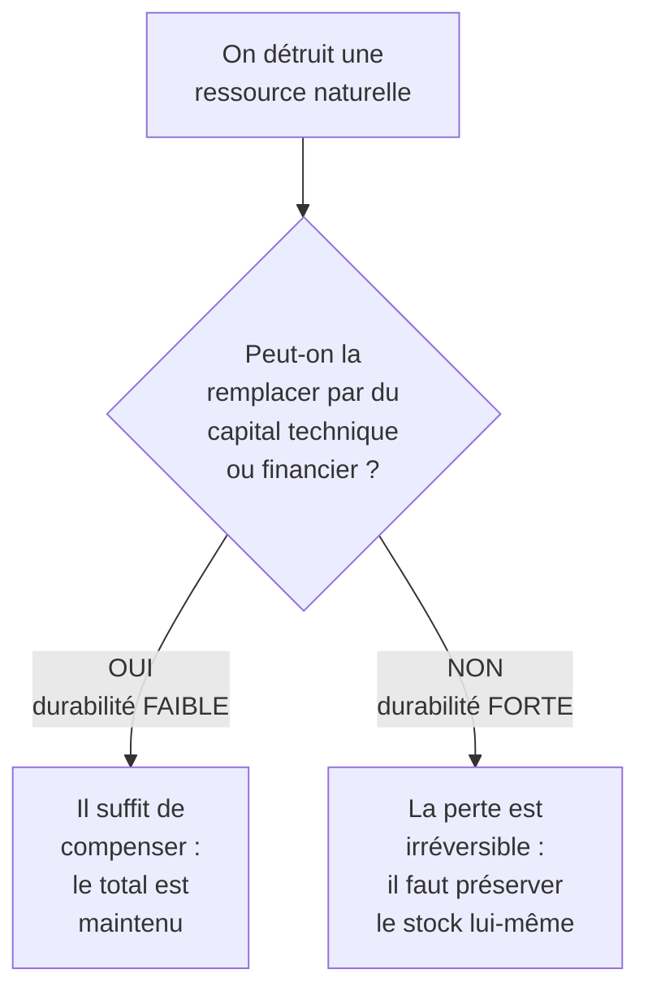

# Q31 — Durabilité forte contre durabilité faible

> **La réponse en une phrase**
> Toute la différence tient à un seul mot : le capital naturel est-il **substituable** ou non ? La durabilité faible dit oui, la durabilité forte dit non — et votre cours défend explicitement la forte.

---

## Partie 1 — La citation du cours, mot à mot

📘 Cours durabilité :
> « La **durabilité forte** considère le **capital naturel** comme **non substituable** par d'autres formes de capital (économique, social) et qui priorise la **préservation des écosystèmes et des limites planétaires comme conditions de base à l'existence de toute vie humaine et activité économique**. »

⚠️ Décomposons, parce que chaque groupe de mots porte un argument :

| Fragment | Ce qu'il affirme |
|---|---|
| « capital naturel » | La nature est traitée comme un stock, pas comme un décor |
| « **non substituable** » | On ne peut pas remplacer une forêt par de l'argent ou de la technologie |
| « priorise » | Il y a une hiérarchie, pas un équilibre |
| « **conditions de base** » | Ce n'est pas un facteur parmi d'autres, c'est le préalable |
| « de toute vie humaine **et activité économique** » | L'économie est incluse dans le périmètre concerné |

🔎 Remarquez que le cours ne définit pas la durabilité faible. Il donne la définition de la forte et laisse comprendre que la faible est son opposé. C'est un choix : le cours prend position.

---

## Partie 2 — Comprendre la substituabilité

C'est le concept central, et il mérite une explication concrète.

**La question** : si nous détruisons un capital naturel, pouvons-nous le remplacer par autre chose ?

### La position faible, exposée honnêtement

🔎 Elle n'est pas absurde. Son raisonnement : ce qui compte est le **capital total** (naturel + technique + humain + financier). Si on épuise une ressource mais qu'on développe une technologie qui rend cette ressource inutile, on n'a rien perdu. Historiquement, il y a des exemples : la substitution du charbon au bois a évité la déforestation totale de l'Europe.

### La position forte, et pourquoi le cours la retient

⚠️ Trois arguments, tous présents ou déductibles de vos supports.

**Argument 1 — L'irréversibilité.**
📘 Le cours sur les limites planétaires : « Lorsqu'une limite est dépassée, cela impacte directement l'équilibre du système Terre actuel (l'Holocène dans le jargon). Plusieurs limites dépassées peuvent conduire à la remise en question de ce fameux système dans son ensemble. En conséquence cela **remettrait en question la vie sur terre** (qu'elle soit humaine, animale ou végétale). »

🔎 Une espèce éteinte ne revient pas. Un climat basculé ne se rebascule pas. La substitution suppose la réversibilité ; l'irréversibilité l'interdit.

**Argument 2 — L'interdépendance.**
📘 « **Tout est lié** et le dépassement d'une limite planétaire a généralement un impact sur les autres limites comme le réchauffement climatique. »

🔎 On ne peut pas substituer élément par élément un système dont les composants interagissent.

**Argument 3 — La hiérarchie logique.**
🔎 Sans biosphère, il n'y a pas de société ; sans société, pas d'économie. Le capital naturel n'est donc pas un capital parmi d'autres : c'est le **support** des autres. C'est exactement ce que dit le wedding cake. Voir [[Q32_Le_wedding_cake_des_ODD]].

---

## Partie 3 — Le tableau de comparaison

| | Durabilité **faible** | Durabilité **forte** |
|---|---|---|
| Capital naturel | Substituable | 📘 **Non substituable** |
| Ce qu'on maintient | Le capital **total** | Le **stock naturel** lui-même |
| Rapport économie / nature | La nature est un facteur de production | 📘 Les écosystèmes sont les « conditions de base » |
| Attitude face à la destruction | Compenser | Éviter |
| Confiance dans la technologie | Élevée | Prudente |
| Position du cours | — | ✅ Retenue |

---

## Partie 4 — Les conséquences concrètes en entreprise

C'est là que la distinction cesse d'être philosophique.

| Sujet | Ce que dit la durabilité faible | Ce que dit la durabilité forte |
|---|---|---|
| **Compensation carbone** | Suffisante : on émet, on compense ailleurs | Second choix : il faut d'abord **réduire** |
| **Croissance des volumes** | Acceptable si l'efficacité progresse | Insuffisante : c'est l'effet rebond |
| **Indicateur pertinent** | Intensité (kg CO₂ par produit) | **Absolu** (tonnes CO₂ totales) |
| **Innovation** | Elle résoudra le problème | Elle aide, elle ne dispense pas d'arbitrer |
| **Ordre des 3R** | Le recyclage suffit | 📘 « réduction et réutilisation, **puis enfin seulement** de recyclage » |

🔎 **Le point le plus opérationnel** : la ligne « indicateur ». Choisir de suivre une intensité plutôt qu'un absolu, c'est adopter implicitement la position faible. C'est un choix philosophique déguisé en choix technique.

⚠️ Et 📘 le cours BM durable emploie précisément la formule « réduire **ou** compenser les externalités négatives ». L'ordre des mots place la réduction en premier — cohérent avec la durabilité forte.

---

## Partie 5 — Ce que la position forte ne dit pas

Une réponse nuancée évite deux caricatures.

| Caricature | Ce que la durabilité forte dit réellement |
|---|---|
| « Il faut arrêter toute activité économique » | Il faut rester **dans les limites**, pas cesser d'agir |
| « La technologie est inutile » | Elle est utile, elle ne dispense pas d'arbitrer |
| « Il faut moins de tout » | 📘 « Le critère central n'est pas "moins", mais **moins de superflu, sans réduire l'essentiel** » |

⚠️ La troisième ligne est essentielle : la durabilité forte impose un **plafond**, pas une privation générale. Et le donut ajoute un **plancher** qu'il ne faut pas non plus franchir vers le bas. Voir [[Q34_Le_donut_de_Kate_Raworth]].

---

## Partie 6 — Exemple complet

**L'entreprise.** Une compagnie aérienne régionale envisage deux stratégies climat.

### Stratégie A — logique de durabilité faible

| Mesure | Logique |
|---|---|
| Achat de crédits carbone couvrant 100 % des émissions | Le carbone émis est compensé ailleurs |
| Renouvellement de la flotte pour des appareils 15 % plus efficients | L'efficacité progresse |
| Communication : « vols neutres en carbone » | Le capital total est maintenu |
| **Volume de vols** | ▲ +20 % sur cinq ans |

**Résultat en absolu** : 1,20 × 0,85 = **+2 % d'émissions réelles**, malgré la compensation et l'efficacité.

### Stratégie B — logique de durabilité forte

| Mesure | Logique |
|---|---|
| Plafond d'émissions absolues, décroissant de 4 % par an | Le stock naturel est la contrainte |
| Suppression des lignes court-courrier doublées par le rail | Réduction avant compensation |
| Renouvellement de flotte identique | L'efficacité aide, sans être suffisante |
| Compensation du résiduel seulement | Second choix assumé |
| **Volume de vols** | Arbitré selon le plafond |

**Résultat en absolu** : émissions décroissantes.

### Ce que la comparaison montre

🔎 Les deux stratégies contiennent les mêmes mesures techniques. La différence est **la contrainte qu'on se donne** : la stratégie A optimise une intensité, la stratégie B respecte un plafond absolu.

⚠️ Et le choix de l'indicateur suffit à trahir la position philosophique. Demandez à une entreprise quel indicateur elle suit, vous saurez à quelle durabilité elle adhère — quels que soient ses discours.

---

## Les pièges

> [!danger] Erreurs classiques
> 1. **Définir sans le mot « substituable ».** C'est le concept central.
> 2. **Caricaturer la durabilité faible.** Elle a un raisonnement, il faut l'exposer avant de le discuter.
> 3. **Oublier que le cours prend position.** 📘 Il définit la forte, pas la faible.
> 4. **Ne pas descendre aux conséquences pratiques.** Compensation, indicateurs, ordre des 3R.
> 5. **Confondre durabilité forte et décroissance générale.** 📘 « Moins de superflu, sans réduire l'essentiel. »

## À retenir

| | |
|---|---|
| **Le critère** | Le capital naturel est-il substituable ? |
| **Définition 📘** | « Non substituable par d'autres formes de capital […] conditions de base à l'existence de toute vie humaine et activité économique » |
| **Position du cours** | La durabilité **forte** |
| **Arguments** | Irréversibilité, interdépendance (« tout est lié »), hiérarchie logique |
| **Le test pratique** | Suit-on un indicateur d'intensité ou un indicateur absolu ? |
| **Ce que ce n'est pas** | Une privation générale — c'est un plafond |
