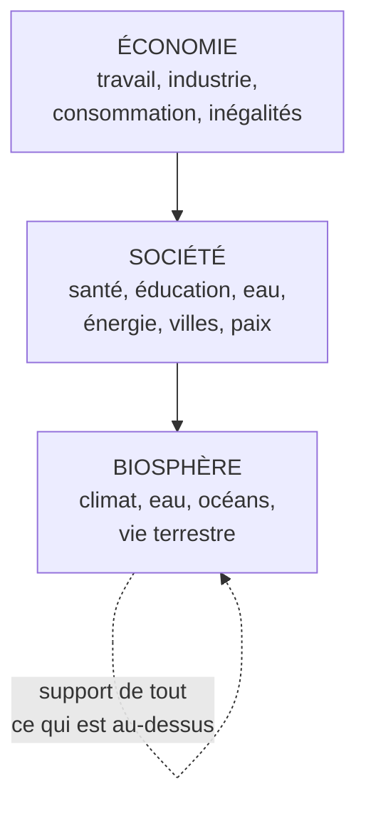

# Q32 — Qu'est-ce que le « wedding cake » des ODD ?

> **La réponse en une phrase**
> Une représentation qui **empile** les 17 ODD en trois étages — biosphère en bas, société au milieu, économie en haut — pour dire ce que la liste plate des ODD ne dit pas : **il y a un ordre de dépendance**.

---

## Partie 1 — La source et le nom

📘 Cours numérique et durabilité : « **Cadres conceptuels de la durabilité : Le gâteau de mariage.** The SDG "wedding cake". Source : **Stockholm Resilience Institute**. »

📘 Le cours durabilité a également une slide intitulée « **Le "Wedding Cake"** ».

🔎 Le nom vient de la forme : une pièce montée à trois étages, chacun reposant sur le précédent.

---

## Partie 2 — Le problème que cette représentation résout

Voici pourquoi elle existe, et c'est le cœur de la réponse.

📘 Les 17 ODD sont présentés dans l'Agenda 2030 comme une **liste** : 17 pictogrammes alignés, tous de même taille.

⚠️ Cette présentation crée une illusion : elle laisse croire que les objectifs sont **équivalents et indépendants**, comme un menu où l'on choisirait ceux qui nous conviennent.

🔎 Or ils ne le sont pas. L'objectif « vie aquatique » et l'objectif « croissance économique » ne sont pas au même niveau logique : sans océans vivants, il n'y a pas d'économie. Le wedding cake corrige exactement cela.

---

## Partie 3 — Les trois étages

| Étage | Ce qu'il contient | ODD typiquement rattachés |
|---|---|---|
| **Biosphère** (base) | Les systèmes naturels qui rendent la vie possible | 6 (eau), 13 (climat), 14 (vie aquatique), 15 (vie terrestre) |
| **Société** (milieu) | Les conditions d'une vie humaine digne | 1 à 5, 7, 11, 16 |
| **Économie** (sommet) | L'activité productive et sa répartition | 8, 9, 10, 12 |
| **Traversant** | 📘 Partenariats — l'ODD 17 | 17 |

🔎 La répartition précise des 17 ODD entre étages est ma reconstruction ; elle est standard mais les slides ne la détaillent pas. Le **principe** de la hiérarchie, lui, est bien celui du cours.

---

## Partie 4 — Ce que la superposition affirme

Ce n'est pas décoratif. Chaque relation d'empilement porte une affirmation forte.

| Affirmation | Conséquence |
|---|---|
| L'économie repose sur la société | Une économie qui détruit le tissu social scie sa propre branche |
| La société repose sur la biosphère | Une société qui dépasse les limites naturelles ne se maintient pas |
| **Il n'y a pas d'arbitrage possible entre étages** | On ne « compense » pas une dégradation de la base par une performance du sommet |

⚠️ Cette dernière ligne est décisive. Elle rejette explicitement la **durabilité faible** : on ne peut pas substituer du capital économique à du capital naturel, parce qu'ils ne sont pas au même niveau.

📘 Et c'est exactement ce que dit le cours : « La durabilité forte considère le capital naturel comme **non substituable** par d'autres formes de capital (économique, social) et qui priorise la préservation des écosystèmes et des limites planétaires comme **conditions de base** à l'existence de toute vie humaine et activité économique. »

🔎 Le wedding cake est donc la **représentation graphique de la durabilité forte**. Faire ce lien vaut des points. Voir [[Q31_Durabilite_forte_vs_faible]].

---

## Partie 5 — Le contraste avec la vision économique dominante

| Vision classique | Wedding cake |
|---|---|
| Trois piliers **côte à côte** : économique, social, environnemental | Trois étages **empilés** |
| On cherche un **équilibre** entre les trois | On respecte un **ordre de dépendance** |
| Un déficit environnemental peut être compensé par un gain économique | Impossible : la base conditionne le reste |
| Représentation : trois cercles qui se recoupent | Représentation : une pièce montée |

⚠️ **Le point à faire** : la vision des « trois piliers » autorise implicitement les arbitrages entre eux. C'est cette autorisation que le wedding cake retire.

🔎 Formulation à retenir : **on passe de « équilibrer trois dimensions » à « respecter des conditions préalables »**.

---

## Partie 6 — La place du wedding cake parmi les cadres du cours

📘 Vos supports présentent trois cadres qui se complètent :

| Cadre | Ce qu'il apporte |
|---|---|
| **17 ODD** | La **liste** : quoi viser |
| **Wedding cake** | La **hiérarchie** : dans quel ordre |
| **Donut de Raworth** | Les **bornes** : jusqu'où, et pas en dessous de quoi |

🔎 Les citer ensemble en montrant qu'ils ne se concurrencent pas est exactement le type de réponse qui distingue une compréhension d'une mémorisation. Voir [[Q34_Le_donut_de_Kate_Raworth]].

---

## Partie 7 — L'usage concret en entreprise

Le wedding cake sert à **ordonner les priorités** quand plusieurs objectifs entrent en conflit.

### La règle de décision

> **Un gain à un étage supérieur ne justifie jamais une dégradation à un étage inférieur.**

| Situation | Ce que dit le wedding cake |
|---|---|
| Un projet crée 50 emplois (économie) et dépasse un seuil de rejet (biosphère) | ❌ La base prime : il faut résoudre le rejet |
| Un projet réduit les émissions (biosphère) et exclut une population (société) | ❌ Aussi problématique : la société est sous l'économie mais au-dessus de rien |
| Un projet dégrade la marge (économie) et améliore les deux autres étages | ✅ Arbitrage acceptable, à condition que la viabilité tienne |

⚠️ La deuxième ligne mérite attention : le wedding cake n'autorise pas non plus à sacrifier le social au nom de l'écologie. C'est exactement le principe de **sobriété juste** du cours : 📘 « Le critère central n'est pas "moins", mais moins de superflu, **sans réduire l'essentiel** ».

---

## Partie 8 — Exemple complet

**Le projet.** Une entreprise genevoise de livraison veut passer à une flotte 100 % électrique et supprimer son service téléphonique au profit d'une application.

### Analyse par étages

| Étage | Effet du projet | Verdict |
|---|---|---|
| **Biosphère** | ▲ Émissions locales réduites. ⚠️ Mais fabrication de nouvelles batteries, métaux critiques | Positif net si les véhicules actuels sont en fin de vie ; négatif s'ils sont renouvelés prématurément |
| **Société** | ⚠️ Les clients sans smartphone perdent l'accès. Les chauffeurs sont géolocalisés en continu | **Dégradation** |
| **Économie** | ▲ Coûts d'exploitation réduits, image améliorée | Positif |

### La décision selon le wedding cake

🔎 Le projet améliore le sommet et une partie de la base, et **dégrade l'étage du milieu**. La règle hiérarchique dit qu'on ne valide pas en l'état.

**Ce qu'il faut corriger :**

| Correction | Étage visé |
|---|---|
| Maintenir un canal téléphonique accessible | Société |
| Limiter la géolocalisation aux données strictement utiles à la tournée | Société |
| Ne remplacer les véhicules qu'en fin de vie utile, pas avant | Biosphère |

⚠️ Sans ces corrections, le projet serait présenté comme « écologique » alors qu'il crée une exclusion — exactement le mécanisme du cas SilverDigital. Voir [[Q50_Lexclusion_indirecte]].

---

## Les pièges

> [!danger] Erreurs classiques
> 1. **Décrire la forme sans dire ce qu'elle affirme.** L'empilement est un argument.
> 2. **Oublier la source.** 📘 Stockholm Resilience Institute.
> 3. **Confondre avec les trois piliers.** Côte à côte ≠ empilés.
> 4. **Croire que l'écologie autorise à sacrifier le social.** Le milieu compte aussi.
> 5. **Ne pas relier à la durabilité forte.** C'en est la représentation graphique.
> 6. **Oublier l'ODD 17.** Les partenariats traversent les trois étages.

## À retenir

| | |
|---|---|
| **Source 📘** | Stockholm Resilience Institute, « The SDG wedding cake » |
| **Les trois étages** | Biosphère → Société → Économie |
| **Ce qu'il affirme** | Un ordre de dépendance, pas un équilibre à trouver |
| **Ce qu'il rejette** | La substituabilité entre étages, donc la durabilité faible |
| **La règle** | Un gain en haut ne justifie pas une dégradation en bas |
| **Sa place** | Les ODD donnent la liste, le wedding cake l'ordre, le donut les bornes |
