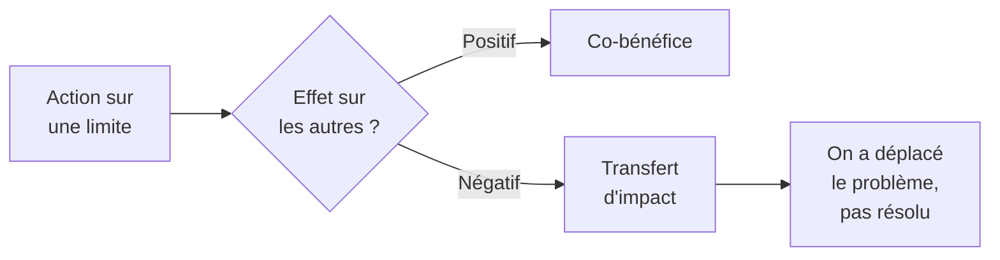

# Q33 — Combien de limites planétaires, et combien sont dépassées ?

> **La réponse en une phrase**
> **Neuf** limites identifiées, **sept dépassées en 2025** — et le chiffre à retenir n'est pas neuf mais **sept sur neuf**, parce que c'est lui qui transforme un concept scientifique en argument stratégique.

---

## Partie 1 — Ce qu'est une limite planétaire

Une limite planétaire est un **seuil quantifié** au-delà duquel un processus naturel bascule hors de l'état stable que l'humanité a connu depuis 10 000 ans.

🔎 L'analogie utile : ce n'est pas une jauge de carburant qui descend progressivement, c'est un **disjoncteur**. En dessous du seuil, le système absorbe. Au-dessus, il change de régime.

📘 Le cours emploie exactement ce vocabulaire de basculement : « Lorsqu'une limite est dépassée, cela **impacte directement l'équilibre du système Terre actuel (l'Holocène** dans le jargon). »

### Le mot « Holocène »

🔎 L'Holocène est la période géologique stable des dix derniers millénaires — celle pendant laquelle l'agriculture, les villes et les civilisations ont pu apparaître. Les limites planétaires définissent l'espace de fonctionnement qui **maintient** cet état.

---

## Partie 2 — Les chiffres

| Élément | Valeur | Source |
|---|---|---|
| Nombre de limites | **9** | Travaux de Rockström et de l'équipe du Stockholm Resilience Centre, 2009 |
| Limites dépassées | **7 sur 9** | État 2025 |

⚠️ La date de 2009 et le nom de Rockström figurent dans votre fiche de révision. Ils sont exacts, mais je ne les ai pas retrouvés cités explicitement dans les extraits de vos slides. Si vous les mentionnez, faites-le comme un complément de contexte plutôt qu'en les attribuant au cours.

```
État des neuf limites planétaires (2025)

Dépassées   ██████████████  7
Respectées  ████            2
```

🔎 **Pourquoi ce chiffre est votre meilleur argument** : contre l'objection « la durabilité est un effet de mode », une contrainte physique ne se démode pas. Sept limites sur neuf franchies n'est pas une opinion, c'est un état mesuré.

---

## Partie 3 — Les trois enseignements du cours

📘 La slide « En résumé » de votre cours durabilité donne trois affirmations, et chacune vaut d'être expliquée.

### Enseignement 1 — Le dépassement fait basculer le système

📘 « Lorsqu'une limite est dépassée, cela impacte directement l'équilibre du système Terre actuel (l'Holocène). Plusieurs limites dépassées peuvent conduire à la **remise en question de ce fameux système dans son ensemble**. En conséquence cela remettrait en question la **vie sur terre** (qu'elle soit humaine, animale ou végétale). »

🔎 Notez la gradation : une limite dépassée déséquilibre ; **plusieurs** limites dépassées remettent en cause le système entier. Avec sept sur neuf, on est dans le second cas.

### Enseignement 2 — Tout est lié

📘 « **Tout est lié** et le dépassement d'une limite planétaire a généralement un impact sur les autres limites comme le réchauffement climatique. »

⚠️ C'est l'enseignement le plus important stratégiquement. Il signifie que les limites ne sont pas neuf compteurs indépendants : agir sur une seule peut aggraver une autre.



🔎 Exemple concret : passer une flotte à l'électrique améliore le climat et dégrade les limites liées à l'extraction de métaux et à l'usage de l'eau. Ce n'est pas une raison de ne pas le faire, c'est une raison de **regarder les neuf limites, pas une seule**.

⚠️ C'est aussi pourquoi une stratégie « bas carbone » n'est pas synonyme de stratégie durable. Le carbone est une limite sur neuf.

### Enseignement 3 — Ce n'est pas irrémédiable

📘 « En adoptant des pratiques plus **respectueuses** de notre environnement **nous pouvons inverser la tendance**. »

🔎 Le cours ne conclut pas sur le catastrophisme. C'est important pour votre posture à l'oral : on présente une contrainte, pas une fatalité.

📘 Et le cours ajoute l'objectif : « Il est donc **urgent de revenir au sein d'un espace de fonctionnement sécurisé** pour préserver l'habitabilité humaine de la planète. »

---

## Partie 4 — Le lien avec le donut

📘 Le donut de Raworth définit son **plafond écologique** comme les « limites planétaires, au-delà desquelles les conditions de vie ne sont plus assurées et des **basculements irréversibles** peuvent se produire ».

🔎 Autrement dit : **les neuf limites planétaires *sont* le plafond du donut**. Ce ne sont pas deux concepts distincts, c'est le même contenu vu dans deux cadres différents.

| Cadre | Rôle des limites planétaires |
|---|---|
| Limites planétaires | L'objet lui-même : neuf seuils quantifiés |
| Donut | Elles constituent le **plafond écologique** |
| Wedding cake | Elles définissent l'étage **biosphère**, celui qui porte tout |
| Durabilité forte | 📘 Elles sont les « **conditions de base** à l'existence de toute vie humaine et activité économique » |

⚠️ Savoir articuler ces quatre cadres autour d'un même contenu est exactement ce qu'un examinateur cherche. Voir [[Q34_Le_donut_de_Kate_Raworth]] et [[Q32_Le_wedding_cake_des_ODD]].

---

## Partie 5 — L'usage en entreprise

Une entreprise ne « respecte » pas des limites planétaires : elles sont globales. Mais elle peut faire trois choses.

| Action | Ce que ça veut dire |
|---|---|
| **Identifier sa contribution** | Sur quelles limites mon activité pèse-t-elle réellement ? |
| **Éviter le transfert** | Vérifier qu'améliorer une limite n'en dégrade pas une autre |
| **Raisonner en absolu** | Une limite est un plafond, donc seul un indicateur absolu la teste |

⚠️ La troisième ligne est la conséquence la plus concrète. Un indicateur d'intensité — kg CO₂ par produit — ne dit **rien** du respect d'un plafond. Seul le total compte. Voir [[Q37_Leffet_rebond]].

---

## Partie 6 — Exemple complet

**L'entreprise.** Un fabricant genevois de dispositifs médicaux, 120 salariés.

### Étape 1 — Sur quelles limites l'activité pèse-t-elle ?

| Limite concernée | Contribution de l'entreprise |
|---|---|
| Changement climatique | Énergie de production, transport, chaîne du froid |
| Cycles biogéochimiques | Rejets de la stérilisation chimique |
| Usage de l'eau douce | Nettoyage et refroidissement |
| Introduction d'entités nouvelles | Plastiques techniques et solvants |
| Les cinq autres | Contribution marginale |

🔎 Quatre limites sur neuf. C'est déjà une information stratégique : l'entreprise ne peut pas se raconter qu'elle n'a qu'un enjeu carbone.

### Étape 2 — Le test du transfert

| Action envisagée | Limite améliorée | Limite dégradée |
|---|---|---|
| Remplacer la stérilisation chimique par la vapeur | Entités nouvelles, cycles biogéochimiques | ⚠️ Énergie et **eau** |
| Passer à un emballage bioplastique | Entités nouvelles | ⚠️ Usage des sols, eau agricole |
| Relocaliser la production en Suisse | Climat (transport) | ⚠️ Coût énergétique local |

⚠️ **Aucune de ces actions n'est neutre.** Le raisonnement correct n'est pas de renoncer, c'est de choisir celle dont le bilan sur les neuf limites est le plus favorable — et de le dire explicitement.

### Étape 3 — Les indicateurs

| Indicateur | Type | Limite testée |
|---|---|---|
| Tonnes CO₂ totales annuelles | **Absolu** | Climat |
| m³ d'eau consommés par an | **Absolu** | Eau douce |
| kg de solvants utilisés par an | **Absolu** | Entités nouvelles |
| kg CO₂ par dispositif produit | Intensité | Suivi du progrès technique |
| Nombre de dispositifs produits | Contrôle | Détecte l'effet rebond |

🔎 Trois absolus pour trois limites, plus une intensité et un contrôle. C'est la structure minimale d'un tableau de bord cohérent avec la notion de limite.

---

## Les pièges

> [!danger] Erreurs classiques
> 1. **Retenir 9 et oublier 7.** C'est le rapport qui fait l'argument.
> 2. **Traiter les limites comme indépendantes.** 📘 « Tout est lié. »
> 3. **Réduire la durabilité au carbone.** C'est une limite sur neuf.
> 4. **Oublier l'Holocène.** C'est l'état qu'on cherche à préserver.
> 5. **Suivre des indicateurs d'intensité.** Une limite est un plafond : elle se teste en absolu.
> 6. **Conclure au catastrophisme.** 📘 « Nous pouvons inverser la tendance. »

## À retenir

| | |
|---|---|
| **Les chiffres** | **9** limites, **7 dépassées en 2025** |
| **Nature** | Des seuils de basculement, pas des jauges progressives |
| **L'état de référence 📘** | L'**Holocène** |
| **Enseignement clé 📘** | « Tout est lié » — le dépassement d'une limite impacte les autres |
| **Objectif 📘** | « Revenir au sein d'un espace de fonctionnement sécurisé » |
| **Conséquence pratique** | Un plafond se mesure en **absolu**, jamais en intensité |
