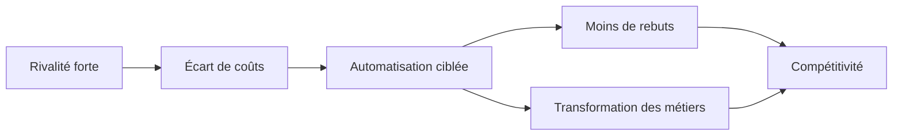

> ⬅ [[Q56_AgroTrace_SA]] · [[00_Index_30_mises_en_situation|🗂 Index]] · [[Q58_HelvCare]] ➡

# Q57 — MétalJura : automatiser une usine menacée ou préserver l'emploi ?

## Situation / Énoncé

**MétalJura SA**, fabricant jurassien de composants industriels, compte **450 employés**. Ses concurrents allemands et asiatiques ont automatisé leurs usines. Ses coûts de production sont environ **18 % plus élevés** que la moyenne du secteur. La direction envisage des robots, de l'IA de contrôle qualité et de la maintenance prédictive. Le projet pourrait réduire déchets et énergie par pièce, mais transformer ou supprimer environ 60 postes.

### Question d'examen

**L'automatisation constitue-t-elle une stratégie durable et créatrice d'avantage concurrentiel pour MétalJura ? Proposez une stratégie complète.**

## 1. Découpage & bases

La question contient deux tests : **durabilité** et **avantage concurrentiel**. Une machine peut améliorer les coûts sans créer un avantage durable, car les concurrents peuvent acheter la même machine.

### Contexte

- Rivalité forte.
- Clients industriels exigeants sur prix, délai, qualité.
- Équipements et savoir-faire anciens mais précieux.
- Pression sur les déchets et la consommation énergétique.

## 2. Notions & définitions

- **Ressource :** actif mobilisable (machines, argent, personnes, réputation, technologie).
- **Compétence :** capacité à combiner les ressources efficacement.
- **VRIO :** Valeur, Rareté, Imitabilité, Organisation. Le robot seul est rarement rare ; l'ensemble **robot + données + savoir-faire + organisation** peut l'être.
- **Chaîne de valeur :** permet de localiser les tâches à automatiser.
- **RNE sociétale :** les choix technologiques affectent l'emploi, les compétences et l'organisation du travail.
- **Effet rebond :** baisse du coût par pièce pouvant conduire à produire plus.

## 3. Argumentation

### Pourquoi agir ?

L'écart de coûts de 18 % peut réduire la marge et donc la capacité future d'investissement. L'immobilisme est lui aussi un choix risqué.

### Comment ?

1. Identifier les opérations répétitives, dangereuses, énergivores et génératrices de rebut.
2. Automatiser d'abord ces tâches.
3. Associer les opérateurs expérimentés à la conception des nouveaux processus.
4. Transformer les postes vers maintenance, contrôle, programmation et amélioration continue.
5. Mesurer coût/pièce, rebut, énergie/pièce **et impact absolu**, ainsi que l'évolution des emplois.

### Logique

**Pression concurrentielle → besoin de productivité → automatisation ciblée → baisse du rebut → baisse des coûts.**

Mais l'avantage durable naît davantage de : **savoir-faire + données historiques + apprentissage + organisation**.

## 4. Exemples & interconnexion

Un système de vision peut détecter un défaut au début de l'usinage. Cela évite de continuer à consommer énergie et matière sur une pièce qui sera rejetée.

Un technicien expérimenté peut décrire les signaux annonçant une panne. Si cette connaissance est intégrée dans la maintenance prédictive, l'entreprise transforme un savoir tacite en compétence organisationnelle.

**Porter → urgence ; chaîne de valeur → lieu d'action ; VRIO → source d'avantage ; RNE → conséquences sociales ; effet rebond → contrôle du volume ; SAF → arbitrage.**

## 5. Schéma

| SAF | Évaluation |
|---|---|
| **S** | Élevée : besoin réel de productivité et de qualité. |
| **A** | Moyenne : salariés fortement affectés. |
| **F** | Moyenne/élevée : technologie accessible, compétences à transformer. |

## 6. Risques & piège

Risques : licenciements, perte de savoir tacite, dépendance aux fournisseurs, cyber-risque industriel, effet rebond des volumes.

### Piège classique

**« Automatisation = baisse des coûts = avantage durable. »** Faux : un robot standard est imitable. À l'examen, identifie ce qui est difficile à copier.

### Recommandation

Automatiser sélectivement, protéger le savoir métier et investir dans la requalification. Mesurer les impacts **par unité et en absolu**.

---

---

⬅ [[Q56_AgroTrace_SA]] · [[00_Index_30_mises_en_situation|🗂 Index des 30 cas]] · [[Q58_HelvCare]] ➡
