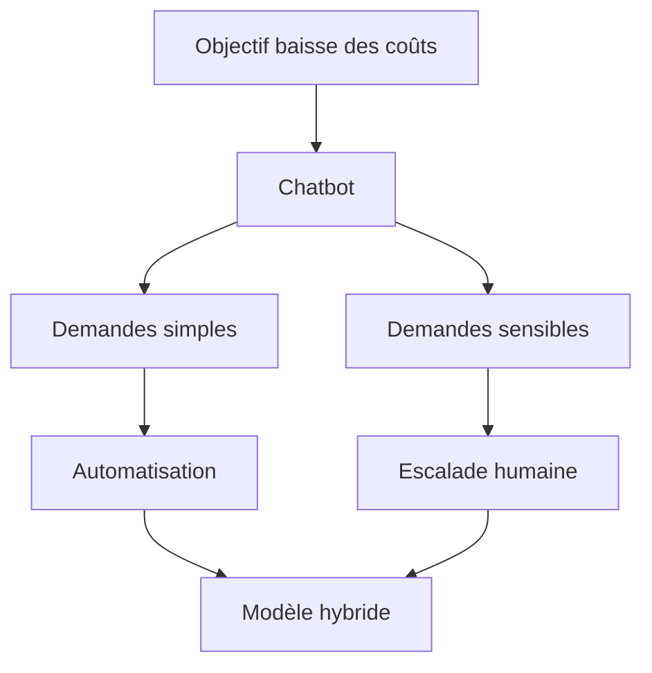

> ⬅ [[Q57_MetalJura]] · [[00_Index_30_mises_en_situation|🗂 Index]] · [[Q59_Montis_Outdoor]] ➡

# Q58 — HelvCare : remplacer le service client par une IA ?

## Situation

**HelvCare**, start-up suisse de télésanté de **70 salariés**, veut remplacer 60 % du support par un chatbot génératif. Les coûts pourraient diminuer de 35 %. Mais 25 % des utilisateurs ont plus de 65 ans et certaines demandes concernent des données sensibles.

### Question

**HelvCare doit-elle adopter une stratégie “AI First” pour son service client ? Analysez l'option sous l'angle du business model, de la RNE et de l'accessibilité.**

## 1. Découpage & contexte

Le dilemme est **efficience économique vs confiance, inclusion et risque**. Il ne faut pas confondre disponibilité 24/7 avec accessibilité réelle.

## 2. Notions

- **BMC :** la relation client est un bloc du modèle économique.
- **Équation de profit :** baisse de coûts de support peut améliorer la marge.
- **RNE :** économie, technologie, environnement, société.
- **Accessibilité / POUR :** Perceptible, Utilisable, Compréhensible, Robuste.
- **Exclusion indirecte :** personne n'est interdite, mais certains ne peuvent plus utiliser correctement le service.
- **Privacy by design :** protéger les données dès la conception.

## 3. Pourquoi / Comment

### Pourquoi l'IA peut être utile

- Disponibilité 24/7.
- Réponse immédiate aux demandes simples.
- Conseillers humains libérés pour les cas complexes.

### Pourquoi elle peut détruire de la valeur

- Un client qui ne comprend pas le bot perd confiance.
- Un mauvais conseil dans la santé a un risque plus élevé qu'une erreur e-commerce.
- Une collecte excessive augmente le risque cyber.

### Mise en œuvre

1. Classer les demandes par risque.
2. IA pour horaires, attestations, démarches simples.
3. Accès humain visible pour cas complexes.
4. Transfert du contexte sans faire répéter le client.
5. Tests avec seniors et personnes ayant des besoins d'accessibilité.
6. Minimisation des données.

## 4. Exemple & interconnexion

Un chatbot peut générer une attestation administrative. En revanche, si une personne de 76 ans ne comprend pas une information importante et doit traverser quatre menus pour parler à un humain, le gain de coût devient un **risque stratégique de confiance**.

BMC montre le gain/coût ; RNE montre les risques ; accessibilité montre l'inclusion ; données ajoutent la responsabilité ; SAF compare AI First et hybride.

## 5. Schéma

## 6. Risques & piège

- Hallucinations.
- Données sensibles.
- Exclusion des seniors.
- Dépendance au fournisseur IA.
- Coût environnemental du calcul.

**Piège :** « disponible 24/7 = accessible ». Non.

### Recommandation

Refuser le **AI First intégral**. Adopter **AI when useful, human when needed** avec gouvernance des données et tests d'accessibilité.

---

---

⬅ [[Q57_MetalJura]] · [[00_Index_30_mises_en_situation|🗂 Index des 30 cas]] · [[Q59_Montis_Outdoor]] ➡
