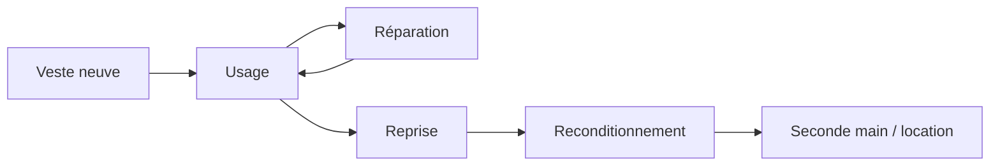

> ⬅ [[Q58_HelvCare]] · [[00_Index_30_mises_en_situation|🗂 Index]] · [[Q60_AlpCloud]] ➡

# Q59 — Montis Outdoor : arrêter de vendre des vestes neuves ?

## Situation

**Montis Outdoor**, entreprise suisse de vêtements techniques de **220 salariés**, vend environ **80 000 vestes par an**. Elle envisage location, réparation, reprise et revente d'occasion. Cela peut réduire les ventes neuves mais créer des revenus récurrents.

### Question

**Comment Montis Outdoor peut-elle métamorphoser son business model sans détruire sa rentabilité ?**

## 1. Découpage

La tension centrale est : **plus le produit dure, moins il est remplacé**. Si le revenu dépend seulement de la vente neuve, la durabilité semble menacer la rentabilité. Il faut donc modifier la **captation de valeur**.

## 2. Notions

- **BMC :** 9 blocs du modèle économique.
- **BM durable :** mission + impacts positifs + externalités négatives.
- **3R :** Réduire → Réutiliser → Recycler.
- **Éco-conception :** réduire l'impact sur tout le cycle de vie.
- **Équation de profit :** revenus moins coûts.

## 3. Argumentation

### Pourquoi changer ?

- Pression écologique sur le textile.
- Croissance de la seconde main.
- Possibilité pour des plateformes externes de capter une valeur que Montis laisse aujourd'hui partir.

### Comment ?

1. Concevoir les vestes pour être réparées.
2. Ouvrir un service de réparation simple et garanti.
3. Tester la location sur des usages temporaires.
4. Reprendre les produits et créer une seconde main certifiée.
5. Mesurer la **marge cumulée par veste sur toute sa vie**.

### Logique

**Durée de vie ↑ → ventes neuves ↓**, mais **réparation + location + seconde main → revenus multiples**.

## 4. Exemple

Une veste peut être vendue neuve, réparée deux fois, reprise puis revendue d'occasion. Un même produit génère plusieurs flux de revenus tout en réduisant le besoin de fabriquer une nouvelle veste.

## 5. Schéma

## 6. Risques & piège

- Cannibalisation du neuf.
- Coût de l'atelier.
- Logistique inverse.
- Greenwashing si la réparation reste marginale.

**Piège :** expliquer la circularité sans expliquer **revenus et coûts**.

### Recommandation

Passer progressivement de **« marge par vente neuve »** à **« valeur et marge cumulées par produit sur sa durée de vie »**.

---

---

⬅ [[Q58_HelvCare]] · [[00_Index_30_mises_en_situation|🗂 Index des 30 cas]] · [[Q60_AlpCloud]] ➡
