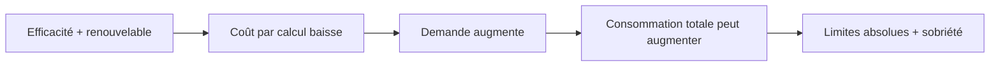

> ⬅ [[Q59_Montis_Outdoor]] · [[00_Index_30_mises_en_situation|🗂 Index]] · [[Q61_UrbanMeal]] ➡

# Q60 — AlpCloud : un « green data center » est-il vraiment durable ?

## Situation

**AlpCloud SA**, fournisseur cloud suisse de **120 salariés**, veut construire un data center vaudois alimenté par de l'électricité renouvelable et récupérer sa chaleur pour un quartier voisin. Mais le site doublerait sa capacité de calcul et viserait de nouveaux clients IA.

### Question

**AlpCloud peut-elle présenter ce projet comme une stratégie durable ? Analysez le projet à travers le PESTEL, Porter, l'effet rebond et le business model durable.**

## 1. Découpage

Il faut distinguer **efficacité relative** et **impact absolu**. Un data center peut consommer moins par requête et pourtant consommer plus au total si le volume explose.

## 2. Notions

- **PESTEL :** énergie, eau, acceptabilité, politique publique.
- **Porter + État :** rôle du réseau électrique, autorisations, fournisseurs d'énergie.
- **T-D-R :** Terminaux, Data centers, Réseaux.
- **Effet rebond :** efficacité → baisse du coût → hausse des usages.
- **BM durable :** impacts positifs et externalités négatives.

## 3. Argumentation

### Gains réels

- Électricité renouvelable.
- Meilleure efficacité.
- Récupération de chaleur.

### Limites

- Doublement de capacité.
- Matériel et eau.
- Demande IA pouvant augmenter très vite.
- Stockage « illimité » encourageant le gaspillage numérique.

### Méthode

1. Mesurer énergie/eau/renouvellement matériel.
2. Publier indicateurs absolus et relatifs.
3. Mettre des règles de suppression/archivage.
4. Évaluer le scénario sans nouveau data center.
5. Lier la récupération de chaleur à une utilisation réelle.

## 4. Exemple

Si l'énergie par requête baisse de 30 % mais que le volume double, la consommation totale augmente encore. C'est exactement pourquoi l'**effet rebond** doit être cité.

## 5. Schéma

## 6. Risques & piège

- Greenwashing.
- Conflits énergie/eau.
- Rebond.
- Obsolescence matérielle.

**Piège :** regarder seulement l'impact par unité.

### Recommandation

Parler d'un data center **plus efficient**, pas « durable par nature ». Conditionner le projet à des objectifs absolus, une politique de sobriété et une transparence complète.

---

---

⬅ [[Q59_Montis_Outdoor]] · [[00_Index_30_mises_en_situation|🗂 Index des 30 cas]] · [[Q61_UrbanMeal]] ➡
