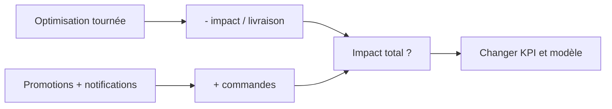

> ⬅ [[Q60_AlpCloud]] · [[00_Index_30_mises_en_situation|🗂 Index]] · [[Q62_LacMobilite]] ➡

# Q61 — UrbanMeal : croissance numérique ou durabilité sociale ?

## Situation

**UrbanMeal**, plateforme genevoise de livraison, emploie 85 salariés permanents et travaille avec environ 600 livreurs partenaires. Son application utilise recommandations, notifications et promotions pour augmenter la fréquence de commande. La société communique sur ses vélos électriques et l'optimisation des tournées.

### Question

**Évaluez la cohérence stratégique de la promesse durable d'UrbanMeal et proposez un repositionnement.**

## 1. Découpage

Le problème est structurel : UrbanMeal réduit peut-être l'impact **par livraison**, mais cherche à augmenter le **nombre total de livraisons**.

## 2. Notions

- **Économie de l'attention :** modèle qui cherche à augmenter fréquence et engagement.
- **Dark patterns :** mécanismes qui poussent l'utilisateur à agir.
- **RNE sociétale :** conditions de travail et impacts sur les personnes.
- **BM durable :** externalités environnementales et sociales.
- **Effet rebond :** gain logistique absorbé par plus de commandes.

## 3. Pourquoi / Comment

- Optimiser les tournées réduit les kilomètres à vide.
- Mais promotions et notifications peuvent augmenter le volume.
- Les conditions des livreurs sont une partie de la durabilité.

**Actions :** commandes groupées, créneaux non urgents, emballages réutilisables, réduction des notifications manipulatrices, KPI de kilomètres et émissions absolus, satisfaction des livreurs.

## 4. Exemple

-20 % d'émissions par livraison avec +50 % de livraisons peut augmenter l'impact total.

## 5. Schéma

## 6. Risques & piège

Greenwashing, précarisation, emballages, collecte de données, effet rebond.

**Piège :** réduire la durabilité au vélo électrique.

### Recommandation

Repositionner l'offre autour de la **livraison mutualisée et responsable**, et ne plus piloter seulement le nombre de commandes.

---

---

⬅ [[Q60_AlpCloud]] · [[00_Index_30_mises_en_situation|🗂 Index des 30 cas]] · [[Q62_LacMobilite]] ➡
