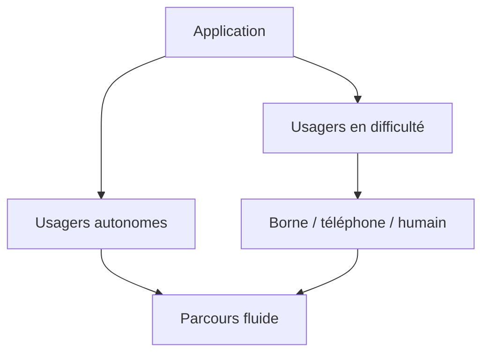

> ⬅ [[Q61_UrbanMeal]] · [[00_Index_30_mises_en_situation|🗂 Index]] · [[Q63_WatchNext]] ➡

# Q62 — LacMobilité : une application unique pour remplacer les guichets ?

## Situation

**LacMobilité**, opérateur de transports publics de **1 300 salariés**, veut regrouper billets, abonnements, horaires et réclamations dans une application et fermer 70 % des guichets. Économie prévue : 8 millions CHF/an. Des associations de seniors et de personnes handicapées s'y opposent.

### Question

**Construisez une stratégie de digitalisation qui améliore l'efficience sans créer d'exclusion indirecte.**

## 1. Découpage

Le bon choix n'est pas « digital ou humain », mais **quel canal pour quel besoin et quel public**.

## 2. Notions

- **Accessibilité :** service réellement utilisable par tous.
- **POUR :** Perceptible, Utilisable, Compréhensible, Robuste.
- **Exclusion indirecte :** pas d'interdiction formelle, mais impossibilité pratique.
- **Collecte utilisateurs :** observation, interview, sondage, focus group.
- **BMC :** les canaux participent à la proposition de valeur.

## 3. Argumentation

L'application peut réduire les files et coûts. Mais fermer trop vite déplace le coût vers l'usager : smartphone, temps, stress, complexité.

**Méthode :** observer de vrais parcours, tester seniors/touristes/personnes malvoyantes, simplifier authentification, conserver bornes, téléphone et points humains ciblés.

## 4. Exemple

Un touriste sans compte ne devrait pas devoir créer un profil complet pour acheter un billet simple. Un senior peut avoir besoin de gros caractères et d'un accès humain clair.

## 5. Schéma

## 6. Risques & piège

Fracture numérique, collecte de mobilité, coût du multicanal, résistance interne.

**Piège :** garder un numéro de téléphone caché et appeler cela « inclusif ».

### Recommandation

**Digital-first mais pas digital-only**, avec fermeture progressive seulement après validation par des KPI d'autonomie et d'accessibilité.

---

---

⬅ [[Q61_UrbanMeal]] · [[00_Index_30_mises_en_situation|🗂 Index des 30 cas]] · [[Q63_WatchNext]] ➡
