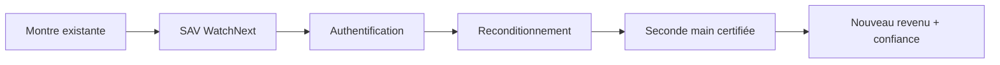

> ⬅ [[Q62_LacMobilite]] · [[00_Index_30_mises_en_situation|🗂 Index]] · [[Q64_FarmaNova]] ➡

# Q63 — WatchNext : blockchain et seconde main dans l'horlogerie de luxe

## Situation

**WatchNext**, manufacture horlogère suisse de **900 employés**, possède une marque centenaire. Le marché de l'occasion progresse. L'entreprise envisage un passeport numérique garantissant origine, entretien et authenticité, puis une plateforme officielle de seconde main.

### Question

**Cette diversification peut-elle renforcer l'avantage concurrentiel de WatchNext sans banaliser son image de luxe ?**

## 1. Découpage

La technologie est secondaire. Le vrai enjeu est de récupérer la valeur de l'occasion grâce à la **marque, l'expertise et la confiance**.

## 2. Notions

- **Ressources immatérielles :** marque, réputation, savoir-faire.
- **VRIO :** la blockchain est copiable ; la marque centenaire, le réseau SAV et l'expertise sont plus difficiles à imiter.
- **3R :** la seconde main relève de la réutilisation.
- **BMC :** nouveaux segments, canaux et revenus.

## 3. Argumentation

Ignorer l'occasion laisse aux plateformes externes la commission et la relation client. Une certification officielle transforme la compétence SAV en valeur commerciale.

**Mise en œuvre :** inspection, remise en état, garantie, passeport sobre, plateforme sélective, contrôle du volume pour préserver le luxe.

## 4. Exemple

Une montre de dix ans peut revenir chez WatchNext, être restaurée, certifiée et revendue avec garantie. La même montre génère de la valeur sans fabrication neuve.

## 5. Schéma

## 6. Risques & piège

Banalisation, coût du passeport, cyber-risque, conflit avec distributeurs.

**Piège :** « blockchain = avantage concurrentiel ». Non : l'avantage est surtout la combinaison **marque + expertise + réseau**.

### Recommandation

Créer une seconde main premium certifiée, avec technologie sobre au service de la confiance.

---

---

⬅ [[Q62_LacMobilite]] · [[00_Index_30_mises_en_situation|🗂 Index des 30 cas]] · [[Q64_FarmaNova]] ➡
