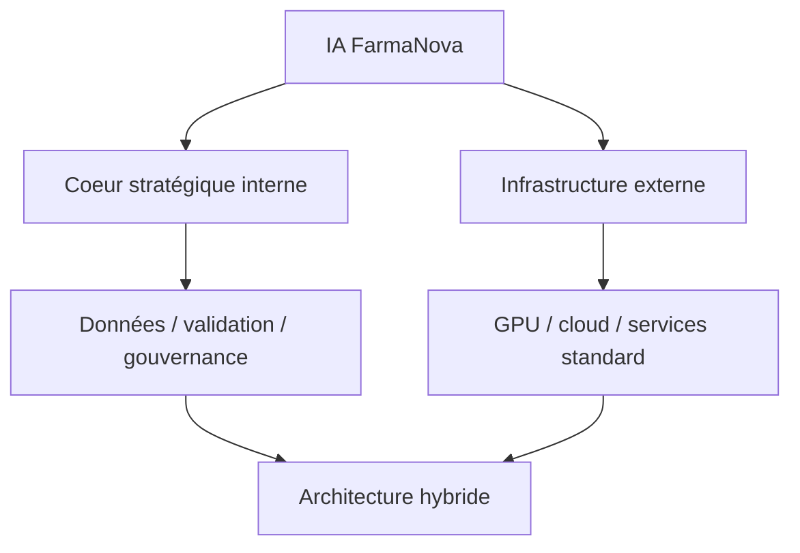

> ⬅ [[Q63_WatchNext]] · [[00_Index_30_mises_en_situation|🗂 Index]] · [[Q65_BatiCycle]] ➡

# Q64 — FarmaNova : développer son IA en interne ou l'externaliser ?

## Situation

**FarmaNova**, laboratoire suisse de **320 salariés**, veut utiliser l'IA pour accélérer l'identification de molécules. Option A : équipe IA interne de 35 personnes. Option B : grande plateforme externe, deux fois moins chère à court terme.

### Question

**Quelle architecture de valeur FarmaNova doit-elle choisir ?**

## 1. Découpage

Question classique **faire ou faire faire**. Le prix court terme n'est pas le seul critère : il faut identifier ce qui doit rester sous contrôle.

## 2. Notions

- **RCOV :** Ressources, Compétences, Organisation, Valeur.
- **Porter fournisseurs :** dépendance au prestataire.
- **VRIO :** données scientifiques + expertise peuvent être stratégiques.
- **Coût du cycle de vie :** inclure migration, verrouillage, recrutement, sécurité.
- **RNE :** données, cyber, dépendance.

## 3. Argumentation

Externaliser accélère et réduit les coûts initiaux. Mais externaliser **données, savoir-faire et validation** peut faire perdre l'apprentissage organisationnel.

### Architecture recommandée

- Interne : gouvernance, architecture de données, validation scientifique, compétence IA permettant de challenger les fournisseurs.
- Externe : capacité de calcul, composants standards, infrastructure commoditisée.
- Contrats : portabilité, documentation, réversibilité.

## 4. Exemple

FarmaNova peut louer des GPU tout en gardant les choix scientifiques et les données critiques en interne.

## 5. Schéma

## 6. Risques & piège

Verrouillage, fuite de données, recrutement cher, obsolescence des compétences.

**Piège :** comparer seulement « 2x moins cher ».

### Recommandation

Architecture **hybride** : protéger le cœur stratégique et louer la commodité.

---

---

⬅ [[Q63_WatchNext]] · [[00_Index_30_mises_en_situation|🗂 Index des 30 cas]] · [[Q65_BatiCycle]] ➡
