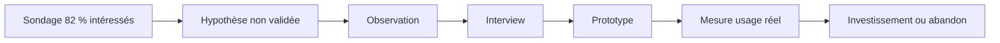

> ⬅ [[Q65_BatiCycle]] · [[00_Index_30_mises_en_situation|🗂 Index]] · [[Q67_BanqueRive]] ➡

# Q66 — EduNova : l'IA pédagogique répond-elle réellement à un besoin ?

## Situation / Énoncé

**EduNova**, start-up EdTech de **55 personnes**, a développé un assistant IA qui génère automatiquement exercices, quiz et résumés. La direction veut investir **3 millions CHF** pour généraliser la fonction à tous les étudiants et en faire le cœur de la proposition de valeur.

Le principal argument avancé est un sondage dans lequel **82 % des étudiants déclarent trouver l'IA intéressante**. Pourtant, aucune observation structurée des usages, aucune interview approfondie et aucun test de comportement réel n'ont été réalisés.

### Question d'examen

**Avant d'investir, quelle démarche stratégique EduNova doit-elle suivre pour vérifier que son innovation répond à un besoin réel et durable ?**

## 1. Découpage de la question & pose des bases

### Décorticage du sujet

Le mot important est **« avant d'investir »**. L'examinateur attend que tu comprennes qu'une entreprise ne doit pas confondre **enthousiasme pour une technologie** et **validation d'un besoin**.

Le chiffre de 82 % semble fort, mais il répond seulement à une question d'opinion : « trouvez-vous cela intéressant ? ». Il ne prouve pas que l'étudiant a un problème important, que la solution le résout, qu'il l'utilisera régulièrement ou qu'il acceptera de payer.

### Environnement & contexte

- Les outils d'IA généralistes sont facilement accessibles : la concurrence indirecte est forte.
- Les établissements et enseignants s'interrogent sur la qualité pédagogique et l'intégrité académique.
- Les étudiants peuvent être attirés par l'IA sans modifier leurs comportements de révision.
- Les données d'apprentissage peuvent devenir sensibles : historique, difficultés, performance, habitudes.

### Diagnostic interne

- **Force :** EduNova sait déjà développer un prototype.
- **Faiblesse :** connaissance insuffisante du problème utilisateur.
- **Ressource stratégique à construire :** compréhension fine des comportements réels d'apprentissage.
- **Compétence clé :** transformer les observations en proposition de valeur.

## 2. Développement des notions & définitions claires

- **Observation :** regarder ce que l'utilisateur fait réellement, sans lui imposer une solution. Elle révèle comportements, raccourcis et frustrations.
- **Interview :** comprendre une expérience passée ou présente avec des questions ouvertes et impartiales. Le but est de faire raconter, pas de faire valider une idée.
- **Sondage :** méthode utile pour quantifier, mais moins bonne pour découvrir un besoin latent.
- **Focus group :** discussion structurée d'un groupe ciblé, utile pour explorer des perceptions, mais soumise aux dynamiques de groupe.
- **Besoin latent :** problème réel que l'utilisateur ne formule pas spontanément.
- **Proposition de valeur :** bénéfice concret promis à un segment précis.
- **Sobriété numérique :** questionner d'abord le besoin avant d'ajouter davantage de technologie.
- **RNE :** considérer aussi données, dépendance, bien-être, environnement et effets sur l'apprentissage.

## 3. Argumentation — Pourquoi et Comment

### Pourquoi agir avec méthode ?

1. Un investissement de 3 millions crée des coûts fixes et un risque de verrouillage technologique.
2. Une fonction facilement copiable ne constitue pas automatiquement un avantage concurrentiel.
3. Le vrai problème peut être différent de « manquer d'exercices » : priorisation, motivation, feedback, compréhension, organisation du temps.
4. Générer plus de contenu peut même aggraver la surcharge cognitive.

### Comment vérifier le besoin ?

**Étape 1 — Formuler des hypothèses de problème.** Exemples : « les étudiants ne savent pas quoi réviser », « ils manquent de feedback », « ils perdent du temps à créer des exercices ».

**Étape 2 — Observer.** Regarder des étudiants préparer un examen. Quels outils utilisent-ils ? Où bloquent-ils ? Que contournent-ils ?

**Étape 3 — Interviewer.** Demander : « raconte-moi ta dernière révision difficile » plutôt que « voudrais-tu un assistant IA ? ».

**Étape 4 — Prototyper à faible coût.** Tester plusieurs fonctions : recommandation de priorités, correction, génération d'exercices, suivi de progression.

**Étape 5 — Mesurer le comportement réel.** Taux d'utilisation, rétention, progression, temps gagné, abandon.

**Étape 6 — Quantifier.** Une fois le besoin compris, utiliser un sondage pour mesurer sa fréquence dans une population plus large.

**Étape 7 — Décider avec SAF.** L'investissement devient pertinent seulement si le besoin est important, fréquent et solvable.

### Preuve & logique

**Question biaisée → réponse positive → fausse certitude → investissement risqué.**

À l'inverse : **observation → problème réel → prototype ciblé → mesure d'usage → proposition de valeur crédible.**

## 4. Exemples & mélange des concepts

Un étudiant peut déclarer vouloir « plus d'exercices ». En l'observant, EduNova découvre peut-être qu'il possède déjà des dizaines d'exercices mais ne sait pas lesquels choisir. Un outil qui **priorise trois exercices pertinents** peut alors créer plus de valeur qu'un générateur de 500 exercices.

Ici, la **collecte utilisateur** nourrit directement le **BMC** : meilleure compréhension du segment → meilleure proposition de valeur → meilleure probabilité de revenus. La **sobriété numérique** renforce la même logique : ne pas déployer de calcul lourd avant de savoir quel besoin doit être servi.

## 5. Graphique / schéma visuel

| SAF | Lecture |
|---|---|
| **Souhaitabilité** | Impossible à confirmer tant que le besoin n'est pas démontré. |
| **Acceptabilité** | À tester auprès des étudiants, enseignants et établissements. |
| **Faisabilité** | Technique élevée, mais faisabilité marché encore inconnue. |

## 6. Problèmes, risques & erreurs à éviter

- Biais de confirmation.
- Investissement dans une fonction peu utilisée.
- Dépendance à un fournisseur IA.
- Surcharge de contenus.
- Collecte excessive de données scolaires.
- Coût du calcul disproportionné.

### Le piège classique

Présenter **82 %** comme une preuve de marché. À l'examen, demande toujours : **que mesure vraiment ce chiffre ?**

### Recommandation

Ne pas investir immédiatement. Suivre **observation → interviews → prototype → mesure d'usage → sondage de validation → SAF**. L'objectif est de prouver le besoin avant d'industrialiser la technologie.

---

---

⬅ [[Q65_BatiCycle]] · [[00_Index_30_mises_en_situation|🗂 Index des 30 cas]] · [[Q67_BanqueRive]] ➡
