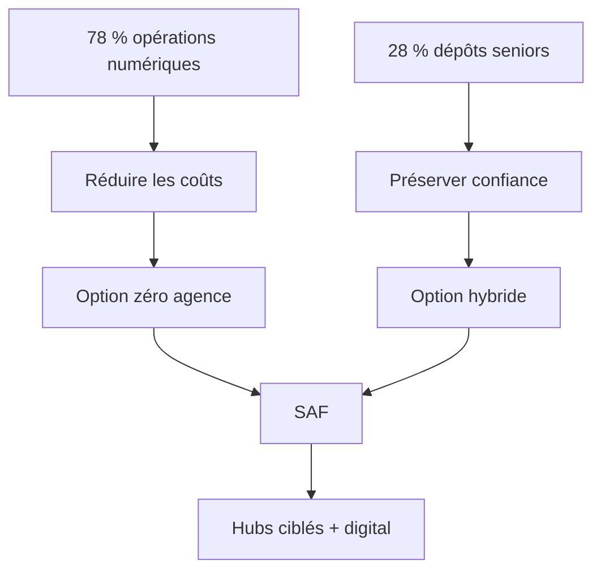

> ⬅ [[Q66_EduNova]] · [[00_Index_30_mises_en_situation|🗂 Index]] · [[Q68_CleanTech_Appliances]] ➡

# Q67 — BanqueRive : la rentabilité justifie-t-elle le « zéro agence » ?

## Situation / Énoncé

**BanqueRive SA**, banque régionale de **600 salariés**, constate que **78 % des opérations courantes** sont déjà numériques. Elle envisage de fermer presque toutes ses agences sauf le siège, avec une économie estimée à **14 millions CHF par an**.

Pourtant, les clients de plus de 65 ans représentent environ **28 % des dépôts**. La banque s'est historiquement différenciée par la proximité, le conseil et la confiance locale.

### Question

**À partir d'un SWOT croisé, des parties prenantes et de la RNE, recommandez ou non le passage au zéro agence.**

## 1. Découpage & bases

Le mot clé est **SWOT croisé**. Une mauvaise copie fera quatre listes. Une bonne copie utilise les listes pour générer des options.

### SWOT de départ

| Interne | Positif | Négatif |
|---|---|---|
| **Diagnostic interne** | **Forces :** confiance locale, marque, 78 % d'usages déjà numériques, base de dépôts. | **Faiblesses :** réseau coûteux, processus peut-être complexes, coûts fixes immobiliers. |

| Externe | Positif | Négatif |
|---|---|---|
| **Diagnostic externe** | **Opportunités :** adoption numérique, conseil à distance, nouveaux services. | **Menaces :** vieillissement, néobanques, exclusion, perte de proximité. |

## 2. Notions & définitions

- **SWOT :** Forces/Faiblesses internes, Opportunités/Menaces externes.
- **Croisement SWOT :** Force×Opportunité, Force×Menace, Faiblesse×Opportunité, Faiblesse×Menace.
- **Parties prenantes :** clients, salariés, actionnaires, régulateurs, associations.
- **Ressource immatérielle :** confiance et réputation, difficiles à copier rapidement.
- **Exclusion indirecte :** service légal mais qui rend l'accès plus difficile à un groupe.
- **RNE sociétale :** responsabilité sur l'inclusion et les effets des choix numériques.

## 3. Argumentation

### Croisement stratégique

- **Force confiance + opportunité numérique :** créer un modèle de proximité digitale plutôt que copier une néobanque.
- **Faiblesse coûts + opportunité adoption :** fermer les agences les moins utiles.
- **Force clientèle fidèle + menace exclusion :** préserver des points humains à forte valeur.
- **Faiblesse réseau cher + menace néobanques :** simplifier sans abandonner le facteur distinctif.

### Pourquoi le zéro agence peut être dangereux

Les 14 millions d'économie sont visibles immédiatement. La valeur des dépôts et de la confiance perdue est moins visible. Si un segment qui détient 28 % des dépôts quitte la banque, l'économie peut être annulée par une perte de ressources financières et de relation client.

### Comment décider

1. Mesurer le coût et la fréquentation de chaque agence.
2. Mesurer surtout **qui utilise l'agence et quelle valeur économique ces clients représentent**.
3. Transformer certaines agences en hubs sur rendez-vous.
4. Développer assistance téléphonique/vidéo accessible.
5. Fermer progressivement et suivre le churn, les dépôts et la satisfaction.

## 4. Exemple & interconnexion

Un client senior peut faire seulement quatre visites par an mais détenir un patrimoine important. Une lecture basée uniquement sur le « nombre de transactions » sous-estime sa valeur.

Le **BMC** rappelle que les canaux font partie de la proposition de valeur. La **RNE** transforme l'accessibilité en risque stratégique. Les **parties prenantes** montrent que tous les clients n'ont pas le même pouvoir économique.

## 5. Schéma

## 6. Risques & piège

- Perte de dépôts.
- Exclusion des seniors.
- Surcharge du support à distance.
- Cyber-risque accru.
- Dégradation de la marque locale.

### Piège classique

Classer **« vieillissement de la population » comme faiblesse**. C'est externe : donc menace/opportunité. Une faiblesse est par exemple l'incapacité interne à proposer une interface accessible.

### Recommandation

Refuser le zéro agence immédiat. Réduire le réseau mais conserver des **hubs humains à forte valeur**, tout en améliorant fortement les canaux numériques.

---

---

⬅ [[Q66_EduNova]] · [[00_Index_30_mises_en_situation|🗂 Index des 30 cas]] · [[Q68_CleanTech_Appliances]] ➡
