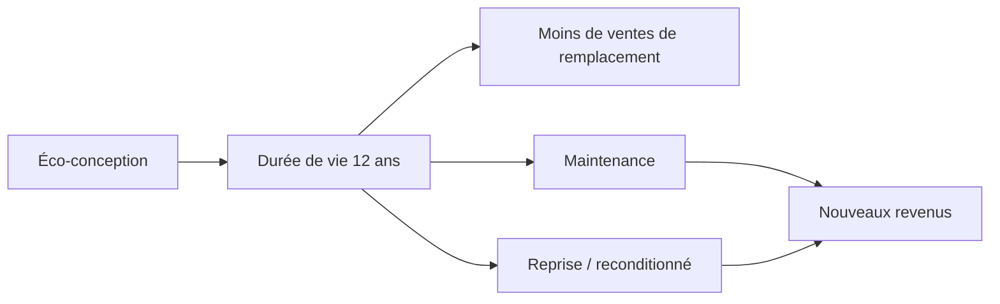

> ⬅ [[Q67_BanqueRive]] · [[00_Index_30_mises_en_situation|🗂 Index]] · [[Q69_AlpineFresh]] ➡

# Q68 — CleanTech Appliances : vendre des appareils qui durent… et perdre des ventes ?

## Situation

**CleanTech Appliances**, fabricant de lave-linge de **750 salariés**, veut passer d'une durée moyenne d'utilisation de 7 à 12 ans. Cela suppose meilleure réparabilité, disponibilité des pièces et conception modulaire. Mais moins de remplacement signifie potentiellement moins de ventes neuves.

### Question

**Comment concilier éco-conception, avantage concurrentiel et viabilité économique ?**

## 1. Découpage

Le dilemme est économique : **un produit durable peut réduire la fréquence d'achat**. Pour que la stratégie soit viable, l'entreprise doit modifier la manière dont elle capte la valeur.

## 2. Notions

- **Éco-conception :** réduire les impacts sur tout le cycle de vie.
- **3R :** Réduire → Réutiliser → Recycler.
- **BM durable :** transformer les blocs du modèle, pas seulement le produit.
- **Équation de profit :** revenus − coûts.
- **VRIO :** une organisation de réparation et un réseau de service peuvent être plus difficiles à imiter qu'une simple promesse de robustesse.

## 3. Pourquoi / Comment

### Pourquoi ?

- Pressions réglementaires et sociétales sur réparabilité.
- Clients sensibles au coût total.
- Marché mature : différenciation par la durée peut être pertinente.

### Comment ?

1. Modules réparables.
2. Pièces disponibles longtemps.
3. Maintenance et extension de garantie.
4. Reprise et reconditionnement.
5. Mesurer marge cumulée par appareil sur sa vie.

### Logique

**Durée de vie ↑ → renouvellement ↓ → revenus neuf ↓.**

Mais : **services + pièces + reprise + reconditionnement → nouvelles sources de revenu.**

## 4. Exemple

Un moteur défaillant peut être remplacé sans changer toute la machine. La marque gagne sur la pièce, le service et la fidélité, tandis que le client évite un achat complet.

## 5. Schéma

## 6. Risques & piège

Cannibalisation, stock de pièces, coût SAV, prix plus élevé, promesse de durée non prouvée.

**Piège :** dire « durable = moins rentable » sans analyser le business model.

### Recommandation

Passer à **produit durable + services + reprise + reconditionnement**, avec un KPI de valeur et marge sur le cycle de vie.

---

---

⬅ [[Q67_BanqueRive]] · [[00_Index_30_mises_en_situation|🗂 Index des 30 cas]] · [[Q69_AlpineFresh]] ➡
