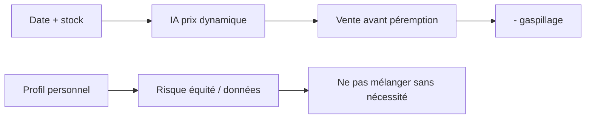

> ⬅ [[Q68_CleanTech_Appliances]] · [[00_Index_30_mises_en_situation|🗂 Index]] · [[Q70_MicroFab]] ➡

# Q69 — AlpineFresh : prix dynamiques par IA contre le gaspillage alimentaire

## Situation

**AlpineFresh**, chaîne de **65 supermarchés et 2 200 salariés**, teste une IA qui baisse automatiquement le prix des produits proches de leur date limite. Les déchets baissent de **25 %**. Mais certaines fonctions personnalisent aussi les prix selon le profil du client.

### Question

**Faut-il généraliser cette IA ? Analysez performance, durabilité, données et équité.**

## 1. Découpage

Il faut séparer deux choses :

1. **Prix dynamique lié au produit** : date, stock, heure.
2. **Prix personnalisé lié à la personne** : historique, profil, comportement.

Le premier peut servir le gaspillage sans nécessiter beaucoup de données personnelles. Le second ajoute un problème d'équité.

## 2. Notions

- **Chaîne de valeur :** gestion des stocks, marketing/vente.
- **RNE :** bénéfice économique + risques données/éthique.
- **Minimisation :** ne collecter que ce qui est nécessaire.
- **Transparence :** expliquer la logique du prix.
- **BM durable :** réduction du gaspillage comme impact positif et baisse de coûts.

## 3. Argumentation

### Pourquoi généraliser une partie ?

Une réduction automatique à J-1 ou J-2 peut écouler le produit avant destruction. Cela crée un alignement intéressant : **moins de déchets + moins de pertes financières**.

### Pourquoi limiter la personnalisation ?

Si deux clients paient des prix différents pour la même raison invisible, le sentiment d'injustice peut dégrader la confiance. Surtout, cette donnée personnelle n'est peut-être pas nécessaire pour réduire le gaspillage.

### Méthode

- Utiliser date, heure, stock et rythme de vente.
- Afficher clairement la réduction.
- Séparer le projet anti-gaspillage du projet de personnalisation marketing.
- Mesurer déchets absolus, marge, satisfaction, plaintes et commandes.

## 4. Exemple

Un yaourt à J-1 peut être automatiquement réduit de 40 % pour tous. Il n'est pas nécessaire de savoir que tel client achète souvent des yaourts pour éviter sa destruction.

## 5. Schéma

## 6. Risques & piège

Biais, discrimination perçue, clients attendant toujours les promotions, surcommande provoquée par le meilleur écoulement.

**Piège :** « puisque les déchets baissent, toute collecte est justifiée ».

### Recommandation

Généraliser le **prix dynamique produit/date**, transparent et sobre en données. Ne pas généraliser automatiquement la tarification individuelle opaque.

---

---

⬅ [[Q68_CleanTech_Appliances]] · [[00_Index_30_mises_en_situation|🗂 Index des 30 cas]] · [[Q70_MicroFab]] ➡
