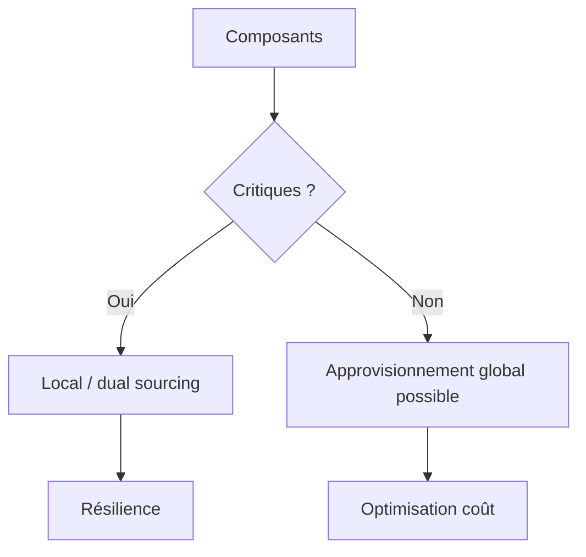

> ⬅ [[Q69_AlpineFresh]] · [[00_Index_30_mises_en_situation|🗂 Index]] · [[Q71_EcoEvent]] ➡

# Q70 — MicroFab : relocaliser sa production en Suisse ?

## Situation

**MicroFab**, fabricant de composants électroniques de **140 salariés**, achète 80 % de ses sous-composants en Asie. Un partenaire suisse propose une production locale **25 % plus chère**, mais avec délais plus courts, meilleure réparabilité et moins de dépendance au transport aérien.

### Question

**MicroFab doit-elle relocaliser une partie de sa chaîne d'approvisionnement ?**

## 1. Découpage

Ne pas comparer seulement les prix. Il faut comparer le **coût stratégique total** et la **criticité des composants**.

## 2. Notions

- **PESTEL :** géopolitique, change, transport, énergie.
- **Porter :** pouvoir fournisseurs.
- **Chaîne de valeur :** impact d'une rupture sur la production.
- **Coût du cycle de vie / coût total :** prix + transport + stock + défaut + rupture + fin de vie.
- **Résilience :** capacité à continuer malgré un choc.

## 3. Argumentation

Une pièce 25 % plus chère peut être rationnelle si elle évite l'arrêt d'une ligne beaucoup plus coûteuse.

### Méthode

1. Classer les pièces par criticité.
2. Mesurer substituabilité et délai.
3. Calculer coût total.
4. Relocaliser ou dual-sourcer les pièces critiques.
5. Garder certains composants standardisés à l'international.

## 4. Exemple

Une pièce coûtant 50 CHF peut bloquer une machine vendue 20 000 CHF. Son risque de rupture compte plus que quelques francs de différence.

## 5. Schéma

## 6. Risques & piège

Coût local élevé, capacité insuffisante, dépendance déplacée, complexité de deux sources.

**Piège :** « local = forcément durable » ou « +25 % = forcément mauvais ».

### Recommandation

Mettre en place un **dual sourcing ciblé** sur les composants critiques.

---

---

⬅ [[Q69_AlpineFresh]] · [[00_Index_30_mises_en_situation|🗂 Index des 30 cas]] · [[Q71_EcoEvent]] ➡
