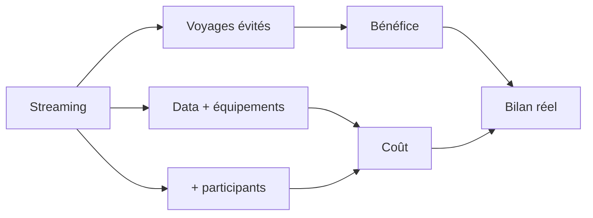

> ⬅ [[Q70_MicroFab]] · [[00_Index_30_mises_en_situation|🗂 Index]] · [[Q72_GeneveTour]] ➡

# Q71 — EcoEvent : streaming ou événements physiques ?

## Situation

**EcoEvent**, agence de conférences de **35 salariés**, veut rendre tous ses événements hybrides. Elle affirme que le streaming réduit les voyages. Mais la participation a doublé et l'entreprise a acheté davantage de matériel audiovisuel et de services cloud.

### Question

**Le modèle hybride constitue-t-il réellement un business model plus durable ?**

## 1. Découpage

Le mot important est **« réellement »** : il faut vérifier si le streaming **remplace** un impact ou **s'ajoute** à lui.

## 2. Notions

- **T-D-R :** terminaux, data centers, réseaux.
- **Effet rebond :** accès plus facile → plus de participants et de contenus.
- **BM durable :** prendre en compte impacts positifs et négatifs.
- **Sobriété :** qualité vidéo et stockage proportionnés au besoin.

## 3. Argumentation

### Positif

Un intervenant international peut éviter un vol et un hôtel.

### Négatif

Si l'événement physique reste identique et que le streaming ajoute des milliers de connexions, du matériel et des replays permanents, l'impact numérique est additionnel.

### Méthode

- Demander combien de participants distants auraient réellement voyagé.
- Louer ou mutualiser le matériel.
- Éviter la 4K si inutile.
- Limiter la durée de conservation des replays.

## 4. Exemple

Une vidéo plus légère regardée par 10 000 personnes peut au total générer plus de trafic qu'une vidéo lourde regardée par 500. L'effet rebond concerne donc aussi le volume d'usage.

## 5. Schéma

## 6. Risques & piège

Double organisation, stockage, matériel sous-utilisé, effet rebond.

**Piège :** « digital = dématérialisé = zéro impact ».

### Recommandation

Utiliser l'hybride surtout lorsqu'il **substitue de vrais déplacements** et appliquer une sobriété audiovisuelle.

---

---

⬅ [[Q70_MicroFab]] · [[00_Index_30_mises_en_situation|🗂 Index des 30 cas]] · [[Q72_GeneveTour]] ➡
