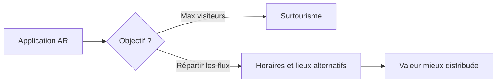

> ⬅ [[Q71_EcoEvent]] · [[00_Index_30_mises_en_situation|🗂 Index]] · [[Q73_MedTechPlus]] ➡

# Q72 — GenèveTour : réalité augmentée et surtourisme

## Situation

**GenèveTour**, organisme touristique de **80 employés**, veut lancer une application de réalité augmentée proposant parcours personnalisés et promotions. Elle souhaite attirer davantage de visiteurs alors que certains quartiers sont déjà saturés en été.

### Question

**Comment transformer cette innovation numérique en outil de stratégie touristique durable plutôt qu'en accélérateur de surtourisme ?**

## 1. Découpage

Le vrai problème est l'**objectif optimisé**. Si l'application maximise uniquement le nombre de touristes, elle peut aggraver le surtourisme.

## 2. Notions

- **PESTEL :** qualité de vie, mobilité, économie locale, politique touristique.
- **Parties prenantes :** habitants, commerces, touristes, transports, autorités.
- **Donut :** plancher social et plafond écologique.
- **Effet rebond :** une destination plus facile d'accès peut attirer davantage.
- **RNE :** données de localisation et recommandations.

## 3. Argumentation

L'application peut être utilisée pour **répartir** les visiteurs au lieu d'en maximiser le nombre.

### Actions

- Cartographier les heures et zones de saturation.
- Recommander des itinéraires hors pics.
- Mettre en avant les transports publics.
- Orienter vers des commerces locaux moins centraux.
- Mesurer satisfaction des habitants, dispersion des flux et mobilité bas carbone.

## 4. Exemple

À 14h, si un lieu est saturé, l'application peut proposer un musée moins fréquenté à proximité au lieu de pousser automatiquement le monument le plus populaire.

## 5. Schéma

## 6. Risques & piège

Surveillance, biais vers certains commerces, déplacement des nuisances, effet rebond.

**Piège :** garder le KPI « visiteurs totaux » et ajouter le mot durable.

### Recommandation

Changer les KPI : privilégier **qualité territoriale, dispersion des flux et valeur locale**.

---

---

⬅ [[Q71_EcoEvent]] · [[00_Index_30_mises_en_situation|🗂 Index des 30 cas]] · [[Q73_MedTechPlus]] ➡
